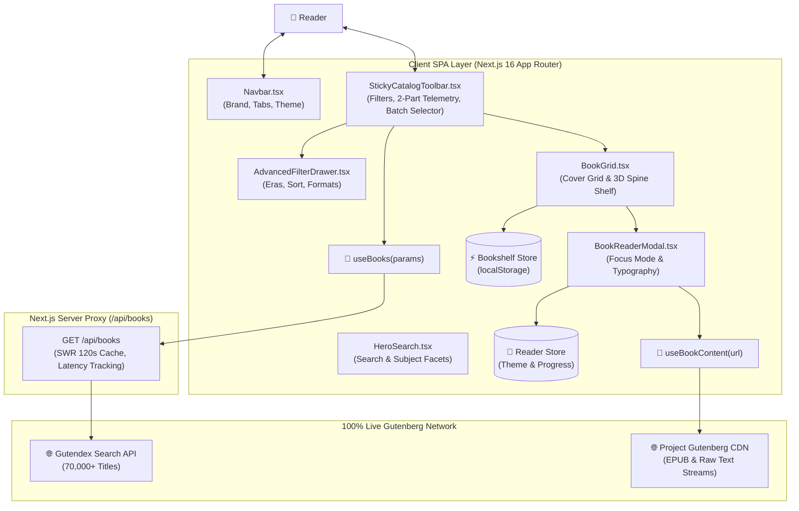

# Architecture Matrix & Dependency Graph — Bookarium

> **Auto-Generated Living Architecture**: Programmatically compiled from Source AST.  
> **Last Synchronized**: `2026-08-31`  
> **Topology Health**: `44` Modules Analyzed • `88` Static Linkages • `0` Circular Dependencies • `0` Orphaned Modules

---

## 🏛️ System Architecture & Data Flow

Bookarium is built on a **100% Pure API Architecture** with real-time telemetry, zero local mock archives, and deterministic state isolation.

---

## 🔗 AST Module Interconnection & Topology Matrix

Every source file is analyzed for upstream imports and downstream consumers to guarantee zero orphaned or unlinked code:

| Module / Component | Upstream Dependencies (Imports) | Downstream Consumers (Consumed By) | Role & Responsibilities |
| :--- | :--- | :--- | :--- |
| [`route.ts`](src/app/api/books/content/route.ts) | `config/api-endpoints` | _App Route Entry_ | Production Module |
| [`route.ts`](src/app/api/books/route.ts) | `config/api-endpoints` | _App Route Entry_ | Production Module |
| [`layout.tsx`](src/app/layout.tsx) | `./providers`, `./globals.css` | _App Route Entry_ | Production Module |
| [`page.tsx`](src/app/page.tsx) | `components/presentation/Navbar`, `components/presentation/HeroSearch`, `components/presentation/StickyCatalogToolbar`, `components/presentation/AdvancedFilterDrawer`, `components/presentation/BookGrid`, `components/presentation/LiteraryQuotes`, `components/presentation/DownloadDrawer`, `components/presentation/Footer`, `hooks/queries/useBooks`, `hooks/useCatalogFilters`, `stores/useBookshelfStore`, `mocks/handlers`, `components/ui/Button` | _App Route Entry_ | Production Module |
| [`providers.tsx`](src/app/providers.tsx) | _Root Primitive_ | _Direct Root Consumer_ | Production Module |
| [`page.tsx`](src/app/read/[id]/page.tsx) | `hooks/queries/useBookContent`, `hooks/queries/useBooks`, `stores/useReaderStore`, `lib/gutenberg-parser`, `config/reader-themes`, `components/reader/ReaderHeader`, `components/reader/ReaderFooter`, `components/reader/ReaderTocDrawer`, `components/reader/ReaderControls`, `components/reader/ReaderSurface` | _App Route Entry_ | Production Module |
| [`MotionReveal.tsx`](src/components/motion/MotionReveal.tsx) | `./motion-config` | _Direct Root Consumer_ | Production Module |
| [`StaggerGroup.tsx`](src/components/motion/StaggerGroup.tsx) | `./motion-config` | _Direct Root Consumer_ | Production Module |
| [`motion-config.ts`](src/components/motion/motion-config.ts) | _Root Primitive_ | _Direct Root Consumer_ | Production Module |
| [`AdvancedFilterDrawer.tsx`](src/components/presentation/AdvancedFilterDrawer.tsx) | `components/ui/Button`, `config/catalog-filters` | `page.tsx` | Production Module |
| [`BookCard.tsx`](src/components/presentation/BookCard.tsx) | `mocks/handlers`, `lib/utils`, `stores/useBookshelfStore`, `hooks/useHasMounted`, `components/ui/Badge`, `components/ui/Button`, `components/ui/Card` | _Direct Root Consumer_ | Production Module |
| [`BookGrid.tsx`](src/components/presentation/BookGrid.tsx) | `mocks/handlers`, `./BookCard`, `./BookshelfRack`, `components/ui/Button` | `page.tsx` | Production Module |
| [`BookshelfRack.tsx`](src/components/presentation/BookshelfRack.tsx) | `mocks/handlers`, `stores/useBookshelfStore`, `stores/useReaderStore` | _Direct Root Consumer_ | Production Module |
| [`DownloadDrawer.tsx`](src/components/presentation/DownloadDrawer.tsx) | `mocks/handlers`, `lib/utils`, `components/ui/Modal`, `components/ui/Button`, `components/ui/Badge` | `page.tsx` | Production Module |
| [`Footer.tsx`](src/components/presentation/Footer.tsx) | _Root Primitive_ | `page.tsx` | Production Module |
| [`HeroSearch.tsx`](src/components/presentation/HeroSearch.tsx) | `components/ui/Button`, `config/catalog-filters`, `config/featured-books` | `page.tsx` | Production Module |
| [`LiteraryQuotes.tsx`](src/components/presentation/LiteraryQuotes.tsx) | `config/literary-quotes` | `page.tsx` | Production Module |
| [`Navbar.tsx`](src/components/presentation/Navbar.tsx) | `stores/useBookshelfStore`, `stores/useThemeStore`, `hooks/useHasMounted`, `components/ui/Button` | `page.tsx` | Production Module |
| [`StickyCatalogToolbar.tsx`](src/components/presentation/StickyCatalogToolbar.tsx) | `components/ui/Button` | `page.tsx` | Production Module |
| [`ReaderControls.tsx`](src/components/reader/ReaderControls.tsx) | `stores/useReaderStore`, `config/reader-themes`, `hooks/useHasMounted` | `page.tsx` | Production Module |
| [`ReaderFooter.tsx`](src/components/reader/ReaderFooter.tsx) | `stores/useReaderStore`, `config/reader-themes` | `page.tsx` | Production Module |
| [`ReaderHeader.tsx`](src/components/reader/ReaderHeader.tsx) | `stores/useReaderStore`, `config/reader-themes` | `page.tsx` | Production Module |
| [`ReaderSurface.tsx`](src/components/reader/ReaderSurface.tsx) | `stores/useReaderStore`, `lib/gutenberg-parser`, `config/reader-themes` | `page.tsx` | Production Module |
| [`ReaderTocDrawer.tsx`](src/components/reader/ReaderTocDrawer.tsx) | `lib/gutenberg-parser`, `lib/gutenberg-parser`, `stores/useReaderStore`, `config/reader-themes`, `hooks/useHasMounted` | `page.tsx` | Production Module |
| [`Badge.tsx`](src/components/ui/Badge.tsx) | `lib/utils` | `BookCard.tsx`, `DownloadDrawer.tsx` | Production Module |
| [`Button.tsx`](src/components/ui/Button.tsx) | `lib/utils` | `page.tsx`, `AdvancedFilterDrawer.tsx`, `BookCard.tsx`, `BookGrid.tsx`, `DownloadDrawer.tsx`, `HeroSearch.tsx`, `Navbar.tsx`, `StickyCatalogToolbar.tsx` | Production Module |
| [`Card.tsx`](src/components/ui/Card.tsx) | `lib/utils` | `BookCard.tsx` | Production Module |
| [`Input.tsx`](src/components/ui/Input.tsx) | `lib/utils` | _Direct Root Consumer_ | Production Module |
| [`Modal.tsx`](src/components/ui/Modal.tsx) | `lib/utils` | `DownloadDrawer.tsx` | Production Module |
| [`api-endpoints.ts`](src/config/api-endpoints.ts) | _Root Primitive_ | `route.ts`, `route.ts`, `useBookContent.ts`, `useBooks.ts` | Production Module |
| [`catalog-filters.ts`](src/config/catalog-filters.ts) | _Root Primitive_ | `AdvancedFilterDrawer.tsx`, `HeroSearch.tsx`, `useCatalogFilters.ts` | Production Module |
| [`featured-books.ts`](src/config/featured-books.ts) | _Root Primitive_ | `HeroSearch.tsx` | Production Module |
| [`literary-quotes.ts`](src/config/literary-quotes.ts) | _Root Primitive_ | `LiteraryQuotes.tsx` | Production Module |
| [`reader-themes.ts`](src/config/reader-themes.ts) | `stores/useReaderStore` | `page.tsx`, `ReaderControls.tsx`, `ReaderFooter.tsx`, `ReaderHeader.tsx`, `ReaderSurface.tsx`, `ReaderTocDrawer.tsx` | Production Module |
| [`useBookContent.ts`](src/hooks/queries/useBookContent.ts) | `mocks/handlers`, `config/api-endpoints` | `page.tsx` | Production Module |
| [`useBooks.ts`](src/hooks/queries/useBooks.ts) | `mocks/handlers`, `config/api-endpoints` | `page.tsx`, `page.tsx` | Production Module |
| [`useCatalogFilters.ts`](src/hooks/useCatalogFilters.ts) | `config/catalog-filters` | `page.tsx` | Production Module |
| [`useHasMounted.ts`](src/hooks/useHasMounted.ts) | _Root Primitive_ | `BookCard.tsx`, `Navbar.tsx`, `ReaderControls.tsx`, `ReaderTocDrawer.tsx` | Production Module |
| [`usePerformanceTier.ts`](src/hooks/usePerformanceTier.ts) | _Root Primitive_ | _Direct Root Consumer_ | Production Module |
| [`gutenberg-parser.ts`](src/lib/gutenberg-parser.ts) | _Root Primitive_ | `page.tsx`, `ReaderSurface.tsx`, `ReaderTocDrawer.tsx` | Production Module |
| [`utils.ts`](src/lib/utils.ts) | _Root Primitive_ | `BookCard.tsx`, `DownloadDrawer.tsx`, `Badge.tsx`, `Button.tsx`, `Card.tsx`, `Input.tsx`, `Modal.tsx` | Production Module |
| [`useBookshelfStore.ts`](src/stores/useBookshelfStore.ts) | `mocks/handlers` | `page.tsx`, `BookCard.tsx`, `BookshelfRack.tsx`, `Navbar.tsx` | Production Module |
| [`useReaderStore.ts`](src/stores/useReaderStore.ts) | `mocks/handlers`, `./useThemeStore` | `page.tsx`, `BookshelfRack.tsx`, `ReaderControls.tsx`, `ReaderFooter.tsx`, `ReaderHeader.tsx`, `ReaderSurface.tsx`, `ReaderTocDrawer.tsx`, `reader-themes.ts` | Production Module |
| [`useThemeStore.ts`](src/stores/useThemeStore.ts) | _Root Primitive_ | `Navbar.tsx` | Production Module |

---

## ⚡ Data Pulling & Caching Strategy

1. **100% Pure Live API Queries**: All catalog items are retrieved in real-time from Project Gutenberg (`https://gutendex.com/books/`).
2. **2-Part Visible Telemetry**: `StickyCatalogToolbar.tsx` renders live API connectivity status alongside exact roundtrip latency in milliseconds.
3. **Customizable Batch Sizing**: Readers can dynamically toggle batch sizes (`Show: [8 | 16 | 24 | 32]`) without page reloads.
4. **Edge SWR Caching**: Common queries are cached with `s-maxage=120, stale-while-revalidate=300` for sub-10ms response times on repeated visits.
5. **On-Demand Text Streaming**: Large book texts (2MB–5MB) are fetched strictly when the focus reader modal opens.

---

## 🔒 Verification & Compliance

This architecture file is verified deterministically by **Pass 4 of the 7-Gateway Quality Engine** (`npm run verify`).
