# Bookarium — 100% Legal Public Domain Library & Reader

> **Pure Literature. Zero Paywalls. Zero API Keys Required.**

[](https://nextjs.org/)
[](https://react.dev/)
[](https://www.typescriptlang.org/)
[](https://tailwindcss.com/)
[](https://supabase.com/)
[](https://vitest.dev/)
[](docs/QUALITY_AUDIT_REPORT.md)
[](LICENSE)

---

An ultra-refined, high-performance web application for discovering, reading, and downloading 100% legal, public domain books (Zero-Copyright / CC0 / Gutenberg Public Domain). Built with **Next.js 16 App Router**, **Supabase Auth & Cloud Synchronization**, **TanStack React Query**, **Zustand offline-first persistence**, **Framer Motion**, and verified by a deterministic **7-Gateway Quality Engine**.

---

## 🎨 Design Inspiration & Aesthetic Philosophy

Bookarium's visual identity and tactile layout are deeply inspired by classical editorial typography, archival letterpress printing, and modern Figma bookstore design systems:

* **Figma Editorial Concept**: Inspired by the minimalist elegance of curated bookstore layouts, specifically referencing the [Booksaw — Bookstore E-Commerce Website Design Template](https://www.figma.com/community/file/1521831984874247291/booksaw-bookstore-ecommerce-website-design-template) on the Figma Community.
* **Open-Book Skeuomorphic Details**: Custom open-book card spreads with subtle center spine creases (`.book-center-crease`), realistic paper texture shadows (`shadow-booksaw`), and page depth elevation.
* **Warm Editorial Palettes & 100% Solid Surfaces**:
  * **Day / Standard**: Crisp cream-paper tones (`#fcfbf9`, `#ffffff`) with rich obsidian ink typography and 100% solid, non-transparent surfaces.
  * **Sepia / Cozy Coffee (Warm Midtone)**: Warm roasted espresso and cafe mocha tones (`#251d18`, `#322720`) with steamed milk cream typography (`#f5ece1`) and warm caramel accents for eye comfort in ambient evening light.
  * **Dark Mode**: High-contrast slate obsidian canvas (`#0e1117`, `#161b26`) preserving focus in low-light settings.
* **Refined Typography**: Pairings of classic literary serifs, clean sans-serifs, and monospace archival metadata accents.

---

## 🛠️ Latest Improvements (v2.8.0)

- **Supabase Authentication & Multi-Device Cloud Sync (ADR-005)** – Integrated Supabase Authentication (Email/Password, Magic Link OTP, OAuth) with PostgreSQL Row Level Security (RLS) tables (`public.profiles`, `public.bookshelves`, `public.bookshelf_items`, `public.reading_progress`). Supports multi-shelf collections and automated migration of guest bookmarks on first login.
- **Offline-First Progressive Enhancement Pattern** – Guest readers retain 100% instant, friction-free access to all features, reading tools, and offline `localStorage` bookmarks with zero account creation requirement.
- **Cryptographically Secure Strong Password Generator** – Built-in 16-character password generator (`[Suggest Strong Password]`) with one-click clipboard copying, a show/hide visibility toggle (`Eye` / `EyeOff`), real-time password strength meter, and `autoComplete="new-password"` native browser integration.
- **In-Modal Email Verification & `/auth/callback` Route Handler** – User-friendly email verification feedback preventing premature session activation, paired with Next.js edge route handler `/auth/callback` for automated session token exchange upon clicking inbox verification links.
- **Dedicated Profile & Reading Preferences Page (`/profile`)** – Standalone profile dashboard enabling readers to update display names with instant cloud save, select default reading atmosphere themes (*Light*, *Sepia*, *Dark*), inspect live cloud library statistics (*Saved Volumes*, *Liked Titles*, *Custom Shelves*), and manage account security.
- **Unified Navigation & User Menu** – Standardized the top Navbar account button to render a unified `<UserIcon />` indicator for both guest "Sign In" and authenticated account dropdown menus with direct navigation to `/profile`.
- **Polymorphic `<Button />` Component & `chip` Size Token** – Upgraded the core button primitive with type-safe `as` prop support (`as={Link}` or `as="a"`) and introduced the `chip` size token eliminating style duplication across links and buttons.
- **Centered Editorial Sub-Header Ribbon in Reader (`ReaderHeader`)** – Extracted the clickable Gutenberg `#ID` metadata badge, active `Section X of Y` indicator, and `Z% Progress` metric into a dedicated, centered sub-header ribbon directly beneath the main title bar.
- **Multi-Work Anthology & Romance Table of Contents Extraction** – Implemented Conditional Two-Phase chapter detection in the Gutenberg parser, self-healing complex anthologies and collections (such as Book 831 *Four Arthurian Romances*, *Dubliners*, etc.) with automatic footnote bracket stripping (`[11]`, `[21]`) and title-cased navigation in the Table of Contents drawer.
- **Verified by the 7-Gateway Quality Engine** – 48/48 test files passed, 270/270 tests passed with **91.0% line coverage** and **80.5% branch coverage** (`npm run verify`).

---

## 🌐 Data Sources & Infrastructure

Bookarium runs on an open, decentralized architecture requiring **Zero Paid Developer Keys**:

| Service / Source | Endpoint / Provider | Description & Usage |
|---|---|---|
| **Gutendex REST API** | [`https://gutendex.com/`](https://gutendex.com/) | Open-source JSON Web API indexing over 70,000+ Project Gutenberg public domain titles. Provides search, topic filters, author timelines, download metrics, and metadata with strict `copyright=false` filtering. |
| **Project Gutenberg CDN** | [`https://www.gutenberg.org/`](https://www.gutenberg.org/) | Direct content delivery network providing unabridged plain text (`.txt`), official EPUB packages (`.epub.images`, `.epub.noimages`), Kindle/MOBI formats, and web-ready HTML. |
| **Supabase (Auth & Postgres)** | [`https://supabase.com/`](https://supabase.com/) | Optional cloud authentication and PostgreSQL synchronization for custom bookshelves and reading progress using Row Level Security (RLS). |
| **Public Domain Archive Proxy** | `/api/books` & `/api/books/content` | Next.js server-side route proxies providing caching, CORS handling, and guaranteed public domain integrity before client delivery. |

---

## 🎯 Key Features & Capabilities

* **Zero API Key Requirement**: Works instantly out of the box with zero third-party developer keys, sign-ups, or credit card walls.
* **Strict Public Domain Integrity**: All queries programmatically enforce `copyright=false` through Gutendex and Project Gutenberg.
* **Deep Linking & Bidirectional URL State Synchronization**:
  * All catalog filters (`search`, `topic`, `language`, `era`, `sort`, `format`, `page`, `view`) automatically synchronize bidirectionally with URL search parameters via shallow `history.replaceState`.
  * Fully supports direct bookmarking, shareable search URLs, and native browser Back / Forward (`popstate`) navigation with zero page reloads and 0 CLS.
* **Network Debouncing & Resilient Upstream Querying**:
  * 300ms keystroke debouncing prevents API spamming while typing, with 0ms instant flush on `Enter` / form submission.
  * Robust JSON response parsing with graceful 502/504 failover handling for Gutenberg upstream timeouts.
* **Procedural Cover Art Fallback**:
  * Automatic `onError` detection replaces missing or dead remote cover images with elegant, dark-academia typographic cover art in pure CSS with zero layout shifts.
* **SSR Hydration Guarding Protocol**:
  * Store reads for liked and saved book collections are guarded with `useHasMounted()` to guarantee zero React hydration mismatches on initial server render.
* **100% Live Dual-Gateway Data Pipeline**: Next.js Server Route Proxy paired with direct client upstream failover to `https://gutendex.com/` guaranteeing 100% uptime on serverless platforms without reliance on local mock fallbacks.
* **Dynamic Hourly Rotating 3D Featured Book & Interactive 3D Open-Book Physics**:
  * Curated pool of iconic public domain classics dynamically rotated every UTC hour with zero-cron client/server deterministic synchronization.
  * **Realistic 3D Open-Book Hover & Click-to-Pin State Machine**: On desktop hover, the hardbound volume smoothly elevates and takes a gentle isometric tabletop inclination while the front cover swings open 180° on its left spine hinge—revealing facing **Left Page** (title, author, comprehensive opening chapter reflection) and **Right Page** (notable passage, public domain stamp, and direct read action). Clicking pins the volume open or closed with automatic hover re-engagement.
  * **Physical 60–120 FPS Right-to-Left 3D Page Turn**: Shuffling passages flips a physical 3D leaf ($0^\circ \to -180^\circ$) across the spine with physically synchronized ink reveals, preserving the underlying left page until the leaf physically lands.
  * **Comprehensive Literary Typography**: Full-bodied literary excerpts and opening reflections typeset with balanced line-clamping (`line-clamp-8`) to naturally fill the 2-page spreads without UI overlap.
  * In-book passage shuffle button to cycle through narrative acts and chapters of the open volume without page reloads.
  * 1-Click instant reader handoff with 0ms metadata population.
* **Collapsible Left-Side Catalog Filter Sidebar & Push-Content Desktop Layout**:
  * Slide-out left-docked filter drawer (`slide-in-from-left duration-300`) with zero dark background dimming.
  * On desktop, opening filters smoothly pushes the entire webpage content (`<main>`) to the right (`lg:pl-96 duration-300`), allowing non-blocking side-by-side catalog browsing and live filter tweaking.
  * The **Filters** button functions as an interactive toggle (`Open / Close`) with active state highlights.
* **Flush 0px Sticky Header & Floating Shadow Elevation**:
  * Seamless 0px flush alignment between the top navbar and sticky toolbar with a floating `shadow-md` elevation over scrolling book cards.
  * Horizontally scrollable active filter chips strip (`overflow-x-auto scrollbar-none`) preventing vertical height shifts (0 CLS).
* **Deep Archive Query UX & Live Telemetry**: Sticky catalog toolbar equipped with real-time roundtrip latency telemetry, direct page jumping, animated `Info` indicators, responsive mobile two-tier wrapping, and informative tooltips explaining relational SQL offsets across 70,000+ public domain volumes.
* **Header Navigation & Brand Reset**: Clean top bar with unified iconography (**Catalog** `<BookOpen>`, **Bookshelf** `<Bookmark>`, **Favorites** `<Heart>`), live badge counters, single-click brand catalog reset/refresh, and automatic mobile icon collapsing for zero horizontal overflow.
* **Floating Back to Top & Quick Navigation**: Motion-animated scroll-to-top button with viewport threshold detection.
* **Interactive Studio Bookshelf Mode**:
  * **Skeuomorphic Wooden Ledge**: Tactile shelf presentation with physical depth shadows, spine ledges, linen backdrops, and smooth horizontal touch-panning (`touch-pan-x`) on mobile devices.
  * **Embossed Vertical Spines**: Distinct palette-styled book spines with dynamic heights, gold/silver embossed lettering, bookmark ribbons, and glowing progress pips.
  * **Hover Action Cards**: Floating preview cards elevated above the shelf with instant `Read`, `Download`, and `Bookmark` actions.
* **Dedicated In-Browser Focus Reader (`/read/[id]`)**:
  * **Triple-Tier Metadata Resolution & Gutenberg Archive Modal**: Instant reader metadata resolution (Store $\to$ Plain-Text Header Parsing $\to$ API) with an interactive `[ ℹ️ #VolumeID ]` badge that opens a detailed Gutenberg Public Domain Archive modal without causing any header layout shifts.
  * **Edge-to-Edge Symmetrical Reader Toolbars**: Full-width top navigation header and bottom footer with mathematically locked center progress badges and page jumpers, eliminating layout drift across varying book and chapter title lengths.
  * **Tactile Hardware-Accelerated Page-Turn Opacity Transitions**: Smooth 180ms ease-out opacity micro-transitions (`animate-page-turn`) paired with motion-safe scroll-to-top on page flips, Next/Prev actions, and catalog grid browsing with automatic `prefers-reduced-motion` compliance.
  * **Dual-Strategy Chapter & Anthology TOC Engine**: Automatically segments both standard numbered chapters (`CHAPTER 1`, `BOOK I`) and short story/tale anthologies (e.g. *"Twenty-Five Ghost Stories"* `read/53419`) via front-matter `CONTENTS` index scanning, listing all individual stories as discrete, jumpable sections in the Table of Contents drawer.
  * **Gutenberg Paragraph Reflow Engine**: Normalizes legacy 70-character hard linebreaks into fluid prose across Narrow (`576px`), Normal (`768px`), and Wide (`1024px`) reading layouts while preserving double-spaced paragraphs, dialogue, and indented poetry/verse.
  * **True Book-Wide Global Pagination**: Calculates virtual pages across the entire volume with keyboard (`←`/`→`) and input page jumping.
  * **Zero Cumulative Layout Shift (0 CLS)**: `scrollbar-gutter: stable`, fixed aspect ratios, border-safe interactive buttons, and no synthetic body overflow locks ensure 100% layout stability.
  * **Table of Contents Drawer**: Instant chapter navigation with live starting page number badges (`p. 18`, `p. 28`, `p. 34`), read-time estimates, and solid opaque surfaces with transparent backdrops.
  * **Font Scaler & Dynamic Line Spacing Sliders**: Real-time font sizing (12px–36px) and dynamic line height (1.2–2.6) with 1-click presets (`14px / 18px / 24px` and `1.4 Compact / 1.8 Standard / 2.2 Spacious`) and top bar quick spacing cycler (`↕`).
  * **Pinch‑to‑Zoom Font Scaling (Mobile)**: Two‑finger pinch gestures adjust the font size between 12 px – 36 px, displaying a transient HUD pill with the current size.
  * **Typography & Reading Modes**: 1-click column width presets (**Narrow** / **Normal** / **Wide** — defaulting to **Wide** `1024px`) and reading mode switching (**Page** / **Scroll**).
* **Dynamic Literary Passages & Quotes ("Words That Shaped Humanity")**: Rotating showcase of iconic classic quotes with classical first-line editorial indentation, interactive shuffle discovery, and bottom-aligned author citations and read prompts across all cards.
* **Direct Download Hub**: Multi-format downloads including direct EPUB, clean plain text, mobile-friendly HTML, and Kindle formats.
* **Auto-Healing Personal Bookshelf & Favorites**: Curated collections, reading queue, reading history, and favorited titles with background metadata auto-recovery and 1-click reset actions.
### 🌐 Supported Languages

The catalog can be filtered by the following language options (ISO‑639‑1 codes used by the API):

- `en` – English
- `fr` – French (Français)
- `de` – German (Deutsch)
- `es` – Spanish (Español)
- `it` – Italian (Italiano)
- `la` – Latin (Lingua Latina)
- `el` – Greek (Ancient & Modern)
- `pt` – Portuguese (Português)
- `nl` – Dutch (Nederlands)
- `ru` – Russian (Русский)
- `zh` – Chinese (中文)
- `ro` – Romanian (Română)

> **How it works** – Selecting a language via the unified `<LanguageSelector />` component (available on both the main Hero search bar and the sidebar filter drawer) adds a `languages=<code>` query parameter that flows through `useBooks` → `/api/books` → Gutendex API, returning only public domain books in the chosen language.


---

## 🏛️ System Architecture Diagrams

### 1. End-to-End System Context & Data Flow

```mermaid
flowchart TD
    User["👤 Reader / Literature Enthusiast"]
    
    subgraph ClientApp ["Bookarium Next.js 16 App"]
        Nav["Navigation & Brand Reset (Navbar.tsx)"]
        Hero["Hero Search & Subject Chips (HeroSearch.tsx)"]
        Grid["Interactive Book Grid & Filtering (BookGrid.tsx)"]
        Card["Book Card Component (BookCard.tsx)"]
        Reader["Dedicated In-Browser Reader (src/app/read/[id]/page.tsx)"]
        Profile["Profile & Reading Preferences (src/app/profile/page.tsx)"]
        AuthModal["Auth Modal & Password Generator (AuthModal.tsx)"]
        
        StoreShelf[("⚡ Bookshelf Store\n• savedBooks: []\n• cloudBookshelves: []\n• likedBookIds: []")]
        StoreAuth[("🔐 Auth Store\n• user: User | null\n• profile: Profile | null")]
        StoreReader[("📖 Reader Store\n• activeBookId\n• theme (light/dark/sepia)\n• fontSize / spacing\n• progress: {}")]
        
        QueryBooks["🔄 useBooks(query, topic, page)"]
        QueryContent["🔄 useBookContent(textUrl, bookId)"]
        
        Nav -->|Open Auth / Profile| StoreAuth
        Nav -->|View Bookshelf| StoreShelf
        Hero -->|Filter Query| QueryBooks
        QueryBooks --> Grid
        Grid --> Card
        Card -->|Open Reader| Reader
        Card -->|Save / Like| StoreShelf
        Reader --> StoreReader
        Reader --> QueryContent
        Profile --> StoreAuth
        Profile --> StoreShelf
    end

    subgraph BackendServices ["Live Data & Cloud Synchronization"]
        ProxyRoute["Gateway 1: GET /api/books\n(SSR Proxy)"]
        DirectUpstream["Gateway 2: Direct Upstream Fetch\n(Client Failover)"]
        ContentProxy["GET /api/books/content\n(Text Stream)"]
        AuthCallback["GET /auth/callback\n(Session Token Exchange)"]
        
        GutendexAPI["🌐 Gutendex REST API\n(70,000+ Titles)"]
        GutenbergContent["🌐 Gutenberg Content CDN\n(text/plain & EPUB)"]
        SupabaseCloud[("⚡ Supabase Cloud\n• Auth (Email / Magic Link / OAuth)\n• Postgres (RLS Shelves & Profiles)")]
        
        QueryBooks --> ProxyRoute
        ProxyRoute --> GutendexAPI
        QueryBooks -.->|Failover| DirectUpstream
        DirectUpstream --> GutendexAPI
        QueryContent --> ContentProxy
        ContentProxy --> GutenbergContent
        StoreAuth <-->|Session / Profiles| SupabaseCloud
        StoreShelf <-->|Cloud Sync (RLS)| SupabaseCloud
        AuthCallback <-->|Code Exchange| SupabaseCloud
    end

    subgraph QualityGateEngine ["7-Gateway Verification Engine"]
        VerifyScript["scripts/verify-build.js"]
        ASTParser["scripts/lib/ast-parser.js"]
        LivingArch["ARCHITECTURE.md"]
        QualityReport["docs/QUALITY_AUDIT_REPORT.md"]
        Changelog["CHANGELOG.md"]
        
        VerifyScript --> ASTParser
        ASTParser --> LivingArch
        VerifyScript --> QualityReport
        VerifyScript --> Changelog
    end

    User <-->|Browse, Read, Sync| ClientApp
    ClientApp -.->|Validated by| VerifyScript
```

---

### 2. Focus Reader State & Typography Engine

```mermaid
flowchart LR
    subgraph ReaderState ["Zustand Reader Store (useReaderStore)"]
        ActiveBook["Active Book Metadata"]
        FontSize["Font Size: 12px - 36px"]
        FontFamily["Font Family: Serif | Sans | Mono"]
        LineHeight["Line Height: 1.2 - 2.6"]
        ColumnWidth["Column Width: Narrow (576px) | Normal (768px) | Wide (1024px)"]
        ReadingMode["Reading Mode: Paginated | Scroll"]
        Theme["Theme: Light | Dark | Sepia"]
        Progress["Global Page & Book Progress %"]
    end

    subgraph ParsingEngine ["Gutenberg Typography & Segmentation AST"]
        RawText["Raw Plain Text Stream"]
        Reflow["reflowGutenbergParagraphs\n(Normalizes 70-col hard wraps)"]
        TOCFilter["Front-Matter TOC Suppressor"]
        Segmentation["Chapter Section Segmentation"]
        VirtualPages["Virtual Continuous Page Spread (5600 chars/pg)"]
        
        RawText --> Reflow
        Reflow --> TOCFilter
        TOCFilter --> Segmentation
        Segmentation --> VirtualPages
    end

    subgraph ReaderView ["Dedicated Focus Reader (src/app/read/[id]/page.tsx)"]
        Toolbar["Top Editorial Reader Bar"]
        ContentArea["Book Page Rendering Area (Fluid Paragraph Wrap)"]
        ProgressBar["Top Reading Progress Indicator"]
        FooterBar["Sticky Bottom Pagination & Page Jump"]
        TOC["Table of Contents Slide-Over Drawer"]
    end

    subgraph Persistence ["Browser LocalStorage"]
        LSState[("bookarium-reader-preferences")]
        LSProgress[("bookarium-progress-map")]
    end

    Toolbar -->|Adjust Size / Family / Width / Mode / Theme| ReaderState
    VirtualPages --> ReaderView
    ReaderState --> ContentArea
    ReaderState --> ProgressBar
    FooterBar -->|Page Flip / Jump| ReaderState
    TOC -->|"Select Chapter [p. X]"| ReaderState
    ReaderState <--> LSState
    ReaderState <--> LSProgress
```



---

## ⚡ Quick Start

### Prerequisites
- **Node.js**: `>= 20.0.0` (Node 22 LTS recommended)
- **npm**: `>= 10.0.0`

### Environment Configuration (Optional - for Cloud Bookshelf Sync)
Create a `.env.local` file in the project root with your public Supabase project credentials:

```env
NEXT_PUBLIC_SUPABASE_URL=https://your-project-id.supabase.co
NEXT_PUBLIC_SUPABASE_ANON_KEY=your-supabase-anon-key
```

*(If no Supabase credentials are provided, Bookarium operates seamlessly in 100% offline-first mode using browser storage).*

### Installation & Local Development

```bash
# 1. Clone the repository and install dependencies
npm install

# 2. Start local development server (automatically launches browser)
npm run dev:open

# 3. Or launch full development environment with background test watcher
npm run dev:all
```

The application will be accessible at [http://localhost:3000](http://localhost:3000).

---

## 🛠️ CLI Command Matrix

| Command | Action / Description |
|---|---|
| `npm run dev` | Starts Next.js development server at `http://localhost:3000` |
| `npm run dev:open` | Starts dev server and opens your default browser concurrently |
| `npm run dev:all` | Starts dev server, Vitest test watcher, and browser concurrently |
| `npm run verify` | **Runs the full 7-Gateway Quality Engine** before commits |
| `npm test` | Runs the full Vitest suite with V8 code coverage report |
| `npm run test:ui` | Launches Vitest interactive visual testing UI |
| `npm run test:watch` | Runs Vitest in reactive watch mode for TDD |
| `npm run typecheck` | Validates TypeScript types across all `.ts`/`.tsx` files |
| `npm run lint` | Runs ESLint 9 rules and Core Web Vitals checks |
| `npm run knip` | Audits repository for unused exports and dead dependencies |
| `npm run docs:sync` | Auto-generates `ARCHITECTURE.md` and `CHANGELOG.md` from AST |
| `npm run adr:new -- "Title"` | Creates a new Architecture Decision Record in `docs/DECISIONS.md` |
| `npm run build` | Compiles optimized Next.js 16 production bundle |

---

## 🛡️ The 7-Gateway Quality Engine

The repository enforces a closed-loop quality verification engine before any release or commit:

```
+-----------------------------------------------------------------------------+
|                     7-GATEWAY CLOSED-LOOP VERIFICATION                      |
+-----------------------------------------------------------------------------+
| Pass 0.5 | Secret Scanner       | Checks repository files for exposed keys  |
| Pass 1   | TypeScript Engine    | Strict typecheck with 0 compile errors    |
| Pass 2   | Vitest Server Mocks  | Validates MSW v2 handlers and query hooks |
| Pass 3   | Vitest Client UI     | Unit & integration tests (>= 80% coverage)|
| Pass 4   | Living Docs Sync     | Auto-updates ARCHITECTURE, AUDIT, & CHANGE|
| Pass 5   | ADR Validation       | Validates DECISIONS.md sequential schema  |
| Pass 6   | Quality & Dead Code  | ESLint check and Knip unused code audit   |
| Pass 7   | Production Build     | Compiles Next.js production bundle        |
+-----------------------------------------------------------------------------+
```

🔒 **Pre-Commit Enforcement**: Any failure in Passes 0.5 through 7 immediately halts execution, outputs exact error telemetry, and automatically blocks the commit from being created.

---

## 📚 Living Documentation Registry

- **Living System Architecture (C4 Level 1-3)**: [`ARCHITECTURE.md`](ARCHITECTURE.md)
- **Quality & Coverage Audit Report**: [`docs/QUALITY_AUDIT_REPORT.md`](docs/QUALITY_AUDIT_REPORT.md)
- **Machine-Readable Audit Telemetry**: [`docs/quality-audit-results.json`](docs/quality-audit-results.json)
- **Architecture Decision Records (ADRs)**: [`docs/DECISIONS.md`](docs/DECISIONS.md)
- **Master Governance Protocol**: [`.agents/AGENTS.md`](.agents/AGENTS.md)
- **CI/CD Pipeline Guide**: [`docs/PIPELINE_GUIDE.md`](docs/PIPELINE_GUIDE.md)
- **Developer Maintenance Hub**: [`DEVELOPMENT.md`](DEVELOPMENT.md)
- **Semantic Release Changelog**: [`CHANGELOG.md`](CHANGELOG.md)

---

## ⚖️ License & Public Domain Notice

Licensed under the **MIT License**. All queried literature and book texts originate from **Project Gutenberg** and are in the **Public Domain** (Zero Copyright / CC0) in accordance with international public domain statutes.
