# Bookarium — 100% Legal Public Domain Library & Reader

> **Pure Literature. Zero Paywalls. Zero API Keys Required.**

[](https://nextjs.org/)
[](https://react.dev/)
[](https://www.typescriptlang.org/)
[](https://tailwindcss.com/)
[](https://supabase.com/)
[](https://vercel.com/)
[](docs/QUALITY_AUDIT_REPORT.md)
[](docs/QUALITY_AUDIT_REPORT.md)
[](docs/QUALITY_AUDIT_REPORT.md)
[](LICENSE)

---

An ultra-refined, high-performance web application for discovering, reading, and downloading 100% legal, public domain books (Zero-Copyright / CC0 / Gutenberg Public Domain). Built with **Next.js 16 App Router**, **Supabase Auth & Cloud Synchronization**, **TanStack React Query**, **Zustand offline-first persistence**, **Framer Motion**, and verified by a deterministic **7-Gateway Quality Engine**.

---

## 🎨 Design Inspiration & Aesthetic Philosophy

Bookarium's visual identity and tactile layout are deeply inspired by classical editorial typography, archival letterpress printing, and modern Figma bookstore design systems:

* **Figma Editorial Concept**: Inspired by the minimalist elegance of curated bookstore layouts, specifically referencing the [Booksaw — Bookstore E-Commerce Website Design Template](https://www.figma.com/community/file/1521831984874247291/booksaw-bookstore-ecommerce-website-design-template) on the Figma Community.
* **Open-Book Skeuomorphic Details**: Custom open-book card spreads with subtle center spine creases (`.book-center-crease`), realistic paper texture shadows (`shadow-booksaw`), and page depth elevation.
* **Warm Editorial Palettes & 100% Solid Surfaces**:
  * **Day / Standard**: Crisp cream-paper tones (`#fcfbf9`, `#ffffff`) with rich obsidian ink typography and 100% solid, non-transparent surfaces.
  * **Sepia / Cozy Coffee (Warm Midtone)**: Warm roasted espresso and cafe mocha tones (`#251d18`, `#322720`) with steamed milk cream typography (`#f5ece1`) and warm caramel accents for eye comfort in ambient evening light.
  * **Dark Mode**: High-contrast slate obsidian canvas (`#0e1117`, `#161b26`) preserving focus in low-light settings.
* **Refined Typography**: Pairings of classic literary serifs, clean sans-serifs, and monospace archival metadata accents.

---

## 🛠️ Latest Improvements (v1.5.0)

- **Comprehensive Account Lifecycle & Security Management (`/profile`, `AuthModal`, `/auth/confirm-deletion`)**:
  - **Forgot Password Flow** – Direct password reset email request interface within the authentication modal, delivering secure one-time password reset links.
  - **In-App Password Generator & Live Strength Meter** – Cryptographic high-entropy 16-character password generator button with instant clipboard copy feedback, dual auto-fill, and a real-time color-coded complexity meter (Weak / Moderate / Strong) available across both the Sign Up modal and the Profile dashboard.
  - **Dual-Password Confirmation & Mismatch Guard** – Dedicated *Confirm Password* fields across both Sign Up registration and Profile password changes, eliminating typos and accidental lockout.
  - **Industry-Standard Email-Verified Account Deletion** – Two-step deletion verification protocol informing the user upfront, dispatching a secure one-time verification link to their email, and requiring final authorization at the dedicated `/auth/confirm-deletion` portal before permanently purging cloud bookshelves and terminating the session.
  - **Accidental Clear Protection Modals** – Tactile modal confirmation dialogs preventing accidental clearing of personal bookshelves or liked favorites.
  - **Literary Tagline Refresh** – Updated footer attribution to *"Crafted with care for book lovers everywhere"*.
- **Universal Multi-Language Translations & Reader Switcher (`/read/[id]`)** – Interactive `<Globe />` language dropdown in the Reader navigation header powered by `useBookTranslations` and TanStack React Query caching. Discovers and groups all available international translations (Spanish, French, German, Italian, Dutch, Greek, etc.) and bilingual editions across the 70,000+ public domain volume archive with 1-click seamless handoff.
- **Tactile Book Page-Turn Transitions for View Switching** – Integrated the reader's tactile `animate-page-turn` transition (`180ms cubic-bezier(0.16, 1, 0.3, 1)`) into the main application view container, delivering the physical sensation of turning a book page whenever switching between **Catalog**, **Bookshelf**, and **Favorites**.
- **Arrival Docking & Pure Physical Slide-Hide Transitions** – Enhanced `useScrollDirection` with an arrival dock guard so the top header remains visible when the catalog filter bar first docks on initial scroll down. Upgraded `StickyCatalogToolbar` to use synchronized transform translations (`transition-transform duration-300 ease-in-out` with `-translate-y-16` / `-translate-y-[calc(100%+4rem)]`), completely eliminating top-margin layout gaps and replacing opacity fades with solid physical slide transitions.
- **User-Configurable Sticky Scroll Preferences (`/profile`)** – Added user preference setting in the Profile dashboard allowing readers to choose between **Smart Auto-Hide** (directional auto-hide to maximize reading space) and **Always Fixed** (stationary header and toolbar pinned at top). Persisted across browser sessions with `usePreferencesStore`.
- **Exact Custom Shelves Profile Analytics** – Verified profile stats card (`/profile`) displaying an accurate count of user-created custom bookshelves separate from the master general library.
- **Dynamic Responsive Bookshelf Capacity Engine** – `ResizeObserver`-driven physical book packing automatically scaling from 6-8 books on mobile up to 18-24 books on wide displays, eliminating empty side gaps with balanced horizontal center alignment.
- **Mobile Tap-to-Activate In-Shelf Quick-Action Modal** – Smooth interactive floating modal rendered directly within the active shelf niche on mobile devices, preventing accidental navigation and displaying full natural author formatting (`formatAuthorNames`).
- **Reader Direct Link Sharing & Dynamic Viewport Ergonomics** – Integrated header Share button copying canonical book URLs to clipboard with tactile 2-second visual feedback, paired with CSS Dynamic Viewport units (`h-[100dvh]`, `pb-[env(safe-area-inset-bottom)]`) to prevent footer cutoff on collapsing mobile address bars.
- **Exact-Page Bookmarking & Auto-Resume Engine** – Automatic persistence of exact chapter and page positions (`readingPositions`) in `useReaderStore`. Opening any book instantly restores the reader to the exact paragraph and page left off, accompanied by a non-intrusive "Resumed at Chapter X, Page Y" toast with 1-click Restart.
- **Tactile Hardwood Bookshelves & Library Aesthetics (ADR-006)** – Unified bookcase architecture with rich multi-stop walnut wood rails, top specular bevel lines, ambient alcove spotlighting (`.shelf-ambient-niche`), and dedicated Dark/Sepia wood gradients. Guarantees 100% flush base contact across mobile touch-scroll and desktop viewports.
- **3D Convex Book Spine Physics & Hot-Foil Typography** – Cylindrical 3D specular lighting overlay (`.book-spine-convex`) simulating authentic curved hardcover bindings and hinge creases, complemented by `.spine-emboss-gold` and `.spine-emboss-silver` hot-foil gilded serif typography and volume seals.
- **Multi-Category Cloud Bookshelf Synchronization (ADR-005)** – Supabase PostgreSQL cloud sync with Row Level Security (RLS). Features a master "General" bookshelf aggregating all user books, floating "Move to Shelf" selector dropdowns on book spines, and safe shelf deletion auto-reassigning orphaned volumes to General.
- **Multi-Volume Segmentation Engine & Volume Drawer** – Comprehensive multi-part and multi-volume detection for Project Gutenberg works (Volumes I-III, Books 1-12, Cantos, Acts, Tomes) with an interactive Volume Selector Drawer.
- **Smart Chapter Heading Detector & Table of Contents (`ReaderTocDrawer`)** – Automatic hierarchy detection for Roman numeral and titled chapters with direct slide-out navigation.
- **Strict 0% Page 1 Reading Progress & Verified Profiles** – Recalibrated progress percentage engine ensuring exact 0% on page 1, paired with standalone user profiles (`/profile`) for managing reading statistics and atmosphere settings.
- **Verified by the 7-Gateway Quality Engine** – 52/52 test files passed, 338/338 tests passed with **91.5% line coverage** and **81.1% branch coverage** (`npm run verify`).

---

## 🌐 Data Sources & Infrastructure

Bookarium runs on an open, decentralized architecture requiring **Zero Paid Developer Keys**:

| Service / Source | Endpoint / Provider | Description & Usage |
|---|---|---|
| **Gutendex REST API** | [`gutendex.com`](https://gutendex.com/) • [`GitHub`](https://github.com/garethbjohnson/gutendex) | Open-source JSON Web API created by [Gareth B. Johnson](https://github.com/garethbjohnson/gutendex) indexing over 70,000+ Project Gutenberg public domain titles. Provides search, topic filters, author timelines, download metrics, and metadata with strict `copyright=false` filtering. |
| **Project Gutenberg CDN** | [`gutenberg.org`](https://www.gutenberg.org/) | Direct content delivery network providing unabridged plain text (`.txt`), official EPUB packages (`.epub.images`, `.epub.noimages`), Kindle/MOBI formats, and web-ready HTML. |
| **Supabase (Auth & Postgres)** | [`supabase.com`](https://supabase.com/) | Optional cloud authentication and PostgreSQL synchronization for custom bookshelves and reading progress using Row Level Security (RLS). |
| **Vercel Edge Platform** | [`vercel.com`](https://vercel.com/) | High-performance edge deployment, dynamic SSR route handlers, zero-config production caching, and global CDN delivery. |
| **Public Domain Archive Proxy** | `/api/books` & `/api/books/content` | Next.js server-side route proxies providing caching, CORS handling, and guaranteed public domain integrity before client delivery. |

---

## 🎯 Key Features & Capabilities

* **Zero API Key Requirement**: Works instantly out of the box with zero third-party developer keys, sign-ups, or credit card walls.
* **Strict Public Domain Integrity**: All queries programmatically enforce `copyright=false` through Gutendex and Project Gutenberg.
* **Deep Linking & Bidirectional URL State Synchronization**:
  * All catalog filters (`search`, `topic`, `language`, `era`, `sort`, `format`, `page`, `view`) automatically synchronize bidirectionally with URL search parameters via shallow `history.replaceState`.
  * Fully supports direct bookmarking, shareable search URLs, and native browser Back / Forward (`popstate`) navigation with zero page reloads and 0 CLS.
* **Network Debouncing & Resilient Upstream Querying**:
  * 300ms keystroke debouncing prevents API spamming while typing, with 0ms instant flush on `Enter` / form submission.
  * Robust JSON response parsing with graceful 502/504 failover handling for Gutenberg upstream timeouts.
* **Procedural Cover Art Fallback**:
  * Automatic `onError` detection replaces missing or dead remote cover images with elegant, dark-academia typographic cover art in pure CSS with zero layout shifts.
* **SSR Hydration Guarding Protocol**:
  * Store reads for liked and saved book collections are guarded with `useHasMounted()` to guarantee zero React hydration mismatches on initial server render.
* **100% Live Dual-Gateway Data Pipeline**: Next.js Server Route Proxy paired with direct client upstream failover to `https://gutendex.com/` guaranteeing 100% uptime on serverless platforms without reliance on local mock fallbacks.
* **Dynamic Hourly Rotating 3D Featured Book & Interactive 3D Open-Book Physics**:
  * Curated pool of iconic public domain classics dynamically rotated every UTC hour with zero-cron client/server deterministic synchronization.
  * **Realistic 3D Open-Book Hover & Click-to-Pin State Machine**: On desktop hover, the hardbound volume smoothly elevates and takes a gentle isometric tabletop inclination while the front cover swings open 180° on its left spine hinge—revealing facing **Left Page** (title, author, comprehensive opening chapter reflection) and **Right Page** (notable passage, public domain stamp, and direct read action). Clicking pins the volume open or closed with automatic hover re-engagement.
  * **Physical 60–120 FPS Right-to-Left 3D Page Turn**: Shuffling passages flips a physical 3D leaf ($0^\circ \to -180^\circ$) across the spine with physically synchronized ink reveals, preserving the underlying left page until the leaf physically lands.
  * **Comprehensive Literary Typography**: Full-bodied literary excerpts and opening reflections typeset with balanced line-clamping (`line-clamp-8`) to naturally fill the 2-page spreads without UI overlap.
  * In-book passage shuffle button to cycle through narrative acts and chapters of the open volume without page reloads.
  * 1-Click instant reader handoff with 0ms metadata population.
* **Interactive 3D Book Preview Modal & FLIP Physical Landing**:
  * Clicking "Preview Volume" on any catalog book card triggers a seamless 3D hardcover modal with fluid FLIP geometry transitions.
  * Measures precise viewport-safe bounds (`document.documentElement.clientWidth`) and preserves exact $1.000\times$ typography scales, delivering zero font distortion and seamless subpixel return landing without jumps or pops.
  * Features live in-modal chapter shuffling, opening act excerpts, and instant reader handoff.
* **Directional Stepped Scroll Navigation & User Profile Preferences**:
  * Dynamic scroll detection (`useScrollDirection`) with session-isolated continuous gesture locking (180ms debounce).
  * Smoothly hides top header on first scroll down, docks filter bar to `top-0`, and hides the filter bar on second scroll for 100% immersive book viewing.
  * 1-gesture up-scroll immediately reveals the filter bar at `top-0` for instant page jumping and filter tweaking.
  * User-configurable in the User Profile (`/profile`) between **Smart Auto-Hide** and **Always Fixed**.
* **Collapsible Left-Side Catalog Filter Sidebar & Push-Content Desktop Layout**:
  * Slide-out left-docked filter drawer (`slide-in-from-left duration-300`) with zero dark background dimming.
  * On desktop, opening filters smoothly pushes the entire webpage content (`<main>`) to the right (`lg:pl-96 duration-300`), allowing non-blocking side-by-side catalog browsing and live filter tweaking.
  * The **Filters** button functions as an interactive toggle (`Open / Close`) with active state highlights.
* **Flush 0px Sticky Header & Floating Shadow Elevation**:
  * Seamless 0px flush alignment between the top navbar and sticky toolbar with a floating `shadow-md` elevation over scrolling book cards.
  * Horizontally scrollable active filter chips strip (`overflow-x-auto scrollbar-none`) preventing vertical height shifts (0 CLS).
* **Deep Archive Query UX & Live Telemetry**: Sticky catalog toolbar equipped with real-time roundtrip latency telemetry, direct page jumping, animated `Info` indicators, responsive mobile two-tier wrapping, and informative tooltips explaining relational SQL offsets across 70,000+ public domain volumes.
* **Header Navigation & Brand Reset**: Clean top bar with unified iconography (**Catalog** `<BookOpen>`, **Bookshelf** `<Bookmark>`, **Favorites** `<Heart>`), live badge counters, single-click brand catalog reset/refresh, and automatic mobile icon collapsing for zero horizontal overflow.
* **Floating Back to Top & Quick Navigation**: Motion-animated scroll-to-top button with viewport threshold detection.
* **Interactive Studio Bookshelf Mode**:
  * **Unified Hardwood Bookcase**: Integrated shelf niche alcove and solid timber rail with bevel highlights and ambient spotlight vignettes (`.shelf-ambient-niche`), ensuring books sit directly flush on the wood ledge.
  * **3D Convex Spines & Gilded Lettering**: Convex specular spine curvature (`.book-spine-convex`) with 8 authentic binding colorways (Oxblood, Navy, Emerald, Saddle, Plum, Charcoal, Teal, Espresso), hot-foil gold/silver typography, and bookmark ribbons.
  * **Multi-Shelf Categories & General View**: Master "General" view displaying all library volumes alongside custom collections, with a floating "Move to Shelf" selector on spine hover cards.
  * **Grounded Pull-Forward Hover**: Physical scaling (`scale-105 origin-bottom`) pulling the volume forward toward the reader with instant `Read`, `Download`, and `Bookmark` actions.
* **Dedicated In-Browser Focus Reader (`/read/[id]`)**:
  * **Exact-Page Bookmarking & Auto-Resume**: Automatic persistence of exact chapter and page coordinates (`readingPositions`) in `useReaderStore`. Opening any volume displays a non-intrusive "Resumed at Chapter X, Page Y" toast with a 1-click Restart option.
  * **Triple-Tier Metadata Resolution & Gutenberg Archive Modal**: Instant reader metadata resolution (Store $\to$ Plain-Text Header Parsing $\to$ API) with an interactive `[ ℹ️ #VolumeID ]` badge that opens a detailed Gutenberg Public Domain Archive modal without causing any header layout shifts.
  * **Edge-to-Edge Symmetrical Reader Toolbars**: Full-width top navigation header and bottom footer with mathematically locked center progress badges and page jumpers, eliminating layout drift across varying book and chapter title lengths.
  * **Tactile Hardware-Accelerated Page-Turn Opacity Transitions**: Smooth 180ms ease-out opacity micro-transitions (`animate-page-turn`) paired with motion-safe scroll-to-top on page flips, Next/Prev actions, and catalog grid browsing with automatic `prefers-reduced-motion` compliance.
  * **Dual-Strategy Chapter & Anthology TOC Engine**: Automatically segments both standard numbered chapters (`CHAPTER 1`, `BOOK I`) and short story/tale anthologies (e.g. *"Twenty-Five Ghost Stories"* `read/53419`) via front-matter `CONTENTS` index scanning, listing all individual stories as discrete, jumpable sections in the Table of Contents drawer.
  * **Gutenberg Paragraph Reflow Engine**: Normalizes legacy 70-character hard linebreaks into fluid prose across Narrow (`576px`), Normal (`768px`), and Wide (`1024px`) reading layouts while preserving double-spaced paragraphs, dialogue, and indented poetry/verse.
  * **True Book-Wide Global Pagination**: Calculates virtual pages across the entire volume with keyboard (`←`/`→`) and input page jumping.
  * **Zero Cumulative Layout Shift (0 CLS)**: `scrollbar-gutter: stable`, fixed aspect ratios, border-safe interactive buttons, and no synthetic body overflow locks ensure 100% layout stability.
  * **Table of Contents Drawer**: Instant chapter navigation with live starting page number badges (`p. 18`, `p. 28`, `p. 34`), read-time estimates, and solid opaque surfaces with transparent backdrops.
  * **Font Scaler & Dynamic Line Spacing Sliders**: Real-time font sizing (12px–36px) and dynamic line height (1.2–2.6) with 1-click presets (`14px / 18px / 24px` and `1.4 Compact / 1.8 Standard / 2.2 Spacious`) and top bar quick spacing cycler (`↕`).
  * **Pinch‑to‑Zoom Font Scaling (Mobile)**: Two‑finger pinch gestures adjust the font size between 12 px – 36 px, displaying a transient HUD pill with the current size.
  * **Typography & Reading Modes**: 1-click column width presets (**Narrow** / **Normal** / **Wide** — defaulting to **Wide** `1024px`) and reading mode switching (**Page** / **Scroll**).
* **Dynamic Literary Passages & Quotes ("Words That Shaped Humanity")**: Rotating showcase of iconic classic quotes with classical first-line editorial indentation, interactive shuffle discovery, and bottom-aligned author citations and read prompts across all cards.
* **Direct Download Hub**: Multi-format downloads including direct EPUB, clean plain text, mobile-friendly HTML, and Kindle formats.
* **Auto-Healing Personal Bookshelf & Favorites**: Curated collections, reading queue, reading history, and favorited titles with background metadata auto-recovery and 1-click reset actions.
### 🌐 Supported Languages

The catalog can be filtered by the following language options (ISO‑639‑1 codes used by the API):

- `en` – English
- `fr` – French (Français)
- `de` – German (Deutsch)
- `es` – Spanish (Español)
- `it` – Italian (Italiano)
- `la` – Latin (Lingua Latina)
- `el` – Greek (Ancient & Modern)
- `pt` – Portuguese (Português)
- `nl` – Dutch (Nederlands)
- `ru` – Russian (Русский)
- `zh` – Chinese (中文)
- `ro` – Romanian (Română)

> **How it works** – Selecting a language via the unified `<LanguageSelector />` component (available on both the main Hero search bar and the sidebar filter drawer) adds a `languages=<code>` query parameter that flows through `useBooks` → `/api/books` → Gutendex API, returning only public domain books in the chosen language.


---

## 🏛️ System Architecture Diagrams

### 1. End-to-End System Context & Data Flow

```mermaid
flowchart TD
    User["👤 Reader / Literature Enthusiast"]
    
    subgraph ClientApp ["Bookarium Next.js 16 App"]
        Nav["Navigation & Brand Reset (Navbar.tsx)"]
        Hero["Hero Search & Subject Chips (HeroSearch.tsx)"]
        Toolbar["Sticky Filter Bar (StickyCatalogToolbar.tsx)"]
        Grid["Interactive Book Grid & Filtering (BookGrid.tsx)"]
        Card["Book Card Component (BookCard.tsx)"]
        Modal["3D Book Preview Modal (BookPreviewModal.tsx)"]
        Reader["Dedicated In-Browser Reader (src/app/read/[id]/page.tsx)"]
        Profile["Profile & Reading Preferences (src/app/profile/page.tsx)"]
        AuthModal["Auth Modal & Password Generator (AuthModal.tsx)"]
        
        StoreShelf[("⚡ Bookshelf Store\n• savedBooks: []\n• cloudBookshelves: []\n• likedBookIds: []")]
        StoreAuth[("🔐 Auth Store\n• user: User | null\n• profile: Profile | null")]
        StoreReader[("📖 Reader Store\n• activeBookId\n• theme (light/dark/sepia)\n• fontSize / spacing\n• progress: {}")]
        StoreReader[("📖 Reader Store\n• activeBookId\n• theme (light/dark/sepia)\n• readingPositions: {}\n• progress: {}")]
        StorePrefs[("⚙️ Preferences Store\n• stickyScrollEnabled: boolean")]
        
        ScrollHook["📜 useScrollDirection\n(3-State Gesture Stepping)"]
        QueryBooks["🔄 useBooks(query, topic, page)"]
        QueryContent["🔄 useBookContent(textUrl, bookId)"]
        
        Nav -->|Open Auth / Profile| StoreAuth
        Nav -->|View Bookshelf| StoreShelf
        StorePrefs --> ScrollHook
        ScrollHook --> Nav
        ScrollHook --> Toolbar
        Hero -->|Filter Query| QueryBooks
        QueryBooks --> Grid
        Grid --> Card
        Card -->|Preview 3D Volume| Modal
        Card -->|Open Reader| Reader
        Card -->|Save / Like| StoreShelf
        Reader --> StoreReader
        Reader --> QueryContent
        Profile --> StoreAuth
        Profile --> StoreShelf
        Profile --> StorePrefs
    end

    subgraph BackendServices ["Live Data & Cloud Synchronization"]
        ProxyRoute["Gateway 1: GET /api/books\n(SSR Proxy)"]
        DirectUpstream["Gateway 2: Direct Upstream Fetch\n(Client Failover)"]
        ContentProxy["GET /api/books/content\n(Text Stream)"]
        AuthCallback["GET /auth/callback\n(Session Token Exchange)"]
        
        GutendexAPI["🌐 Gutendex REST API\n(70,000+ Titles)"]
        GutenbergContent["🌐 Gutenberg Content CDN\n(text/plain & EPUB)"]
        SupabaseCloud[("⚡ Supabase Cloud\n• Auth (Email / Magic Link / OAuth)\n• Postgres (RLS Shelves & Profiles)")]
        
        QueryBooks --> ProxyRoute
        ProxyRoute --> GutendexAPI
        QueryBooks -.->|Failover| DirectUpstream
        DirectUpstream --> GutendexAPI
        QueryContent --> ContentProxy
        ContentProxy --> GutenbergContent
        StoreAuth <-->|Session / Profiles| SupabaseCloud
        StoreShelf <-->|Cloud Sync (RLS)| SupabaseCloud
        AuthCallback <-->|Code Exchange| SupabaseCloud
    end

    subgraph QualityGateEngine ["7-Gateway Verification Engine"]
        VerifyScript["scripts/verify-build.js"]
        ASTParser["scripts/lib/ast-parser.js"]
        LivingArch["docs/ARCHITECTURE.md"]
        QualityReport["docs/QUALITY_AUDIT_REPORT.md"]
        Changelog["CHANGELOG.md"]
        
        VerifyScript --> ASTParser
        ASTParser --> LivingArch
        VerifyScript --> QualityReport
        VerifyScript --> Changelog
    end

    User <-->|Browse, Read, Sync| ClientApp
    ClientApp -.->|Validated by| VerifyScript
```

---

### 2. Focus Reader State & Typography Engine

```mermaid
flowchart LR
    subgraph ReaderState ["Zustand Reader Store (useReaderStore)"]
        ActiveBook["Active Book Metadata"]
        FontSize["Font Size: 12px - 36px"]
        FontFamily["Font Family: Serif | Sans | Mono"]
        LineHeight["Line Height: 1.2 - 2.6"]
        ColumnWidth["Column Width: Narrow (576px) | Normal (768px) | Wide (1024px)"]
        ReadingMode["Reading Mode: Paginated | Scroll"]
        Theme["Theme: Light | Dark | Sepia"]
        Progress["Global Page & Book Progress %"]
        Positions["Reading Positions Map\n(exact chapter & page restore)"]
    end

    subgraph ParsingEngine ["Gutenberg Typography & Segmentation AST"]
        RawText["Raw Plain Text Stream"]
        Reflow["reflowGutenbergParagraphs\n(Normalizes 70-col hard wraps)"]
        TOCFilter["Front-Matter TOC Suppressor"]
        Segmentation["Chapter Section Segmentation"]
        VirtualPages["Virtual Continuous Page Spread (5600 chars/pg)"]
        
        RawText --> Reflow
        Reflow --> TOCFilter
        TOCFilter --> Segmentation
        Segmentation --> VirtualPages
    end

    subgraph ReaderView ["Dedicated Focus Reader (src/app/read/[id]/page.tsx)"]
        Toolbar["Top Editorial Reader Bar"]
        ContentArea["Book Page Rendering Area (Fluid Paragraph Wrap)"]
        ProgressBar["Top Reading Progress Indicator"]
        ResumeToast["Exact-Page Auto-Resume Toast"]
        FooterBar["Sticky Bottom Pagination & Page Jump"]
        TOC["Table of Contents Slide-Over Drawer"]
    end

    subgraph Persistence ["Browser LocalStorage"]
        LSState[("bookarium-reader-preferences")]
        LSProgress[("bookarium-progress-map")]
        LSPositions[("bookarium-reading-positions")]
    end

    Toolbar -->|Adjust Size / Family / Width / Mode / Theme| ReaderState
    VirtualPages --> ReaderView
    ReaderState --> ContentArea
    ReaderState --> ProgressBar
    ReaderState --> ResumeToast
    FooterBar -->|Page Flip / Jump| ReaderState
    TOC -->|"Select Chapter [p. X]"| ReaderState
    ReaderState <--> LSState
    ReaderState <--> LSProgress
    ReaderState <--> LSPositions
```



---

## ⚡ Quick Start

### Prerequisites
- **Node.js**: `>= 20.0.0` (Node 22 LTS recommended)
- **npm**: `>= 10.0.0`

### Environment Configuration (Optional - for Cloud Bookshelf Sync)
Create a `.env.local` file in the project root with your public Supabase project credentials:

```env
NEXT_PUBLIC_SUPABASE_URL=https://your-project-id.supabase.co
NEXT_PUBLIC_SUPABASE_ANON_KEY=your-supabase-anon-key
```

*(If no Supabase credentials are provided, Bookarium operates seamlessly in 100% offline-first mode using browser storage).*

### Installation & Local Development

```bash
# 1. Clone the repository and install dependencies
npm install

# 2. Start local development server (automatically launches browser)
npm run dev:open

# 3. Or launch full development environment with background test watcher
npm run dev:all
```

The application will be accessible at [http://localhost:3000](http://localhost:3000).

### 🚀 Production Deployment on Vercel

Bookarium is architected for zero-config deployment on **[Vercel](https://vercel.com/)**:

1. Push your repository branch to GitHub.
2. Import the project into the [Vercel Dashboard](https://vercel.com/new).
3. Under **Environment Variables**, optionally set:
   * `NEXT_PUBLIC_SUPABASE_URL` = your Supabase project URL
   * `NEXT_PUBLIC_SUPABASE_ANON_KEY` = your Supabase public anon key
4. Click **Deploy** — Vercel will automatically build the Next.js 16 production bundle, configure edge caching, and provision serverless API proxies.

---

## 🛠️ CLI Command Matrix

| Command | Action / Description |
|---|---|
| `npm run dev` | Starts Next.js development server at `http://localhost:3000` |
| `npm run dev:open` | Starts dev server and opens your default browser concurrently |
| `npm run dev:all` | Starts dev server, Vitest test watcher, and browser concurrently |
| `npm run verify` | **Runs the full 7-Gateway Quality Engine** before commits |
| `npm test` | Runs the full Vitest suite with V8 code coverage report |
| `npm run test:ui` | Launches Vitest interactive visual testing UI |
| `npm run test:watch` | Runs Vitest in reactive watch mode for TDD |
| `npm run typecheck` | Validates TypeScript types across all `.ts`/`.tsx` files |
| `npm run lint` | Runs ESLint 9 rules and Core Web Vitals checks |
| `npm run knip` | Audits repository for unused exports and dead dependencies |
| `npm run docs:sync` | Auto-generates `docs/ARCHITECTURE.md`, `CHANGELOG.md`, and `docs/QUALITY_AUDIT_REPORT.md` from AST |
| `npm run adr:new -- "Title"` | Creates a new Architecture Decision Record in `docs/DECISIONS.md` |
| `npm run build` | Compiles optimized Next.js 16 production bundle |

---

## 🛡️ The 7-Gateway Quality Engine

The repository enforces a closed-loop quality verification engine before any release or commit:

```
+-----------------------------------------------------------------------------+
|                     7-GATEWAY CLOSED-LOOP VERIFICATION                      |
+-----------------------------------------------------------------------------+
| Pass 0.5 | Secret Scanner       | Checks repository files for exposed keys  |
| Pass 1   | TypeScript Engine    | Strict typecheck with 0 compile errors    |
| Pass 2   | Vitest Server Mocks  | Validates MSW v2 handlers and query hooks |
| Pass 3   | Vitest Client UI     | Unit & integration tests (>= 80% coverage)|
| Pass 4   | Living Docs Sync     | Auto-updates ARCHITECTURE, AUDIT, & CHANGE|
| Pass 5   | ADR Validation       | Validates DECISIONS.md sequential schema  |
| Pass 6   | Quality & Dead Code  | ESLint check and Knip unused code audit   |
| Pass 7   | Production Build     | Compiles Next.js production bundle        |
+-----------------------------------------------------------------------------+
```

🔒 **Pre-Commit Enforcement**: Any failure in Passes 0.5 through 7 immediately halts execution, outputs exact error telemetry, and automatically blocks the commit from being created.

---

## 📚 Living Documentation & Quality Assurance Matrix

| Document / Artifact | Scope & Verification Status | Live Resource Link |
|---|---|---|
| 📋 **Quality Audit & Test Suite Catalog** | 7-Gateway status summary, live coverage metrics, and complete index of all 338 tests across 52 test suites. | [`docs/QUALITY_AUDIT_REPORT.md`](docs/QUALITY_AUDIT_REPORT.md) |
| 📊 **CI/CD Quality Telemetry** | Machine-readable JSON summary of build metrics, test suites, and coverage passes. | [`docs/quality-audit-results.json`](docs/quality-audit-results.json) |
| 🏛️ **Living Architecture Matrix (C4)** | AST-driven component inventory, route handlers, Zustand state, and dependency graphs. | [`docs/ARCHITECTURE.md`](docs/ARCHITECTURE.md) |
| 📜 **Living Changelog** | Keep a Changelog 1.0.0 & SemVer release history across all milestones. | [`CHANGELOG.md`](CHANGELOG.md) |
| ⚖️ **Architecture Decision Records (ADRs)** | 5 validated ADRs governing zero-API keys, public domain integrity, and cloud sync. | [`docs/DECISIONS.md`](docs/DECISIONS.md) |
| 🛡️ **Master Governance Protocol** | Immutable engineering protocols and agent operational guardrails. | [`.agents/AGENTS.md`](.agents/AGENTS.md) |
| 🚀 **CI/CD Pipeline Guide** | Developer runbook and pipeline execution workflows. | [`docs/PIPELINE_GUIDE.md`](docs/PIPELINE_GUIDE.md) |
| 🛠️ **Developer Maintenance Hub** | Local setup, environment configuration, and contributor commands. | [`DEVELOPMENT.md`](DEVELOPMENT.md) |

---

## 🙏 Acknowledgements & Open-Source Credits

* **[Project Gutenberg](https://www.gutenberg.org/)**: For pioneering the public domain digitization movement and preserving thousands of classic literary masterpieces for humanity.
* **[Gutendex by Gareth B. Johnson](https://github.com/garethbjohnson/gutendex)**: For creating and maintaining the high-performance, open-source RESTful JSON web API for Project Gutenberg metadata.
* **[Booksaw Design Concept](https://www.figma.com/community/file/1521831984874247291/booksaw-bookstore-ecommerce-website-design-template)**: For inspiring the warm, tactile bookstore aesthetic and skeuomorphic open-book layouts.

---

## ⚖️ License & Public Domain Notice

Licensed under the **MIT License**. All queried literature and book texts originate from **Project Gutenberg** and are in the **Public Domain** (Zero Copyright / CC0) in accordance with international public domain statutes.
