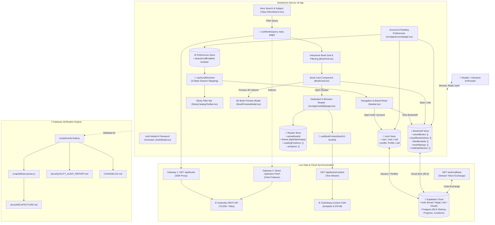

# Bookarium — 100% Legal Public Domain Library & Reader

> **Pure Literature. Zero Paywalls. Zero API Keys Required.**

[](https://antigravity.google)
[](https://github.com/calin-m/Bookarium/actions/workflows/ci.yml)
[-black?style=flat-square&logo=next.js)](https://nextjs.org/)
[](https://react.dev/)
[](https://www.typescriptlang.org/)
[](https://tailwindcss.com/)
[](public/sw.js)
[](https://supabase.com/)
[](https://vercel.com/)
[](docs/QUALITY_AUDIT_REPORT.md)
[](docs/QUALITY_AUDIT_REPORT.md)
[](docs/QUALITY_AUDIT_REPORT.md)
[](ROADMAP.md)
[](LICENSE)

---

An ultra-refined, high-performance web application for discovering, reading, and downloading 100% legal, public domain books (Zero-Copyright / CC0 / Gutenberg Public Domain). Built with **Next.js 16 App Router**, **Supabase Auth & Cloud Synchronization**, **TanStack React Query**, **Zustand offline-first persistence**, **Tailwind CSS**, **Framer Motion**, developed with **[Google AI / Antigravity](https://antigravity.google)**, and verified by a deterministic **7-Gateway Quality Engine**.

---

## 🎨 Design Inspiration & Aesthetic Philosophy

Bookarium's visual identity and tactile layout are deeply inspired by classical editorial typography, archival letterpress printing, and modern Figma bookstore design systems:

* **Figma Editorial Concept**: Inspired by the minimalist elegance of curated bookstore layouts, specifically referencing the [Booksaw — Bookstore E-Commerce Website Design Template](https://www.figma.com/community/file/1521831984874247291/booksaw-bookstore-ecommerce-website-design-template) on the Figma Community.
* **Open-Book Skeuomorphic Details**: Custom open-book card spreads with subtle center spine creases (`.book-center-crease`), realistic paper texture shadows (`shadow-booksaw`), and page depth elevation.
* **Warm Editorial Palettes & 100% Solid Surfaces**:
  * **Day / Standard**: Crisp cream-paper tones (`#fcfbf9`, `#ffffff`) with rich obsidian ink typography and 100% solid, non-transparent surfaces.
  * **Sepia / Cozy Coffee (Warm Midtone)**: Warm roasted espresso and cafe mocha tones (`#251d18`, `#322720`) with steamed milk cream typography (`#f5ece1`) and warm caramel accents for eye comfort in ambient evening light.
  * **Dark Mode**: High-contrast slate obsidian canvas (`#0e1117`, `#161b26`) preserving focus in low-light settings.
* **Refined Typography**: Pairings of classic literary serifs, clean sans-serifs, and monospace archival metadata accents.

---

<!-- BEGIN:latest-release -->
## 🛠️ Latest Improvements (v1.9.3)

- **Personal 1-5 Star Book Ratings (`StarRating.tsx`)**: Tactile star rating widget with hover preview, clear toggle, and zero layout shift.
- **Reading Status Management (`ReadingStatusSelector.tsx`)**: 3-tier reading status selector (Want to Read, Currently Reading, Finished) with active visual states.
- **Viewport-Level Mobile Modal (`BookshelfMobileModal.tsx`)**: Touch-optimized action sheet for mobile and vertical displays (< 1024px) enabling full rating and shelf curation on Favorites and Bookshelf.
- **Live Static Analysis Telemetry (`scripts/generate-quality-report.js`)**: Automated execution and telemetry recording of ESLint 9 and Knip dead code audits directly in `QUALITY_AUDIT_REPORT.md` and `quality-audit-results.json`.
- **Knip Duplicate Export Resolution (`BookshelfMobileModal.tsx`)**: Removed redundant alias exports (`BookMobileModal`), ensuring clean Pass 6 audit compliance with 0 errors.

> 📖 **Complete Historical Ledger**: For full chronological release notes, breaking changes, and migration details across all versions, see [**`CHANGELOG.md`**](CHANGELOG.md).
<!-- END:latest-release -->

---

## 🌐 Data Sources & Infrastructure

Bookarium runs on an open, decentralized architecture requiring **Zero Paid Developer Keys**:

| Service / Source | Endpoint / Provider | Description & Usage |
|---|---|---|
| **Gutendex REST API** | [`gutendex.com`](https://gutendex.com/) • [`GitHub`](https://github.com/garethbjohnson/gutendex) | Open-source JSON Web API created by [Gareth B. Johnson](https://github.com/garethbjohnson/gutendex) indexing over 70,000+ Project Gutenberg public domain titles. Provides search, topic filters, author timelines, download metrics, and metadata with strict `copyright=false` filtering. |
| **Project Gutenberg CDN** | [`gutenberg.org`](https://www.gutenberg.org/) | Direct content delivery network providing unabridged plain text (`.txt`), official EPUB packages (`.epub.images`, `.epub.noimages`), Kindle/MOBI formats, and web-ready HTML. |
| **Supabase (Auth & Postgres)** | [`supabase.com`](https://supabase.com/) | Optional cloud authentication and PostgreSQL synchronization for custom bookshelves and reading progress using Row Level Security (RLS). |
| **Vercel Edge Platform** | [`vercel.com`](https://vercel.com/) | High-performance edge deployment, dynamic SSR route handlers, zero-config production caching, and global CDN delivery. |
| **Public Domain Archive Proxy** | `/api/books` & `/api/books/content` | Next.js server-side route proxies providing caching, CORS handling, and guaranteed public domain integrity before client delivery. |

---

## 🎯 Key Features & Capabilities

* **Zero API Key Requirement**: Works instantly out of the box with zero third-party developer keys, sign-ups, or credit card walls.
* **Strict Public Domain Integrity**: All queries programmatically enforce `copyright=false` through Gutendex and Project Gutenberg.
* **Deep Linking & Bidirectional URL State Synchronization**:
  * All catalog filters (`search`, `topic`, `language`, `era`, `sort`, `format`, `page`, `view`) automatically synchronize bidirectionally with URL search parameters via shallow `history.replaceState`.
  * Fully supports direct bookmarking, shareable search URLs, and native browser Back / Forward (`popstate`) navigation with zero page reloads and 0 CLS.
* **Network Debouncing & Resilient Upstream Querying**:
  * 300ms keystroke debouncing prevents API spamming while typing, with 0ms instant flush on `Enter` / form submission.
  * Robust JSON response parsing with graceful 502/504 failover handling for Gutenberg upstream timeouts.
* **Procedural Cover Art Fallback**:
  * Automatic `onError` detection replaces missing or dead remote cover images with elegant, dark-academia typographic cover art in pure CSS with zero layout shifts.
* **SSR Hydration Guarding Protocol**:
  * Store reads for liked and saved book collections are guarded with `useHasMounted()` to guarantee zero React hydration mismatches on initial server render.
* **100% Live Dual-Gateway Data Pipeline**: Next.js Server Route Proxy paired with direct client upstream failover to `https://gutendex.com/` guaranteeing 100% uptime on serverless platforms without reliance on local mock fallbacks.
* **Dynamic Hourly Rotating 3D Featured Book & Interactive 3D Open-Book Physics**:
  * Curated pool of iconic public domain classics dynamically rotated every UTC hour with zero-cron client/server deterministic synchronization.
  * **Realistic 3D Open-Book Hover & Click-to-Pin State Machine**: On desktop hover, the hardbound volume smoothly elevates and takes a gentle isometric tabletop inclination while the front cover swings open 180° on its left spine hinge—revealing facing **Left Page** (title, author, comprehensive opening chapter reflection) and **Right Page** (notable passage, public domain stamp, and direct read action). Clicking pins the volume open or closed with automatic hover re-engagement.
  * **Physical 60–120 FPS Right-to-Left 3D Page Turn**: Shuffling passages flips a physical 3D leaf ($0^\circ \to -180^\circ$) across the spine with physically synchronized ink reveals, preserving the underlying left page until the leaf physically lands.
  * **Comprehensive Literary Typography**: Full-bodied literary excerpts and opening reflections typeset with balanced line-clamping (`line-clamp-8`) to naturally fill the 2-page spreads without UI overlap.
  * In-book passage shuffle button to cycle through narrative acts and chapters of the open volume without page reloads.
  * 1-Click instant reader handoff with 0ms metadata population.
* **Interactive 3D Book Preview Modal & FLIP Physical Landing**:
  * Clicking "Preview Volume" on any catalog book card triggers a seamless 3D hardcover modal with fluid FLIP geometry transitions.
  * Measures precise viewport-safe bounds (`document.documentElement.clientWidth`) and preserves exact $1.000\times$ typography scales, delivering zero font distortion and seamless subpixel return landing without jumps or pops.
  * Features live in-modal chapter shuffling, opening act excerpts, and instant reader handoff.
* **Directional Stepped Scroll Navigation & User Profile Preferences**:
  * Dynamic scroll detection (`useScrollDirection`) with session-isolated continuous gesture locking (180ms debounce).
  * Smoothly hides top header on first scroll down, docks filter bar to `top-0`, and hides the filter bar on second scroll for 100% immersive book viewing.
  * 1-gesture up-scroll immediately reveals the filter bar at `top-0` for instant page jumping and filter tweaking.
  * User-configurable in User Account Settings (`/account`) between **Smart Auto-Hide** and **Always Fixed**.
* **Collapsible Left-Side Catalog Filter Sidebar & Push-Content Desktop Layout**:
  * Slide-out left-docked filter drawer (`slide-in-from-left duration-300`) with zero dark background dimming.
  * On desktop, opening filters smoothly pushes the entire webpage content (`<main>`) to the right (`lg:pl-96 duration-300`), allowing non-blocking side-by-side catalog browsing and live filter tweaking.
  * The **Filters** button functions as an interactive toggle (`Open / Close`) with active state highlights.
* **Flush 0px Sticky Header & Floating Shadow Elevation**:
  * Seamless 0px flush alignment between the top navbar and sticky toolbar with a floating `shadow-md` elevation over scrolling book cards.
  * Horizontally scrollable active filter chips strip (`overflow-x-auto scrollbar-none`) preventing vertical height shifts (0 CLS).
* **Deep Archive Query UX & Live Telemetry**: Sticky catalog toolbar equipped with real-time roundtrip latency telemetry, direct page jumping, animated `Info` indicators, responsive mobile two-tier wrapping, and informative tooltips explaining relational SQL offsets across 70,000+ public domain volumes.
* **Header Navigation & Brand Reset**: Clean top bar with unified iconography (**Catalog** `<BookOpen>`, **Bookshelf** `<Bookmark>`, **Favorites** `<Heart>`, **Notebook** `<Highlighter>`), dynamic solid fill states, single-click brand catalog reset/refresh, and automatic mobile icon collapsing for zero horizontal overflow.
* **Progressive Web App (PWA), Offline App Shell & Standalone Installation**:
  * Native Next.js 16 Web App Manifest (`manifest.ts`) declaring standalone display mode, `id: '/?source=pwa'`, explicit `scope: '/'`, brand obsidian/cream theme colors, and a full suite of standard and maskable PWA icons (`public/icons/`).
  * **Native Service Worker Offline Cache Engine (`public/sw.js`, `ServiceWorkerRegister.tsx`)**: Precaches the application shell and static assets, serving cached app shell navigation on offline requests so stored IndexedDB books can be read in airplane mode with zero network access.
  * Seamless 1-click home screen installation on iOS, Android, macOS, and Windows with zero browser address bar chrome.
* **In-Reader Text Highlighting & Annotations Engine**:
  * Direct prose text selection triggers a floating contextual toolbar (`TextHighlightPopover`) offering 4 editorial pastel highlighters (Canary Yellow, Vintage Amber, Calm Mint, Soft Rose) with coarse-pointer context menu clearance and touch dismissal.
  * Chapter-scoped annotation filtering, in-place color switching, single-quote deletion confirmation modals with quote previews, passage deduplication, and color-matched selection styling (`::selection`) across Light, Dark, and Sepia themes to eliminate default browser selection clashing.
  * Bilingual Parallel mode annotation integration rendering highlights and notes on both translated and original sentences.
  * Full-text searchable drawer (`ReaderAnnotationsDrawer`) with chapter/page coordinates, color filter tabs, and 1-click jumps.
  * Dual-tier persistence: 100% offline-first in browser storage with Supabase PostgreSQL cloud sync, Row-Level Security (`public.user_annotations`), persistent deletion tombstones preventing zombie note resurrection, and an offline mutation outbox queue.
* **Literary Commonplace Notebook & Reading Journal (`/?view=notebook`)**:
  * Dedicated 4th navigation tab in the top header with active amber fill state, clean Booksaw editorial typography, and zero badge clutter.
  * Comprehensive reading journal view organizing all highlighted excerpts and personal marginalia across your entire library.
  * Multi-tier book metadata resolution, full-text search, pastel color filter pills with horizontal mouse wheel scroll translation, volume grouping vs chronological stream, safe single-quote and collection wipe confirmation modals, and 1-click academic citation copying.
* **User Account Reading Journal Metrics (`/account`)**:
  * Added a dedicated 4th metric card in a responsive 2x2 grid displaying live "Notes & Quotes" counts with amber accenting and direct deep-linking to the Literary Notebook.
* **Floating Back to Top & Quick Navigation**: Motion-animated scroll-to-top button with viewport threshold detection.
* **Interactive Studio Bookshelf Mode**:
  * **Unified Hardwood Bookcase**: Integrated shelf niche alcove and solid timber rail with bevel highlights and ambient spotlight vignettes (`.shelf-ambient-niche`), ensuring books sit directly flush on the wood ledge.
  * **3D Convex Spines & Gilded Lettering**: Convex specular spine curvature (`.book-spine-convex`) with 8 authentic binding colorways (Oxblood, Navy, Emerald, Saddle, Plum, Charcoal, Teal, Espresso), hot-foil gold/silver typography, and bookmark ribbons.
  * **Multi-Shelf Categories & General View**: Master "General" view displaying all library volumes alongside custom collections, with a floating "Move to Shelf" selector on spine hover cards.
  * **Grounded Pull-Forward Hover**: Physical scaling (`scale-105 origin-bottom`) pulling the volume forward toward the reader with instant `Read`, `Download`, and `Bookmark` actions.
* **Dedicated In-Browser Focus Reader (`/read/[id]`)**:
  * **Exact-Page Bookmarking & Auto-Resume**: Automatic persistence of exact chapter and page coordinates (`readingPositions`) in `useReaderStore`. Opening any volume displays a non-intrusive "Resumed at Chapter X, Page Y" toast with a 1-click Restart option.
  * **Triple-Tier Metadata Resolution & Gutenberg Archive Modal**: Instant reader metadata resolution (Store $\to$ Plain-Text Header Parsing $\to$ API) with an interactive `[ ℹ️ #VolumeID ]` badge that opens a detailed Gutenberg Public Domain Archive modal without causing any header layout shifts.
  * **Edge-to-Edge Symmetrical Reader Toolbars**: Full-width top navigation header and bottom footer with mathematically locked center progress badges and page jumpers, eliminating layout drift across varying book and chapter title lengths.
  * **Tactile Hardware-Accelerated Page-Turn Opacity Transitions**: Smooth 180ms ease-out opacity micro-transitions (`animate-page-turn`) paired with motion-safe scroll-to-top on page flips, Next/Prev actions, and catalog grid browsing with automatic `prefers-reduced-motion` compliance.
  * **Dual-Strategy Chapter & Anthology TOC Engine**: Automatically segments both standard numbered chapters (`CHAPTER 1`, `BOOK I`) and short story/tale anthologies (e.g. *"Twenty-Five Ghost Stories"* `read/53419`) via front-matter `CONTENTS` index scanning, listing all individual stories as discrete, jumpable sections in the Table of Contents drawer.
  * **Gutenberg Paragraph Reflow Engine**: Normalizes legacy 70-character hard linebreaks into fluid prose across Narrow (`576px`), Normal (`768px`), and Wide (`1024px`) reading layouts while preserving double-spaced paragraphs, dialogue, and indented poetry/verse.
  * **True Book-Wide Global Pagination**: Calculates virtual pages across the entire volume with keyboard (`←`/`→`) and input page jumping.
  * **Table of Contents Drawer (`ReaderTocDrawer`)**: Instant chapter navigation with live starting page number badges (`p. 18`, `p. 28`, `p. 34`), read-time estimates, and solid opaque surfaces with transparent backdrops.
  * **In-Book Full-Text Search Drawer (`ReaderSearchDrawer`)**: Real-time client regex search engine scanning the entire volume with highlighted snippet matches (`<mark>`), chapter grouping, live match count badges, 1-click chapter jumps, and keyboard shortcut invocation (`Ctrl+F` / `Cmd+F` / `/`).
  * **Language Editions & Translations Drawer (`ReaderLanguageDrawer`)**: Portaled modal discovering all international editions (Spanish, French, German, Italian, etc.) and bilingual translations with 1-click reading handoff.
  * **Physical Sliding Mobile Toolbar Drawer (`ReaderHeader`)**: Pin-docked mobile control drawer with an integrated traveling pull handle (`[‹] / [›]`), keeping the reading canvas and page-turn tap zones 100% unblocked.
  * **Font Scaler & Dynamic Line Spacing Sliders**: Real-time font sizing (12px–36px) and dynamic line height (1.2–2.6) with 1-click presets (`14px / 18px / 24px` and `1.4 Compact / 1.8 Standard / 2.2 Spacious`) and top bar quick spacing cycler (`↕`).
  * **Pinch‑to‑Zoom Font Scaling (Mobile)**: Two‑finger pinch gestures adjust the font size between 12 px – 36 px, displaying a transient HUD pill with the current size.
  * **Typography & Reading Modes**: 1-click column width presets (**Narrow** / **Normal** / **Wide** — defaulting to **Wide** `1024px`) and reading mode switching (**Page** / **Scroll**).
* **Dynamic Literary Passages & Quotes ("Words That Shaped Humanity")**: Rotating showcase of iconic classic quotes with classical first-line editorial indentation, interactive shuffle discovery, and bottom-aligned author citations and read prompts across all cards.
* **Zero-Copyright Download Hub & Canonical Fallback Engine**: Multi-format downloads (direct EPUB, Kindle/MOBI, clean UTF-8 plain text, and web-ready HTML) backed by Project Gutenberg permanent canonical URLs, guaranteeing 100% download availability across the Catalog, Bookshelf, and Favorites.
* **Native IndexedDB Offline Book Storage Engine**: Zero-dependency browser storage bypassing the 5MB `localStorage` limit, enabling readers to download individual books or entire bookshelf collections for instant offline reading with a single click and clear with confirmation safety.
* **Auto-Healing Personal Bookshelf & Cross-Device Favorites Sync**: Curated collections, reading queue, reading history, and favorited titles synchronized across devices via Supabase PostgreSQL and Row Level Security (RLS), with automatic local-to-cloud migration on login and database uniqueness guards.
* **Personal 1–5 Star Book Ratings & Reading Status Management**:
  * Tactile 5-star rating system (`StarRating.tsx`) with hover-preview, active selection, accessible clear rating toggle (`×`), and zero layout shifts.
  * 3-tier reading status classification (**Want to Read**, **Currently Reading**, **Finished**) with active selection rings and single-click removal.
  * Responsive dual-mode presentation:
    * **Desktop** ($\ge 1024\text{px}$): Integrated into the floating 3D hardcover preview toolbar (`BookPreviewModal`) rendered on a solid theme-consistent card surface (`bg-card`) with outside-click backdrop dismissal and isolated interactive controls.
    * **Mobile & Narrow Displays** ($< 1024\text{px}$): Touch-optimized modal sheet (`BookshelfMobileModal`) triggered directly when tapping covers or ratings in Favorites (`activeView === 'likes'`) or Bookshelf, providing phone/tablet rating ergonomics without impacting 1-tap catalog reading.
  * 100% offline-first via Zustand `useBookshelfStore`, synchronized with Supabase PostgreSQL (`public.user_book_curation`) using Row Level Security.
* **Pure Domain Library Portability & Full Data Sovereignty**:
  * Single-click portable JSON backup and RFC 4180-compliant CSV spreadsheet catalog export (`src/lib/library-backup.ts`) capturing volumes, shelves, bookmarks, ratings, reading statuses, and literary annotations.
  * Defensive schema validation (`validateLibraryBackup`) and dual-strategy restore (**Merge with Existing Library** preserving current collections, or **Replace Entire Library** for clean snapshot restores) with live preview badges, destructive action safeguards, and automatic cloud sync.
### 🌐 Supported Languages, On-Demand AI Translation & Neural Read-Aloud

Bookarium provides a comprehensive, multi-tiered language ecosystem designed for both authentic public domain archive discovery and universal accessibility:

#### 1. Catalog & Archive Filtering (12 Primary Languages)
The catalog can be filtered by the following primary language options (ISO‑639‑1 codes used by the API):
- `en` – English
- `fr` – French (Français)
- `de` – German (Deutsch)
- `es` – Spanish (Español)
- `it` – Italian (Italiano)
- `la` – Latin (Lingua Latina)
- `el` – Greek (Ancient & Modern)
- `pt` – Portuguese (Português)
- `nl` – Dutch (Nederlands)
- `ru` – Russian (Русский)
- `zh` – Chinese (中文)
- `ro` – Romanian (Română)

> **How it works** – Selecting a language via the unified `<LanguageSelector />` component (available on both the main Hero search bar and the sidebar filter drawer) adds a `languages=<code>` query parameter that flows through `useBooks` → `/api/books` → Gutendex API, returning only public domain books in the chosen language. Inside the reader, the **Language Drawer** also discovers all authentic Project Gutenberg foreign editions and translations for the current title.

#### 2. On-Demand Dynamic AI Translation (40+ Languages)
Inside any public domain volume, readers can translate pages on-the-fly into **40+ world languages** (featuring 18 popular language quick-chips including Spanish, French, German, Italian, Portuguese, Romanian, Dutch, Russian, Japanese, Chinese, Polish, Swedish, and more):
- **Zero-Key Serverless Architecture**: Powered by a rate-limited Google Neural Machine Translation proxy (`/api/translate`) requiring zero third-party paid API keys or account sign-in.
- **Offline Page-Level Caching**: Every translated page is automatically cached in `localStorage` per book and page, enabling instant, zero-latency transitions on re-read.
- **Bilingual Parallel Reading Mode**: Seamlessly toggle between full translation and bilingual parallel view, displaying translated paragraphs alongside authentic original sentence subtitles for comparative study and language learning.

#### 3. Synchronized Neural Voice Read-Aloud (Text-to-Speech)
- **Automatic Language-Aware Voice Pairing**: The offline-first Web Speech narration engine (`window.speechSynthesis`) automatically detects whether the reader is viewing original text or a translated page, instantly pairing narration with high-definition neural voices native to that language.
- **Real-Time Visual Sentence Highlighting**: As narration plays, each active sentence is highlighted with an amber glow on `ReaderSurface`, synchronizing visual reading and audio narration.
- **Full Media Session & Audio Controls**: Offers speed presets (0.85x–2.0x), sentence navigation (Skip Prev / Next), and OS-level MediaSession integration for lock screen and Bluetooth headphone controls.
#### 4. Transparent Privacy & Global Data Sovereignty (`/privacy`)
- **Zero-Tracking Architecture**: Engineered with zero Google Analytics, zero Meta Pixels, zero advertising beacons, and zero commercial tracking dossiers.
- **ePrivacy Directive Art. 5(3) Exemption**: Omits intrusive cookie pop-up banners because Bookarium sets no non-essential cookies. The only cookie used is the strictly necessary Supabase authentication session token (`sb-*-auth-token`) when a user explicitly signs in.
- **Local-First Storage**: Reading progress, themes, font settings, and downloaded books are saved locally in browser `localStorage` and `IndexedDB`.
- **Global Compliance & Self-Service Erasure**: Fully compliant with GDPR (Articles 15–20), California CCPA/CPRA ("Do Not Sell or Share My Personal Information"), COPPA (under-13 protections), and UK GDPR, featuring instant self-service account deletion and data wiping in User Settings (`/account`).

---

## 🏛️ System Architecture Diagrams

### 1. End-to-End System Context & Data Flow



---

### 2. Focus Reader State & Typography Engine

```mermaid
flowchart LR
    subgraph ReaderState ["Zustand Reader Store (useReaderStore)"]
        ActiveBook["Active Book Metadata"]
        FontSize["Font Size: 12px - 36px"]
        FontFamily["Font Family: Serif | Sans | Mono"]
        LineHeight["Line Height: 1.2 - 2.6"]
        ColumnWidth["Column Width: Narrow (576px) | Normal (768px) | Wide (1024px)"]
        ReadingMode["Reading Mode: Paginated | Scroll"]
        Theme["Theme: Light | Dark | Sepia"]
        Progress["Global Page & Book Progress %"]
        Positions["Reading Positions Map\n(exact chapter & page restore)"]
    end

    subgraph ParsingEngine ["Gutenberg Typography & Segmentation AST"]
        RawText["Raw Plain Text Stream"]
        Reflow["reflowGutenbergParagraphs\n(Normalizes 70-col hard wraps)"]
        TOCFilter["Front-Matter TOC Suppressor"]
        Segmentation["Chapter Section Segmentation"]
        VirtualPages["Virtual Continuous Page Spread (5600 chars/pg)"]
        
        RawText --> Reflow
        Reflow --> TOCFilter
        TOCFilter --> Segmentation
        Segmentation --> VirtualPages
    end

    subgraph ReaderView ["Dedicated Focus Reader (src/app/read/[id]/page.tsx)"]
        Toolbar["Top Editorial Reader Bar & Sliding Tray (ReaderHeader)"]
        SubHeader["Sub-Header Status Ribbon (ReaderSubHeaderRibbon)"]
        ContentArea["Book Page Rendering Area (Fluid Paragraph Wrap)"]
        ProgressBar["Top Reading Progress Indicator"]
        ResumeToast["Exact-Page Auto-Resume Toast"]
        FooterBar["Sticky Bottom Pagination & Page Jump"]
        TOC["Table of Contents Drawer (ReaderTocDrawer)"]
        SearchDrawer["In-Book Search Drawer (ReaderSearchDrawer)"]
        LangDrawer["Language Editions Drawer (ReaderLanguageDrawer)"]
        Controls["Appearance & Typography Popover (ReaderControls)"]
        InfoModal["Archival Metadata Modal (GutenbergInfoModal)"]
    end

    subgraph Persistence ["Browser LocalStorage"]
        LSState[("bookarium-reader-preferences")]
        LSProgress[("bookarium-progress-map")]
        LSPositions[("bookarium-reading-positions")]
    end

    Toolbar -->|"Adjust Size / Family / Width / Mode / Theme"| ReaderState
    VirtualPages --> ReaderView
    ReaderState --> ContentArea
    ReaderState --> ProgressBar
    ReaderState --> ResumeToast
    FooterBar -->|"Page Flip / Jump"| ReaderState
    TOC -->|"Select Chapter (p. X)"| ReaderState
    SearchDrawer -->|"Jump to Match (p. X)"| ReaderState
    LangDrawer -->|"Switch Translation"| ReaderState
    Controls -->|"Tweak Settings"| ReaderState
    ReaderState <--> LSState
    ReaderState <--> LSProgress
    ReaderState <--> LSPositions
```



---

## ⚡ Quick Start

### Prerequisites
- **Node.js**: `>= 20.0.0` (Node 22 LTS recommended)
- **npm**: `>= 10.0.0`

### Environment Configuration (Optional - for Cloud Bookshelf Sync)
Create a `.env.local` file in the project root with your public Supabase project credentials:

```env
NEXT_PUBLIC_SUPABASE_URL=https://your-project-id.supabase.co
NEXT_PUBLIC_SUPABASE_ANON_KEY=your-supabase-anon-key
```

*(If no Supabase credentials are provided, Bookarium operates seamlessly in 100% offline-first mode using browser storage).*

---

## 🗄️ Supabase Cloud Database & Authentication Setup

Bookarium uses Supabase PostgreSQL for optional cloud authentication, cross-device bookshelf & favorites synchronization, and reading progress tracking. Follow these steps to provision your database in under 2 minutes:

### Step 1: Create a Free Supabase Project
1. Go to [supabase.com](https://supabase.com/) and create a new project.
2. Note your **Project URL** and **anon public API Key** from **Project Settings $\to$ API**.

### Step 2: Run Database Schema Script
1. In your Supabase Dashboard, open the **SQL Editor** from the left sidebar.
2. Click **New Query** and copy the contents of [`supabase/schema.sql`](supabase/schema.sql):

```sql
-- 1. Profiles Table
CREATE TABLE IF NOT EXISTS public.profiles (
  id UUID PRIMARY KEY REFERENCES auth.users(id) ON DELETE CASCADE,
  display_name TEXT,
  preferred_theme TEXT DEFAULT 'light',
  font_size INTEGER DEFAULT 18,
  created_at TIMESTAMPTZ NOT NULL DEFAULT NOW(),
  updated_at TIMESTAMPTZ NOT NULL DEFAULT NOW()
);
ALTER TABLE public.profiles ENABLE ROW LEVEL SECURITY;
DROP POLICY IF EXISTS "Users can view their own profile" ON public.profiles;
CREATE POLICY "Users can view their own profile" ON public.profiles FOR SELECT USING (auth.uid() = id);
DROP POLICY IF EXISTS "Users can insert their own profile" ON public.profiles;
CREATE POLICY "Users can insert their own profile" ON public.profiles FOR INSERT WITH CHECK (auth.uid() = id);
DROP POLICY IF EXISTS "Users can update their own profile" ON public.profiles;
CREATE POLICY "Users can update their own profile" ON public.profiles FOR UPDATE USING (auth.uid() = id);
DROP POLICY IF EXISTS "Users can delete their own profile" ON public.profiles;
CREATE POLICY "Users can delete their own profile" ON public.profiles FOR DELETE USING (auth.uid() = id);

-- 2. Bookshelves Table (Master 'General' + Custom Shelves)
CREATE TABLE IF NOT EXISTS public.bookshelves (
  id UUID PRIMARY KEY DEFAULT gen_random_uuid(),
  user_id UUID NOT NULL REFERENCES auth.users(id) ON DELETE CASCADE,
  name TEXT NOT NULL,
  is_default BOOLEAN NOT NULL DEFAULT false,
  created_at TIMESTAMPTZ NOT NULL DEFAULT NOW(),
  updated_at TIMESTAMPTZ NOT NULL DEFAULT NOW()
);
CREATE UNIQUE INDEX IF NOT EXISTS unique_user_default_bookshelf ON public.bookshelves(user_id) WHERE is_default = true;
CREATE UNIQUE INDEX IF NOT EXISTS unique_user_shelf_name ON public.bookshelves(user_id, lower(trim(name)));
ALTER TABLE public.bookshelves ENABLE ROW LEVEL SECURITY;
DROP POLICY IF EXISTS "Users can view their own bookshelves" ON public.bookshelves;
CREATE POLICY "Users can view their own bookshelves" ON public.bookshelves FOR SELECT USING (auth.uid() = user_id);
DROP POLICY IF EXISTS "Users can insert their own bookshelves" ON public.bookshelves;
CREATE POLICY "Users can insert their own bookshelves" ON public.bookshelves FOR INSERT WITH CHECK (auth.uid() = user_id);
DROP POLICY IF EXISTS "Users can update their own bookshelves" ON public.bookshelves;
CREATE POLICY "Users can update their own bookshelves" ON public.bookshelves FOR UPDATE USING (auth.uid() = user_id);
DROP POLICY IF EXISTS "Users can delete their own bookshelves" ON public.bookshelves;
CREATE POLICY "Users can delete their own bookshelves" ON public.bookshelves FOR DELETE USING (auth.uid() = user_id);

-- 3. Bookshelf Items Table
CREATE TABLE IF NOT EXISTS public.bookshelf_items (
  id UUID PRIMARY KEY DEFAULT gen_random_uuid(),
  bookshelf_id UUID NOT NULL REFERENCES public.bookshelves(id) ON DELETE CASCADE,
  user_id UUID NOT NULL REFERENCES auth.users(id) ON DELETE CASCADE,
  book_id INTEGER NOT NULL,
  book_title TEXT NOT NULL,
  book_authors TEXT[] NOT NULL DEFAULT '{}',
  cover_url TEXT,
  added_at TIMESTAMPTZ NOT NULL DEFAULT NOW(),
  UNIQUE(bookshelf_id, book_id)
);
ALTER TABLE public.bookshelf_items ENABLE ROW LEVEL SECURITY;
DROP POLICY IF EXISTS "Users can view their own bookshelf items" ON public.bookshelf_items;
CREATE POLICY "Users can view their own bookshelf items" ON public.bookshelf_items FOR SELECT USING (auth.uid() = user_id);
DROP POLICY IF EXISTS "Users can insert their own bookshelf items" ON public.bookshelf_items;
CREATE POLICY "Users can insert their own bookshelf items" ON public.bookshelf_items FOR INSERT WITH CHECK (auth.uid() = user_id);
DROP POLICY IF EXISTS "Users can update their own bookshelf items" ON public.bookshelf_items;
CREATE POLICY "Users can update their own bookshelf items" ON public.bookshelf_items FOR UPDATE USING (auth.uid() = user_id);
DROP POLICY IF EXISTS "Users can delete their own bookshelf items" ON public.bookshelf_items;
CREATE POLICY "Users can delete their own bookshelf items" ON public.bookshelf_items FOR DELETE USING (auth.uid() = user_id);

-- 4. User Favorites Table (Cross-Device Favorites Sync)
CREATE TABLE IF NOT EXISTS public.user_favorites (
  user_id UUID NOT NULL REFERENCES auth.users(id) ON DELETE CASCADE,
  book_id INTEGER NOT NULL,
  book_title TEXT NOT NULL,
  book_authors TEXT[] NOT NULL DEFAULT '{}',
  cover_url TEXT,
  created_at TIMESTAMPTZ NOT NULL DEFAULT NOW(),
  PRIMARY KEY (user_id, book_id)
);
ALTER TABLE public.user_favorites ENABLE ROW LEVEL SECURITY;
DROP POLICY IF EXISTS "Users can view their own favorites" ON public.user_favorites;
CREATE POLICY "Users can view their own favorites" ON public.user_favorites FOR SELECT USING (auth.uid() = user_id);
DROP POLICY IF EXISTS "Users can insert their own favorites" ON public.user_favorites;
CREATE POLICY "Users can insert their own favorites" ON public.user_favorites FOR INSERT WITH CHECK (auth.uid() = user_id);
DROP POLICY IF EXISTS "Users can delete their own favorites" ON public.user_favorites;
CREATE POLICY "Users can delete their own favorites" ON public.user_favorites FOR DELETE USING (auth.uid() = user_id);

-- 5. Reading Progress Table
CREATE TABLE IF NOT EXISTS public.reading_progress (
  id UUID PRIMARY KEY DEFAULT gen_random_uuid(),
  user_id UUID NOT NULL REFERENCES auth.users(id) ON DELETE CASCADE,
  book_id INTEGER NOT NULL,
  current_chapter_index INTEGER NOT NULL DEFAULT 0,
  progress_percent NUMERIC NOT NULL DEFAULT 0,
  scroll_offset NUMERIC NOT NULL DEFAULT 0,
  last_read_at TIMESTAMPTZ NOT NULL DEFAULT NOW(),
  UNIQUE(user_id, book_id)
);
ALTER TABLE public.reading_progress ENABLE ROW LEVEL SECURITY;
DROP POLICY IF EXISTS "Users can view their own reading progress" ON public.reading_progress;
CREATE POLICY "Users can view their own reading progress" ON public.reading_progress FOR SELECT USING (auth.uid() = user_id);
DROP POLICY IF EXISTS "Users can insert their own reading progress" ON public.reading_progress;
CREATE POLICY "Users can insert their own reading progress" ON public.reading_progress FOR INSERT WITH CHECK (auth.uid() = user_id);
DROP POLICY IF EXISTS "Users can update their own reading progress" ON public.reading_progress;
CREATE POLICY "Users can update their own reading progress" ON public.reading_progress FOR UPDATE USING (auth.uid() = user_id);
DROP POLICY IF EXISTS "Users can delete their own reading progress" ON public.reading_progress;
CREATE POLICY "Users can delete their own reading progress" ON public.reading_progress FOR DELETE USING (auth.uid() = user_id);

-- 6. User Annotations Table (Highlights & Scholarly Notes)
CREATE TABLE IF NOT EXISTS public.user_annotations (
  id UUID PRIMARY KEY DEFAULT gen_random_uuid(),
  user_id UUID NOT NULL REFERENCES auth.users(id) ON DELETE CASCADE,
  book_id INTEGER NOT NULL,
  chapter_index INTEGER NOT NULL,
  chapter_page INTEGER NOT NULL,
  selected_text TEXT NOT NULL,
  color TEXT NOT NULL CHECK (color IN ('yellow', 'amber', 'mint', 'rose')),
  note TEXT,
  created_at TIMESTAMPTZ NOT NULL DEFAULT timezone('utc'::text, now()),
  updated_at TIMESTAMPTZ NOT NULL DEFAULT timezone('utc'::text, now())
);
ALTER TABLE public.user_annotations ENABLE ROW LEVEL SECURITY;
DROP POLICY IF EXISTS "Users can view their own annotations" ON public.user_annotations;
CREATE POLICY "Users can view their own annotations" ON public.user_annotations FOR SELECT TO authenticated USING (auth.uid() = user_id);
DROP POLICY IF EXISTS "Users can insert their own annotations" ON public.user_annotations;
CREATE POLICY "Users can insert their own annotations" ON public.user_annotations FOR INSERT TO authenticated WITH CHECK (auth.uid() = user_id);
DROP POLICY IF EXISTS "Users can update their own annotations" ON public.user_annotations;
CREATE POLICY "Users can update their own annotations" ON public.user_annotations FOR UPDATE TO authenticated USING (auth.uid() = user_id) WITH CHECK (auth.uid() = user_id);
DROP POLICY IF EXISTS "Users can delete their own annotations" ON public.user_annotations;
CREATE POLICY "Users can delete their own annotations" ON public.user_annotations FOR DELETE TO authenticated USING (auth.uid() = user_id);
CREATE INDEX IF NOT EXISTS idx_user_annotations_user_book ON public.user_annotations(user_id, book_id);

-- 7. User Book Curation Table (Personal 1-5 Star Ratings & Reading Statuses)
CREATE TABLE IF NOT EXISTS public.user_book_curation (
  id UUID PRIMARY KEY DEFAULT gen_random_uuid(),
  user_id UUID NOT NULL REFERENCES auth.users(id) ON DELETE CASCADE,
  book_id INTEGER NOT NULL,
  rating SMALLINT CHECK (rating >= 1 AND rating <= 5),
  reading_status TEXT CHECK (reading_status IN ('want_to_read', 'currently_reading', 'finished')),
  created_at TIMESTAMPTZ NOT NULL DEFAULT timezone('utc'::text, now()),
  updated_at TIMESTAMPTZ NOT NULL DEFAULT timezone('utc'::text, now()),
  UNIQUE(user_id, book_id)
);
ALTER TABLE public.user_book_curation ENABLE ROW LEVEL SECURITY;
DROP POLICY IF EXISTS "Users can view their own book curation" ON public.user_book_curation;
CREATE POLICY "Users can view their own book curation" ON public.user_book_curation FOR SELECT TO authenticated USING (auth.uid() = user_id);
DROP POLICY IF EXISTS "Users can insert their own book curation" ON public.user_book_curation;
CREATE POLICY "Users can insert their own book curation" ON public.user_book_curation FOR INSERT TO authenticated WITH CHECK (auth.uid() = user_id);
DROP POLICY IF EXISTS "Users can update their own book curation" ON public.user_book_curation;
CREATE POLICY "Users can update their own book curation" ON public.user_book_curation FOR UPDATE TO authenticated USING (auth.uid() = user_id) WITH CHECK (auth.uid() = user_id);
DROP POLICY IF EXISTS "Users can delete their own book curation" ON public.user_book_curation;
CREATE POLICY "Users can delete their own book curation" ON public.user_book_curation FOR DELETE TO authenticated USING (auth.uid() = user_id);
CREATE INDEX IF NOT EXISTS idx_user_book_curation_user_book ON public.user_book_curation(user_id, book_id);

-- 8. Auto-Provisioning User Trigger (Profile + Default General Shelf)
CREATE OR REPLACE FUNCTION public.handle_new_user()
RETURNS TRIGGER AS $$
BEGIN
  INSERT INTO public.profiles (id, display_name, preferred_theme)
  VALUES (NEW.id, COALESCE(NEW.raw_user_meta_data->>'display_name', 'Reader'), 'light')
  ON CONFLICT (id) DO NOTHING;

  INSERT INTO public.bookshelves (user_id, name, is_default)
  VALUES (NEW.id, 'General', true)
  ON CONFLICT DO NOTHING;

  RETURN NEW;
END;
$$ LANGUAGE plpgsql SECURITY DEFINER;

DROP TRIGGER IF EXISTS on_auth_user_created ON auth.users;
CREATE TRIGGER on_auth_user_created
  AFTER INSERT ON auth.users
  FOR EACH ROW EXECUTE FUNCTION public.handle_new_user();

-- 9. RPC Function: Delete Current User Account
CREATE OR REPLACE FUNCTION public.delete_current_user()
RETURNS VOID AS $$
BEGIN
  DELETE FROM auth.users WHERE id = auth.uid();
END;
$$ LANGUAGE plpgsql SECURITY DEFINER;
```

3. Click **Run** to execute the script. This provisions all tables, enables strict Row Level Security (RLS), registers automatic profile creation triggers, and installs the self-account deletion RPC.

### Step 3: Configure Authentication Redirect URLs
1. In your Supabase Dashboard, navigate to **Authentication $\to$ URL Configuration**.
2. Set **Site URL** to:
   - `http://localhost:3000` (for local development) or `https://your-app.vercel.app` (for production)
3. Under **Redirect URLs**, add the following allowed callback endpoints:
   - `http://localhost:3000/auth/callback`
   - `http://localhost:3000/auth/confirm-deletion`
   - `http://localhost:3000/account`
   - `https://your-app.vercel.app/auth/callback`
   - `https://your-app.vercel.app/auth/confirm-deletion`
   - `https://your-app.vercel.app/account`

---

### Installation & Local Development

```bash
# 1. Clone the repository and install dependencies
npm install

# 2. Start local development server (automatically launches browser)
npm run dev:open

# 3. Or launch full development environment with background test watcher
npm run dev:all
```

The application will be accessible at [http://localhost:3000](http://localhost:3000).

### 🚀 Production Deployment on Vercel

Bookarium is architected for zero-config deployment on **[Vercel](https://vercel.com/)**:

1. Push your repository branch to GitHub.
2. Import the project into the [Vercel Dashboard](https://vercel.com/new).
3. Under **Environment Variables**, optionally set:
   * `NEXT_PUBLIC_SUPABASE_URL` = your Supabase project URL
   * `NEXT_PUBLIC_SUPABASE_ANON_KEY` = your Supabase public anon key
4. Click **Deploy** — Vercel will automatically build the Next.js 16 production bundle, configure edge caching, and provision serverless API proxies.
---

## 🔒 Enterprise Security & Resiliency Architecture

Bookarium implements a defense-in-depth security model across the edge, serverless runtime, and client layers:

| Security Vector | Implementation & File Path | Protection Mechanism |
|---|---|---|
| **Sliding-Window Rate Limiting** | [`src/lib/rate-limiter.ts`](src/lib/rate-limiter.ts) | Zero-dependency in-memory sliding-window rate limiter protecting upstream Project Gutenberg APIs (60 req/min on `/api/books`, 30 req/min on `/api/books/content`) with automatic 30s garbage collection, `X-RateLimit-*` headers, and `429 Too Many Requests` status with `Retry-After`. |
| **HTTP Security Headers** | [`next.config.ts`](next.config.ts) | Enforces HSTS (`max-age=63072000; includeSubDomains; preload`), Clickjacking defense (`X-Frame-Options: SAMEORIGIN`), MIME-type sniffing prevention (`X-Content-Type-Options: nosniff`), Referrer Policy (`strict-origin-when-cross-origin`), and Permissions Policy (`camera=(), microphone=(), geolocation=()`). |
| **SSRF & Path Traversal Immunity** | [`src/app/api/books/content/route.ts`](src/app/api/books/content/route.ts) | Upstream URL whitelisting (`isSafeUpstreamUrl`) restricting fetches strictly to official Project Gutenberg domains (`gutenberg.org`, `aleph.gutenberg.org`, `ibiblio.org`), strict numeric ID regex verification (`^\d{1,8}$`), and `redirect: 'manual'` preventing open redirect hops. |
| **Open Redirect Defense** | [`src/app/auth/callback/route.ts`](src/app/auth/callback/route.ts) | Path sanitization (`sanitizeRedirectPath`) guaranteeing OAuth and magic-link redirect paths strictly originate from trusted relative roots (`/^\/[^\/\\]/`) preventing off-site phishing redirects. |
| **ReDoS & Main Thread Protection** | [`src/lib/gutenberg-parser.ts`](src/lib/gutenberg-parser.ts) | Non-backtracking regular expressions (`[^\n]{0,80}`) and bounded passage analysis window (capped at 120,000 characters) eliminating regular expression denial of service (ReDoS) and event loop freezing on massive multi-megabyte classical tomes. |
| **LRU Pagination Memory Cache** | [`src/lib/gutenberg-parser.ts`](src/lib/gutenberg-parser.ts) | 500-entry memory cache (`Map<string, string[]>`) for paginated chapter views, delivering instant sub-millisecond virtual page turns with zero redundant recalculation. |
| **Relational Data Purge & Account Deletion** | [`src/stores/useAuthStore.ts`](src/stores/useAuthStore.ts) | Comprehensive cascading cleanup across PostgreSQL tables (`reading_progress`, `bookshelf_items`, `bookshelves`, `profiles`) with fallback RPC `delete_current_user` execution and session revocation. |
| **Datacenter Proximity & Edge Optimization** | [`vercel.json`](vercel.json) | Pins serverless execution to `iad1` (Washington D.C. / US-East) directly adjacent to Gutenberg/Gutendex nodes with dedicated memory and payload compression (`gzip, deflate, br`). |

---

## 🛠️ CLI Command Matrix

| Command | Action / Description |
|---|---|
| `npm run dev` | Starts Next.js development server at `http://localhost:3000` |
| `npm run dev:open` | Starts dev server and opens your default browser concurrently |
| `npm run dev:all` | Starts dev server, Vitest test watcher, and browser concurrently |
| `npm run verify` | **Runs the full 7-Gateway Quality Engine** before commits |
| `npm test` | Runs the full Vitest suite with V8 code coverage report |
| `npm run test:fast` | Runs Vitest test suites without coverage calculation for rapid developer validation |
| `npm run test:ui` | Launches Vitest interactive visual testing UI |
| `npm run test:watch` | Runs Vitest in reactive watch mode for TDD |
| `npm run typecheck` | Validates TypeScript types across all `.ts`/`.tsx` files |
| `npm run lint` | Runs ESLint 9 rules and Core Web Vitals checks |
| `npm run knip` | Audits repository for unused exports and dead dependencies |
| `npm run docs:sync` | Auto-generates `docs/ARCHITECTURE.md`, `CHANGELOG.md`, and `docs/QUALITY_AUDIT_REPORT.md` from source AST |
| `npm run adr:new -- "Title"` | Creates a new Architecture Decision Record in `docs/DECISIONS.md` |
| `npm run build` | Compiles optimized Next.js 16 production bundle |

---

## 🛡️ The 7-Gateway Quality Engine

The repository enforces a closed-loop quality verification engine before any release or commit:

```
+-----------------------------------------------------------------------------+
|                     7-GATEWAY CLOSED-LOOP VERIFICATION                      |
+-----------------------------------------------------------------------------+
| Pass 0.5 | Secret Scanner       | Checks repository files for exposed keys  |
| Pass 1   | TypeScript Engine    | Strict typecheck with 0 compile errors    |
| Pass 2   | Vitest Server Mocks  | Validates MSW v2 handlers and query hooks |
| Pass 3   | Vitest Client UI     | Unit & integration tests (>= 80% coverage)|
| Pass 4   | Living Docs Sync     | Auto-updates ARCHITECTURE, AUDIT, & CHANGE|
| Pass 5   | ADR Validation       | Validates DECISIONS.md sequential schema  |
| Pass 6   | Quality & Dead Code  | ESLint check and Knip unused code audit   |
| Pass 7   | Production Build     | Compiles Next.js production bundle        |
+-----------------------------------------------------------------------------+
```

🔒 **Pre-Commit Enforcement**: Any failure in Passes 0.5 through 7 immediately halts execution, outputs exact error telemetry, and automatically blocks the commit from being created.

---

## 📚 Living Documentation & Quality Assurance Matrix

| Document / Artifact | Scope & Verification Status | Live Resource Link |
|---|---|---|
| 📋 **Quality Audit & Test Suite Catalog** | 7-Gateway status summary, live coverage metrics, and complete index of all 840 tests across 116 test suites. | [`docs/QUALITY_AUDIT_REPORT.md`](docs/QUALITY_AUDIT_REPORT.md) |
| 📊 **CI/CD Quality Telemetry** | Machine-readable JSON summary of build metrics, test suites, and coverage passes. | [`docs/quality-audit-results.json`](docs/quality-audit-results.json) |
| 🏛️ **Living Architecture Matrix (C4)** | AST-driven component inventory, route handlers, Zustand state, and dependency graphs. | [`docs/ARCHITECTURE.md`](docs/ARCHITECTURE.md) |
| 🗺️ **Living Product Roadmap** | AST-verified roadmap with 0% drift, feature milestone tracking, and live progress metrics. | [`ROADMAP.md`](ROADMAP.md) |
| 📜 **Living Changelog** | Keep a Changelog 1.0.0 & SemVer release history across all milestones. | [`CHANGELOG.md`](CHANGELOG.md) |
| ⚖️ **Architecture Decision Records (ADRs)** | 12 validated ADRs (ADR-001 through ADR-012) governing zero-API keys, state architecture, and UI physics. | [`docs/DECISIONS.md`](docs/DECISIONS.md) |
| 🔒 **Security Policy & Responsible Disclosure** | Supported versions, vulnerability reporting protocols, and architectural safeguards. | [`SECURITY.md`](SECURITY.md) |
| 🤝 **Contributor Guidelines** | Onboarding guide, local development quickstart, testing protocols, and conventional commits. | [`CONTRIBUTING.md`](CONTRIBUTING.md) |
| 🕊️ **Code of Conduct** | Contributor Covenant v2.1 standards for an inclusive, welcoming community. | [`CODE_OF_CONDUCT.md`](CODE_OF_CONDUCT.md) |
| 🚀 **CI/CD Pipeline Guide** | Developer runbook and pipeline execution workflows. | [`docs/PIPELINE_GUIDE.md`](docs/PIPELINE_GUIDE.md) |
| 🛠️ **Developer Maintenance Hub** | Local setup, environment configuration, and contributor commands. | [`DEVELOPMENT.md`](DEVELOPMENT.md) |

---

## 🙏 Acknowledgements & Open-Source Credits

* **[Google AI / Antigravity](https://antigravity.google)**: For powering the autonomous agentic engineering, architectural refactoring, and deterministic quality verification driving the development of this codebase.
* **[Project Gutenberg](https://www.gutenberg.org/)**: For pioneering the public domain digitization movement and preserving thousands of classic literary masterpieces for humanity.
* **[Gutendex by Gareth B. Johnson](https://github.com/garethbjohnson/gutendex)**: For creating and maintaining the high-performance, open-source RESTful JSON web API for Project Gutenberg metadata.
* **[Booksaw Design Concept](https://www.figma.com/community/file/1521831984874247291/booksaw-bookstore-ecommerce-website-design-template)**: For inspiring the warm, tactile bookstore aesthetic and skeuomorphic open-book layouts.

---

## ⚖️ License & Public Domain Notice

Licensed under the **MIT License**. All queried literature and book texts originate from **Project Gutenberg** and are in the **Public Domain** (Zero Copyright / CC0) in accordance with international public domain statutes.
