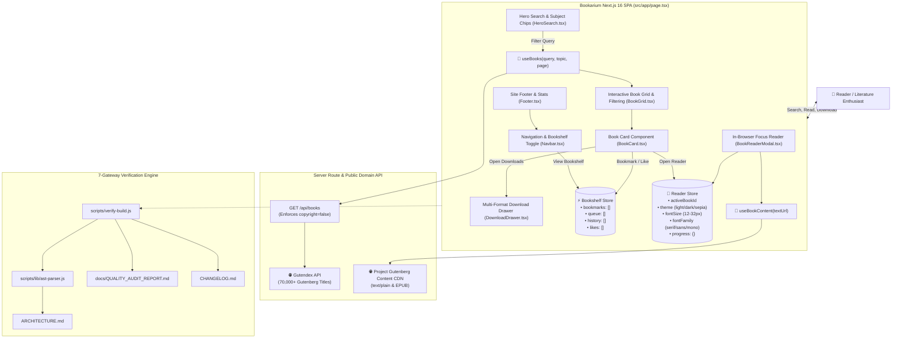
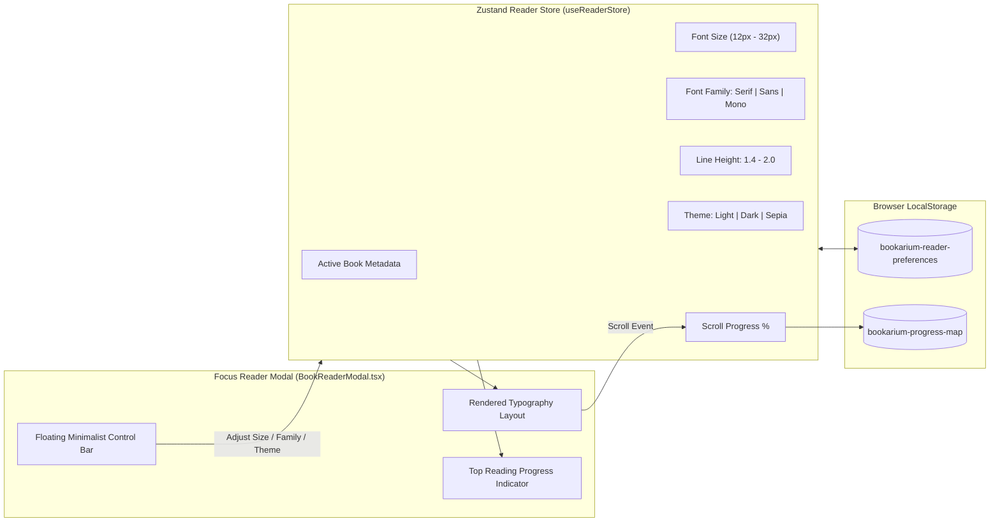
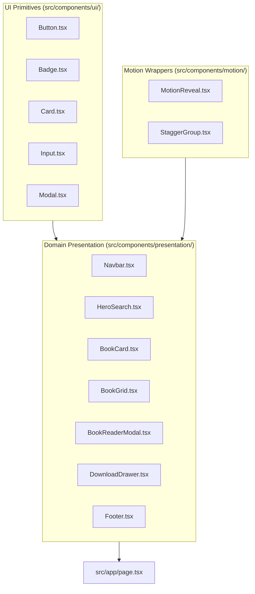

# Bookarium — 100% Legal Public Domain Library & Reader

> **Pure Literature. Zero Paywalls. Zero API Keys.**

[](https://nextjs.org/)
[](https://react.dev/)
[](https://www.typescriptlang.org/)
[](https://tailwindcss.com/)
[](https://vitest.dev/)
[](docs/QUALITY_AUDIT_REPORT.md)
[](LICENSE)

---

An ultra-refined, high-performance web application for discovering, reading, and downloading 100% legal, public domain books (Zero-Copyright / CC0 / Gutenberg Public Domain). Built with **Next.js 16 App Router**, **TanStack React Query**, **Zustand offline persistence**, **Framer Motion**, and verified by a deterministic **7-Gateway Quality Engine**.

---

## 🎯 Project Scope & Core Principles

Bookarium is engineered as a zero-friction, privacy-first gateway to the world's greatest public domain literature:
- **Zero API Key Requirement**: Works instantly out of the box with zero third-party developer keys, sign-ups, or credit card walls.
- **Strict Public Domain Integrity**: All queries programmatically enforce `copyright=false` through Gutendex and Project Gutenberg.
- **In-Browser Focus Reader**: Distraction-free reading environment featuring dynamic font scaling (12px–32px), Serif/Sans/Mono typography, Light/Dark/Sepia themes, and real-time reading progress persistence to `localStorage`.
- **Direct Download Hub**: Multi-format downloads including direct EPUB, clean plain text, mobile-friendly HTML, and Kindle formats.
- **Offline Personal Bookshelf**: Curated collections, reading queue, reading history, and liked titles stored locally via Zustand.

---

## 🏛️ System Architecture Diagrams

### 1. End-to-End System Context & Data Flow



---

### 2. Focus Reader State & Typography Engine



---

### 3. Atomic Component Hierarchy



---

## ⚡ Quick Start

### Prerequisites
- **Node.js**: `>= 20.0.0` (Node 22 LTS recommended)
- **npm**: `>= 10.0.0`

### Installation & Local Development

```bash
# 1. Clone the repository and install dependencies
npm install

# 2. Start local development server (automatically launches browser)
npm run dev:open

# 3. Or launch full development environment with background test watcher
npm run dev:all
```

The application will be accessible at [http://localhost:3000](http://localhost:3000).

---

## 🛠️ CLI Command Matrix

| Command | Action / Description |
|---|---|
| `npm run dev` | Starts Next.js development server at `http://localhost:3000` |
| `npm run dev:open` | Starts dev server and opens your default browser concurrently |
| `npm run dev:all` | Starts dev server, Vitest test watcher, and browser concurrently |
| `npm run verify` | **Runs the full 7-Gateway Quality Engine** before commits |
| `npm test` | Runs the full Vitest suite with V8 code coverage report |
| `npm run test:ui` | Launches Vitest interactive visual testing UI |
| `npm run test:watch` | Runs Vitest in reactive watch mode for TDD |
| `npm run typecheck` | Validates TypeScript types across all `.ts`/`.tsx` files |
| `npm run lint` | Runs ESLint 9 rules and Core Web Vitals checks |
| `npm run knip` | Audits repository for unused exports and dead dependencies |
| `npm run docs:sync` | Auto-generates `ARCHITECTURE.md` and `CHANGELOG.md` from AST |
| `npm run adr:new -- "Title"` | Creates a new Architecture Decision Record in `docs/DECISIONS.md` |
| `npm run build` | Compiles optimized Next.js 16 production bundle |

---

## 🛡️ The 7-Gateway Quality Engine

The repository enforces a closed-loop quality verification engine before any release or commit:

```
+-----------------------------------------------------------------------------+
|                     7-GATEWAY CLOSED-LOOP VERIFICATION                      |
+-----------------------------------------------------------------------------+
| Pass 0.5 | Secret Scanner       | Checks repository files for exposed keys  |
| Pass 1   | TypeScript Engine    | Strict typecheck with 0 compile errors    |
| Pass 2   | Vitest Server Mocks  | Validates MSW v2 handlers and query hooks |
| Pass 3   | Vitest Client UI     | Unit & integration tests (>= 80% coverage)|
| Pass 4   | Living Docs Sync     | Auto-updates ARCHITECTURE, AUDIT, & CHANGE|
| Pass 5   | ADR Validation       | Validates DECISIONS.md sequential schema  |
| Pass 6   | Quality & Dead Code  | ESLint check and Knip unused code audit   |
| Pass 7   | Production Build     | Compiles Next.js production bundle        |
+-----------------------------------------------------------------------------+
```

🔒 **Pre-Commit Enforcement**: Any failure in Passes 0.5 through 7 immediately halts execution, outputs exact error telemetry, and automatically blocks the commit from being created.

---

## 📚 Living Documentation Registry

- **Living System Architecture (C4 Level 1-3)**: [`ARCHITECTURE.md`](ARCHITECTURE.md)
- **Quality & Coverage Audit Report**: [`docs/QUALITY_AUDIT_REPORT.md`](docs/QUALITY_AUDIT_REPORT.md)
- **Machine-Readable Audit Telemetry**: [`docs/quality-audit-results.json`](docs/quality-audit-results.json)
- **Architecture Decision Records (ADRs)**: [`docs/DECISIONS.md`](docs/DECISIONS.md)
- **Master Governance Protocol**: [`.agents/AGENTS.md`](.agents/AGENTS.md)
- **CI/CD Pipeline Guide**: [`docs/PIPELINE_GUIDE.md`](docs/PIPELINE_GUIDE.md)
- **Developer Maintenance Hub**: [`DEVELOPMENT.md`](DEVELOPMENT.md)
- **Semantic Release Changelog**: [`CHANGELOG.md`](CHANGELOG.md)

---

## ⚖️ License

Licensed under the **MIT License**. All queried literature and books are in the **Public Domain** (Zero Copyright / CC0).
