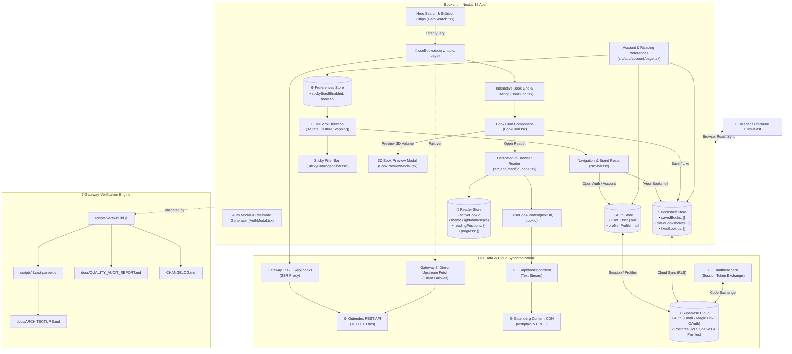
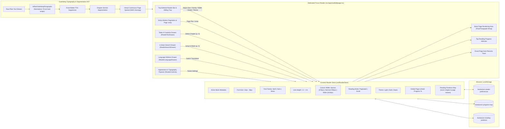

# Bookarium — 100% Legal Public Domain Library & Reader

> **Pure Literature. Zero Paywalls. Zero API Keys Required.**

[](https://antigravity.google)
[](https://nextjs.org/)
[](https://react.dev/)
[](https://www.typescriptlang.org/)
[](https://tailwindcss.com/)
[](https://supabase.com/)
[](https://vercel.com/)
[](docs/QUALITY_AUDIT_REPORT.md)
[](docs/QUALITY_AUDIT_REPORT.md)
[](docs/QUALITY_AUDIT_REPORT.md)
[](ROADMAP.md)
[](LICENSE)

---

An ultra-refined, high-performance web application for discovering, reading, and downloading 100% legal, public domain books (Zero-Copyright / CC0 / Gutenberg Public Domain). Built with **Next.js 16 App Router**, **Supabase Auth & Cloud Synchronization**, **TanStack React Query**, **Zustand offline-first persistence**, **Framer Motion**, developed with **[Google AI / Antigravity](https://antigravity.google)**, and verified by a deterministic **7-Gateway Quality Engine**.

---

## 🎨 Design Inspiration & Aesthetic Philosophy

Bookarium's visual identity and tactile layout are deeply inspired by classical editorial typography, archival letterpress printing, and modern Figma bookstore design systems:

* **Figma Editorial Concept**: Inspired by the minimalist elegance of curated bookstore layouts, specifically referencing the [Booksaw — Bookstore E-Commerce Website Design Template](https://www.figma.com/community/file/1521831984874247291/booksaw-bookstore-ecommerce-website-design-template) on the Figma Community.
* **Open-Book Skeuomorphic Details**: Custom open-book card spreads with subtle center spine creases (`.book-center-crease`), realistic paper texture shadows (`shadow-booksaw`), and page depth elevation.
* **Warm Editorial Palettes & 100% Solid Surfaces**:
  * **Day / Standard**: Crisp cream-paper tones (`#fcfbf9`, `#ffffff`) with rich obsidian ink typography and 100% solid, non-transparent surfaces.
  * **Sepia / Cozy Coffee (Warm Midtone)**: Warm roasted espresso and cafe mocha tones (`#251d18`, `#322720`) with steamed milk cream typography (`#f5ece1`) and warm caramel accents for eye comfort in ambient evening light.
  * **Dark Mode**: High-contrast slate obsidian canvas (`#0e1117`, `#161b26`) preserving focus in low-light settings.
* **Refined Typography**: Pairings of classic literary serifs, clean sans-serifs, and monospace archival metadata accents.

---

## 🛠️ Latest Improvements (v1.7.4)

- **Responsive Header Ergonomics & GitHub Repository Integration (`Navbar.tsx`, `Footer.tsx`)** – Direct repository links across header and footer, brand anti-truncation protection (`shrink-0`, `whitespace-nowrap`), space-aware responsive GitHub button disclosure (`min-[440px]:inline-flex`), synchronized tablet/desktop text expansion at `md:`, anti-jitter `border-b-2 border-transparent` tabs, and desktop hover tooltips.
- **SPDX Standard MIT License Provisioning (`LICENSE`, `package.json`)** – Installed official MIT License text with copyright attribution and package manifest metadata for automated GitHub `licensee` badge detection.
- **Dynamic On-Demand Translation & Dual-Tier Language Hub (`/api/translate`, `usePageTranslation.ts`, `ReaderLanguageDrawer.tsx`)** – Zero-key Google Neural Machine Translation proxy with offline page-level caching, 18 popular language quick-select chips, 40+ language catalog, Bilingual Parallel reading mode with original sentence subtitles, and dynamic native neural voice narration synchronization with Read-Aloud.
- **Email Verification & Resend Flow (`AccountIdentityCard.tsx`, `AuthModal.tsx`, `useAuthStore.ts`)** – Dynamic reader status inspecting `user.email_confirmed_at` to render `🛡️ Verified Reader` or `⚠️ Email Unverified` badges, an interactive resend banner on `/account` with 60-second cooldown timer, and post-signup/sign-in resend buttons in `AuthModal`.
- **Idempotent Supabase Database DDL (`supabase/schema.sql`)** – Added `DROP POLICY IF EXISTS` guards to all Row Level Security policies, allowing the SQL migration script to be safely re-run multiple times in the Supabase SQL editor without error or risk of data loss.
- **Native Web Speech Text-to-Speech Read-Aloud (`useReaderSpeech.ts`, `ReaderSpeechBar.tsx`)** – Offline-first, zero-cost audio narration engine using standard `window.speechSynthesis`. Features sentence-level segmentation (bypassing Chromium's 15-second speech freeze bug), natural neural voice prioritization, synchronized visual reading highlights on `ReaderSurface`, speed presets (0.85x–2.0x), and Media Session lock screen/Bluetooth headphone controls.
- **Canonical Domain Model Architecture (`src/types/book.types.ts`)** – Normalized single-source-of-truth domain models (`GutendexBook`, `Author`, `GutendexResponse`) across all presentation components, stores, and API handlers.
- **Reader Drawer Shell Compound Primitive (`ReaderDrawerShell.tsx`)** – Abstracted portaling, backdrop, scale/opacity transitions, header clearance, and Escape key handling across all 4 reader tool drawers (`ReaderTocDrawer`, `ReaderSearchDrawer`, `ReaderControls`, `ReaderLanguageDrawer`).
- **Headless Reader Gesture & State Isolation (`useReaderGestures.ts`, `useReaderDrawers.ts`)** – Extracted pinch-to-zoom font scaling, horizontal swipe navigation, and 4-way mutual drawer exclusivity into test-isolated headless hooks with 100% co-located coverage.
- **Gutenberg Parser Subsystem Modularization (`src/lib/gutenberg/`)** – Decomposed the monolithic 700-line parser into single-responsibility modules (`pagination`, `reflow`, `segmentation`, `metadata`, `passages`) backed by a 100% backward-compatible facade barrel.
- **Centralized Reader & Gesture Config (`reader-config.ts`, `reader-themes.ts`)** – Centralized font bounds (`12`–`36`), typography presets, gesture timing thresholds, and drawer title icon accent tokens.
- **Bookshelf & Favorites Theme Border Harmonization (`CollectionSearchBar.tsx`, `page.tsx`)** – Upgraded collection search box, count pill, and clear buttons to solid `border-border` (`#462e22` in Sepia / `#292524` in Dark), ensuring pristine consistency with the application design tokens.
- **Direct 1-Click / 1-Tap Account Navigation (`Navbar.tsx`)** – Replaced popover/hover dropdowns on the top navigation bar with a direct Next.js link to `/account`, delivering instant, zero-friction navigation to the reader dossier with active state indicators (`activeView="account"`).
- **Fluid Tactile Bookshelf Scrolling on Mobile (`BookshelfRack.tsx`)** – Removed restrictive `touch-pan-x` class from bookshelf item rows, enabling smooth and natural vertical thumb scrolling down the page on touchscreens while preserving horizontal book shelf panning.
- **Harmonized Canonical Border Theme Style (`border-border`)** – Standardized all cards, danger zones, delete buttons, lock badges, and user pills across `/account` to use `border-border` (`#292524` in dark / `#e7e5e4` in light), eliminating harsh colored borders for visual elegance.
- **Global Dark Mode Button Ring Offset & Themed Focus Styling (`Button.tsx`, `AccountPreferencesSection.tsx`, `AccountLibraryStats.tsx`)** – Replaced un-themed `#ffffff` white ring offset with `focus-visible:ring-offset-background` and `focus-visible:ring-primary`, eliminating bright white focus halos in dark mode and applying unified themed focus rings across theme buttons, sticky scroll options, and library metric cards.
- **Zero Cumulative Layout Shift (CLS) on Modals (`Modal.tsx`)** – Removed direct `document.body.style.overflow` manipulation on dialog open/close, anchoring the page scroll track seamlessly with `scrollbar-gutter: stable` for 0 layout shift when triggering modals.
- **Normalized Reader Sub-Header Metrics & Responsive Collapsing (`ReaderHeader.tsx`)** – Normalized the Gutenberg Archive Info icon to `w-3 h-3` (12px) to match BookOpen and Sparkles icons, preserving clean **Icon + Value** rendering on mobile (`[ ℹ️ #1342 ] • [ 📖 1/24 ] • [ ✨ 45% ]`) without vertical ribbon wrapping.
- **Continuous Scroll Auto-Hide Sweetspot Calibration (`useScrollDirection.ts`)** – Calibrated continuous swipe threshold (120px) allowing short swipes to dock the filter bar at `top-0` while continuous reading gestures smoothly auto-hide both header and toolbar for full-screen catalog reading.
- **Compact Responsive Sub-Header Ribbon & Locked 1-Line Height (`ReaderHeader.tsx`)** – Responsive text condensation on mobile viewports preventing vertical ribbon wrapping on narrow screens (< 640px).
- **Locked Slim Header Toolbar & Zero Layout Shifts (`ReaderHeader.tsx`)** – Fixed book title typography at `text-sm` (14px/20px) and locked toolbar (`min-h-[3.5rem] py-2.5`) + ribbon (`py-1.5 text-[10px]`) dimensions, permanently eliminating responsive thickness shifts and font-size jumps across all viewport widths.
- **Calibrated Flush Portaled Drawer Docking & Clearance** – Precision geometry (`top-[5.875rem]` and `max-h-[calc(100dvh-11.5rem)]`) across all 4 in-reader tool drawers (`ReaderTocDrawer`, `ReaderSearchDrawer`, `ReaderControls`, `ReaderLanguageDrawer`), providing a clean 3px hairline top separation beneath the header and ~20px bottom clearance above the sticky footer.
- **Subtle Tactile Header Drop Shadow (`reader-themes.ts`)** – Softened top bar elevation token to `shadow-sm` across Light, Sepia, and Dark reading themes.
- **Gutenberg Archive Modal Stacking Context Elevation** – Elevated `isInfoCardOpen` container to `z-[10001]`, ensuring pristine dialog and backdrop layering over the `z-[10000]` sticky reader header.
- **Unified Portaled Reader Drawer Architecture & 4-Way Mutual Exclusivity (ADR-012)** – Standardized all in-reader tool dialogs (`ReaderTocDrawer`, `ReaderSearchDrawer`, `ReaderControls`, `ReaderLanguageDrawer`) as portaled components (`createPortal(..., document.body)`). Centralized visibility at the parent reader page level with strict 4-way mutual exclusivity (opening one closes the others, while re-clicking toggles closed).
- **Elevated Reader Header Stacking & Non-Blocking Page Flips (`ReaderHeader.tsx`)** – Elevated header stacking context to `z-[10000]` above modal backdrops (`z-[9998]`), ensuring toolbar buttons remain fully clickable and active. Removed broad blocking overlays so page-turn zones and footer navigation remain completely interactive and responsive while tools are open.
- **Physical Sliding Reader Toolbar with Traveling Pull Handle (`ReaderHeader.tsx`)** – Pin-docked mobile reader drawer to the right margin with physical `translateX` glide animation. Closed state displays only the 44px arrow button `[‹]`; opened state smoothly glides the handle to the left of the 6 tools and rotates into `[›]`.
- **Complete Sepia, Light & Dark Theme Palette Harmonization** – Unified theme tokens (`${activeTheme.drawerBg}`, `${activeTheme.drawerActive}`, `${activeTheme.drawerHover}`, `${activeTheme.pill}`, `${activeTheme.border}`) across Table of Contents, Search match highlights (`<mark>`), Typography range sliders (`accent-amber-500 bg-[#462e22]`), Language Editions selector, and Gutenberg Archive Metadata Modal.
- **Enterprise Security Hardening & Zero-Dependency Rate Limiting (`rate-limiter.ts`, `next.config.ts`, `/api/books`)** – In-memory sliding window rate limiter protecting upstream Project Gutenberg APIs (60 req/min for search, 30 req/min for full text) with `X-RateLimit-*` and `Retry-After` headers, paired with strict HSTS, Clickjacking defense (`SAMEORIGIN`), MIME-sniffing protection (`nosniff`), Permissions-Policy, and SSRF domain whitelisting.
- **Open Redirect Sanitization & Secure Auth Callback (`/auth/callback`)** – Strict relative path validation (`sanitizeRedirectPath`) preventing open redirect vulnerabilities in OAuth and magic-link authentication flows.
- **ReDoS Elimination & Pagination Cache (`gutenberg-parser.ts`)** – Non-backtracking regular expressions (`[^\n]{0,80}`) and bounded passage analysis window (capped at 120,000 chars) eliminating main-thread event loop blocking on multi-megabyte classic epics, accompanied by a 500-entry LRU pagination cache for instant virtual page turns.
- **Datacenter Proximity Pinned & Payload Compression (`vercel.json`)** – Configured Vercel deployment pinning serverless functions to `iad1` (Washington D.C. / North Virginia) in the same geographic corridor as Gutendex, paired with `Accept-Encoding: gzip, deflate, br`, HTTP Keep-Alive, and long-lived Edge caching (`s-maxage=3600`).
- **Unconstrained Viewport Cursor Tooltips & Contextual Action Feedback (`BookCard.tsx`)** – Direct DOM body portaling (`createPortal`) of cursor-following tooltips tracking mouse coordinates at `+12px, +14px` across card edges without boundary clipping, dynamically swapping between `"Click to preview quotes"`, `"Add to Favorites"` / `"Remove from Favorites"`, and `"Add to Bookshelf"` / `"Remove from Bookshelf"`.
- **Dynamic 3D Preview Modal Fluid Typography & Intelligent Space-Filling (`BookPreviewModal.tsx`)** – Adaptive title scaling preventing line overflows on long classic titles without truncation, combined with content-aware proportional quote space-filling and clean presentation spreads.
- **Single-Source Route Registry & Configuration Singletons (`src/config/routes.ts`, `src/config/site-config.ts`)** – Type-safe centralized registries consolidating all internal route paths, view queries, canonical project URLs, and persistent storage keys with 100% co-located unit tests.
- **Modular Component Decomposition** – Decomposed monolithic components into single-responsibility sub-components in `src/components/presentation/bookshelf/` (`BookshelfSpine`, `BookshelfMobileModal`, `BookshelfManageModals`) and `src/components/account/` (`AccountIdentityCard`, `AccountLibraryStats`, `AccountSecuritySection`, `AccountPreferencesSection`, `AccountDeleteModal`), reducing `BookshelfRack.tsx` by -55% and `AccountPage` by -58%.
- **Account Route Migration (`/account`) & User Menu Ergonomics** – Migrated user settings from `/profile` to `/account`, updated top bar button to fixed-width `"Account"`, and styled internal menu link as `"Settings"`.
- **Order-Independent Dynamic Smart Search (`/lib/smart-search.ts`, `CollectionSearchBar.tsx`)** – Real-time, zero-network-latency client search engine for Bookshelf and Favorites supporting order-independent multi-token matching (`"austen pride"` = `"pride austen"`), diacritic/accent insensitivity, instant clear button, keyboard shortcuts (`Esc`), and live match counter badges.
- **Dynamic Active Icon Fills & Zero-Shift Header Hydration** – Clean dynamic SVG fills for Bookshelf (`fill-primary`) and Favorites (`fill-destructive`) when containing saved items, eliminating all text clutter and delivering 100% stable layouts (CLS = 0).
- **Top 1px Dividing Border & Stacking Elevation** – Added `border-y border-border` to `StickyCatalogToolbar` ensuring crisp 1px separation between header and filter bar when docked, while eliminating shadow collision.
- **Comprehensive Account Lifecycle & Security Management (`/account`, `AuthModal`, `/auth/confirm-deletion`)**:
  - **Forgot Password Flow** – Direct password reset email request interface within the authentication modal, delivering secure one-time password reset links.
  - **In-App Password Generator & Live Strength Meter** – Cryptographic high-entropy 16-character password generator button with instant clipboard copy feedback, dual auto-fill, and a real-time color-coded complexity meter (Weak / Moderate / Strong) available across both the Sign Up modal and the Account dashboard.
  - **Dual-Password Confirmation & Mismatch Guard** – Dedicated *Confirm Password* fields across both Sign Up registration and Account password changes, eliminating typos and accidental lockout.
  - **Industry-Standard Email-Verified Account Deletion** – Two-step deletion verification protocol informing the user upfront, dispatching a secure one-time verification link to their email, and requiring final authorization at the dedicated `/auth/confirm-deletion` portal before permanently purging cloud bookshelves and terminating the session.
  - **Accidental Clear Protection Modals** – Tactile modal confirmation dialogs preventing accidental clearing of personal bookshelves or liked favorites.
  - **Literary Tagline Refresh** – Updated footer attribution to *"Crafted with care for book lovers everywhere"*.
- **Universal Multi-Language Translations & Reader Switcher (`/read/[id]`)** – Interactive `<Globe />` language dropdown in the Reader navigation header powered by `useBookTranslations` and TanStack React Query caching. Discovers and groups all available international translations (Spanish, French, German, Italian, Dutch, Greek, etc.) and bilingual editions across the 70,000+ public domain volume archive with 1-click seamless handoff.
- **Tactile Book Page-Turn Transitions for View Switching** – Integrated the reader's tactile `animate-page-turn` transition (`180ms cubic-bezier(0.16, 1, 0.3, 1)`) into the main application view container, delivering the physical sensation of turning a book page whenever switching between **Catalog**, **Bookshelf**, and **Favorites**.
- **Arrival Docking & Pure Physical Slide-Hide Transitions** – Enhanced `useScrollDirection` with an arrival dock guard so the top header remains visible when the catalog filter bar first docks on initial scroll down. Upgraded `StickyCatalogToolbar` to use synchronized transform translations (`transition-transform duration-300 ease-in-out` with `-translate-y-16` / `-translate-y-[calc(100%+4rem)]`), completely eliminating top-margin layout gaps and replacing opacity fades with solid physical slide transitions.
- **User-Configurable Sticky Scroll Preferences (`/account`)** – Added user preference setting in the Account dashboard allowing readers to choose between **Smart Auto-Hide** (directional auto-hide to maximize reading space) and **Always Fixed** (stationary header and toolbar pinned at top). Persisted across browser sessions with `usePreferencesStore`.
- **Exact Custom Shelves Account Analytics** – Verified account stats card (`/account`) displaying an accurate count of user-created custom bookshelves separate from the master general library.
- **Dynamic Responsive Bookshelf Capacity Engine** – `ResizeObserver`-driven physical book packing automatically scaling from 6-8 books on mobile up to 18-24 books on wide displays, eliminating empty side gaps with balanced horizontal center alignment.
- **Mobile Tap-to-Activate In-Shelf Quick-Action Modal** – Smooth interactive floating modal rendered directly within the active shelf niche on mobile devices, preventing accidental navigation and displaying full natural author formatting (`formatAuthorNames`).
- **Reader Direct Link Sharing & Dynamic Viewport Ergonomics** – Integrated header Share button copying canonical book URLs to clipboard with tactile 2-second visual feedback, paired with CSS Dynamic Viewport units (`h-[100dvh]`, `pb-[env(safe-area-inset-bottom)]`) to prevent footer cutoff on collapsing mobile address bars.
- **Exact-Page Bookmarking & Auto-Resume Engine** – Automatic persistence of exact chapter and page positions (`readingPositions`) in `useReaderStore`. Opening any book instantly restores the reader to the exact paragraph and page left off, accompanied by a non-intrusive "Resumed at Chapter X, Page Y" toast with 1-click Restart.
- **Tactile Hardwood Bookshelves & Library Aesthetics (ADR-006)** – Unified bookcase architecture with rich multi-stop walnut wood rails, top specular bevel lines, ambient alcove spotlighting (`.shelf-ambient-niche`), and dedicated Dark/Sepia wood gradients. Guarantees 100% flush base contact across mobile touch-scroll and desktop viewports.
- **3D Convex Book Spine Physics & Hot-Foil Typography** – Cylindrical 3D specular lighting overlay (`.book-spine-convex`) simulating authentic curved hardcover bindings and hinge creases, complemented by `.spine-emboss-gold` and `.spine-emboss-silver` hot-foil gilded serif typography and volume seals.
- **Multi-Category Cloud Bookshelf Synchronization (ADR-005)** – Supabase PostgreSQL cloud sync with Row Level Security (RLS). Features a master "General" bookshelf aggregating all user books, floating "Move to Shelf" selector dropdowns on book spines, and safe shelf deletion auto-reassigning orphaned volumes to General.
- **Multi-Volume Segmentation Engine & Volume Drawer** – Comprehensive multi-part and multi-volume detection for Project Gutenberg works (Volumes I-III, Books 1-12, Cantos, Acts, Tomes) with an interactive Volume Selector Drawer.
- **Smart Chapter Heading Detector & Table of Contents (`ReaderTocDrawer`)** – Automatic hierarchy detection for Roman numeral and titled chapters with direct slide-out navigation.
- **Strict 0% Page 1 Reading Progress & Verified Accounts** – Recalibrated progress percentage engine ensuring exact 0% on page 1, paired with standalone user accounts (`/account`) for managing reading statistics and atmosphere settings.
- **Verified by the 7-Gateway Quality Engine** – 69/69 test files passed, 476/476 tests passed with **92.26% line coverage** and **80.40% branch coverage** (`npm run verify`).

---

## 🌐 Data Sources & Infrastructure

Bookarium runs on an open, decentralized architecture requiring **Zero Paid Developer Keys**:

| Service / Source | Endpoint / Provider | Description & Usage |
|---|---|---|
| **Gutendex REST API** | [`gutendex.com`](https://gutendex.com/) • [`GitHub`](https://github.com/garethbjohnson/gutendex) | Open-source JSON Web API created by [Gareth B. Johnson](https://github.com/garethbjohnson/gutendex) indexing over 70,000+ Project Gutenberg public domain titles. Provides search, topic filters, author timelines, download metrics, and metadata with strict `copyright=false` filtering. |
| **Project Gutenberg CDN** | [`gutenberg.org`](https://www.gutenberg.org/) | Direct content delivery network providing unabridged plain text (`.txt`), official EPUB packages (`.epub.images`, `.epub.noimages`), Kindle/MOBI formats, and web-ready HTML. |
| **Supabase (Auth & Postgres)** | [`supabase.com`](https://supabase.com/) | Optional cloud authentication and PostgreSQL synchronization for custom bookshelves and reading progress using Row Level Security (RLS). |
| **Vercel Edge Platform** | [`vercel.com`](https://vercel.com/) | High-performance edge deployment, dynamic SSR route handlers, zero-config production caching, and global CDN delivery. |
| **Public Domain Archive Proxy** | `/api/books` & `/api/books/content` | Next.js server-side route proxies providing caching, CORS handling, and guaranteed public domain integrity before client delivery. |

---

## 🎯 Key Features & Capabilities

* **Zero API Key Requirement**: Works instantly out of the box with zero third-party developer keys, sign-ups, or credit card walls.
* **Strict Public Domain Integrity**: All queries programmatically enforce `copyright=false` through Gutendex and Project Gutenberg.
* **Deep Linking & Bidirectional URL State Synchronization**:
  * All catalog filters (`search`, `topic`, `language`, `era`, `sort`, `format`, `page`, `view`) automatically synchronize bidirectionally with URL search parameters via shallow `history.replaceState`.
  * Fully supports direct bookmarking, shareable search URLs, and native browser Back / Forward (`popstate`) navigation with zero page reloads and 0 CLS.
* **Network Debouncing & Resilient Upstream Querying**:
  * 300ms keystroke debouncing prevents API spamming while typing, with 0ms instant flush on `Enter` / form submission.
  * Robust JSON response parsing with graceful 502/504 failover handling for Gutenberg upstream timeouts.
* **Procedural Cover Art Fallback**:
  * Automatic `onError` detection replaces missing or dead remote cover images with elegant, dark-academia typographic cover art in pure CSS with zero layout shifts.
* **SSR Hydration Guarding Protocol**:
  * Store reads for liked and saved book collections are guarded with `useHasMounted()` to guarantee zero React hydration mismatches on initial server render.
* **100% Live Dual-Gateway Data Pipeline**: Next.js Server Route Proxy paired with direct client upstream failover to `https://gutendex.com/` guaranteeing 100% uptime on serverless platforms without reliance on local mock fallbacks.
* **Dynamic Hourly Rotating 3D Featured Book & Interactive 3D Open-Book Physics**:
  * Curated pool of iconic public domain classics dynamically rotated every UTC hour with zero-cron client/server deterministic synchronization.
  * **Realistic 3D Open-Book Hover & Click-to-Pin State Machine**: On desktop hover, the hardbound volume smoothly elevates and takes a gentle isometric tabletop inclination while the front cover swings open 180° on its left spine hinge—revealing facing **Left Page** (title, author, comprehensive opening chapter reflection) and **Right Page** (notable passage, public domain stamp, and direct read action). Clicking pins the volume open or closed with automatic hover re-engagement.
  * **Physical 60–120 FPS Right-to-Left 3D Page Turn**: Shuffling passages flips a physical 3D leaf ($0^\circ \to -180^\circ$) across the spine with physically synchronized ink reveals, preserving the underlying left page until the leaf physically lands.
  * **Comprehensive Literary Typography**: Full-bodied literary excerpts and opening reflections typeset with balanced line-clamping (`line-clamp-8`) to naturally fill the 2-page spreads without UI overlap.
  * In-book passage shuffle button to cycle through narrative acts and chapters of the open volume without page reloads.
  * 1-Click instant reader handoff with 0ms metadata population.
* **Interactive 3D Book Preview Modal & FLIP Physical Landing**:
  * Clicking "Preview Volume" on any catalog book card triggers a seamless 3D hardcover modal with fluid FLIP geometry transitions.
  * Measures precise viewport-safe bounds (`document.documentElement.clientWidth`) and preserves exact $1.000\times$ typography scales, delivering zero font distortion and seamless subpixel return landing without jumps or pops.
  * Features live in-modal chapter shuffling, opening act excerpts, and instant reader handoff.
* **Directional Stepped Scroll Navigation & User Profile Preferences**:
  * Dynamic scroll detection (`useScrollDirection`) with session-isolated continuous gesture locking (180ms debounce).
  * Smoothly hides top header on first scroll down, docks filter bar to `top-0`, and hides the filter bar on second scroll for 100% immersive book viewing.
  * 1-gesture up-scroll immediately reveals the filter bar at `top-0` for instant page jumping and filter tweaking.
  * User-configurable in User Account Settings (`/account`) between **Smart Auto-Hide** and **Always Fixed**.
* **Collapsible Left-Side Catalog Filter Sidebar & Push-Content Desktop Layout**:
  * Slide-out left-docked filter drawer (`slide-in-from-left duration-300`) with zero dark background dimming.
  * On desktop, opening filters smoothly pushes the entire webpage content (`<main>`) to the right (`lg:pl-96 duration-300`), allowing non-blocking side-by-side catalog browsing and live filter tweaking.
  * The **Filters** button functions as an interactive toggle (`Open / Close`) with active state highlights.
* **Flush 0px Sticky Header & Floating Shadow Elevation**:
  * Seamless 0px flush alignment between the top navbar and sticky toolbar with a floating `shadow-md` elevation over scrolling book cards.
  * Horizontally scrollable active filter chips strip (`overflow-x-auto scrollbar-none`) preventing vertical height shifts (0 CLS).
* **Deep Archive Query UX & Live Telemetry**: Sticky catalog toolbar equipped with real-time roundtrip latency telemetry, direct page jumping, animated `Info` indicators, responsive mobile two-tier wrapping, and informative tooltips explaining relational SQL offsets across 70,000+ public domain volumes.
* **Header Navigation & Brand Reset**: Clean top bar with unified iconography (**Catalog** `<BookOpen>`, **Bookshelf** `<Bookmark>`, **Favorites** `<Heart>`), live badge counters, single-click brand catalog reset/refresh, and automatic mobile icon collapsing for zero horizontal overflow.
* **Floating Back to Top & Quick Navigation**: Motion-animated scroll-to-top button with viewport threshold detection.
* **Interactive Studio Bookshelf Mode**:
  * **Unified Hardwood Bookcase**: Integrated shelf niche alcove and solid timber rail with bevel highlights and ambient spotlight vignettes (`.shelf-ambient-niche`), ensuring books sit directly flush on the wood ledge.
  * **3D Convex Spines & Gilded Lettering**: Convex specular spine curvature (`.book-spine-convex`) with 8 authentic binding colorways (Oxblood, Navy, Emerald, Saddle, Plum, Charcoal, Teal, Espresso), hot-foil gold/silver typography, and bookmark ribbons.
  * **Multi-Shelf Categories & General View**: Master "General" view displaying all library volumes alongside custom collections, with a floating "Move to Shelf" selector on spine hover cards.
  * **Grounded Pull-Forward Hover**: Physical scaling (`scale-105 origin-bottom`) pulling the volume forward toward the reader with instant `Read`, `Download`, and `Bookmark` actions.
* **Dedicated In-Browser Focus Reader (`/read/[id]`)**:
  * **Exact-Page Bookmarking & Auto-Resume**: Automatic persistence of exact chapter and page coordinates (`readingPositions`) in `useReaderStore`. Opening any volume displays a non-intrusive "Resumed at Chapter X, Page Y" toast with a 1-click Restart option.
  * **Triple-Tier Metadata Resolution & Gutenberg Archive Modal**: Instant reader metadata resolution (Store $\to$ Plain-Text Header Parsing $\to$ API) with an interactive `[ ℹ️ #VolumeID ]` badge that opens a detailed Gutenberg Public Domain Archive modal without causing any header layout shifts.
  * **Edge-to-Edge Symmetrical Reader Toolbars**: Full-width top navigation header and bottom footer with mathematically locked center progress badges and page jumpers, eliminating layout drift across varying book and chapter title lengths.
  * **Tactile Hardware-Accelerated Page-Turn Opacity Transitions**: Smooth 180ms ease-out opacity micro-transitions (`animate-page-turn`) paired with motion-safe scroll-to-top on page flips, Next/Prev actions, and catalog grid browsing with automatic `prefers-reduced-motion` compliance.
  * **Dual-Strategy Chapter & Anthology TOC Engine**: Automatically segments both standard numbered chapters (`CHAPTER 1`, `BOOK I`) and short story/tale anthologies (e.g. *"Twenty-Five Ghost Stories"* `read/53419`) via front-matter `CONTENTS` index scanning, listing all individual stories as discrete, jumpable sections in the Table of Contents drawer.
  * **Gutenberg Paragraph Reflow Engine**: Normalizes legacy 70-character hard linebreaks into fluid prose across Narrow (`576px`), Normal (`768px`), and Wide (`1024px`) reading layouts while preserving double-spaced paragraphs, dialogue, and indented poetry/verse.
  * **True Book-Wide Global Pagination**: Calculates virtual pages across the entire volume with keyboard (`←`/`→`) and input page jumping.
  * **Table of Contents Drawer (`ReaderTocDrawer`)**: Instant chapter navigation with live starting page number badges (`p. 18`, `p. 28`, `p. 34`), read-time estimates, and solid opaque surfaces with transparent backdrops.
  * **In-Book Full-Text Search Drawer (`ReaderSearchDrawer`)**: Real-time client regex search engine scanning the entire volume with highlighted snippet matches (`<mark>`), chapter grouping, live match count badges, 1-click chapter jumps, and keyboard shortcut invocation (`Ctrl+F` / `Cmd+F` / `/`).
  * **Language Editions & Translations Drawer (`ReaderLanguageDrawer`)**: Portaled modal discovering all international editions (Spanish, French, German, Italian, etc.) and bilingual translations with 1-click reading handoff.
  * **Physical Sliding Mobile Toolbar Drawer (`ReaderHeader`)**: Pin-docked mobile control drawer with an integrated traveling pull handle (`[‹] / [›]`), keeping the reading canvas and page-turn tap zones 100% unblocked.
  * **Font Scaler & Dynamic Line Spacing Sliders**: Real-time font sizing (12px–36px) and dynamic line height (1.2–2.6) with 1-click presets (`14px / 18px / 24px` and `1.4 Compact / 1.8 Standard / 2.2 Spacious`) and top bar quick spacing cycler (`↕`).
  * **Pinch‑to‑Zoom Font Scaling (Mobile)**: Two‑finger pinch gestures adjust the font size between 12 px – 36 px, displaying a transient HUD pill with the current size.
  * **Typography & Reading Modes**: 1-click column width presets (**Narrow** / **Normal** / **Wide** — defaulting to **Wide** `1024px`) and reading mode switching (**Page** / **Scroll**).
* **Dynamic Literary Passages & Quotes ("Words That Shaped Humanity")**: Rotating showcase of iconic classic quotes with classical first-line editorial indentation, interactive shuffle discovery, and bottom-aligned author citations and read prompts across all cards.
* **Direct Download Hub**: Multi-format downloads including direct EPUB, clean plain text, mobile-friendly HTML, and Kindle formats.
* **Auto-Healing Personal Bookshelf & Favorites**: Curated collections, reading queue, reading history, and favorited titles with background metadata auto-recovery and 1-click reset actions.
### 🌐 Supported Languages, On-Demand AI Translation & Neural Read-Aloud

Bookarium provides a comprehensive, multi-tiered language ecosystem designed for both authentic public domain archive discovery and universal accessibility:

#### 1. Catalog & Archive Filtering (12 Primary Languages)
The catalog can be filtered by the following primary language options (ISO‑639‑1 codes used by the API):
- `en` – English
- `fr` – French (Français)
- `de` – German (Deutsch)
- `es` – Spanish (Español)
- `it` – Italian (Italiano)
- `la` – Latin (Lingua Latina)
- `el` – Greek (Ancient & Modern)
- `pt` – Portuguese (Português)
- `nl` – Dutch (Nederlands)
- `ru` – Russian (Русский)
- `zh` – Chinese (中文)
- `ro` – Romanian (Română)

> **How it works** – Selecting a language via the unified `<LanguageSelector />` component (available on both the main Hero search bar and the sidebar filter drawer) adds a `languages=<code>` query parameter that flows through `useBooks` → `/api/books` → Gutendex API, returning only public domain books in the chosen language. Inside the reader, the **Language Drawer** also discovers all authentic Project Gutenberg foreign editions and translations for the current title.

#### 2. On-Demand Dynamic AI Translation (40+ Languages)
Inside any public domain volume, readers can translate pages on-the-fly into **40+ world languages** (featuring 18 popular language quick-chips including Spanish, French, German, Italian, Portuguese, Romanian, Dutch, Russian, Japanese, Chinese, Polish, Swedish, and more):
- **Zero-Key Serverless Architecture**: Powered by a rate-limited Google Neural Machine Translation proxy (`/api/translate`) requiring zero third-party paid API keys or account sign-in.
- **Offline Page-Level Caching**: Every translated page is automatically cached in `localStorage` per book and page, enabling instant, zero-latency transitions on re-read.
- **Bilingual Parallel Reading Mode**: Seamlessly toggle between full translation and bilingual parallel view, displaying translated paragraphs alongside authentic original sentence subtitles for comparative study and language learning.

#### 3. Synchronized Neural Voice Read-Aloud (Text-to-Speech)
- **Automatic Language-Aware Voice Pairing**: The offline-first Web Speech narration engine (`window.speechSynthesis`) automatically detects whether the reader is viewing original text or a translated page, instantly pairing narration with high-definition neural voices native to that language.
- **Real-Time Visual Sentence Highlighting**: As narration plays, each active sentence is highlighted with an amber glow on `ReaderSurface`, synchronizing visual reading and audio narration.
- **Full Media Session & Audio Controls**: Offers speed presets (0.85x–2.0x), sentence navigation (Skip Prev / Next), and OS-level MediaSession integration for lock screen and Bluetooth headphone controls.

---

## 🏛️ System Architecture Diagrams

### 1. End-to-End System Context & Data Flow



---

### 2. Focus Reader State & Typography Engine



---

## ⚡ Quick Start

### Prerequisites
- **Node.js**: `>= 20.0.0` (Node 22 LTS recommended)
- **npm**: `>= 10.0.0`

### Environment Configuration (Optional - for Cloud Bookshelf Sync)
Create a `.env.local` file in the project root with your public Supabase project credentials:

```env
NEXT_PUBLIC_SUPABASE_URL=https://your-project-id.supabase.co
NEXT_PUBLIC_SUPABASE_ANON_KEY=your-supabase-anon-key
```

*(If no Supabase credentials are provided, Bookarium operates seamlessly in 100% offline-first mode using browser storage).*

---

## 🗄️ Supabase Cloud Database & Authentication Setup

Bookarium uses Supabase PostgreSQL for optional cloud authentication, cross-device bookshelf synchronization, and reading progress tracking. Follow these steps to provision your database in under 2 minutes:

### Step 1: Create a Free Supabase Project
1. Go to [supabase.com](https://supabase.com/) and create a new project.
2. Note your **Project URL** and **anon public API Key** from **Project Settings $\to$ API**.

### Step 2: Run Database Schema Script
1. In your Supabase Dashboard, open the **SQL Editor** from the left sidebar.
2. Click **New Query** and copy the contents of [`supabase/schema.sql`](supabase/schema.sql):

```sql
-- 1. Profiles Table
CREATE TABLE IF NOT EXISTS public.profiles (
  id UUID PRIMARY KEY REFERENCES auth.users(id) ON DELETE CASCADE,
  display_name TEXT,
  preferred_theme TEXT DEFAULT 'light',
  font_size INTEGER DEFAULT 18,
  created_at TIMESTAMPTZ NOT NULL DEFAULT NOW(),
  updated_at TIMESTAMPTZ NOT NULL DEFAULT NOW()
);
ALTER TABLE public.profiles ENABLE ROW LEVEL SECURITY;
DROP POLICY IF EXISTS "Users can view their own profile" ON public.profiles;
CREATE POLICY "Users can view their own profile" ON public.profiles FOR SELECT USING (auth.uid() = id);
DROP POLICY IF EXISTS "Users can insert their own profile" ON public.profiles;
CREATE POLICY "Users can insert their own profile" ON public.profiles FOR INSERT WITH CHECK (auth.uid() = id);
DROP POLICY IF EXISTS "Users can update their own profile" ON public.profiles;
CREATE POLICY "Users can update their own profile" ON public.profiles FOR UPDATE USING (auth.uid() = id);
DROP POLICY IF EXISTS "Users can delete their own profile" ON public.profiles;
CREATE POLICY "Users can delete their own profile" ON public.profiles FOR DELETE USING (auth.uid() = id);

-- 2. Bookshelves Table (Master 'General' + Custom Shelves)
CREATE TABLE IF NOT EXISTS public.bookshelves (
  id UUID PRIMARY KEY DEFAULT gen_random_uuid(),
  user_id UUID NOT NULL REFERENCES auth.users(id) ON DELETE CASCADE,
  name TEXT NOT NULL,
  is_default BOOLEAN NOT NULL DEFAULT false,
  created_at TIMESTAMPTZ NOT NULL DEFAULT NOW(),
  updated_at TIMESTAMPTZ NOT NULL DEFAULT NOW()
);
ALTER TABLE public.bookshelves ENABLE ROW LEVEL SECURITY;
DROP POLICY IF EXISTS "Users can view their own bookshelves" ON public.bookshelves;
CREATE POLICY "Users can view their own bookshelves" ON public.bookshelves FOR SELECT USING (auth.uid() = user_id);
DROP POLICY IF EXISTS "Users can insert their own bookshelves" ON public.bookshelves;
CREATE POLICY "Users can insert their own bookshelves" ON public.bookshelves FOR INSERT WITH CHECK (auth.uid() = user_id);
DROP POLICY IF EXISTS "Users can update their own bookshelves" ON public.bookshelves;
CREATE POLICY "Users can update their own bookshelves" ON public.bookshelves FOR UPDATE USING (auth.uid() = user_id);
DROP POLICY IF EXISTS "Users can delete their own bookshelves" ON public.bookshelves;
CREATE POLICY "Users can delete their own bookshelves" ON public.bookshelves FOR DELETE USING (auth.uid() = user_id);

-- 3. Bookshelf Items Table
CREATE TABLE IF NOT EXISTS public.bookshelf_items (
  id UUID PRIMARY KEY DEFAULT gen_random_uuid(),
  bookshelf_id UUID NOT NULL REFERENCES public.bookshelves(id) ON DELETE CASCADE,
  user_id UUID NOT NULL REFERENCES auth.users(id) ON DELETE CASCADE,
  book_id INTEGER NOT NULL,
  book_title TEXT NOT NULL,
  book_authors TEXT[] NOT NULL DEFAULT '{}',
  cover_url TEXT,
  added_at TIMESTAMPTZ NOT NULL DEFAULT NOW(),
  UNIQUE(bookshelf_id, book_id)
);
ALTER TABLE public.bookshelf_items ENABLE ROW LEVEL SECURITY;
DROP POLICY IF EXISTS "Users can view their own bookshelf items" ON public.bookshelf_items;
CREATE POLICY "Users can view their own bookshelf items" ON public.bookshelf_items FOR SELECT USING (auth.uid() = user_id);
DROP POLICY IF EXISTS "Users can insert their own bookshelf items" ON public.bookshelf_items;
CREATE POLICY "Users can insert their own bookshelf items" ON public.bookshelf_items FOR INSERT WITH CHECK (auth.uid() = user_id);
DROP POLICY IF EXISTS "Users can update their own bookshelf items" ON public.bookshelf_items;
CREATE POLICY "Users can update their own bookshelf items" ON public.bookshelf_items FOR UPDATE USING (auth.uid() = user_id);
DROP POLICY IF EXISTS "Users can delete their own bookshelf items" ON public.bookshelf_items;
CREATE POLICY "Users can delete their own bookshelf items" ON public.bookshelf_items FOR DELETE USING (auth.uid() = user_id);

-- 4. Reading Progress Table
CREATE TABLE IF NOT EXISTS public.reading_progress (
  id UUID PRIMARY KEY DEFAULT gen_random_uuid(),
  user_id UUID NOT NULL REFERENCES auth.users(id) ON DELETE CASCADE,
  book_id INTEGER NOT NULL,
  current_chapter_index INTEGER NOT NULL DEFAULT 0,
  progress_percent NUMERIC NOT NULL DEFAULT 0,
  scroll_offset NUMERIC NOT NULL DEFAULT 0,
  last_read_at TIMESTAMPTZ NOT NULL DEFAULT NOW(),
  UNIQUE(user_id, book_id)
);
ALTER TABLE public.reading_progress ENABLE ROW LEVEL SECURITY;
DROP POLICY IF EXISTS "Users can view their own reading progress" ON public.reading_progress;
CREATE POLICY "Users can view their own reading progress" ON public.reading_progress FOR SELECT USING (auth.uid() = user_id);
DROP POLICY IF EXISTS "Users can insert their own reading progress" ON public.reading_progress;
CREATE POLICY "Users can insert their own reading progress" ON public.reading_progress FOR INSERT WITH CHECK (auth.uid() = user_id);
DROP POLICY IF EXISTS "Users can update their own reading progress" ON public.reading_progress;
CREATE POLICY "Users can update their own reading progress" ON public.reading_progress FOR UPDATE USING (auth.uid() = user_id);
DROP POLICY IF EXISTS "Users can delete their own reading progress" ON public.reading_progress;
CREATE POLICY "Users can delete their own reading progress" ON public.reading_progress FOR DELETE USING (auth.uid() = user_id);

-- 5. Auto-Provisioning User Trigger (Profile + Default General Shelf)
CREATE OR REPLACE FUNCTION public.handle_new_user()
RETURNS TRIGGER AS $$
BEGIN
  INSERT INTO public.profiles (id, display_name, preferred_theme)
  VALUES (NEW.id, COALESCE(NEW.raw_user_meta_data->>'display_name', 'Reader'), 'light')
  ON CONFLICT (id) DO NOTHING;

  INSERT INTO public.bookshelves (user_id, name, is_default)
  VALUES (NEW.id, 'General', true);

  RETURN NEW;
END;
$$ LANGUAGE plpgsql SECURITY DEFINER;

DROP TRIGGER IF EXISTS on_auth_user_created ON auth.users;
CREATE TRIGGER on_auth_user_created
  AFTER INSERT ON auth.users
  FOR EACH ROW EXECUTE FUNCTION public.handle_new_user();

-- 6. RPC Function: Delete Current User Account
CREATE OR REPLACE FUNCTION public.delete_current_user()
RETURNS VOID AS $$
BEGIN
  DELETE FROM auth.users WHERE id = auth.uid();
END;
$$ LANGUAGE plpgsql SECURITY DEFINER;
```

3. Click **Run** to execute the script. This provisions all tables, enables strict Row Level Security (RLS), registers automatic profile creation triggers, and installs the self-account deletion RPC.

### Step 3: Configure Authentication Redirect URLs
1. In your Supabase Dashboard, navigate to **Authentication $\to$ URL Configuration**.
2. Set **Site URL** to:
   - `http://localhost:3000` (for local development) or `https://your-app.vercel.app` (for production)
3. Under **Redirect URLs**, add the following allowed callback endpoints:
   - `http://localhost:3000/auth/callback`
   - `http://localhost:3000/auth/confirm-deletion`
   - `http://localhost:3000/account`
   - `https://your-app.vercel.app/auth/callback`
   - `https://your-app.vercel.app/auth/confirm-deletion`
   - `https://your-app.vercel.app/account`

---

### Installation & Local Development

```bash
# 1. Clone the repository and install dependencies
npm install

# 2. Start local development server (automatically launches browser)
npm run dev:open

# 3. Or launch full development environment with background test watcher
npm run dev:all
```

The application will be accessible at [http://localhost:3000](http://localhost:3000).

### 🚀 Production Deployment on Vercel

Bookarium is architected for zero-config deployment on **[Vercel](https://vercel.com/)**:

1. Push your repository branch to GitHub.
2. Import the project into the [Vercel Dashboard](https://vercel.com/new).
3. Under **Environment Variables**, optionally set:
   * `NEXT_PUBLIC_SUPABASE_URL` = your Supabase project URL
   * `NEXT_PUBLIC_SUPABASE_ANON_KEY` = your Supabase public anon key
4. Click **Deploy** — Vercel will automatically build the Next.js 16 production bundle, configure edge caching, and provision serverless API proxies.
---

## 🔒 Enterprise Security & Resiliency Architecture

Bookarium implements a defense-in-depth security model across the edge, serverless runtime, and client layers:

| Security Vector | Implementation & File Path | Protection Mechanism |
|---|---|---|
| **Sliding-Window Rate Limiting** | [`src/lib/rate-limiter.ts`](src/lib/rate-limiter.ts) | Zero-dependency in-memory sliding-window rate limiter protecting upstream Project Gutenberg APIs (60 req/min on `/api/books`, 30 req/min on `/api/books/content`) with automatic 30s garbage collection, `X-RateLimit-*` headers, and `429 Too Many Requests` status with `Retry-After`. |
| **HTTP Security Headers** | [`next.config.ts`](next.config.ts) | Enforces HSTS (`max-age=63072000; includeSubDomains; preload`), Clickjacking defense (`X-Frame-Options: SAMEORIGIN`), MIME-type sniffing prevention (`X-Content-Type-Options: nosniff`), Referrer Policy (`strict-origin-when-cross-origin`), and Permissions Policy (`camera=(), microphone=(), geolocation=()`). |
| **SSRF & Path Traversal Immunity** | [`src/app/api/books/content/route.ts`](src/app/api/books/content/route.ts) | Upstream URL whitelisting (`isSafeUpstreamUrl`) restricting fetches strictly to official Project Gutenberg domains (`gutenberg.org`, `aleph.gutenberg.org`, `ibiblio.org`), strict numeric ID regex verification (`^\d{1,8}$`), and `redirect: 'manual'` preventing open redirect hops. |
| **Open Redirect Defense** | [`src/app/auth/callback/route.ts`](src/app/auth/callback/route.ts) | Path sanitization (`sanitizeRedirectPath`) guaranteeing OAuth and magic-link redirect paths strictly originate from trusted relative roots (`/^\/[^\/\\]/`) preventing off-site phishing redirects. |
| **ReDoS & Main Thread Protection** | [`src/lib/gutenberg-parser.ts`](src/lib/gutenberg-parser.ts) | Non-backtracking regular expressions (`[^\n]{0,80}`) and bounded passage analysis window (capped at 120,000 characters) eliminating regular expression denial of service (ReDoS) and event loop freezing on massive multi-megabyte classical tomes. |
| **LRU Pagination Memory Cache** | [`src/lib/gutenberg-parser.ts`](src/lib/gutenberg-parser.ts) | 500-entry memory cache (`Map<string, string[]>`) for paginated chapter views, delivering instant sub-millisecond virtual page turns with zero redundant recalculation. |
| **Relational Data Purge & Account Deletion** | [`src/stores/useAuthStore.ts`](src/stores/useAuthStore.ts) | Comprehensive cascading cleanup across PostgreSQL tables (`reading_progress`, `bookshelf_items`, `bookshelves`, `profiles`) with fallback RPC `delete_current_user` execution and session revocation. |
| **Datacenter Proximity & Edge Optimization** | [`vercel.json`](vercel.json) | Pins serverless execution to `iad1` (Washington D.C. / US-East) directly adjacent to Gutenberg/Gutendex nodes with dedicated memory and payload compression (`gzip, deflate, br`). |

---

## 🛠️ CLI Command Matrix

| Command | Action / Description |
|---|---|
| `npm run dev` | Starts Next.js development server at `http://localhost:3000` |
| `npm run dev:open` | Starts dev server and opens your default browser concurrently |
| `npm run dev:all` | Starts dev server, Vitest test watcher, and browser concurrently |
| `npm run verify` | **Runs the full 7-Gateway Quality Engine** before commits |
| `npm test` | Runs the full Vitest suite with V8 code coverage report |
| `npm run test:fast` | Runs Vitest test suites without coverage calculation for rapid developer validation |
| `npm run test:ui` | Launches Vitest interactive visual testing UI |
| `npm run test:watch` | Runs Vitest in reactive watch mode for TDD |
| `npm run typecheck` | Validates TypeScript types across all `.ts`/`.tsx` files |
| `npm run lint` | Runs ESLint 9 rules and Core Web Vitals checks |
| `npm run knip` | Audits repository for unused exports and dead dependencies |
| `npm run docs:sync` | Auto-generates `docs/ARCHITECTURE.md`, `CHANGELOG.md`, and `docs/QUALITY_AUDIT_REPORT.md` from source AST |
| `npm run adr:new -- "Title"` | Creates a new Architecture Decision Record in `docs/DECISIONS.md` |
| `npm run build` | Compiles optimized Next.js 16 production bundle |

---

## 🛡️ The 7-Gateway Quality Engine

The repository enforces a closed-loop quality verification engine before any release or commit:

```
+-----------------------------------------------------------------------------+
|                     7-GATEWAY CLOSED-LOOP VERIFICATION                      |
+-----------------------------------------------------------------------------+
| Pass 0.5 | Secret Scanner       | Checks repository files for exposed keys  |
| Pass 1   | TypeScript Engine    | Strict typecheck with 0 compile errors    |
| Pass 2   | Vitest Server Mocks  | Validates MSW v2 handlers and query hooks |
| Pass 3   | Vitest Client UI     | Unit & integration tests (>= 80% coverage)|
| Pass 4   | Living Docs Sync     | Auto-updates ARCHITECTURE, AUDIT, & CHANGE|
| Pass 5   | ADR Validation       | Validates DECISIONS.md sequential schema  |
| Pass 6   | Quality & Dead Code  | ESLint check and Knip unused code audit   |
| Pass 7   | Production Build     | Compiles Next.js production bundle        |
+-----------------------------------------------------------------------------+
```

🔒 **Pre-Commit Enforcement**: Any failure in Passes 0.5 through 7 immediately halts execution, outputs exact error telemetry, and automatically blocks the commit from being created.

---

## 📚 Living Documentation & Quality Assurance Matrix

| Document / Artifact | Scope & Verification Status | Live Resource Link |
|---|---|---|
| 📋 **Quality Audit & Test Suite Catalog** | 7-Gateway status summary, live coverage metrics, and complete index of all 569 tests across 81 test suites. | [`docs/QUALITY_AUDIT_REPORT.md`](docs/QUALITY_AUDIT_REPORT.md) |
| 📊 **CI/CD Quality Telemetry** | Machine-readable JSON summary of build metrics, test suites, and coverage passes. | [`docs/quality-audit-results.json`](docs/quality-audit-results.json) |
| 🏛️ **Living Architecture Matrix (C4)** | AST-driven component inventory, route handlers, Zustand state, and dependency graphs. | [`docs/ARCHITECTURE.md`](docs/ARCHITECTURE.md) |
| 🗺️ **Living Product Roadmap** | AST-verified roadmap with 0% drift, feature milestone tracking, and live progress metrics. | [`ROADMAP.md`](ROADMAP.md) |
| 📜 **Living Changelog** | Keep a Changelog 1.0.0 & SemVer release history across all milestones. | [`CHANGELOG.md`](CHANGELOG.md) |
| ⚖️ **Architecture Decision Records (ADRs)** | 12 validated ADRs (ADR-001 through ADR-012) governing zero-API keys, state architecture, and UI physics. | [`docs/DECISIONS.md`](docs/DECISIONS.md) |
| 🛡️ **Master Governance Protocol** | Immutable engineering protocols and agent operational guardrails. | [`.agents/AGENTS.md`](.agents/AGENTS.md) |
| 🚀 **CI/CD Pipeline Guide** | Developer runbook and pipeline execution workflows. | [`docs/PIPELINE_GUIDE.md`](docs/PIPELINE_GUIDE.md) |
| 🛠️ **Developer Maintenance Hub** | Local setup, environment configuration, and contributor commands. | [`DEVELOPMENT.md`](DEVELOPMENT.md) |

---

## 🙏 Acknowledgements & Open-Source Credits

* **[Google AI / Antigravity](https://antigravity.google)**: For powering the autonomous agentic engineering, architectural refactoring, and deterministic quality verification driving the development of this codebase.
* **[Project Gutenberg](https://www.gutenberg.org/)**: For pioneering the public domain digitization movement and preserving thousands of classic literary masterpieces for humanity.
* **[Gutendex by Gareth B. Johnson](https://github.com/garethbjohnson/gutendex)**: For creating and maintaining the high-performance, open-source RESTful JSON web API for Project Gutenberg metadata.
* **[Booksaw Design Concept](https://www.figma.com/community/file/1521831984874247291/booksaw-bookstore-ecommerce-website-design-template)**: For inspiring the warm, tactile bookstore aesthetic and skeuomorphic open-book layouts.

---

## ⚖️ License & Public Domain Notice

Licensed under the **MIT License**. All queried literature and book texts originate from **Project Gutenberg** and are in the **Public Domain** (Zero Copyright / CC0) in accordance with international public domain statutes.
