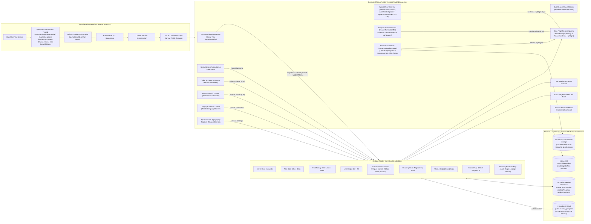

# Bookarium — 100% Legal Public Domain Library & Reader

> **Pure Literature. Zero Paywalls. Zero API Keys Required.**

[](https://antigravity.google)
[](https://github.com/calin-m/Bookarium/actions/workflows/ci.yml)
[-black?style=flat-square&logo=next.js)](https://nextjs.org/)
[](https://react.dev/)
[](https://www.typescriptlang.org/)
[](https://tailwindcss.com/)
[](public/sw.js)
[](https://supabase.com/)
[](https://vercel.com/)
[](docs/QUALITY_AUDIT_REPORT.md)
[](docs/QUALITY_AUDIT_REPORT.md)
[](docs/QUALITY_AUDIT_REPORT.md)
[](ROADMAP.md)
[](LICENSE)

---

An open-source, offline-first web application and reader for discovering, reading, and downloading public domain books (Project Gutenberg / CC0). Built with **Next.js 16 App Router**, **Tailwind CSS**, and **Zustand** persistence, deployed on the **Vercel Edge Platform**, developed with **[Google AI / Antigravity](https://antigravity.google)**, and verified by a deterministic **7-Gateway Quality Engine**.

Bookarium is powered by a self-hosted **Supabase PostgreSQL** catalog (78,000+ volumes) featuring GIN full-text search and pre-computed author lifespan indexes, delivering sub-50ms single-book lookups and dependable ~1–2s catalog page queries (compared to 20–60s queue delays on public APIs). To guarantee continuous uptime and zero-configuration setups, it includes an automatic failover to the upstream **Gutendex REST API** and Project Gutenberg mirrors whenever the database is unseeded, unreachable, or undergoing maintenance.

---

## 🎨 Design Inspiration & Aesthetic Philosophy

Bookarium's visual identity and tactile layout are deeply inspired by classical editorial typography, archival letterpress printing, and modern Figma bookstore design systems:

* **Figma Editorial Concept**: Inspired by the minimalist elegance of curated bookstore layouts, specifically referencing the [Booksaw — Bookstore E-Commerce Website Design Template](https://www.figma.com/community/file/1521831984874247291/booksaw-bookstore-ecommerce-website-design-template) on the Figma Community.
* **Open-Book Skeuomorphic Details**: Custom open-book card spreads with subtle center spine creases (`.book-center-crease`), realistic paper texture shadows (`shadow-booksaw`), and page depth elevation.
* **Warm Editorial Palettes & 100% Solid Surfaces**:
  * **Day / Standard**: Crisp cream-paper tones (`#fcfbf9`, `#ffffff`) with rich obsidian ink typography and 100% solid, non-transparent surfaces.
  * **Sepia / Cozy Coffee (Warm Midtone)**: Warm roasted espresso and cafe mocha tones (`#2b1d16`, `#3c281e`, `#332219`) with steamed milk cream typography (`#fef6eb`) and warm caramel amber accents (`#f59e0b`) for eye comfort in ambient evening light.
  * **Dark Mode**: High-contrast slate obsidian canvas (`#0e1117`, `#161b26`) preserving focus in low-light settings.
* **Refined Typography**: Pairings of classic literary serifs, clean sans-serifs, and monospace archival metadata accents.

---

<!-- BEGIN:latest-release -->
## 🛠️ Latest Improvements (v2.5.1)

- **Synchronized Dynamic SSR & Jurisdictional Edge Cookie Seeding (`src/app/layout.tsx`, `src/stores/useJurisdictionStore.ts`)**: Declared `export const dynamic = 'force-dynamic'`, extracted edge cookie `bookarium-geo-country` via Next.js `cookies()`, and passed `initialCountry` into `<Providers>`, eliminating Frankenstein (Book #0) and Pride & Prejudice (Book #1342) pre-hydration flash-on-mount swaps.
- **27-Masterwork & 36-Quote Curated Anthology Expansion (`src/config/featured-books.ts`, `src/config/literary-quotes.ts`, `src/components/presentation/LiteraryQuotes.tsx`)**: Expanded `FEATURED_HERO_BOOKS` from 10 to 27 classic masterworks and `LITERARY_QUOTES` from 12 to 36 iconic passages with verified author birth/death lifespans and territorial copyright filtering.
- **Declarative Copyright Subsystem Encapsulation & Unified Presentation Notice (`src/hooks/useBookCopyright.ts`, `src/components/presentation/CopyrightNoticeBanner.tsx`)**: Introduced declarative facade hook `useBookCopyright` and unified `CopyrightNoticeBanner` component, refactoring 8 presentation components and separating legal calculations from UI layouts.
- **Presentation Layer Copyright Separation**: Delegated territorial copyright checks across `BookCard`, `BookPreviewModal`, `BookmarkCard`, `BookshelfRack`, `DownloadDrawer`, `BookshelfMobileModal`, and `BookshelfSpine` to `useBookCopyright`.
- **Smooth Scrolling on Catalog Page Size Toggle (`src/app/page.tsx`)**: Smoothly scrolls `#catalog-section` into view when toggling between 8 and 16 books per page.

> 📖 **Complete Historical Ledger**: For full chronological release notes, breaking changes, and migration details across all versions, see [**`CHANGELOG.md`**](CHANGELOG.md).
<!-- END:latest-release -->

---

## 🌐 Data Sources & Infrastructure

Bookarium runs on an open, decentralized architecture requiring **Zero Paid Developer Keys**:

| Service / Source | Endpoint / Provider | Description & Usage |
|---|---|---|
| **Self-Hosted Supabase Catalog** | [`public.books`](#step-3-populate-public-domain-book-catalog-optional) (PostgreSQL) | Primary catalog provider hosting 78,000+ Project Gutenberg titles with automated GIN full-text search (`search_vector`) and pre-computed author lifespan indexes, delivering sub-50ms single-book copyright verification, consistent ~1–2s 32-volume catalog page searches, and zero-egress searches. |
| **Gutendex REST API** | [`gutendex.com`](https://gutendex.com/) • [`GitHub`](https://github.com/garethbjohnson/gutendex) | Resilient upstream search fallback created by [Gareth B. Johnson](https://github.com/garethbjohnson/gutendex) indexing 70,000+ titles with strict `copyright=false` filtering. Engaged automatically when Supabase is unseeded or offline. |
| **Project Gutenberg CDN & Mirrors** | [`gutenberg.org`](https://www.gutenberg.org/) • Mirrors | Content delivery network and mirrors (`aleph.gutenberg.org`, `gutenberg.readingroo.ms`) providing plain text (`.txt`), official EPUB packages (`.epub.images`), Kindle/MOBI formats, and web-ready HTML. |
| **Supabase (Auth, Sync & Catalog)** | [`supabase.com`](https://supabase.com/) | Cloud authentication, user library synchronization (bookshelves, annotations, progress, streaks, accolades) with RLS user isolation, and self-hosted public domain catalog. |
| **Vercel Edge Platform** | [`vercel.com`](https://vercel.com/) | High-performance edge deployment, dynamic SSR route handlers, zero-config production caching, global CDN delivery, and cookie-less aggregate performance telemetry (Vercel Web Analytics & Speed Insights). |
| **Public Domain Archive Proxies** | `/api/books` & `/api/books/content` | Next.js server-side route proxies providing caching, Strangler Fig dual-provider catalog resolution, Tier 1/Tier 2 content streaming, and guaranteed public domain integrity before client delivery. |

---

## 🎯 Key Features & Capabilities

Bookarium is structured around five core engineering pillars:

### 1. 🎨 Tactile Editorial Design & 3D Book Physics
* **Booksaw Editorial Aesthetic**: Classical typography inspired by fine art bookstore catalogues, featuring open-book card spreads with center spine creases, realistic paper shadows, and 100% solid non-transparent surfaces across Day (`#fcfbf9`), Cozy Coffee Sepia (`#2b1d16`), and Dark Obsidian (`#0e1117`) themes.
* **Hourly Rotating 3D Featured Book (27-Masterwork Curated Anthology)**: Expanded pool of 27 verified public domain masterworks across world literature (Austen, Shelley, Tolstoy, Hugo, Dostoevsky, Brontë, Kafka, Stevenson, Dumas, Machiavelli, Sun Tzu, Marcus Aurelius, Homer, Alcott, Poe, Verne, Thoreau, Twain) rotated every UTC hour with zero-cron deterministic synchronization.
  * **Synchronized Dynamic SSR & Zero-Flash Pre-Hydration**: Edge-stamped geo-cookie (`bookarium-geo-country`) extracted at the Next.js `layout.tsx` boundary synchronously seeds the jurisdiction store and aligns server snapshots with the client, completely eliminating pre-hydration fallback swaps (e.g. *Frankenstein* #0 flashing before the hourly volume) and guaranteeing 0.00 Cumulative Layout Shift.
  * **Interactive Open-Cover Physics**: On desktop hover, the hardbound volume smoothly elevates and opens 180° on its spine hinge, displaying opening reflections on the Left Page and notable excerpts on the Right Page. Clicking pins the volume open or closed.
  * **Physical 60–120 FPS Page Turn**: Shuffling passages flips a physical 3D leaf across the spine with synchronized ink reveals.
* **Daily Rotating Editorial Classic of the Day & 36 Literary Quotes**: Dedicated editorial showcase positioned beneath the catalog grid presenting a unified public domain masterpiece with authentic title, author, publication year, verbatim literary quote, and 1-click reader handoff. Evaluated directly on initial SSR with territorial copyright filtering (e.g. Life+100 Mexico protection) and dynamic anti-collision intelligence that automatically skips candidate books matching the current Hero spotlight to guarantee two unique masterworks on every visit. Supported by an expanded collection of 36 iconic literary passages in "Words That Shaped Humanity" (`LiteraryQuotes.tsx`) with safe shuffling and author lifespan governance.
* **Interactive 3D Book Preview Modal**: Clicking or tapping any book card cover launches a 3D hardcover preview modal with fluid FLIP geometry transitions, subpixel return landing, chapter shuffling, and 1-click reader handoff.
* **Studio Bookshelf Bookcase**: Hardwood shelf alcove with 8 authentic spine binding colorways (Oxblood, Navy, Emerald, Saddle, Plum, Charcoal, Teal, Espresso), convex specular curvature, gilded lettering, pull-forward hover scaling, and a **Zero-CLS Floating Cloud Sync Badge** that smoothly overlays real-time sync status without triggering vertical content shifts.
* **Directional Stepped Scroll Navigation**: Dynamic scroll detection (`useScrollDirection`) smoothly hides the top header on scroll down, docks the catalog filter toolbar to `top-0`, and instantly reveals navigation on upward scroll gestures. Configurable in Account Settings between **Smart Auto-Hide** and **Always Fixed**.
* **Responsive Filter Drawer & Push-Content Layout**: Persistent left-docked drawer on desktop & ultrawide viewports (≥ 1280px / `xl:`) shifting main content to the right (`xl:pl-96`) for non-blocking catalog browsing; smoothly adapts to a focused slide-out overlay with soft backdrop blur (`backdrop-blur-xs`) on laptops, vertical monitors, and mobile devices—guaranteeing 100% unclipped facet typography with zero text truncation.
* **Tactile Mobile Single-Row Sticky Catalog Toolbar**: Compact ~44px mobile toolbar unifying search filter triggers, real-time API health status, view mode toggling (Grid vs. Spine Shelf), and deep-archive pagination in a single horizontal row, maximizing vertical screen real estate for book covers. Features an enhanced tactile numeric page input with auto-selection on tap/focus (`inputMode="numeric"`), decoupled blank editing state, `aria-pressed` size states, and smooth scrolling to `#catalog-section` on page size change.
* **Windowed Chunk Sub-Pagination & Predictive Prefetching**: Seamlessly reconciles upstream API batching with responsive client layouts by sub-slicing the catalog's native 32-volume batch into viewport-optimized pages (8 books/page on mobile `grid-cols-2`, 16 books/page on desktop `md:grid-cols-4`). Sub-page turns execute in 0ms directly from client memory without network delay. A widened predictive prefetch buffer triggers background loading on Sub-page 3 (mobile) or Sub-page 1 (desktop), providing a 15–25 second network lead time before reaching batch boundaries.
* **Explicit Catalog Search Activation & 2-Character Guardrail**: Replaced keystroke debouncing with intentional search submission (<kbd>Enter</kbd> or clicking "Search") to eliminate redundant API spam against public upstream servers. Enforces a client-side and server-side 2-character minimum guardrail with accessible inline validation (`aria-live="polite"`), preventing heavy 1-character full-table scans while fully permitting classical two-character literary titles (*It*, *Oz*, *Up*, *Po*).
* **Unified Native Input Architecture & Search Focus Harmonization**: Standardized all search bars across Catalog, Bookshelf, Favorites, Bookmarks, Notebooks, and Reader Search Drawer to a native `<input>` architecture with `rounded-xl` curvature, subtle pre-hover warming (`hover:border-primary/40`), and a crisp 150ms outward primary ring bloom. The Catalog hero bar integrates floating inset controls (Search button and clear `X`) directly within the input's padding, delivering authentic native focus without enclosing action buttons inside the glow.

### 2. 📖 Dedicated Focus Reader & Typography Engine
* **Unabridged Reading Canvas (`/read/[id]`)**: Full-screen, distraction-free reading with exact chapter and page coordinate auto-resume toasts and 1-click restart option.
* **Gutenberg Paragraph Reflow Engine**: Normalizes legacy 70-character hard linebreaks into fluid prose across Narrow (`576px`), Normal (`768px`), and Wide (`1024px`) layouts while preserving double-spaced paragraphs, dialogue, and indented poetry.
* **Granular Typography Popover (`Aa`)**: Real-time font sizing (12px–36px) and dynamic line height (1.2–2.6) with 1-click presets (`14px / 18px / 24px` and `1.4 / 1.8 / 2.2`), font family selection (Serif, Sans, Mono), and reading mode toggling (Paginated / Scroll).
* **Mobile Pinch-to-Zoom Scaling**: Two-finger pinch gestures adjust font sizing with a transient HUD size badge.
* **Global Sentence-Snapped Virtual Pagination**: Virtual page engine with a 500-entry memory LRU cache for instant sub-millisecond virtual page turns without redundant calculation.
* **Integrated Reading Drawers**:
  * **Table of Contents (`ReaderTocDrawer`)**: Instant chapter navigation with live start-page badges, read-time estimates, and front-matter anthology story detection.
  * **In-Book Search (`ReaderSearchDrawer`)**: Real-time regex scanner across the unabridged volume with highlighted matches (`<mark>`), chapter grouping, match counters, and keyboard shortcut invocation (`Ctrl+F` / `/`).
  * **Language Editions (`ReaderLanguageDrawer`)**: Discovers authentic foreign language Gutenberg editions and translations with 1-click reading handoff.
* **Persistent Web Worker Lifecycle**: Single long-lived Web Worker (`useGutenbergParserWorker`) retained across typography tweaks, eliminating UI thread lag with non-blocking async fallback.

### 3. 🌐 Universal Languages, AI Translation & Neural Narration
* **Catalog & Archive Filtering (12 Primary Languages)**: Full catalog search and facet filtering across English, French, German, Spanish, Italian, Latin, Ancient & Modern Greek, Portuguese, Dutch, Russian, Chinese, and Romanian via the unified `<LanguageSelector />`.
* **On-Demand Dynamic AI Translation (40+ Languages)**: In-reader on-the-fly translation via a zero-key serverless Google Neural Machine Translation proxy (`/api/translate`) featuring 18 popular language quick-chips.
  * **Offline Page-Level Caching**: Every translated page is automatically cached in browser storage for instant zero-latency transitions on re-read.
  * **Bilingual Parallel Reading Mode**: Displays translated paragraphs side-by-side with original authentic sentences for comparative study and language learning.
* **Synchronized Neural Voice Read-Aloud (Text-to-Speech)**: Offline-first narration (`window.speechSynthesis`) with automatic original/translated language-voice pairing, amber visual sentence highlight tracking, speed presets (0.85x–2.0x), sentence navigation, and OS-level MediaSession lockscreen controls.

### 4. ⚡ Offline-First Persistence, Cloud Sync & Data Sovereignty
* **Clean Path URL & Symmetric SSR Hydration Architecture**: Canonical routes (`/`, `/bookshelf`, `/favorites`, `/notebook`, `/bookmarks`) powered by Next.js server rewrites, client history synchronization, and symmetric `parseFiltersFromUrl` query parsing—guaranteeing identical server-rendered HTML and client hydration on deep paginated URLs (e.g. `?page=8`) with zero layout shift and 0 CLS.
* **Bookmarks & Continue Reading Ledger (`/bookmarks`)**: Dedicated reading ledger tracking active volumes with tactile bookmark cards, ribbon accents, live progress percentages, last-read coordinates, status filters (All, In Progress, Completed, On Hold), and 1-click chapter resume.
  * **Authentic Reading Telemetry**: Strictly enrolls volumes with active coordinates or progress, eliminating unopened placeholder clutter.
  * **Two-Way Dynamic Hydration**: Resolves un-shelved book identities via TanStack React Query and automatically pre-seeds warm reader state for instant 0ms transitions.
  * **Completed Reading Progress Latch & "Read Again" Flow**: Resuming a finished volume safely locks 100% progress and the "Completed" badge without regressions. Completed bookmark cards feature a dedicated "Read Again" action allowing readers to restart reading from Page 1 without destroying historical ledger completion achievements.
* **In-Reader Highlighting & Literary Commonplace Notebook (`/notebook`)**:
  * 4 editorial pastel highlighters (Canary Yellow, Vintage Amber, Calm Mint, Soft Rose) with coarse-pointer touch dismissal and chapter-scoped annotation drawer.
  * Comprehensive reading journal organizing highlighted excerpts, personal reflections, pastel color filters, full-text search, volume grouping, and 1-click academic citation copying.
* **Native IndexedDB Offline Book Storage**: Zero-dependency browser storage bypassing the 5MB `localStorage` limit, enabling readers to download entire books for offline reading in airplane mode. Downloading a volume automatically links it to the user's personal bookshelf.
* **Authoritative Cloud State Reconciliation (`lastBookshelfSyncAt`)**: Optional Supabase PostgreSQL cloud sync with Row Level Security (RLS). Initial sync migrates local guest books to the cloud; subsequent syncs treat Supabase as the authoritative source of truth, gracefully pruning titles deleted on another device while pre-sync outbox flushing (`flushOutbox`) safeguards offline additions.
* **High-Performance Database Query Planner Optimization**: Implemented `{ count: 'estimated' }` planner statistics in `src/lib/catalog/supabase-provider.ts` across 78,000+ catalog rows, completely eliminating PostgreSQL `57014` statement timeouts and slashing query latency from `>3,000ms` down to **`~275ms`**.
* **Sanitized Sign-Out & Account Isolation**: Pre-logout outbox drain and clean state wipe (`clearBookshelf()`) prevent cross-account contamination while raw downloaded texts in IndexedDB are preserved on device.
* **Bi-Directional Cloud Reading Progress**: 2000ms debounced upsert to `public.reading_progress`, restoring chapter and scroll coordinates across devices for authenticated accounts while remaining 0ms/zero-network for guest readers.
* **Reading Streaks, Dual Immersion Telemetry & Annual Reading Challenges (`/account`)**: Offline-first literary activity tracking calculating consecutive daily streaks with a **5-minute active immersion threshold** (`300s`), longest streaks, 7-day calendar activity indicators, and total literary immersion duration. Disentangles telemetry into distinct **Reading Time** (visual focus with 2-minute idle guard) and **Listening Time** (uninterrupted Text-to-Speech audio narration retaining time in background tabs). Includes an interactive annual reading challenge progress bar with user-adjustable volume targets, real-time pace tracking, dynamic countdown prompts (`Xm / 5m logged today`), and multi-device Supabase cloud synchronization with Last-Write-Wins (LWW) conflict resolution.
* **Full Data Sovereignty & Portability**: Single-click RFC 4180 CSV export and portable JSON backup (`src/lib/library-backup.ts`) with defensive schema validation and merge/replace restore strategies.
* **Zero-Tracking Privacy Architecture (`/privacy`)**: Zero third-party trackers, zero advertising beacons, cookie-less operation (Art. 5(3) exempt), privacy-first anonymous aggregate telemetry (Vercel Web Analytics & Speed Insights), and self-service account data deletion in User Settings (`/account`).
* **Technical SEO, Social OpenGraph & Upstream Rate-Shielding**: Native Next.js 16 crawl directives (`robots.ts`) explicitly disallow search query parameters (`?search=*`, `?topic=*`) to protect public upstream catalog servers from bot query exhaustion. Dynamic server layouts (`/read/[id]/layout.tsx`) resolve book identities directly from self-hosted Supabase with an in-memory cache and 24-hour Next.js edge caching (`revalidate: 86400`) to generate rich OpenGraph and Twitter cards (`summary_large_image`) featuring authentic book covers, while injecting safe Schema.org `Book`, `WebSite`, and `WebApplication` (`isAccessibleForFree: true`) JSON-LD structured data.

### 5. ⚖️ 100% Airtight Jurisdictional Copyright Governance & Legal Compliance
* **Autonomous Multi-Jurisdiction Engine (`src/lib/copyright-engine.ts`)**: Decoupled, zero-dependency validation engine enforcing exact public domain thresholds based on the user's geographic jurisdiction (year 2026 cutoff calculations):
  * **United States (17 U.S.C. § 304)**: Published on or before 1930 or cleared by Project Gutenberg US (`copyright === false`).
  * **Life + 70 (EU 27, UK, Canada, Australia, New Zealand, Japan)**: Author and translator death year $\le 1955$ ($2026 - 71$).
  * **Life + 100 (Mexico, Côte d'Ivoire)**: Author and translator death year $\le 1925$ ($2026 - 101$).
  * **Life + 80 (Colombia, Spain pre-1987 deaths)**: Author and translator death year $\le 1945$ ($2026 - 81$).
* **Declarative Copyright Subsystem Encapsulation (`useBookCopyright.ts` & `CopyrightNoticeBanner.tsx`)**: Unified copyright logic behind a single declarative facade hook (`useBookCopyright`) and a standardized presentation banner (`CopyrightNoticeBanner`), decoupling legal lifespan calculations from UI layouts and eliminating duplicated evaluation across 8 presentation components.
* **Joint Authorship & Derivative Protection**: Calculates protection from the death of the *last surviving co-author* (Berne Convention Art. 7bis) and independently validates translator derivative works (Berne Convention Art. 2(3)). Includes `partitionBooksByJurisdiction` for cleanly separating legal collections.
* **Fail-Closed Longevity Heuristics**: Applies a strict human longevity upper bound ($birth\_year \le currentYear - term - 101$) for missing death dates, and strictly fails closed outside the US when author lifespans cannot be verified.
* **Next.js 16 Root Proxy Geo-Context & Dynamic SSR Seeding (`src/proxy.ts`, `src/app/layout.tsx`)**: Automatically resolves the visitor's ISO 3166-1 alpha-2 country code via edge headers (`x-vercel-ip-country`, `cf-ipcountry`), stamps a non-tracking `bookarium-geo-country` cookie, supports regional development overrides (`?country=XX`), and synchronously seeds the jurisdiction store during server-side rendering for instant zero-flash hydration.
* **HTTP 451 Streaming Gatekeeper (`/api/books/content`)**: Evaluates incoming text streaming requests against a 24h LRU metadata cache (`src/app/api/books/content/metadata-cache.ts`). If protected under the visitor's local law, the server returns an **`HTTP 451: Unavailable For Legal Reasons`** response detailing the restricting author, local statute, and projected public domain entry date.
* **Hyperlink Neutralization & Presentation Isolation**:
  * **Download Drawer (`DownloadDrawer.tsx`)**: Direct download links are completely omitted from the DOM when restricted, satisfying European Court of Justice (*GS Media*) and UK hyperlink communication case law, replaced with a prominent legal restriction banner (`CopyrightNoticeBanner`).
  * **Book Cards (`BookCard.tsx`)**: Displays an amber `"Protected ([Country])"` badge and disables the reading action as `"Restricted"`.
  * **Dedicated Reader Legal View (`ReaderErrorView.tsx`)**: Renders an archival shield view with full statutory rationale and a 1-click `"Return to Library"` action.
* **Edge CDN Cache Partitioning**: Both `/api/books` and `/api/books/content` routes stamp `Vary: x-vercel-ip-country, Accept-Encoding` to guarantee zero regional cache poisoning across global CDN edge nodes.

---

## 🏛️ System Architecture Diagrams

### 1. End-to-End System Context & Data Flow

```mermaid
flowchart TD
    User["👤 Reader / Literature Enthusiast"]
    
    subgraph FrontendSPA ["Client SPA Layer (Next.js 16 App Router)"]
        Nav["Navbar.tsx\n(Brand Reset, View Switcher, Theme Cycler)"]
        Hero["HeroSearch.tsx\n(Dynamic 3D Rotating Spotlight & Search)"]
        Hero3D["HeroFeaturedBook3D.tsx\n(3D Open-Cover Hinge & Leaf-Flip Engine)"]
        Toolbar["StickyCatalogToolbar.tsx\n(0px Flush Header, Filters Toggle, Tactile Numeric Jump)"]
        FilterDrawer["AdvancedFilterDrawer.tsx\n(Left Push-Sidebar: Eras, Sort, Formats)"]
        EditorialQuote["EditorialQuoteSection.tsx\n(Classic of the Day & Collision Guard)"]
        LiteraryQuotes["LiteraryQuotes.tsx\n(Words That Shaped Humanity & Safe Shuffling)"]
        CopyrightBanner["CopyrightNoticeBanner.tsx\n(Declarative Territorial Restriction & Public Domain Notice)"]
        
        subgraph Views ["Primary Application Views (/ & Edge Rewrites)"]
            Grid["Catalog View (/)\n(Editorial Card Grid & 3D Hardwood Shelf)"]
            ShelfView["Bookshelf View (/bookshelf)\n(Curated Library & Custom Named Shelves)"]
            FavView["Favorites View (/favorites)\n(Personal Masterworks Collection)"]
            MarksView["Bookmarks View (/bookmarks)\n(Tactile Reading Ledger & Telemetry)"]
            NoteView["Commonplace Notebook (/notebook)\n(Highlights, Reflections & Tags)"]
            AccView["Account Hub (/account)\n(Library Stats, Cloud Sync & JSON Backup)"]
            HabitsCard["AccountHabitsCard.tsx\n(Reading Streaks, Daily Progress, Annual Challenge)"]
            AccoladesCard["AccountAccoladesCard.tsx\n(Literary Honors, Showcase & Ex-Libris Bookplates)"]
            ReaderPage["Focus Reader Page (/read/[id])\n(Continuous Pagination, Subtitles, AST)"]
        end
        
        subgraph ReaderDrawers ["Portaled Mutual-Exclusion Dialogs (z-10000)"]
            TocDrawer["ReaderTocDrawer\n(Rich Subtitles & Page Numbers)"]
            SearchDrawer["ReaderSearchDrawer\n(In-Volume Live Text Search)"]
            ControlsDrawer["ReaderControls\n(Typography, Speech & Themes)"]
            LangDrawer["ReaderLanguageDrawer\n(International Editions Handoff)"]
            DownDrawer["DownloadDrawer\n(EPUB, MOBI, TXT Direct Streams)"]
        end
        
        subgraph StateStores ["Zustand Persistent State & Offline Engine"]
            StoreShelf[("⚡ useBookshelfStore\n(saved, likes, queue, history, shelves)")]
            StoreReader[("📖 useReaderStore\n(typography, progress map, coordinates)")]
            StoreTheme[("🎨 useThemeStore\n(day, sepia, obsidian)")]
            StoreAuth[("🔐 useAuthStore\n(session, cloud migration, profile)")]
            StorePref[("⚙️ usePreferencesStore\n(sticky scroll, layout choices)")]
            StoreAnnot[("🖍️ useAnnotationStore\n(pastel highlights, notes, tags)")]
            StoreHabits[("🔥 useHabitsStore\n(streak, 5m threshold, dual immersion, cloud)")]
            StoreAccolades[("🎖️ useAccoladesStore\n(accolades, showcase pinning, celebrations, cloud)")]
            StoreJurisdiction[("🌐 useJurisdictionStore\n(country, rule, dev override, cookie sync)")]
            StoreOffline[("📦 IndexedDB Engine\n(unabridged offline volume cache)")]
        end
        
        subgraph ReaderEngine ["Reader Runtime & Web Speech Subsystem"]
            SpeechHook["🔊 useReaderSpeech\n(SpeechSynthesis, Boundary Sync, Auto-Flip)"]
            TimerHook["⏱️ useReadingTimer\n(Dual Immersion: 2-min Idle Guard + TTS Audio Bypass)"]
            WorkerHook["⚙️ useGutenbergParserWorker\n(Persistent Worker Chapter AST)"]
            LedgerHook["🔖 useContinueReadingLedger\n(Two-Way Hydration & 0ms Resume)"]
            AnnotatorEngine["🖍️ reader-annotator.ts\n(Computational Interval Partitioning & Highlighter)"]
        end
        
        HookCopyright["⚖️ useBookCopyright\n(Declarative Facade: Rules, Lifespans & Status)"]
        HookAutoHeal["🩺 useCollectionAutoHeal\n(Author Lifespan Scanning & Auto-Rehydration)"]
        QueryBooks["🔄 useBooks & usePrefetchNextPage\n(Windowed Sub-Pages & Predictive Prefetch)"]
        QueryContent["🔄 useBookContent(url, bookId)\n(IndexedDB Check to CDN Stream)"]
        QueryTranslate["🌐 useBookTranslations\n(International Editions Aggregation)"]
        Telemetry["📊 Vercel Telemetry\n(Analytics & Speed Insights)"]
    end

    subgraph ServerLayer ["Next.js Root Proxy & Edge Routing Layer"]
        RootProxy["Next.js 16 Root Proxy (src/proxy.ts)\n(Edge Geo-IP: x-vercel-ip-country, Dev ?country=XX, Cookie Stamping)"]
        ProxyBooks["GET /api/books\n(SWR 120s Cache, Latency Tracking, Rate Limit, Seam Controller)"]
        CatalogSeam["Catalog Seam & Dual Providers (src/lib/catalog/)\n(supabase-provider.ts • gutendex-provider.ts)"]
        ProxyContent["GET /api/books/content\n(Tier 1 Supabase DB • Tier 2 Gutenberg Multi-Mirror, Anti-SSRF)"]
        ProxyTranslate["POST /api/translate\n(Neural MT Proxy, 40+ Languages)"]
        LayoutServer["Server Layout (/read/[id])\n(React.cache, ISR 24h, OpenGraph, JSON-LD)"]
    end

    subgraph LegalLayer ["Jurisdictional Copyright Engine (src/lib/copyright-engine.ts)"]
        EngineCore["isBookPublicDomainInJurisdiction\n(US 1930 Cutoff, Life+70, Life+100, Life+80)"]
        JointAuthors["Joint Authorship Guard (Berne Art. 7bis)"]
        Translators["Translator Protection (Berne Art. 2(3))"]
        ContributorFilter["Contributor Role Filter\n(Illustrator/Artist Non-Blocking Exclusion)"]
        CountryResolver["Country Resolver (src/lib/country-resolver.ts)\n(Edge Geo-IP, Cookie Sync, Timezone Inference)"]
        MetaCache["Metadata Lifespan Cache\n(metadata-cache.ts • 24h LRU)"]
    end

    subgraph UpstreamServices ["100% Public Domain & Cloud Infrastructure"]
        Gutendex["🌐 Gutendex Search API\n(Upstream Search Fallback)"]
        GutenbergCDN["🌐 Project Gutenberg Mirrors\n(aleph.gutenberg.org, gutenberg.readingroo.ms, www.gutenberg.org)"]
        GoogleNMT["🌐 Google Neural MT\n(Serverless AI Translation)"]
        SupabaseCloud[("⚡ Supabase Cloud (PostgreSQL)\n(public.books catalog, profiles, shelves, progress, habits, accolades)")]
        SyncEngine["🔄 Gutenberg Catalog Sync Engine\n(scripts/sync-gutenberg-catalog.js • .github/workflows/catalog-sync.yml)"]
        VercelEdge["⚡ Vercel Edge Platform\n(Cookie-less Analytics & Speed Insights)"]
    end

    User --> RootProxy
    RootProxy --> Nav
    RootProxy --> Hero
    Hero --> Hero3D
    RootProxy --> Toolbar
    Toolbar --> FilterDrawer
    Toolbar --> Grid
    Grid --> CopyrightBanner
    Grid --> HookCopyright
    Grid --> EditorialQuote
    Grid --> LiteraryQuotes
    Nav --> Views
    FavView --> HookAutoHeal
    ShelfView --> HookAutoHeal
    HookCopyright --> EngineCore
    AccView --> HabitsCard
    AccView --> AccoladesCard
    
    Grid --> QueryBooks
    QueryBooks --> ProxyBooks
    ProxyBooks --> CatalogSeam
    CatalogSeam --> EngineCore
    CatalogSeam -->|"Primary: Estimated-Count Fast Scan / <50ms Single-Book"| SupabaseCloud
    CatalogSeam -.->|Fallback on unseeded/offline| Gutendex
    SyncEngine -->|Weekly Cron pg_catalog.csv.gz Stream| SupabaseCloud
    QueryBooks -.->|Client Failover on 504| Gutendex
    
    ReaderPage --> QueryContent
    ReaderPage --> ReaderDrawers
    ReaderPage --> ReaderEngine
    ReaderPage --> TimerHook
    ReaderPage --> AnnotatorEngine
    AnnotatorEngine --> StoreAnnot
    QueryContent --> ProxyContent
    ProxyContent --> MetaCache
    MetaCache -->|1. Supabase public.books check| SupabaseCloud
    MetaCache -.->|2. Fallback to Gutendex| Gutendex
    MetaCache --> EngineCore
    EngineCore --> JointAuthors
    EngineCore --> Translators
    ProxyContent -->|Tier 1: Instant DB Text| SupabaseCloud
    ProxyContent -->|Tier 2: Multi-Mirror Fallback| GutenbergCDN
    ReaderPage --> QueryTranslate
    QueryTranslate --> ProxyTranslate
    ProxyTranslate --> GoogleNMT
    
    Views --> StateStores
    HabitsCard --> StoreHabits
    AccoladesCard --> StoreAccolades
    TimerHook --> StoreHabits
    ReaderEngine --> StateStores
    StoreShelf -->|Cloud Sync via RLS| SupabaseCloud
    StoreReader -->|Progress Sync| SupabaseCloud
    StoreAuth -->|Session Auth| SupabaseCloud
    StoreHabits -->|Habits Sync via RLS| SupabaseCloud
    StoreAccolades -->|Accolades Sync via RLS| SupabaseCloud
    Telemetry -.->|Anonymous Metrics| VercelEdge
```



---

### 2. Focus Reader State & Typography Engine



---

### 3. Bookmarks & Continue Reading Ledger Architecture


---

## ⚡ Quick Start

### 1. Prerequisites
- **Node.js**: `>= 20.0.0` (Node 22 LTS recommended)
- **npm**: `>= 10.0.0`

### 2. Installation & Local Development

```bash
# 1. Clone the repository and install dependencies
npm install

# 2. Start local development server (automatically launches browser)
npm run dev:open

# 3. Or launch full development environment with background test watcher
npm run dev:all
```

The application will be accessible at [http://localhost:3000](http://localhost:3000). *(Bookarium operates seamlessly in 100% offline-first mode using browser storage with zero environment setup required).*

### 3. Regional Copyright & Jurisdictional Testing
Bookarium strictly enforces territorial copyright compliance in accordance with international public domain statutes:
- **In Production (Vercel)**: Automatically inspects the client's network connection via `x-vercel-ip-country` (tamper-proof edge IP header).
- **In Local Development (`localhost:3000`)**: Automatically infers your country via your machine's **System Timezone** (e.g. `Europe/Bucharest` $\rightarrow$ `RO` / Life+70), displaying the authentic regional catalog out-of-the-box (55,182 volumes in the EU vs. 78,500 in the U.S.).
- **Testing Other Jurisdictions Locally**:
  - Append `?country=XX` to the URL (e.g. `http://localhost:3000/?country=US` or `http://localhost:3000/?country=MX`).
  - Or define `DEV_COUNTRY=XX` in `.env.local` to permanently anchor your local environment to any ISO 3166-1 country code.

---

## 🗄️ Supabase Cloud Database & Authentication Setup (Optional)

Bookarium uses Supabase PostgreSQL for optional cloud authentication, cross-device bookshelf & favorites synchronization, and reading progress tracking. Follow these steps to provision your database in under 2 minutes:

### Step 1: Create a Free Supabase Project & Configure Environment
1. Go to [supabase.com](https://supabase.com/) and create a new project.
2. Note your **Project URL** and **anon public API Key** from **Project Settings $\to$ API**.
3. Create a `.env.local` file in the project root:

```env
NEXT_PUBLIC_SUPABASE_URL=https://your-project-id.supabase.co
NEXT_PUBLIC_SUPABASE_ANON_KEY=your-supabase-anon-key
```

### Step 2: Run Database Schema Script
1. In your Supabase Dashboard, open the **SQL Editor** from the left sidebar.
2. Click **New Query**, copy and paste the contents of [`supabase/schema.sql`](supabase/schema.sql), and click **Run**.
3. The script is **100% idempotent** and safely provisions all database tables, Row Level Security (RLS) policies, indexes, and triggers:

| Database Object | Type | Purpose & Security Governance |
|---|---|---|
| `public.profiles` | Table (RLS) | User display name, unique @username handle, scholar bio, opt-in public switch, saved books and custom shelf visibility toggles (`show_saved_books`, `show_custom_shelves`), and telemetry visibility with zero-PII public RLS reads (`is_public = true`) and authenticated-only mutations with `WITH CHECK` integrity. |
| `public.bookshelves` | Table (RLS) | Master default 'General' shelf and custom user-created collection shelves with granular public/private privacy enforcement (`is_public = true`) and authenticated-only mutations with `WITH CHECK` integrity. |
| `public.bookshelf_items` | Table (RLS) | Volumes filed in specific bookshelves with uniqueness constraints, parent bookshelf ownership verification on insert/update/delete, public shelf isolation, and cascade-optimized foreign key index on `user_id`. |
| `public.user_favorites` | Table (RLS) | Cross-device synchronized favorited titles with authenticated-only user isolation. |
| `public.reading_progress` | Table (RLS) | Chapter coordinates, progress %, scroll offset, and cached volume metadata with authenticated-only `WITH CHECK` integrity. |
| `public.user_annotations` | Table (RLS) | Passage highlights (yellow, amber, mint, rose) and personal scholarly notes. |
| `public.user_book_curation` | Table (RLS) | Personal 1–5 star ratings and reading status classification. |
| `public.user_reading_habits` | Table (RLS) | Reading streaks, daily session dates, annual goal targets, and dual immersion duration (reading & listening). |
| `public.user_accolades` | Table (RLS) | Unlocked literary accolades, timestamps, showcase pinning, and personal bookplate metadata. |
| `public.books` | Table (RLS) | High-performance self-hosted public domain catalog with GIN full-text search (`search_vector`), indexed languages, subjects, download metrics, pre-computed author lifespan bounds (`max_author_death_year`, `min_author_birth_year`) for sub-50ms single-book copyright resolution and ~1–2s catalog searches, optional full plain-text caching (`content`) for instant reader streaming, and public read RLS (`FOR SELECT USING (true)`). |
| `public.handle_new_user()` | Trigger | Automatically provisions profile and default General shelf on auth creation (RPC execution revoked from `PUBLIC`, `anon`, `authenticated`, immutable `search_path`). |
| `public.delete_current_user()` | RPC Function | Cascade user data erasure and complete self-service account deletion (authenticated-only execution, null session guard, immutable `search_path`). |
| `public.books_search_vector_trigger()` | Trigger | Automatically maintains `search_vector` on book insert/update (RPC execution revoked from `PUBLIC`, `anon`, `authenticated`, immutable `search_path`). |

### Step 3: Populate Public Domain Book Catalog (Optional)
To activate the self-hosted PostgreSQL book catalog and bypass third-party rate limits, you have two options:

#### Option A: Autonomous Full-Catalog Sync (78,000+ Titles — Recommended)
Stream Project Gutenberg's complete official catalog dump directly into Supabase without copy-pasting SQL:
```bash
# 1. Quick test run (first 100 books, ~2 seconds):
npm run catalog:sync -- --limit=100

# 2. Full autonomous catalog population (78,000+ titles in ~2 minutes):
npm run catalog:sync
```
> [!TIP]
> **Hands-Free Weekly Sync**: Add `NEXT_PUBLIC_SUPABASE_URL` and `SUPABASE_SERVICE_ROLE_KEY` to your repository's **GitHub Secrets** (`Settings -> Secrets and variables -> Actions`). The scheduled GitHub Actions workflow (`.github/workflows/catalog-sync.yml`) will automatically update newly added titles every Sunday at 02:00 UTC and keep your Supabase free project active. You can also trigger it on-demand with 1 click from the GitHub **Actions** tab.

#### Option B: Curated Masterworks Starter Seed (10 Books)
If you prefer a quick starter seed for local development:
```bash
# Generate curated SQL seed file with 10 masterworks
npm run catalog:ingest -- --curated --dry-run
```
Paste and run [`supabase/seed_books.sql`](supabase/seed_books.sql) in your Supabase SQL Editor.

Once seeded, `/api/books` automatically routes queries to your self-hosted Supabase PostgreSQL catalog with predictable ~1–2s catalog page responses and sub-50ms single-book lookups, eliminating the 20–60s wait times and timeouts common on public APIs.

### Step 4: Configure Authentication Redirect URLs
1. In your Supabase Dashboard, navigate to **Authentication $\to$ URL Configuration**.
2. Set **Site URL** to:
   - `http://localhost:3000` (for local development) or `https://your-app.vercel.app` (for production)
3. Under **Redirect URLs**, add the following allowed callback endpoints:
   - `http://localhost:3000/auth/callback`
   - `http://localhost:3000/auth/confirm-deletion`
   - `http://localhost:3000/account`
   - `https://your-app.vercel.app/auth/callback`
   - `https://your-app.vercel.app/auth/confirm-deletion`
   - `https://your-app.vercel.app/account`

---

### 🚀 Production Deployment on Vercel

Bookarium is architected for zero-config deployment on **[Vercel](https://vercel.com/)**:

1. Push your repository branch to GitHub.
2. Import the project into the [Vercel Dashboard](https://vercel.com/new).
3. Under **Environment Variables**, optionally set:
   * `NEXT_PUBLIC_SUPABASE_URL` = your Supabase project URL
   * `NEXT_PUBLIC_SUPABASE_ANON_KEY` = your Supabase public anon key
4. Click **Deploy** — Vercel will automatically build the Next.js 16 production bundle, configure edge caching, and provision serverless API proxies.
---

## 🔒 Enterprise Security & Resiliency Architecture

Bookarium implements a defense-in-depth security model across the edge, serverless runtime, and client layers:

| Security Vector | Implementation & File Path | Protection Mechanism |
|---|---|---|
| **Sliding-Window Rate Limiting** | [`src/lib/rate-limiter.ts`](src/lib/rate-limiter.ts) & [`src/lib/api-utils.ts`](src/lib/api-utils.ts) | Zero-dependency in-memory sliding-window rate limiter protecting upstream Project Gutenberg APIs (60 req/min on `/api/books`, 30 req/min on `/api/books/content`) with automatic 30s garbage collection, anti-spoofing IP resolution (prioritizing edge platform headers and rightmost hop extraction), and `429 Too Many Requests` status with `Retry-After`. |
| **Dual-Provider Failover & Cloud Outage Immunity** | [`src/lib/catalog/`](src/lib/catalog/) & [`src/stores/useBookshelfStore.ts`](src/stores/useBookshelfStore.ts) | Automatic Strangler Fig failover transparently degrading `/api/books` and `/api/books/content` from primary Supabase PostgreSQL to the upstream Gutendex REST API and secondary Gutenberg mirrors (`aleph.gutenberg.org`, `gutenberg.readingroo.ms`) upon database latency or cloud outages. Reading positions, bookmarks, audio telemetry, and downloaded texts remain 100% functional offline via IndexedDB and local Zustand storage, with non-blocking post-outage reconciliation (`flushOutbox`). |
| **HTTP Security Headers** | [`next.config.ts`](next.config.ts) | Enforces Content-Security-Policy (`default-src 'self'`, `frame-ancestors 'none'`), Cross-Origin-Opener-Policy (`same-origin`), HSTS (`max-age=63072000; includeSubDomains; preload`), Clickjacking defense (`X-Frame-Options: SAMEORIGIN`), MIME-type sniffing prevention (`X-Content-Type-Options: nosniff`), Referrer Policy (`strict-origin-when-cross-origin`), and Permissions Policy (`camera=(), microphone=(), geolocation=()`). |
| **SSRF & Upstream Stream Bounding** | [`src/app/api/books/content/route.ts`](src/app/api/books/content/route.ts) & [`src/app/api/books/content/url-validator.ts`](src/app/api/books/content/url-validator.ts) | Upstream URL whitelisting (`isSafeUpstreamUrl`) restricting fetches strictly to official Project Gutenberg domains (`gutenberg.org`, `www.gutenberg.org`), strict numeric ID regex verification (`^\d{1,8}$`), `redirect: 'manual'` preventing open redirect hops, and a 15MB payload streaming threshold preventing memory exhaustion DoS. |
| **Open Redirect Defense** | [`src/app/auth/callback/route.ts`](src/app/auth/callback/route.ts) | Path sanitization (`sanitizeRedirectPath`) guaranteeing OAuth and magic-link redirect paths strictly originate from trusted relative roots (`/^\/[^\/\\]/`) preventing off-site phishing redirects. |
| **Next.js Edge Session Proxy** | [`src/proxy.ts`](src/proxy.ts) & [`src/lib/supabase/middleware.ts`](src/lib/supabase/middleware.ts) | Lightweight edge proxy invoking `@supabase/ssr` `updateSession` to seamlessly refresh auth tokens and cookies across route transitions with non-blocking fallback handling. |
| **ReDoS & Main Thread Protection** | [`src/lib/gutenberg-parser.ts`](src/lib/gutenberg-parser.ts) | Non-backtracking regular expressions (`[^\n]{0,80}`) and bounded passage analysis window (capped at 120,000 characters) eliminating regular expression denial of service (ReDoS) and event loop freezing on massive multi-megabyte classical tomes. |
| **LRU Pagination Memory Cache** | [`src/lib/gutenberg-parser.ts`](src/lib/gutenberg-parser.ts) | 500-entry memory cache (`Map<string, string[]>`) for paginated chapter views, delivering instant sub-millisecond virtual page turns with zero redundant recalculation. |
| **Relational Data Purge & Account Deletion** | [`src/stores/useAuthStore.ts`](src/stores/useAuthStore.ts) | Comprehensive cascading cleanup across PostgreSQL tables (`reading_progress`, `bookshelf_items`, `bookshelves`, `profiles`) with fallback RPC `delete_current_user` execution and session revocation. |
| **Anti-Enumeration Scholar Sanctuaries** | [`src/components/profile/PrivateProfileNotice.tsx`](src/components/profile/PrivateProfileNotice.tsx) & [`src/app/u/[username]/page.tsx`](src/app/u/[username]/page.tsx) | Strict opt-in privacy default (`is_public = false`), unified "Scholar Sanctuary Not Found" state preventing user enumeration across private and non-existent profiles, and zero-PII exposure ensuring emails and auth credentials are never queried or rendered. |
| **Datacenter Proximity & Edge Optimization** | [`vercel.json`](vercel.json) | Pins serverless execution to `iad1` (Washington D.C. / US-East) directly adjacent to Gutenberg/Gutendex nodes with dedicated memory and payload compression (`gzip, deflate, br`). |
| **Jurisdictional Copyright & Geo-IP Resolution** | [`src/lib/country-resolver.ts`](src/lib/country-resolver.ts) & [`src/lib/copyright-engine.ts`](src/lib/copyright-engine.ts) | Strict territorial copyright compliance enforcing U.S. 17 U.S.C. § 304, Life+70 (EU/UK/CA/AU), Life+80 (CO/ES), and Life+100 (MX) rules with fail-closed author longevity heuristics. In production, Vercel edge IP headers (`x-vercel-ip-country`) strictly gate catalog filtering and return `HTTP 451 Unavailable For Legal Reasons` for protected text streams. In local development, automatically infers developer's physical country via System Timezone (`Europe/Bucharest` $\rightarrow$ `RO` / Life+70) with optional `.env.local` (`DEV_COUNTRY=XX`) and browser query override (`?country=XX`) support. |

---

## 🛠️ CLI Command Matrix

| Command | Action / Description |
|---|---|
| `npm run dev` | Starts Next.js development server at `http://localhost:3000` |
| `npm run dev:open` | Starts dev server and opens your default browser concurrently |
| `npm run dev:all` | Starts dev server, Vitest test watcher, and browser concurrently |
| `npm run verify` | **Runs the full 7-Gateway Quality Engine** before commits |
| `npm test` | Runs the full Vitest suite with V8 code coverage report |
| `npm run test:fast` | Runs Vitest test suites without coverage calculation for rapid developer validation |
| `npm run test:ui` | Launches Vitest interactive visual testing UI |
| `npm run test:watch` | Runs Vitest in reactive watch mode for TDD |
| `npm run typecheck` | Validates TypeScript types across all `.ts`/`.tsx` files |
| `npm run lint` | Runs ESLint 9 rules and Core Web Vitals checks |
| `npm run knip` | Audits repository for unused exports and dead dependencies |
| `npm run docs:sync` | Auto-generates `docs/ARCHITECTURE.md`, `docs/GUTENBERG_PARSER.md`, `CHANGELOG.md`, and `docs/QUALITY_AUDIT_REPORT.md` from source AST |
| `npm run catalog:sync` | Streams Project Gutenberg's catalog dump (78,000+ titles) and batch-upserts into Supabase |
| `npm run catalog:ingest` | Generates curated SQL seed files (`supabase/seed_books.sql`) for local setup |
| `npm run adr:new -- "Title"` | Creates a new Architecture Decision Record in `docs/DECISIONS.md` |
| `npm run build` | Compiles optimized Next.js 16 production bundle |

---

## 🛡️ The 7-Gateway Quality Engine

The repository enforces a closed-loop quality verification engine before any release or commit:

```
+-----------------------------------------------------------------------------+
|                     7-GATEWAY CLOSED-LOOP VERIFICATION                      |
+-----------------------------------------------------------------------------+
| Pass 0.5 | Secret Scanner       | Checks repository files for exposed keys  |
| Pass 1   | TypeScript Engine    | Strict typecheck with 0 compile errors    |
| Pass 2   | Vitest Server Mocks  | Validates MSW v2 handlers and query hooks |
| Pass 3   | Vitest Client UI     | Unit & integration tests (>= 80% coverage)|
| Pass 4   | Living Docs Sync     | Auto-updates ARCHITECTURE, AUDIT, & CHANGE|
| Pass 5   | ADR Validation       | Validates DECISIONS.md sequential schema  |
| Pass 6   | Quality & Dead Code  | ESLint check and Knip unused code audit   |
| Pass 7   | Production Build     | Compiles Next.js production bundle        |
+-----------------------------------------------------------------------------+
```

🔒 **Pre-Commit Enforcement**: Any failure in Passes 0.5 through 7 immediately halts execution, outputs exact error telemetry, and automatically blocks the commit from being created.

---

## 📚 Living Documentation & Quality Assurance Matrix

| Document / Artifact | Scope & Verification Status | Live Resource Link |
|---|---|---|
| 📋 **Quality Audit & Test Suite Catalog** | 7-Gateway status summary, live coverage metrics, and complete index of all 1495 tests across 168 test suites. | [`docs/QUALITY_AUDIT_REPORT.md`](docs/QUALITY_AUDIT_REPORT.md) |
| 📊 **CI/CD Quality Telemetry** | Machine-readable JSON summary of build metrics, test suites, and coverage passes. | [`docs/quality-audit-results.json`](docs/quality-audit-results.json) |
| 🏛️ **Living Architecture Matrix (C4)** | AST-driven component inventory, route handlers, Zustand state, and dependency graphs. | [`docs/ARCHITECTURE.md`](docs/ARCHITECTURE.md) |
| 📖 **Gutenberg Parser & Segmentation Reference** | AST-compiled specification of the Gutenberg parser subsystem, heuristic regex contracts, pagination limits, and subtitle extraction rules. | [`docs/GUTENBERG_PARSER.md`](docs/GUTENBERG_PARSER.md) |
| 🗺️ **Living Product Roadmap** | AST-verified roadmap with 0% drift, feature milestone tracking, and live progress metrics. | [`ROADMAP.md`](ROADMAP.md) |
| 📜 **Living Changelog** | Keep a Changelog 1.0.0 & SemVer release history across all milestones. | [`CHANGELOG.md`](CHANGELOG.md) |
| ⚖️ **Architecture Decision Records (ADRs)** | 40 validated ADRs (ADR-001 through ADR-040) governing zero-API keys, state architecture, SEO rate-shielding, Web Speech narration, offline IndexedDB engines, completed reading state latches, enterprise polymorphism/encapsulation, Vitest performance architecture, self-hosted Supabase catalog caching, and autonomous full-catalog Gutenberg ingestion. | [`docs/DECISIONS.md`](docs/DECISIONS.md) |
| 🔒 **Security Policy & Responsible Disclosure** | Supported versions, vulnerability reporting protocols, and architectural safeguards. | [`SECURITY.md`](SECURITY.md) |
| 🤝 **Contributor Guidelines** | Onboarding guide, local development quickstart, testing protocols, and conventional commits. | [`CONTRIBUTING.md`](CONTRIBUTING.md) |
| 🕊️ **Code of Conduct** | Contributor Covenant v2.1 standards for an inclusive, welcoming community. | [`CODE_OF_CONDUCT.md`](CODE_OF_CONDUCT.md) |
| 🚀 **CI/CD Pipeline Guide** | Developer runbook and pipeline execution workflows. | [`docs/PIPELINE_GUIDE.md`](docs/PIPELINE_GUIDE.md) |
| 🛠️ **Developer Maintenance Hub** | Local setup, environment configuration, and contributor commands. | [`DEVELOPMENT.md`](DEVELOPMENT.md) |

---

## 🙏 Acknowledgements & Open-Source Credits

* **[Google AI / Antigravity](https://antigravity.google)**: For powering the autonomous agentic engineering, architectural refactoring, and deterministic quality verification driving the development of this codebase.
* **[Project Gutenberg](https://www.gutenberg.org/)**: For pioneering the public domain digitization movement and preserving thousands of classic literary masterpieces for humanity.
* **[Gutendex by Gareth B. Johnson](https://github.com/garethbjohnson/gutendex)**: For creating and maintaining the high-performance, open-source RESTful JSON web API for Project Gutenberg metadata.
* **[Booksaw Bookstore Design Template (CC BY 4.0)](https://www.figma.com/community/file/1521831984874247291/booksaw-bookstore-ecommerce-website-design-template)**: For inspiring the warm, tactile bookstore aesthetic and skeuomorphic open-book layouts.

---

## ⚖️ License & Public Domain Notice

Licensed under the **MIT License**. All queried literature and book texts originate from **Project Gutenberg** and are in the **Public Domain** (Zero Copyright / CC0) in accordance with international public domain statutes.
