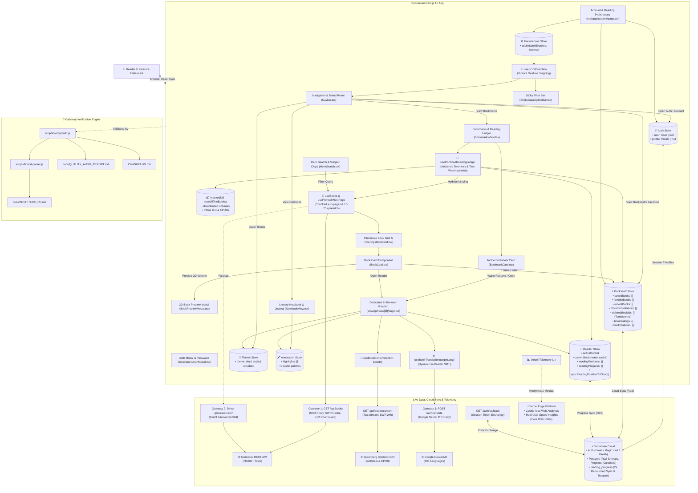
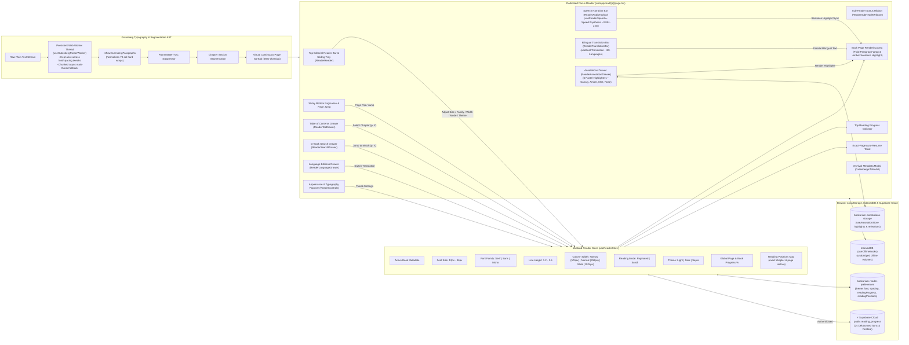
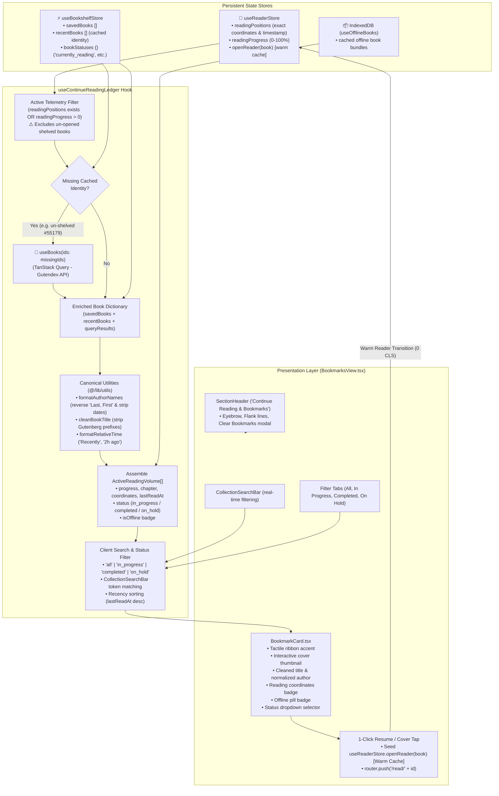

# Bookarium — 100% Legal Public Domain Library & Reader

> **Pure Literature. Zero Paywalls. Zero API Keys Required.**

[](https://antigravity.google)
[](https://github.com/calin-m/Bookarium/actions/workflows/ci.yml)
[-black?style=flat-square&logo=next.js)](https://nextjs.org/)
[](https://react.dev/)
[](https://www.typescriptlang.org/)
[](https://tailwindcss.com/)
[](public/sw.js)
[](https://supabase.com/)
[](https://vercel.com/)
[](docs/QUALITY_AUDIT_REPORT.md)
[](docs/QUALITY_AUDIT_REPORT.md)
[](docs/QUALITY_AUDIT_REPORT.md)
[](ROADMAP.md)
[](LICENSE)

---

An ultra-refined, high-performance web application for discovering, reading, and downloading 100% legal, public domain books (Zero-Copyright / CC0 / Gutenberg Public Domain). Built with **Next.js 16 App Router**, **Supabase Auth & Cloud Synchronization**, **TanStack React Query**, **Zustand offline-first persistence**, **Tailwind CSS**, **Framer Motion**, developed with **[Google AI / Antigravity](https://antigravity.google)**, and verified by a deterministic **7-Gateway Quality Engine**.

---

## 🎨 Design Inspiration & Aesthetic Philosophy

Bookarium's visual identity and tactile layout are deeply inspired by classical editorial typography, archival letterpress printing, and modern Figma bookstore design systems:

* **Figma Editorial Concept**: Inspired by the minimalist elegance of curated bookstore layouts, specifically referencing the [Booksaw — Bookstore E-Commerce Website Design Template](https://www.figma.com/community/file/1521831984874247291/booksaw-bookstore-ecommerce-website-design-template) on the Figma Community.
* **Open-Book Skeuomorphic Details**: Custom open-book card spreads with subtle center spine creases (`.book-center-crease`), realistic paper texture shadows (`shadow-booksaw`), and page depth elevation.
* **Warm Editorial Palettes & 100% Solid Surfaces**:
  * **Day / Standard**: Crisp cream-paper tones (`#fcfbf9`, `#ffffff`) with rich obsidian ink typography and 100% solid, non-transparent surfaces.
  * **Sepia / Cozy Coffee (Warm Midtone)**: Warm roasted espresso and cafe mocha tones (`#2b1d16`, `#3c281e`, `#332219`) with steamed milk cream typography (`#fef6eb`) and warm caramel amber accents (`#f59e0b`) for eye comfort in ambient evening light.
  * **Dark Mode**: High-contrast slate obsidian canvas (`#0e1117`, `#161b26`) preserving focus in low-light settings.
* **Refined Typography**: Pairings of classic literary serifs, clean sans-serifs, and monospace archival metadata accents.

---

<!-- BEGIN:latest-release -->
## 🛠️ Latest Improvements (v1.9.5)

- **Multi-Device Deletion Tombstones (`useBookshelfStore.ts`)**: Integrated `deletedBookIds` tombstone tracking to prevent deleted bookshelf volumes from being resurrected as ghost items during cross-device Supabase cloud reconciliation.
- **Cross-Device Cloud Reading Progress Sync (`useReaderStore.ts`, `useReaderSession.ts`)**: 2000ms debounced upsert to Supabase `public.reading_progress` table with automatic reading coordinate restoration when resuming sessions on new devices, strictly gated for authenticated accounts with 0ms/zero-network guest mode.
- **Persistent Gutenberg Parser Worker (`useGutenbergParserWorker.ts`)**: Maintained a single long-lived Web Worker instance across typography, font scaling, and line spacing adjustments, eliminating worker churn and UI thread freezes with non-blocking async fallback.
- **Selection-Safe Touch Gestures (`useReaderGestures.ts`)**: Suppressed horizontal swipe navigation when active DOM text selection exists or touch starts inside an active modal/popover, preventing accidental page turns during passage highlighting.
- **Ghost Volume Resurrection**: Resolved issue where deleting a book on one client could be overwritten and resurrected upon syncing with cloud storage.

> 📖 **Complete Historical Ledger**: For full chronological release notes, breaking changes, and migration details across all versions, see [**`CHANGELOG.md`**](CHANGELOG.md).
<!-- END:latest-release -->

---

## 🌐 Data Sources & Infrastructure

Bookarium runs on an open, decentralized architecture requiring **Zero Paid Developer Keys**:

| Service / Source | Endpoint / Provider | Description & Usage |
|---|---|---|
| **Gutendex REST API** | [`gutendex.com`](https://gutendex.com/) • [`GitHub`](https://github.com/garethbjohnson/gutendex) | Open-source JSON Web API created by [Gareth B. Johnson](https://github.com/garethbjohnson/gutendex) indexing over 70,000+ Project Gutenberg public domain titles. Provides search, topic filters, author timelines, download metrics, and metadata with strict `copyright=false` filtering. |
| **Project Gutenberg CDN** | [`gutenberg.org`](https://www.gutenberg.org/) | Direct content delivery network providing unabridged plain text (`.txt`), official EPUB packages (`.epub.images`, `.epub.noimages`), Kindle/MOBI formats, and web-ready HTML. |
| **Supabase (Auth & Postgres)** | [`supabase.com`](https://supabase.com/) | Optional cloud authentication and PostgreSQL synchronization for custom bookshelves and reading progress using Row Level Security (RLS). |
| **Vercel Edge Platform** | [`vercel.com`](https://vercel.com/) | High-performance edge deployment, dynamic SSR route handlers, zero-config production caching, global CDN delivery, and cookie-less aggregate performance telemetry (Vercel Web Analytics & Speed Insights). |
| **Public Domain Archive Proxy** | `/api/books` & `/api/books/content` | Next.js server-side route proxies providing caching, CORS handling, query length validation (protecting upstream servers from 1-character scans), and guaranteed public domain integrity before client delivery. |

---

## 🎯 Key Features & Capabilities

Bookarium delivers an archival-grade, high-performance reading environment organized across four foundational pillars:

### 1. 🎨 Tactile Editorial Design & 3D Book Physics
* **Booksaw Editorial Aesthetic**: Classical typography inspired by fine art bookstore catalogues, featuring open-book card spreads with center spine creases, realistic paper shadows, and 100% solid non-transparent surfaces across Day (`#fcfbf9`), Cozy Coffee Sepia (`#2b1d16`), and Dark Obsidian (`#0e1117`) themes.
* **Hourly Rotating 3D Featured Book**: Curated pool of iconic public domain classics rotated every UTC hour with zero-cron deterministic synchronization.
  * **Interactive Open-Cover Physics**: On desktop hover, the hardbound volume smoothly elevates and opens 180° on its spine hinge, displaying opening reflections on the Left Page and notable excerpts on the Right Page. Clicking pins the volume open or closed.
  * **Physical 60–120 FPS Page Turn**: Shuffling passages flips a physical 3D leaf across the spine with synchronized ink reveals.
* **Interactive 3D Book Preview Modal**: Clicking or tapping any book card cover launches a 3D hardcover preview modal with fluid FLIP geometry transitions, subpixel return landing, chapter shuffling, and 1-click reader handoff.
* **Studio Bookshelf Bookcase**: Hardwood shelf alcove with 8 authentic spine binding colorways (Oxblood, Navy, Emerald, Saddle, Plum, Charcoal, Teal, Espresso), convex specular curvature, gilded lettering, and pull-forward hover scaling.
* **Directional Stepped Scroll Navigation**: Dynamic scroll detection (`useScrollDirection`) smoothly hides the top header on scroll down, docks the catalog filter toolbar to `top-0`, and instantly reveals navigation on upward scroll gestures. Configurable in Account Settings between **Smart Auto-Hide** and **Always Fixed**.
* **Responsive Filter Drawer & Push-Content Layout**: Persistent left-docked drawer on desktop & ultrawide viewports (≥ 1280px / `xl:`) shifting main content to the right (`xl:pl-96`) for non-blocking catalog browsing; smoothly adapts to a focused slide-out overlay with soft backdrop blur (`backdrop-blur-xs`) on laptops, vertical monitors, and mobile devices—guaranteeing 100% unclipped facet typography with zero text truncation.
* **Streamlined Single-Row Sticky Catalog Toolbar**: Ultra-compact ~44px mobile toolbar unifying search filter triggers, real-time API health status, view mode toggling (Grid vs. Spine Shelf), and deep-archive pagination in a single horizontal row, maximizing vertical screen real estate for book covers.
* **Windowed Chunk Sub-Pagination & Predictive Prefetching**: Seamlessly reconciles upstream API batching with responsive client layouts by sub-slicing Gutendex's native 32-volume cache into viewport-optimized pages (8 books/page on mobile `grid-cols-2`, 16 books/page on desktop `md:grid-cols-4`). Sub-page turns execute in 0ms directly from client memory without network delay. A widened predictive prefetch buffer triggers background loading on Sub-page 3 (mobile) or Sub-page 1 (desktop), providing a 15–25 second network lead time before reaching batch boundaries.
* **Explicit Catalog Search Activation & 2-Character Guardrail**: Replaced keystroke debouncing with intentional search submission (<kbd>Enter</kbd> or clicking "Search") to eliminate redundant API spam against public upstream servers. Enforces a client-side and server-side 2-character minimum guardrail with accessible inline validation (`aria-live="polite"`), preventing heavy 1-character full-table scans while fully permitting classical two-character literary titles (*It*, *Oz*, *Up*, *Po*).

### 2. 📖 Dedicated Focus Reader & Typography Engine
* **Unabridged Reading Canvas (`/read/[id]`)**: Full-screen, distraction-free reading with exact chapter and page coordinate auto-resume toasts and 1-click restart option.
* **Gutenberg Paragraph Reflow Engine**: Normalizes legacy 70-character hard linebreaks into fluid prose across Narrow (`576px`), Normal (`768px`), and Wide (`1024px`) layouts while preserving double-spaced paragraphs, dialogue, and indented poetry.
* **Granular Typography Popover (`Aa`)**: Real-time font sizing (12px–36px) and dynamic line height (1.2–2.6) with 1-click presets (`14px / 18px / 24px` and `1.4 / 1.8 / 2.2`), font family selection (Serif, Sans, Mono), and reading mode toggling (Paginated / Scroll).
* **Mobile Pinch-to-Zoom Scaling**: Two-finger pinch gestures adjust font sizing with a transient HUD size badge.
* **Global Sentence-Snapped Virtual Pagination**: Virtual page engine with a 500-entry memory LRU cache for instant sub-millisecond virtual page turns without redundant calculation.
* **Integrated Reading Drawers**:
  * **Table of Contents (`ReaderTocDrawer`)**: Instant chapter navigation with live start-page badges, read-time estimates, and front-matter anthology story detection.
  * **In-Book Search (`ReaderSearchDrawer`)**: Real-time regex scanner across the unabridged volume with highlighted matches (`<mark>`), chapter grouping, match counters, and keyboard shortcut invocation (`Ctrl+F` / `/`).
  * **Language Editions (`ReaderLanguageDrawer`)**: Discovers authentic foreign language Gutenberg editions and translations with 1-click reading handoff.
* **Persistent Web Worker Lifecycle**: Single long-lived Web Worker (`useGutenbergParserWorker`) retained across typography tweaks, eliminating UI thread lag with non-blocking async fallback.

### 3. 🌐 Universal Languages, AI Translation & Neural Narration
* **Catalog & Archive Filtering (12 Primary Languages)**: Full catalog search and facet filtering across English, French, German, Spanish, Italian, Latin, Ancient & Modern Greek, Portuguese, Dutch, Russian, Chinese, and Romanian via the unified `<LanguageSelector />`.
* **On-Demand Dynamic AI Translation (40+ Languages)**: In-reader on-the-fly translation via a zero-key serverless Google Neural Machine Translation proxy (`/api/translate`) featuring 18 popular language quick-chips.
  * **Offline Page-Level Caching**: Every translated page is automatically cached in browser storage for instant zero-latency transitions on re-read.
  * **Bilingual Parallel Reading Mode**: Displays translated paragraphs side-by-side with original authentic sentences for comparative study and language learning.
* **Synchronized Neural Voice Read-Aloud (Text-to-Speech)**: Offline-first narration (`window.speechSynthesis`) with automatic original/translated language-voice pairing, amber visual sentence highlight tracking, speed presets (0.85x–2.0x), sentence navigation, and OS-level MediaSession lockscreen controls.

### 4. ⚡ Offline-First Persistence, Cloud Sync & Data Sovereignty
* **Clean Path URL & Symmetric SSR Hydration Architecture**: Canonical routes (`/`, `/bookshelf`, `/favorites`, `/notebook`, `/bookmarks`) powered by Next.js server rewrites, client history synchronization, and symmetric `parseFiltersFromUrl` query parsing—guaranteeing identical server-rendered HTML and client hydration on deep paginated URLs (e.g. `?page=8`) with zero layout shift and 0 CLS.
* **Bookmarks & Continue Reading Ledger (`/bookmarks`)**: Dedicated reading ledger tracking active volumes with tactile bookmark cards, ribbon accents, live progress percentages, last-read coordinates, status filters (All, In Progress, Completed, On Hold), and 1-click chapter resume.
  * **Authentic Reading Telemetry**: Strictly enrolls volumes with active coordinates or progress, eliminating unopened placeholder clutter.
  * **Two-Way Dynamic Hydration**: Resolves un-shelved book identities via TanStack React Query and automatically pre-seeds warm reader state for instant 0ms transitions.
* **In-Reader Highlighting & Literary Commonplace Notebook (`/notebook`)**:
  * 4 editorial pastel highlighters (Canary Yellow, Vintage Amber, Calm Mint, Soft Rose) with coarse-pointer touch dismissal and chapter-scoped annotation drawer.
  * Comprehensive reading journal organizing highlighted excerpts, personal reflections, pastel color filters, full-text search, volume grouping, and 1-click academic citation copying.
* **Native IndexedDB Offline Book Storage**: Zero-dependency browser storage bypassing the 5MB `localStorage` limit, enabling readers to download entire books for offline reading in airplane mode.
* **Auto-Healing Cloud Sync & Deletion Tombstones**: Optional Supabase PostgreSQL cloud sync with Row Level Security (RLS). Persistent deletion tombstones (`deletedBookIds`) prevent zombie volumes from resurrecting during cross-device synchronization.
* **Bi-Directional Cloud Reading Progress**: 2000ms debounced upsert to `public.reading_progress`, restoring chapter and scroll coordinates across devices for authenticated accounts while remaining 0ms/zero-network for guest readers.
* **Full Data Sovereignty & Portability**: Single-click RFC 4180 CSV export and portable JSON backup (`src/lib/library-backup.ts`) with defensive schema validation and merge/replace restore strategies.
* **Zero-Tracking Privacy Architecture (`/privacy`)**: Zero third-party trackers, zero advertising beacons, cookie-less operation (Art. 5(3) exempt), privacy-first anonymous aggregate telemetry (Vercel Web Analytics & Speed Insights), and self-service account data deletion in User Settings (`/account`).

---

## 🏛️ System Architecture Diagrams

### 1. End-to-End System Context & Data Flow



---

### 2. Focus Reader State & Typography Engine



---

### 3. Bookmarks & Continue Reading Ledger Architecture



---

## ⚡ Quick Start

### Prerequisites
- **Node.js**: `>= 20.0.0` (Node 22 LTS recommended)
- **npm**: `>= 10.0.0`

### Environment Configuration (Optional - for Cloud Bookshelf Sync)
Create a `.env.local` file in the project root with your public Supabase project credentials:

```env
NEXT_PUBLIC_SUPABASE_URL=https://your-project-id.supabase.co
NEXT_PUBLIC_SUPABASE_ANON_KEY=your-supabase-anon-key
```

*(If no Supabase credentials are provided, Bookarium operates seamlessly in 100% offline-first mode using browser storage).*

---

## 🗄️ Supabase Cloud Database & Authentication Setup

Bookarium uses Supabase PostgreSQL for optional cloud authentication, cross-device bookshelf & favorites synchronization, and reading progress tracking. Follow these steps to provision your database in under 2 minutes:

### Step 1: Create a Free Supabase Project
1. Go to [supabase.com](https://supabase.com/) and create a new project.
2. Note your **Project URL** and **anon public API Key** from **Project Settings $\to$ API**.

### Step 2: Run Database Schema Script
1. In your Supabase Dashboard, open the **SQL Editor** from the left sidebar.
2. Click **New Query**, copy and paste the contents of [`supabase/schema.sql`](supabase/schema.sql), and click **Run**.
3. The script is **100% idempotent** and safely provisions all database tables, Row Level Security (RLS) policies, indexes, and triggers:

| Database Object | Type | Purpose & Security Governance |
|---|---|---|
| `public.profiles` | Table (RLS) | User display name, preferred theme, and typography preferences (auto-created on signup) |
| `public.bookshelves` | Table (RLS) | Master default 'General' shelf and custom user-created collection shelves |
| `public.bookshelf_items` | Table (RLS) | Volumes filed in specific bookshelves with uniqueness constraints |
| `public.user_favorites` | Table (RLS) | Cross-device synchronized favorited titles |
| `public.reading_progress` | Table (RLS) | Chapter coordinates, progress %, scroll offset, and cached volume metadata |
| `public.user_annotations` | Table (RLS) | Passage highlights (yellow, amber, mint, rose) and personal scholarly notes |
| `public.user_book_curation` | Table (RLS) | Personal 1–5 star ratings and reading status classification |
| `public.handle_new_user()` | Trigger | Automatically provisions profile and default General shelf on auth creation |
| `public.delete_current_user()` | RPC Function | Cascade user data erasure and complete self-service account deletion |

### Step 3: Configure Authentication Redirect URLs
1. In your Supabase Dashboard, navigate to **Authentication $\to$ URL Configuration**.
2. Set **Site URL** to:
   - `http://localhost:3000` (for local development) or `https://your-app.vercel.app` (for production)
3. Under **Redirect URLs**, add the following allowed callback endpoints:
   - `http://localhost:3000/auth/callback`
   - `http://localhost:3000/auth/confirm-deletion`
   - `http://localhost:3000/account`
   - `https://your-app.vercel.app/auth/callback`
   - `https://your-app.vercel.app/auth/confirm-deletion`
   - `https://your-app.vercel.app/account`

---

### Installation & Local Development

```bash
# 1. Clone the repository and install dependencies
npm install

# 2. Start local development server (automatically launches browser)
npm run dev:open

# 3. Or launch full development environment with background test watcher
npm run dev:all
```

The application will be accessible at [http://localhost:3000](http://localhost:3000).

### 🚀 Production Deployment on Vercel

Bookarium is architected for zero-config deployment on **[Vercel](https://vercel.com/)**:

1. Push your repository branch to GitHub.
2. Import the project into the [Vercel Dashboard](https://vercel.com/new).
3. Under **Environment Variables**, optionally set:
   * `NEXT_PUBLIC_SUPABASE_URL` = your Supabase project URL
   * `NEXT_PUBLIC_SUPABASE_ANON_KEY` = your Supabase public anon key
4. Click **Deploy** — Vercel will automatically build the Next.js 16 production bundle, configure edge caching, and provision serverless API proxies.
---

## 🔒 Enterprise Security & Resiliency Architecture

Bookarium implements a defense-in-depth security model across the edge, serverless runtime, and client layers:

| Security Vector | Implementation & File Path | Protection Mechanism |
|---|---|---|
| **Sliding-Window Rate Limiting** | [`src/lib/rate-limiter.ts`](src/lib/rate-limiter.ts) | Zero-dependency in-memory sliding-window rate limiter protecting upstream Project Gutenberg APIs (60 req/min on `/api/books`, 30 req/min on `/api/books/content`) with automatic 30s garbage collection, `X-RateLimit-*` headers, and `429 Too Many Requests` status with `Retry-After`. |
| **HTTP Security Headers** | [`next.config.ts`](next.config.ts) | Enforces HSTS (`max-age=63072000; includeSubDomains; preload`), Clickjacking defense (`X-Frame-Options: SAMEORIGIN`), MIME-type sniffing prevention (`X-Content-Type-Options: nosniff`), Referrer Policy (`strict-origin-when-cross-origin`), and Permissions Policy (`camera=(), microphone=(), geolocation=()`). |
| **SSRF & Path Traversal Immunity** | [`src/app/api/books/content/route.ts`](src/app/api/books/content/route.ts) | Upstream URL whitelisting (`isSafeUpstreamUrl`) restricting fetches strictly to official Project Gutenberg domains (`gutenberg.org`, `www.gutenberg.org`), strict numeric ID regex verification (`^\d{1,8}$`), and `redirect: 'manual'` preventing open redirect hops. |
| **Open Redirect Defense** | [`src/app/auth/callback/route.ts`](src/app/auth/callback/route.ts) | Path sanitization (`sanitizeRedirectPath`) guaranteeing OAuth and magic-link redirect paths strictly originate from trusted relative roots (`/^\/[^\/\\]/`) preventing off-site phishing redirects. |
| **ReDoS & Main Thread Protection** | [`src/lib/gutenberg-parser.ts`](src/lib/gutenberg-parser.ts) | Non-backtracking regular expressions (`[^\n]{0,80}`) and bounded passage analysis window (capped at 120,000 characters) eliminating regular expression denial of service (ReDoS) and event loop freezing on massive multi-megabyte classical tomes. |
| **LRU Pagination Memory Cache** | [`src/lib/gutenberg-parser.ts`](src/lib/gutenberg-parser.ts) | 500-entry memory cache (`Map<string, string[]>`) for paginated chapter views, delivering instant sub-millisecond virtual page turns with zero redundant recalculation. |
| **Relational Data Purge & Account Deletion** | [`src/stores/useAuthStore.ts`](src/stores/useAuthStore.ts) | Comprehensive cascading cleanup across PostgreSQL tables (`reading_progress`, `bookshelf_items`, `bookshelves`, `profiles`) with fallback RPC `delete_current_user` execution and session revocation. |
| **Datacenter Proximity & Edge Optimization** | [`vercel.json`](vercel.json) | Pins serverless execution to `iad1` (Washington D.C. / US-East) directly adjacent to Gutenberg/Gutendex nodes with dedicated memory and payload compression (`gzip, deflate, br`). |

---

## 🛠️ CLI Command Matrix

| Command | Action / Description |
|---|---|
| `npm run dev` | Starts Next.js development server at `http://localhost:3000` |
| `npm run dev:open` | Starts dev server and opens your default browser concurrently |
| `npm run dev:all` | Starts dev server, Vitest test watcher, and browser concurrently |
| `npm run verify` | **Runs the full 7-Gateway Quality Engine** before commits |
| `npm test` | Runs the full Vitest suite with V8 code coverage report |
| `npm run test:fast` | Runs Vitest test suites without coverage calculation for rapid developer validation |
| `npm run test:ui` | Launches Vitest interactive visual testing UI |
| `npm run test:watch` | Runs Vitest in reactive watch mode for TDD |
| `npm run typecheck` | Validates TypeScript types across all `.ts`/`.tsx` files |
| `npm run lint` | Runs ESLint 9 rules and Core Web Vitals checks |
| `npm run knip` | Audits repository for unused exports and dead dependencies |
| `npm run docs:sync` | Auto-generates `docs/ARCHITECTURE.md`, `CHANGELOG.md`, and `docs/QUALITY_AUDIT_REPORT.md` from source AST |
| `npm run adr:new -- "Title"` | Creates a new Architecture Decision Record in `docs/DECISIONS.md` |
| `npm run build` | Compiles optimized Next.js 16 production bundle |

---

## 🛡️ The 7-Gateway Quality Engine

The repository enforces a closed-loop quality verification engine before any release or commit:

```
+-----------------------------------------------------------------------------+
|                     7-GATEWAY CLOSED-LOOP VERIFICATION                      |
+-----------------------------------------------------------------------------+
| Pass 0.5 | Secret Scanner       | Checks repository files for exposed keys  |
| Pass 1   | TypeScript Engine    | Strict typecheck with 0 compile errors    |
| Pass 2   | Vitest Server Mocks  | Validates MSW v2 handlers and query hooks |
| Pass 3   | Vitest Client UI     | Unit & integration tests (>= 80% coverage)|
| Pass 4   | Living Docs Sync     | Auto-updates ARCHITECTURE, AUDIT, & CHANGE|
| Pass 5   | ADR Validation       | Validates DECISIONS.md sequential schema  |
| Pass 6   | Quality & Dead Code  | ESLint check and Knip unused code audit   |
| Pass 7   | Production Build     | Compiles Next.js production bundle        |
+-----------------------------------------------------------------------------+
```

🔒 **Pre-Commit Enforcement**: Any failure in Passes 0.5 through 7 immediately halts execution, outputs exact error telemetry, and automatically blocks the commit from being created.

---

## 📚 Living Documentation & Quality Assurance Matrix

| Document / Artifact | Scope & Verification Status | Live Resource Link |
|---|---|---|
| 📋 **Quality Audit & Test Suite Catalog** | 7-Gateway status summary, live coverage metrics, and complete index of all 945 tests across 120 test suites. | [`docs/QUALITY_AUDIT_REPORT.md`](docs/QUALITY_AUDIT_REPORT.md) |
| 📊 **CI/CD Quality Telemetry** | Machine-readable JSON summary of build metrics, test suites, and coverage passes. | [`docs/quality-audit-results.json`](docs/quality-audit-results.json) |
| 🏛️ **Living Architecture Matrix (C4)** | AST-driven component inventory, route handlers, Zustand state, and dependency graphs. | [`docs/ARCHITECTURE.md`](docs/ARCHITECTURE.md) |
| 🗺️ **Living Product Roadmap** | AST-verified roadmap with 0% drift, feature milestone tracking, and live progress metrics. | [`ROADMAP.md`](ROADMAP.md) |
| 📜 **Living Changelog** | Keep a Changelog 1.0.0 & SemVer release history across all milestones. | [`CHANGELOG.md`](CHANGELOG.md) |
| ⚖️ **Architecture Decision Records (ADRs)** | 15 validated ADRs (ADR-001 through ADR-015) governing zero-API keys, state architecture, and privacy telemetry. | [`docs/DECISIONS.md`](docs/DECISIONS.md) |
| 🔒 **Security Policy & Responsible Disclosure** | Supported versions, vulnerability reporting protocols, and architectural safeguards. | [`SECURITY.md`](SECURITY.md) |
| 🤝 **Contributor Guidelines** | Onboarding guide, local development quickstart, testing protocols, and conventional commits. | [`CONTRIBUTING.md`](CONTRIBUTING.md) |
| 🕊️ **Code of Conduct** | Contributor Covenant v2.1 standards for an inclusive, welcoming community. | [`CODE_OF_CONDUCT.md`](CODE_OF_CONDUCT.md) |
| 🚀 **CI/CD Pipeline Guide** | Developer runbook and pipeline execution workflows. | [`docs/PIPELINE_GUIDE.md`](docs/PIPELINE_GUIDE.md) |
| 🛠️ **Developer Maintenance Hub** | Local setup, environment configuration, and contributor commands. | [`DEVELOPMENT.md`](DEVELOPMENT.md) |

---

## 🙏 Acknowledgements & Open-Source Credits

* **[Google AI / Antigravity](https://antigravity.google)**: For powering the autonomous agentic engineering, architectural refactoring, and deterministic quality verification driving the development of this codebase.
* **[Project Gutenberg](https://www.gutenberg.org/)**: For pioneering the public domain digitization movement and preserving thousands of classic literary masterpieces for humanity.
* **[Gutendex by Gareth B. Johnson](https://github.com/garethbjohnson/gutendex)**: For creating and maintaining the high-performance, open-source RESTful JSON web API for Project Gutenberg metadata.
* **[Booksaw Bookstore Design Template (CC BY 4.0)](https://www.figma.com/community/file/1521831984874247291/booksaw-bookstore-ecommerce-website-design-template)**: For inspiring the warm, tactile bookstore aesthetic and skeuomorphic open-book layouts.

---

## ⚖️ License & Public Domain Notice

Licensed under the **MIT License**. All queried literature and book texts originate from **Project Gutenberg** and are in the **Public Domain** (Zero Copyright / CC0) in accordance with international public domain statutes.
