# Architecture Matrix & Living Technical Reference — Bookarium

> **Auto-Generated Living Architecture**: Programmatically compiled from Source AST via `scripts/lib/ast-parser.js` (Governance Rule 2).  
> **Last Synchronized**: `2026-09-10`  
> **Topology Health**: `165` Modules Analyzed • `533` Static Linkages • `0` Circular Dependencies • `0` Orphaned Modules

---

## 🏛️ System Architecture & Data Flow

Bookarium is built on a **100% Pure Live API Architecture** with real-time telemetry, zero local mock archives, and deterministic state isolation.

```mermaid
flowchart TD
    User["👤 Reader / Public Domain Scholar"]
    
    subgraph FrontendSPA ["Client SPA Layer (Next.js 16 App Router)"]
        Nav["Navbar.tsx\n(Brand Reset, View Switcher, Theme Cycler)"]
        Hero["HeroSearch.tsx\n(Dynamic 3D Rotating Spotlight & Search)"]
        Toolbar["StickyCatalogToolbar.tsx\n(0px Flush Header, Filters Toggle, Telemetry)"]
        FilterDrawer["AdvancedFilterDrawer.tsx\n(Left Push-Sidebar: Eras, Sort, Formats)"]
        
        subgraph Views ["Primary Application Views (/ & Edge Rewrites)"]
            Grid["Catalog View (/)\n(Editorial Card Grid & 3D Hardwood Shelf)"]
            ShelfView["Bookshelf View (/bookshelf)\n(Curated Library & Custom Named Shelves)"]
            FavView["Favorites View (/favorites)\n(Personal Masterworks Collection)"]
            MarksView["Bookmarks View (/bookmarks)\n(Tactile Reading Ledger & Telemetry)"]
            NoteView["Commonplace Notebook (/notebook)\n(Highlights, Reflections & Tags)"]
            AccView["Account Hub (/account)\n(Library Stats, Cloud Sync & JSON Backup)"]
            HabitsCard["AccountHabitsCard.tsx\n(Reading Streaks, Daily Progress, Annual Challenge)"]
            AccoladesCard["AccountAccoladesCard.tsx\n(Literary Honors, Showcase & Ex-Libris Bookplates)"]
            ReaderPage["Focus Reader Page (/read/[id])\n(Continuous Pagination, Subtitles, AST)"]
        end
        
        subgraph ReaderDrawers ["Portaled Mutual-Exclusion Dialogs (z-10000)"]
            TocDrawer["ReaderTocDrawer\n(Rich Subtitles & Page Numbers)"]
            SearchDrawer["ReaderSearchDrawer\n(In-Volume Live Text Search)"]
            ControlsDrawer["ReaderControls\n(Typography, Speech & Themes)"]
            LangDrawer["ReaderLanguageDrawer\n(International Editions Handoff)"]
            DownDrawer["DownloadDrawer\n(EPUB, MOBI, TXT Direct Streams)"]
        end
        
        subgraph StateStores ["Zustand Persistent State & Offline Engine"]
            StoreShelf[("⚡ useBookshelfStore\n(saved, likes, queue, history, shelves)")]
            StoreReader[("📖 useReaderStore\n(typography, progress map, coordinates)")]
            StoreTheme[("🎨 useThemeStore\n(day, sepia, obsidian)")]
            StoreAuth[("🔐 useAuthStore\n(session, cloud migration, profile)")]
            StorePref[("⚙️ usePreferencesStore\n(sticky scroll, layout choices)")]
            StoreAnnot[("🖍️ useAnnotationStore\n(pastel highlights, notes, tags)")]
            StoreHabits[("🔥 useHabitsStore\n(streak, 5m threshold, dual immersion, cloud)")]
            StoreAccolades[("🎖️ useAccoladesStore\n(accolades, showcase pinning, celebrations, cloud)")]
            StoreOffline[("📦 IndexedDB Engine\n(unabridged offline volume cache)")]
        end
        
        subgraph ReaderEngine ["Reader Runtime & Web Speech Subsystem"]
            SpeechHook["🔊 useReaderSpeech\n(SpeechSynthesis, Boundary Sync, Auto-Flip)"]
            TimerHook["⏱️ useReadingTimer\n(Dual Immersion: 2-min Idle Guard + TTS Audio Bypass)"]
            WorkerHook["⚙️ useGutenbergParserWorker\n(Persistent Worker Chapter AST)"]
            LedgerHook["🔖 useContinueReadingLedger\n(Two-Way Hydration & 0ms Resume)"]
            AnnotatorEngine["🖍️ reader-annotator.ts\n(Computational Interval Partitioning & Highlighter)"]
        end
        
        QueryBooks["🔄 useBooks & usePrefetchNextPage\n(Windowed Sub-Pages & Predictive Prefetch)"]
        QueryContent["🔄 useBookContent(url, bookId)\n(IndexedDB Check to CDN Stream)"]
        QueryTranslate["🌐 useBookTranslations\n(International Editions Aggregation)"]
        Telemetry["📊 Vercel Telemetry\n(Analytics & Speed Insights)"]
    end

    subgraph ServerLayer ["Next.js Edge Proxy & Telemetry Layer"]
        ProxyBooks["GET /api/books\n(SWR 120s Cache, Latency Tracking, Rate Limit)"]
        ProxyContent["GET /api/books/content\n(Unabridged Text Stream, Anti-SSRF, SWR 24h)"]
        ProxyTranslate["POST /api/translate\n(Neural MT Proxy, 40+ Languages)"]
        LayoutServer["Server Layout (/read/[id])\n(React.cache, ISR 24h, OpenGraph, JSON-LD)"]
    end

    subgraph UpstreamServices ["100% Public Domain & Cloud Infrastructure"]
        Gutendex["🌐 Gutendex Search API\n(70,000+ Zero-Copyright Volumes)"]
        GutenbergCDN["🌐 Project Gutenberg CDN\n(Official EPUB & Raw Plain-Text)"]
        GoogleNMT["🌐 Google Neural MT\n(Serverless AI Translation)"]
        SupabaseCloud[("⚡ Supabase Cloud\n(Postgres RLS: profiles, shelves, progress, habits, accolades)")]
        VercelEdge["⚡ Vercel Edge Platform\n(Cookie-less Analytics & Speed Insights)"]
    end

    User --> Nav
    User --> Hero
    User --> Toolbar
    Toolbar --> FilterDrawer
    Toolbar --> Grid
    Nav --> Views
    AccView --> HabitsCard
    AccView --> AccoladesCard
    
    Grid --> QueryBooks
    QueryBooks --> ProxyBooks
    ProxyBooks --> Gutendex
    QueryBooks -.->|Client Failover on 504| Gutendex
    
    ReaderPage --> QueryContent
    ReaderPage --> ReaderDrawers
    ReaderPage --> ReaderEngine
    ReaderPage --> TimerHook
    ReaderPage --> AnnotatorEngine
    AnnotatorEngine --> StoreAnnot
    QueryContent --> ProxyContent
    ProxyContent --> GutenbergCDN
    ReaderPage --> QueryTranslate
    QueryTranslate --> ProxyTranslate
    ProxyTranslate --> GoogleNMT
    
    Views --> StateStores
    HabitsCard --> StoreHabits
    AccoladesCard --> StoreAccolades
    TimerHook --> StoreHabits
    ReaderEngine --> StateStores
    StoreShelf -->|Cloud Sync via RLS| SupabaseCloud
    StoreReader -->|Progress Sync| SupabaseCloud
    StoreAuth -->|Session Auth| SupabaseCloud
    StoreHabits -->|Habits Sync via RLS| SupabaseCloud
    StoreAccolades -->|Accolades Sync via RLS| SupabaseCloud
    Telemetry -.->|Anonymous Metrics| VercelEdge
```

---

## 🧩 Component Catalog & Props Interface Matrix

Auto-extracted dynamically from **71 Production UI Components** using Babel AST:

| Component | Category | Exported Props Interface | Primary Props & Signals | Module Link |
| :--- | :--- | :--- | :--- | :--- |
| **`AccoladeCelebrationModal`** | Accolades | `AccoladeCelebrationModalProps` | `accolade`, `onDismiss` | [`src/components/accolades/AccoladeCelebrationModal.tsx`](src/components/accolades/AccoladeCelebrationModal.tsx) |
| **`ExLibrisBookplate`** | Accolades | `ExLibrisBookplateProps` | `definition`, `progress`, `onTogglePin`, `isPinningDisabled` | [`src/components/accolades/ExLibrisBookplate.tsx`](src/components/accolades/ExLibrisBookplate.tsx) |
| **`AccountAccoladesCard`** | Account | `AccountAccoladesCardProps` | `userId` | [`src/components/account/AccountAccoladesCard.tsx`](src/components/account/AccountAccoladesCard.tsx) |
| **`AccountDeleteModal`** | Account | `AccountDeleteModalProps` | `isOpen`, `onClose`, `userEmail`, `isSendingDeletionEmail`, `deletionEmailSent`, `deleteError`, `onRequestDeletion` | [`src/components/account/AccountDeleteModal.tsx`](src/components/account/AccountDeleteModal.tsx) |
| **`AccountHabitsCard`** | Account | `AccountHabitsCardProps` | `userId`, `completedBooksCount` | [`src/components/account/AccountHabitsCard.tsx`](src/components/account/AccountHabitsCard.tsx) |
| **`AccountIdentityCard`** | Account | `AccountIdentityCardProps` | `user`, `profile`, `formattedDate`, `displayName`, `onDisplayNameChange`, `onSaveProfile`, `isSaving`, `saveSuccess`, `saveError`, `onResendVerification`, `isResendingVerification`, `resendSuccess`, `resendError`, `resendCooldown` | [`src/components/account/AccountIdentityCard.tsx`](src/components/account/AccountIdentityCard.tsx) |
| **`AccountLibraryStats`** | Account | `AccountLibraryStatsProps` | `savedCount`, `favoriteCount`, `customShelvesCount`, `annotationCount`, `bookmarksCount`, `readingStreak` | [`src/components/account/AccountLibraryStats.tsx`](src/components/account/AccountLibraryStats.tsx) |
| **`AccountPreferencesSection`** | Account | `AccountPreferencesSectionProps` | `theme`, `onThemeChange`, `stickyScrollEnabled`, `onStickyScrollChange`, `speechRate`, `onSpeechRateChange`, `speechVoiceURI`, `onSpeechVoiceChange`, `speechAutoPageAdvance`, `onSpeechAutoPageAdvanceChange`, `speechHighlightEnabled`, `onSpeechHighlightEnabledChange`, `onResetSpeechPreferences`, `userId` | [`src/components/account/AccountPreferencesSection.tsx`](src/components/account/AccountPreferencesSection.tsx) |
| **`AccountPublicProfileSection`** | Account | `AccountPublicProfileSectionProps` | `user`, `profile`, `onUpdateProfile` | [`src/components/account/AccountPublicProfileSection.tsx`](src/components/account/AccountPublicProfileSection.tsx) |
| **`AccountRestoreModal`** | Account | `AccountRestoreModalProps` | `isOpen`, `onClose`, `backupData`, `onRestore`, `isRestoring`, `restoreSuccess`, `restoreError` | [`src/components/account/AccountRestoreModal.tsx`](src/components/account/AccountRestoreModal.tsx) |
| **`AccountSecuritySection`** | Account | `AccountSecuritySectionProps` | `newPassword`, `confirmPassword`, `showPassword`, `copiedPassword`, `isUpdatingPassword`, `passwordSuccess`, `passwordError`, `strength`, `onNewPasswordChange`, `onConfirmPasswordChange`, `onToggleShowPassword`, `onGeneratePassword`, `onUpdatePassword`, `onSignOut`, `onOpenDeleteModal`, `userEmail` | [`src/components/account/AccountSecuritySection.tsx`](src/components/account/AccountSecuritySection.tsx) |
| **`AuthModal`** | Auth | _Autonomous_ | None (Self-Contained) | [`src/components/auth/AuthModal.tsx`](src/components/auth/AuthModal.tsx) |
| **`EmailSentView`** | Auth | `EmailSentViewProps` | `title`, `email`, `messagePrefix`, `subtitle`, `resendSuccess`, `onResend`, `isResending`, `resendCooldown`, `onBackToSignIn`, `backButtonLabel` | [`src/components/auth/EmailSentView.tsx`](src/components/auth/EmailSentView.tsx) |
| **`ReadingStatusSelector`** | Bookshelf | `ReadingStatusSelectorProps` | `status`, `onChange`, `size`, `showClear`, `className` | [`src/components/bookshelf/ReadingStatusSelector.tsx`](src/components/bookshelf/ReadingStatusSelector.tsx) |
| **`motion-config`** | Motion | _Autonomous_ | None (Self-Contained) | [`src/components/motion/motion-config.ts`](src/components/motion/motion-config.ts) |
| **`MotionReveal`** | Motion | `MotionRevealProps` | `children`, `delay`, `className` | [`src/components/motion/MotionReveal.tsx`](src/components/motion/MotionReveal.tsx) |
| **`StaggerGroup`** | Motion | `StaggerGroupProps` | `children`, `className` | [`src/components/motion/StaggerGroup.tsx`](src/components/motion/StaggerGroup.tsx) |
| **`AdvancedFilterDrawer`** | Presentation | `AdvancedFilterDrawerProps` | `isOpen`, `onClose`, `selectedEra`, `onEraChange`, `selectedSort`, `onSortChange`, `selectedTopic`, `onTopicChange`, `selectedLanguage`, `onLanguageChange`, `selectedFormat`, `onFormatChange`, `onResetAll`, `activeFilterCount` | [`src/components/presentation/AdvancedFilterDrawer.tsx`](src/components/presentation/AdvancedFilterDrawer.tsx) |
| **`BookCard`** | Presentation | `BookCardProps` | `book`, `onDownloadClick`, `onPreviewClick`, `isPreviewActive`, `activeView` | [`src/components/presentation/BookCard.tsx`](src/components/presentation/BookCard.tsx) |
| **`BookGrid`** | Presentation | `BookGridProps` | `books`, `isLoading`, `isError`, `onRetry`, `page`, `onPageChange`, `hasNextPage`, `onDownloadClick`, `onPreviewClick`, `activePreviewBookId`, `emptyTitle`, `emptyDescription`, `viewMode`, `onViewModeChange`, `initialViewMode`, `showViewToggle`, `onBrowseCatalog`, `searchQuery`, `onClearSearch`, `activeView` | [`src/components/presentation/BookGrid.tsx`](src/components/presentation/BookGrid.tsx) |
| **`BookmarkCard`** | Presentation | `BookmarkCardProps` | `volume`, `isOffline`, `onResume`, `onStatusChange`, `onClear` | [`src/components/presentation/BookmarkCard.tsx`](src/components/presentation/BookmarkCard.tsx) |
| **`BookmarksView`** | Presentation | `BookmarksViewProps` | `onBrowseCatalog` | [`src/components/presentation/BookmarksView.tsx`](src/components/presentation/BookmarksView.tsx) |
| **`BookPreviewModal`** | Presentation | `BookPreviewModalProps` | `book`, `originRect`, `isOpen`, `activeView`, `onWillClose`, `onClose`, `onReadBook` | [`src/components/presentation/BookPreviewModal.tsx`](src/components/presentation/BookPreviewModal.tsx) |
| **`BookshelfManageModals`** | Presentation | `BookshelfManageModalsProps` | `isCreatingShelf`, `newShelfName`, `newShelfIsPublic`, `onNewShelfNameChange`, `onNewShelfIsPublicChange`, `onCloseCreateShelf`, `onCreateShelf`, `editingShelfId`, `editingShelfName`, `editingShelfIsPublic`, `onEditingShelfNameChange`, `onEditingShelfIsPublicChange`, `onCloseRenameShelf`, `onRenameShelf`, `deletingShelfId`, `onCloseDeleteShelf`, `onDeleteShelf`, `isClearingOfflineShelf`, `onCloseClearOfflineShelf`, `onConfirmClearOfflineShelf`, `isSubmitting` | [`src/components/presentation/bookshelf/BookshelfManageModals.tsx`](src/components/presentation/bookshelf/BookshelfManageModals.tsx) |
| **`BookshelfMobileModal`** | Presentation | `BookshelfMobileModalProps` | `selectedMobileBook`, `isClosingMobileSheet`, `onClose`, `readingProgress`, `isSaved`, `isFavorite`, `isOffline`, `onToggleSave`, `onToggleFavorite`, `onToggleOffline`, `onBookClick`, `onDownloadClick`, `cloudBookshelves`, `cloudBookshelfItems`, `defaultShelfId`, `currentActiveShelfId`, `userId`, `onMoveBookToShelf`, `activeView`, `className` | [`src/components/presentation/bookshelf/BookshelfMobileModal.tsx`](src/components/presentation/bookshelf/BookshelfMobileModal.tsx) |
| **`BookshelfRack`** | Presentation | `BookshelfRackProps` | `books`, `onBookClick`, `onDownloadClick`, `onBrowseCatalog`, `searchQuery`, `onClearSearch` | [`src/components/presentation/BookshelfRack.tsx`](src/components/presentation/BookshelfRack.tsx) |
| **`BookshelfSpine`** | Presentation | `BookshelfSpineProps` | `book`, `bookIndex`, `readingProgress`, `isSaved`, `isFavorite`, `isOffline`, `onToggleSave`, `onToggleFavorite`, `onToggleOffline`, `onSpineClick`, `onBookClick`, `onDownloadClick`, `cloudBookshelves`, `cloudBookshelfItems`, `defaultShelfId`, `currentActiveShelfId`, `userId`, `onMoveBookToShelf` | [`src/components/presentation/bookshelf/BookshelfSpine.tsx`](src/components/presentation/bookshelf/BookshelfSpine.tsx) |
| **`CollectionSearchBar`** | Presentation | `CollectionSearchBarProps` | `query`, `onQueryChange`, `placeholder`, `mobilePlaceholder`, `totalCount`, `filteredCount`, `collectionName`, `className` | [`src/components/presentation/CollectionSearchBar.tsx`](src/components/presentation/CollectionSearchBar.tsx) |
| **`DownloadDrawer`** | Presentation | `DownloadDrawerProps` | `book`, `isOpen`, `onClose` | [`src/components/presentation/DownloadDrawer.tsx`](src/components/presentation/DownloadDrawer.tsx) |
| **`EditorialQuoteSection`** | Presentation | `EditorialQuoteSectionProps` | `heroBookId`, `className` | [`src/components/presentation/EditorialQuoteSection.tsx`](src/components/presentation/EditorialQuoteSection.tsx) |
| **`Footer`** | Presentation | _Autonomous_ | None (Self-Contained) | [`src/components/presentation/Footer.tsx`](src/components/presentation/Footer.tsx) |
| **`HeroFeaturedBook3D`** | Presentation | `HeroFeaturedBook3DProps` | `featuredBook`, `onReadFeaturedBook` | [`src/components/presentation/HeroFeaturedBook3D.tsx`](src/components/presentation/HeroFeaturedBook3D.tsx) |
| **`HeroSearch`** | Presentation | `HeroSearchProps` | `search`, `onSearchChange`, `onSearch`, `selectedTopic`, `onTopicChange`, `onTopicSelect`, `selectedLanguage`, `onLanguageChange`, `onReadFeaturedBook`, `featuredBook`, `books` | [`src/components/presentation/HeroSearch.tsx`](src/components/presentation/HeroSearch.tsx) |
| **`LanguageSelector`** | Presentation | `LanguageSelectorProps` | `value`, `onChange`, `variant`, `id`, `dataTestId`, `className`, `showIcon` | [`src/components/presentation/LanguageSelector.tsx`](src/components/presentation/LanguageSelector.tsx) |
| **`LiteraryQuotes`** | Presentation | _Autonomous_ | None (Self-Contained) | [`src/components/presentation/LiteraryQuotes.tsx`](src/components/presentation/LiteraryQuotes.tsx) |
| **`Navbar`** | Presentation | `NavbarProps` | `activeView`, `onViewChange`, `isVisible` | [`src/components/presentation/Navbar.tsx`](src/components/presentation/Navbar.tsx) |
| **`NotablePassagesSpread`** | Presentation | `NotablePassagesSpreadProps` | `passage` | [`src/components/presentation/NotablePassagesSpread.tsx`](src/components/presentation/NotablePassagesSpread.tsx) |
| **`NotebookQuoteCard`** | Presentation | `NotebookQuoteCardProps` | `annotation`, `bookTitle`, `bookAuthor`, `isEditing`, `onStartEdit`, `onCancelEdit`, `onSaveNote`, `onUpdateColor`, `onRequestDeleteReflection`, `onRequestDeleteAnnotation`, `onJumpToReader` | [`src/components/presentation/NotebookQuoteCard.tsx`](src/components/presentation/NotebookQuoteCard.tsx) |
| **`NotebookView`** | Presentation | `NotebookViewProps` | `onBrowseCatalog` | [`src/components/presentation/NotebookView.tsx`](src/components/presentation/NotebookView.tsx) |
| **`StickyCatalogToolbar`** | Presentation | `StickyCatalogToolbarProps` | `page`, `onPageChange`, `hasNextPage`, `viewMode`, `onViewModeChange`, `onOpenFilters`, `isFiltersOpen`, `activeFilterCount`, `activeFilterChips`, `onClearAllFilters`, `isFetching`, `onPrefetchNext`, `latencyMs`, `isError`, `pageSize`, `onPageSizeChange`, `isHeaderVisible`, `isVisible` | [`src/components/presentation/StickyCatalogToolbar.tsx`](src/components/presentation/StickyCatalogToolbar.tsx) |
| **`PinnedAccoladesShelf`** | Profile | `PinnedAccoladesShelfProps` | `pinnedItems` | [`src/components/profile/PinnedAccoladesShelf.tsx`](src/components/profile/PinnedAccoladesShelf.tsx) |
| **`PrivateProfileNotice`** | Profile | `PrivateProfileNoticeProps` | `username` | [`src/components/profile/PrivateProfileNotice.tsx`](src/components/profile/PrivateProfileNotice.tsx) |
| **`PublicProfileView`** | Profile | `PublicProfileViewProps` | `profile`, `pinnedAccolades`, `habits`, `bookshelves` | [`src/components/profile/PublicProfileView.tsx`](src/components/profile/PublicProfileView.tsx) |
| **`ServiceWorkerRegister`** | Pwa | _Autonomous_ | None (Self-Contained) | [`src/components/pwa/ServiceWorkerRegister.tsx`](src/components/pwa/ServiceWorkerRegister.tsx) |
| **`DeleteAnnotationModal`** | Reader | `DeleteAnnotationModalProps` | `isOpen`, `onClose`, `onConfirm`, `annotation`, `title`, `description` | [`src/components/reader/DeleteAnnotationModal.tsx`](src/components/reader/DeleteAnnotationModal.tsx) |
| **`GutenbergInfoModal`** | Reader | `GutenbergInfoModalProps` | `isOpen`, `onClose`, `bookId`, `title`, `author`, `theme` | [`src/components/reader/GutenbergInfoModal.tsx`](src/components/reader/GutenbergInfoModal.tsx) |
| **`QuoteDeletePreview`** | Reader | `QuoteDeletePreviewProps` | `selectedText`, `note` | [`src/components/reader/QuoteDeletePreview.tsx`](src/components/reader/QuoteDeletePreview.tsx) |
| **`ReaderAnnotationsDrawer`** | Reader | `ReaderAnnotationsDrawerProps` | `isOpen`, `onClose`, `annotations`, `bookTitle`, `theme`, `onJumpToAnnotation`, `onDeleteAnnotation`, `onUpdateNote` | [`src/components/reader/ReaderAnnotationsDrawer.tsx`](src/components/reader/ReaderAnnotationsDrawer.tsx) |
| **`ReaderControls`** | Reader | `ReaderControlsProps` | `isOpen`, `onClose`, `fontSize`, `onFontSizeChange`, `lineHeight`, `onLineHeightChange`, `fontFamily`, `onFontFamilyChange`, `theme`, `onThemeChange`, `readingMode`, `onReadingModeChange`, `columnWidth`, `onColumnWidthChange` | [`src/components/reader/ReaderControls.tsx`](src/components/reader/ReaderControls.tsx) |
| **`ReaderDrawerShell`** | Reader | `ReaderDrawerShellProps` | `isOpen`, `onClose`, `title`, `titleIcon`, `theme`, `children`, `ariaLabel`, `closeAriaLabel`, `backdropTestId`, `panelTestId`, `className`, `role` | [`src/components/reader/ReaderDrawerShell.tsx`](src/components/reader/ReaderDrawerShell.tsx) |
| **`ReaderErrorView`** | Reader | `ReaderErrorViewProps` | `activeTheme`, `onRetry` | [`src/components/reader/ReaderErrorView.tsx`](src/components/reader/ReaderErrorView.tsx) |
| **`ReaderFooter`** | Reader | `ReaderFooterProps` | `globalPage`, `totalBookPages`, `chapterTitle`, `chapterPage`, `chapterPageCount`, `onPrevPage`, `onNextPage`, `onPageJump`, `isPrevDisabled`, `isNextDisabled`, `readingMode`, `theme`, `currentChapterIndex`, `totalChapters`, `onSelectChapter` | [`src/components/reader/ReaderFooter.tsx`](src/components/reader/ReaderFooter.tsx) |
| **`ReaderHeader`** | Reader | `ReaderHeaderProps` | `title`, `author`, `bookId`, `progress`, `onBack`, `isTocOpen`, `onToggleToc`, `isSearchOpen`, `onToggleSearch`, `isControlsOpen`, `onToggleControls`, `isTranslationsOpen`, `onToggleTranslations`, `isSpeechOpen`, `onToggleSpeech`, `isAnnotationsOpen`, `onToggleAnnotations`, `annotationsCount`, `theme`, `totalChapters`, `currentChapterIndex`, `onThemeChange`, `resumeNotice`, `onRestart`, `onDismissResume`, `translations`, `isTranslationsLoading`, `onSelectTranslation`, `dynamicTargetLanguage`, `displayMode` | [`src/components/reader/ReaderHeader.tsx`](src/components/reader/ReaderHeader.tsx) |
| **`ReaderLanguageDrawer`** | Reader | `ReaderLanguageDrawerProps` | `isOpen`, `onClose`, `translations`, `onSelectTranslation`, `theme`, `dynamicTargetLanguage`, `onSelectDynamicLanguage`, `displayMode`, `onSelectDisplayMode`, `isTranslating` | [`src/components/reader/ReaderLanguageDrawer.tsx`](src/components/reader/ReaderLanguageDrawer.tsx) |
| **`ReaderLoadingView`** | Reader | `ReaderLoadingViewProps` | `activeTheme` | [`src/components/reader/ReaderLoadingView.tsx`](src/components/reader/ReaderLoadingView.tsx) |
| **`ReaderSearchDrawer`** | Reader | `ReaderSearchDrawerProps` | `isOpen`, `onClose`, `chapters`, `fontSize`, `onSelectMatch`, `bookTitle`, `theme` | [`src/components/reader/ReaderSearchDrawer.tsx`](src/components/reader/ReaderSearchDrawer.tsx) |
| **`ReaderSpeechBar`** | Reader | `ReaderSpeechBarProps` | `speech`, `isOpen`, `onClose`, `isPlaying`, `isPaused`, `currentSentenceIndex`, `totalSentences`, `rate`, `availableVoices`, `naturalVoices`, `standardVoices`, `selectedVoice`, `onPlay`, `onPause`, `onResume`, `onSkipNext`, `onSkipPrev`, `onRateChange`, `onVoiceChange`, `theme`, `bookTitle`, `currentPage`, `totalPages`, `isPrevDisabled`, `isNextDisabled` | [`src/components/reader/ReaderSpeechBar.tsx`](src/components/reader/ReaderSpeechBar.tsx) |
| **`ReaderSubHeaderRibbon`** | Reader | `ReaderSubHeaderRibbonProps` | `bookId`, `progress`, `totalChapters`, `currentChapterIndex`, `theme`, `resumeNotice`, `onRestart`, `onDismissResume`, `onOpenInfoModal` | [`src/components/reader/ReaderSubHeaderRibbon.tsx`](src/components/reader/ReaderSubHeaderRibbon.tsx) |
| **`ReaderSurface`** | Reader | `ReaderSurfaceProps` | `theme`, `fontFamily`, `fontSize`, `lineHeight`, `columnWidth`, `readingMode`, `chapter`, `currentPageText`, `chapterPage`, `activeChapterIndex`, `totalChapters`, `isLoading`, `isError`, `onRetry`, `bookTitle`, `bookAuthor`, `onPreviousPage`, `onNextPage`, `onFontSizeChange`, `highlightedSentence`, `translationSegments`, `translatedText`, `displayMode`, `isTranslating`, `annotations`, `onSelectAnnotation`, `onTextSelected` | [`src/components/reader/ReaderSurface.tsx`](src/components/reader/ReaderSurface.tsx) |
| **`ReaderTocDrawer`** | Reader | `ReaderTocDrawerProps` | `isOpen`, `onClose`, `chapters`, `activeChapterIndex`, `onSelectChapter`, `bookTitle`, `theme` | [`src/components/reader/ReaderTocDrawer.tsx`](src/components/reader/ReaderTocDrawer.tsx) |
| **`TextHighlightPopover`** | Reader | `TextHighlightPopoverProps` | `isOpen`, `selectedText`, `position`, `activeColor`, `existingNote`, `existingAnnotationId`, `onSelectColor`, `onSaveNote`, `onDelete`, `onCopyQuote`, `onClose`, `theme` | [`src/components/reader/TextHighlightPopover.tsx`](src/components/reader/TextHighlightPopover.tsx) |
| **`BackToTop`** | Ui | `BackToTopProps` | `threshold`, `className` | [`src/components/ui/BackToTop.tsx`](src/components/ui/BackToTop.tsx) |
| **`Badge`** | Ui | `BadgeProps` | `variant`, `size` | [`src/components/ui/Badge.tsx`](src/components/ui/Badge.tsx) |
| **`Button`** | Ui | _Autonomous_ | None (Self-Contained) | [`src/components/ui/Button.tsx`](src/components/ui/Button.tsx) |
| **`Card`** | Ui | `CardProps` | `variant` | [`src/components/ui/Card.tsx`](src/components/ui/Card.tsx) |
| **`CursorTooltip`** | Ui | `CursorTooltipProps` | `isVisible`, `mousePos`, `offset`, `children`, `className`, `testId` | [`src/components/ui/CursorTooltip.tsx`](src/components/ui/CursorTooltip.tsx) |
| **`Input`** | Ui | `InputProps` | `icon`, `onClear` | [`src/components/ui/Input.tsx`](src/components/ui/Input.tsx) |
| **`Modal`** | Ui | `ModalProps` | `isOpen`, `onClose`, `title`, `children`, `className`, `maxWidth`, `showCloseButton`, `backdropTestId`, `testId` | [`src/components/ui/Modal.tsx`](src/components/ui/Modal.tsx) |
| **`PasswordStrengthMeter`** | Ui | `PasswordStrengthMeterProps` | `strength`, `className` | [`src/components/ui/PasswordStrengthMeter.tsx`](src/components/ui/PasswordStrengthMeter.tsx) |
| **`SectionHeader`** | Ui | `SectionHeaderProps` | `eyebrow`, `title`, `subtitle`, `titleAs`, `showFlankLines`, `className`, `titleClassName`, `children` | [`src/components/ui/SectionHeader.tsx`](src/components/ui/SectionHeader.tsx) |
| **`StarRating`** | Ui | `StarRatingProps` | `value`, `onChange`, `size`, `readOnly`, `showLabel`, `className` | [`src/components/ui/StarRating.tsx`](src/components/ui/StarRating.tsx) |

---

## ⚡ State Management & Store Architecture

Zustand client-side state stores programmatically verified across **8 Persistent Modules**:

### 1. `useAccoladesStore` ([`src/stores/useAccoladesStore.ts`](src/stores/useAccoladesStore.ts))
* **Storage Key**: `STORAGE_KEYS.ACCOLADES` (localStorage)
* **Role & State**: Deterministic literary accolades evaluation, celebration queues, personal showcase pinning (max 3 bookplates), and bi-directional Supabase cloud synchronization.

### 2. `useAnnotationStore` ([`src/stores/useAnnotationStore.ts`](src/stores/useAnnotationStore.ts))
* **Storage Key**: `STORAGE_KEYS.ANNOTATIONS` (localStorage)
* **Role & State**: Scholar marginalia, categorical pastel highlights (Amber, Emerald, Rose, Sky, Violet), reflections, tags, and commonplace book exports.

### 3. `useAuthStore` ([`src/stores/useAuthStore.ts`](src/stores/useAuthStore.ts))
* **Storage Key**: `bookarium-auth-profile` (localStorage)
* **Role & State**: Supabase session authentication, guest status, password generation, and cloud profile synchronization.

### 4. `useBookshelfStore` ([`src/stores/useBookshelfStore.ts`](src/stores/useBookshelfStore.ts))
* **Storage Key**: `General` (localStorage)
* **Role & State**: Personal library collections, reading queue, reading history, custom named shelves, deletion tombstones, and ratings.

### 5. `useHabitsStore` ([`src/stores/useHabitsStore.ts`](src/stores/useHabitsStore.ts))
* **Storage Key**: `STORAGE_KEYS.HABITS` (localStorage)
* **Role & State**: Reading streaks with 5-minute active immersion threshold, daily calendar activity dates, annual volume challenge goals, dual immersion telemetry (reading vs listening), and multi-device Supabase cloud synchronization.

### 6. `usePreferencesStore` ([`src/stores/usePreferencesStore.ts`](src/stores/usePreferencesStore.ts))
* **Storage Key**: `STORAGE_KEYS.PREFERENCES` (localStorage)
* **Role & State**: Reader display choices, sticky header auto-hide preferences, and navigation behaviors.

### 7. `useReaderStore` ([`src/stores/useReaderStore.ts`](src/stores/useReaderStore.ts))
* **Storage Key**: `STORAGE_KEYS.READER_SETTINGS` (localStorage)
* **Role & State**: Active book payload, typography settings (size, family, line height), reading mode (paginated vs scroll), and coordinates.

### 8. `useThemeStore` ([`src/stores/useThemeStore.ts`](src/stores/useThemeStore.ts))
* **Storage Key**: `STORAGE_KEYS.THEME` (localStorage)
* **Role & State**: Global application theme state (Day Paper, Sepia Parchment, Obsidian Dark) with immediate document class application.

---

## 🌐 API Routes, Query Hooks & Reader Engine

### 1. API Route Handlers (Edge Proxy & Telemetry)

| Endpoint / Route | Method(s) | Source File | Cache & Security Strategy | Upstream Target |
| :--- | :--- | :--- | :--- | :--- |
| **`/api/books`** | `GET` | [`src/app/api/books/route.ts`](src/app/api/books/route.ts) | `s-maxage=120, stale-while-revalidate=600` • Sliding-Window Rate Limit | `https://gutendex.com/books/` |
| **`/api/books/content`** | `GET` | [`src/app/api/books/content/route.ts`](src/app/api/books/content/route.ts) | `s-maxage=86400, stale-while-revalidate=604800` • Anti-SSRF Allowlist | `https://www.gutenberg.org/cache/epub/{id}/pg{id}.txt` |
| **`/api/translate`** | `POST` | [`src/app/api/translate/route.ts`](src/app/api/translate/route.ts) | Serverless Neural MT Proxy • 40+ Languages | Google Neural Machine Translation |

### 2. Custom Hooks (Data Queries & Reader Subsystems)

| Hook Name | Subsystem / Layer | Source File | Architectural Responsibility |
| :--- | :--- | :--- | :--- |
| **`useBookPassageShuffle`** | Hooks | [`src/hooks/useBookPassageShuffle.ts`](src/hooks/useBookPassageShuffle.ts) | Autonomous literary quote selection and multi-chapter shuffle engine. |
| **`useCatalogFilters`** | Hooks | [`src/hooks/useCatalogFilters.ts`](src/hooks/useCatalogFilters.ts) | Catalog filter state URL parameter binding, debounce, and query synchronization. |
| **`useCursorTooltip`** | Hooks | [`src/hooks/useCursorTooltip.ts`](src/hooks/useCursorTooltip.ts) | Adaptive unconstrained cursor tooltips for interactive bookshelf elements. |
| **`useHasMounted`** | Hooks | [`src/hooks/useHasMounted.ts`](src/hooks/useHasMounted.ts) | SSR hydration barrier hook preventing client-server markup mismatches. |
| **`useMobileViewSwipe`** | Hooks | [`src/hooks/useMobileViewSwipe.ts`](src/hooks/useMobileViewSwipe.ts) | Application custom hook. |
| **`useOfflineBooks`** | Hooks | [`src/hooks/useOfflineBooks.ts`](src/hooks/useOfflineBooks.ts) | IndexedDB cache enumeration and local offline book deletion management. |
| **`usePerformanceTier`** | Hooks | [`src/hooks/usePerformanceTier.ts`](src/hooks/usePerformanceTier.ts) | Hardware concurrency and memory heuristic detection for fluid 60fps animations. |
| **`useReadingTimer`** | Hooks | [`src/hooks/useReadingTimer.ts`](src/hooks/useReadingTimer.ts) | Reader session telemetry tracking visual reading with 2-minute idle guard and TTS narration audio bypass. |
| **`useScrollDirection`** | Hooks | [`src/hooks/useScrollDirection.ts`](src/hooks/useScrollDirection.ts) | Stepped directional scroll detection with user auto-hide preference persistence. |
| **`useBookContent`** | Queries | [`src/hooks/queries/useBookContent.ts`](src/hooks/queries/useBookContent.ts) | TanStack Query fetching book plain text with IndexedDB offline-first check. |
| **`useBooks`** | Queries | [`src/hooks/queries/useBooks.ts`](src/hooks/queries/useBooks.ts) | TanStack Query fetching catalog volumes with sub-pagination and client failover. |
| **`useBookTranslations`** | Queries | [`src/hooks/queries/useBookTranslations.ts`](src/hooks/queries/useBookTranslations.ts) | TanStack Query aggregating international language translations and editions. |
| **`usePageTranslation`** | Queries | [`src/hooks/queries/usePageTranslation.ts`](src/hooks/queries/usePageTranslation.ts) | On-demand page-level dynamic neural translation caching. |
| **`useContinueReadingLedger`** | Reader | [`src/hooks/reader/useContinueReadingLedger.ts`](src/hooks/reader/useContinueReadingLedger.ts) | Headless continue reading ledger with authentic telemetry enrollment and query hydration. |
| **`useGutenbergParserWorker`** | Reader | [`src/hooks/reader/useGutenbergParserWorker.ts`](src/hooks/reader/useGutenbergParserWorker.ts) | Persistent Web Worker chapter segmentation and layout pagination calculations. |
| **`useReaderDrawers`** | Reader | [`src/hooks/reader/useReaderDrawers.ts`](src/hooks/reader/useReaderDrawers.ts) | Mutual exclusivity coordination for in-reader tool drawers and modals. |
| **`useReaderGestures`** | Reader | [`src/hooks/reader/useReaderGestures.ts`](src/hooks/reader/useReaderGestures.ts) | Touch swipe detection, keyboard shortcuts, and selection gesture conflict guards. |
| **`useReaderSession`** | Reader | [`src/hooks/reader/useReaderSession.ts`](src/hooks/reader/useReaderSession.ts) | Reading coordinates restoration, resume ribbons, and cloud session synchronization. |
| **`useReaderSpeech`** | Reader | [`src/hooks/reader/useReaderSpeech.ts`](src/hooks/reader/useReaderSpeech.ts) | Browser-native Web Speech synthesis with boundary word highlighting and auto-flip. |

---

## 🧠 Domain Engines & Pure Computational Utilities

Pure business logic, historical engines, and layout algorithms verified across **27 Domain Modules** using Babel AST:

| Engine / Utility | Subsystem / Layer | Source File | Primary Exported Primitives | Architectural Responsibility |
| :--- | :--- | :--- | :--- | :--- |
| **`accolades-engine`** | Core Domain | [`src/lib/accolades-engine.ts`](src/lib/accolades-engine.ts) | `determineBookEra`, `isAncientBook`, `BuildAccoladeContextParams`, `buildAccoladeContext`, `getAccoladeById` _(+2 more)_ | Historical literary accolades evaluation engine, criteria matching, milestone progress calculation, and era determination. |
| **`book.adapter`** | Adapters | [`src/lib/adapters/book.adapter.ts`](src/lib/adapters/book.adapter.ts) | `normalizeAuthorName`, `extractFormatUrl`, `isCanonicalBook`, `toCanonicalBook`, `CloudBookRow` _(+5 more)_ | Bidirectional domain transformation between Gutendex API schemas, canonical Book models, and Supabase cloud persistence payloads. |
| **`api-utils`** | Core Domain | [`src/lib/api-utils.ts`](src/lib/api-utils.ts) | `RateLimitInfo`, `getClientIp`, `createRateLimitErrorResponse` | Server-side API route helpers, IP address extraction, and standardized rate limit error response generation. |
| **`book-metadata`** | Core Domain | [`src/lib/book-metadata.ts`](src/lib/book-metadata.ts) | `ResolvedBookIdentity`, `ResolveBookMetadataParams`, `cleanBookTitle`, `isPlaceholderAuthor`, `isPlaceholderTitle` _(+1 more)_ | Author and title cleaning, placeholder author heuristics, and defensive editorial metadata normalization. |
| **`cache`** | Core Domain | [`src/lib/cache.ts`](src/lib/cache.ts) | `SimpleLRUCache` | Generic in-memory Least Recently Used (LRU) cache with bounded capacity and evictions. |
| **`gutenberg-parser`** | Core Domain | [`src/lib/gutenberg-parser.ts`](src/lib/gutenberg-parser.ts) | `* (./gutenberg)` | Root domain facade barrel re-exporting all Gutenberg segmentation, pagination, reflow, and passage extraction subsystems. |
| **`index`** | Gutenberg | [`src/lib/gutenberg/index.ts`](src/lib/gutenberg/index.ts) | `* (./types)`, `* (./reflow)`, `* (./pagination)`, `* (./metadata)`, `* (./segmentation)` _(+1 more)_ | Gutenberg subsystem barrel aggregating types, reflow, pagination, metadata, segmentation, and passage algorithms. |
| **`metadata`** | Gutenberg | [`src/lib/gutenberg/metadata.ts`](src/lib/gutenberg/metadata.ts) | `LANGUAGE_NAME_TO_CODE_MAP`, `normalizeLanguageToCode`, `extractGutenbergHeaderMetadata` | Gutenberg plain-text header/footer metadata extraction, author/title/language detection, and ISO code normalization. |
| **`pagination`** | Gutenberg | [`src/lib/gutenberg/pagination.ts`](src/lib/gutenberg/pagination.ts) | `clearPaginationCache`, `paginateChapterContent`, `getCharsPerPage`, `calculateReadingTime`, `calculateVolumePageSpread` | Continuous chapter pagination algorithms, character-per-page geometry calculations, and reading time estimation. |
| **`passages`** | Gutenberg | [`src/lib/gutenberg/passages.ts`](src/lib/gutenberg/passages.ts) | `extractDynamicBookPassages` | Dynamic book passage and quote extraction engine identifying compelling prose segments with dialogue and character markers. |
| **`reflow`** | Gutenberg | [`src/lib/gutenberg/reflow.ts`](src/lib/gutenberg/reflow.ts) | `reflowGutenbergParagraphs` | Typography text-reflow heuristics repairing Project Gutenberg hard line wraps and paragraph boundaries. |
| **`segmentation`** | Gutenberg | [`src/lib/gutenberg/segmentation.ts`](src/lib/gutenberg/segmentation.ts) | `parseGutenbergChapters` | Robust chapter and section boundary detection with Roman numeral, spelled-word, and structural heading patterns. |
| **`types`** | Gutenberg | [`src/lib/gutenberg/types.ts`](src/lib/gutenberg/types.ts) | `ChapterSection`, `GUTENBERG_PARSER_CONFIG`, `DynamicBookPassage` | Canonical TypeScript interfaces and configurations for the Project Gutenberg parsing engine and AST nodes. |
| **`in-book-search`** | Core Domain | [`src/lib/in-book-search.ts`](src/lib/in-book-search.ts) | `BookSearchMatch`, `InBookSearchResult`, `searchInBook` | Full-text in-volume search algorithm with context snippet generation and matched coordinate navigation. |
| **`library-backup`** | Core Domain | [`src/lib/library-backup.ts`](src/lib/library-backup.ts) | `LibraryBackupShelf`, `LibraryBackupPayload`, `ValidationResult`, `RestoreSummary`, `createLibraryBackup` _(+4 more)_ | Complete library export and import engine handling JSON backup schemas, CSV export, validation, and merge restoration. |
| **`offline-storage`** | Core Domain | [`src/lib/offline-storage.ts`](src/lib/offline-storage.ts) | `OfflineBookMetadata`, `StorageQuotaInfo`, `OfflineBookRecord`, `getStorageQuota`, `evictOldestBooksToFreeSpace` _(+7 more)_ | IndexedDB storage abstraction providing offline book content caching, quota calculation, and LRU eviction. |
| **`password`** | Core Domain | [`src/lib/password.ts`](src/lib/password.ts) | `PasswordStrength`, `generateStrongPassword`, `evaluatePasswordStrength` | Cryptographically secure password generation and multi-factor entropy evaluation engine. |
| **`rate-limiter`** | Core Domain | [`src/lib/rate-limiter.ts`](src/lib/rate-limiter.ts) | `RateLimitOptions`, `RateLimitResult`, `InMemoryRateLimiter`, `booksApiRateLimiter`, `bookContentRateLimiter` | In-memory sliding-window rate limiter with burst mitigation for API routes. |
| **`reader-annotator`** | Core Domain | [`src/lib/reader-annotator.ts`](src/lib/reader-annotator.ts) | `AnnotationSpan`, `computeAnnotationSpans` | Scholarly marginalia interval partitioning and non-destructive HTML text-node highlighter. |
| **`reading-analytics`** | Core Domain | [`src/lib/reading-analytics.ts`](src/lib/reading-analytics.ts) | `DayActivity`, `StreakStats`, `AnnualGoalProgress`, `ReadingSessionTelemetry`, `formatLocalDate` _(+3 more)_ | Streak calculation, 5-minute immersion thresholds, reading speed metrics, and annual reading goal progress. |
| **`smart-search`** | Core Domain | [`src/lib/smart-search.ts`](src/lib/smart-search.ts) | `normalizeSearchText`, `extractSearchTokens`, `matchesSmartSearch`, `getBookSearchHaystack`, `filterBooksSmart` | Fuzzy multi-token search engine querying titles, authors, and subjects with punctuation normalization. |
| **`speech-utils`** | Core Domain | [`src/lib/speech-utils.ts`](src/lib/speech-utils.ts) | `isNaturalVoice`, `cleanVoiceName` | Web Speech API voice selection heuristics identifying natural/neural synthesis voices. |
| **`client`** | Supabase | [`src/lib/supabase/client.ts`](src/lib/supabase/client.ts) | `sanitizeSupabaseUrl`, `createClient` | Browser-side Supabase client initialization with credential sanitization and local session persistence. |
| **`middleware`** | Supabase | [`src/lib/supabase/middleware.ts`](src/lib/supabase/middleware.ts) | `updateSession` | Next.js edge middleware helper managing Supabase auth tokens and cookie refresh cycles. |
| **`server`** | Supabase | [`src/lib/supabase/server.ts`](src/lib/supabase/server.ts) | `createClient` | Server-side Supabase client initialization using Next.js cookies for authenticated route handlers. |
| **`sync-utils`** | Core Domain | [`src/lib/sync-utils.ts`](src/lib/sync-utils.ts) | `CloudSyncable`, `syncAllStoresWithCloud` | Unified bidirectional cloud synchronization coordinator coordinating local Zustand stores with Supabase tables. |
| **`utils`** | Core Domain | [`src/lib/utils.ts`](src/lib/utils.ts) | `cn`, `BookFormatInfo`, `extractBookFormats`, `formatDownloadCount`, `calculateReadingTime` _(+7 more)_ | Core presentation utilities: Tailwind CSS class merging (clsx + twMerge), author formatting, format badges, and blob downloads. |

---

## 🗄️ Database Architecture & Row Level Security (RLS) Policies

Bookarium uses Supabase PostgreSQL for optional cloud synchronization, verified across **9 Database Tables** with strict Row Level Security (Rule 9):

| Table Name | RLS Governance | Client State Store | Domain Role & Security Description |
| :--- | :--- | :--- | :--- |
| **`public.profiles`** | Enabled (`auth.uid()`) | `useAuthStore` | User profile display name, theme preferences, and typography choices (auto-created on signup). |
| **`public.bookshelves`** | Enabled (`auth.uid()`) | `useBookshelfStore` | Default master "General" shelf and custom user-created named shelves. |
| **`public.bookshelf_items`** | Enabled (`auth.uid()`) | `useBookshelfStore` | Books filed in specific shelves with user-scoped uniqueness constraints. |
| **`public.user_favorites`** | Enabled (`auth.uid()`) | `useBookshelfStore` | Cross-device synchronized favorited titles. |
| **`public.reading_progress`** | Enabled (`auth.uid()`) | `useReaderStore` | Chapter index, progress %, scroll offsets, and cached volume metadata. |
| **`public.user_annotations`** | Enabled (`auth.uid()`) | `useAnnotationStore` | Passage text highlights (4 pastel palettes) and scholarly marginalia notes. |
| **`public.user_book_curation`** | Enabled (`auth.uid()`) | `useBookshelfStore` | Personal 1–5 star ratings and reading status classification. |
| **`public.user_reading_habits`** | Enabled (`auth.uid()`) | `useHabitsStore` | Reading streaks (5-min threshold), daily activity dates, annual challenge goals, and dual immersion telemetry. |
| **`public.user_accolades`** | Enabled (`auth.uid()`) | `useAccoladesStore` | Unlocked literary accolades, timestamps, showcase pinning, and personal bookplate metadata. |

---

## 📚 Curated Configurations & Design Token Registry

* **`FEATURED_HERO_BOOKS`** (`src/config/featured-books.ts`): 10 curated classic masterpieces (*Pride and Prejudice, Frankenstein, Moby Dick, The Great Gatsby, Alice in Wonderland, Dorian Gray, Sherlock Holmes, Dracula, A Tale of Two Cities, The Time Machine*) with verified volume numbers and quotes.
* **`ACCOLADES_CATALOG` & `ACCOLADE_TIER_CONFIG`** (`src/config/accolades-config.ts`): 10 curated literary achievement accolades across 4 prestige visual tiers (*Parchment Bronze, Specular Silver, Gilded Gold, Obsidian Masterwork*) with badges, mottoes, criteria, and bookplates.
* **`LITERARY_ERAS`** (`src/config/catalog-filters.ts`): 6 historical eras spanning from Antiquity (-800 to 500) to Mid-20th Century (1914 to 1960).
* **`GENRE_FACETS`** (`src/config/catalog-filters.ts`): Curated genre tags (Gothic & Horror, Philosophy, Adventure, Sci-Fi, Poetry, Drama, Detective & Mystery, History).
* **`READER_THEMES` & `NEXT_READER_THEME`** (`src/config/reader-themes.ts`): 3 reading themes (Day Paper, Sepia Parchment, Obsidian Dark) with color tokens for background, text, borders, accents, theme cycling order, and high-contrast Web Speech boundary highlight classes (`speechHighlight`).
* **`LITERARY_QUOTES`** (`src/config/literary-quotes.ts`): 12 literary passages and opening lines from immortal masterworks.
* **`ANNOTATION_COLOR_CONFIG` & `ANNOTATION_COLOR_LIST`** (`src/config/annotation-tokens.ts`): Canonical single source of truth for scholar annotation color tokens (`yellow`, `amber`, `mint`, `rose`), text highlight surface classes, dot/border styling, human-readable labels, and filter badges.
* **`NAV_ITEMS`, `NAVBAR_VIEW_CONFIG` & `VIEW_CONTENT_CONFIG`** (`src/config/views.config.ts`): Declarative polymorphic strategy configurations defining application view IDs, navigation badges, section eyebrows, titles, search placeholders, and collection clear action descriptors.
* **`ROUTES`** (`src/config/routes.ts`): Centralized single-source route registry defining clean path targets and dynamic route builders.
* **`SITE_CONFIG`** (`src/config/site-config.ts`): Canonical site metadata, storage key registry, and public domain policy declarations.

---

## 🔗 AST Module Interconnection & Topology Matrix

Every source file is analyzed for upstream imports and downstream consumers to guarantee zero orphaned or unlinked code:

| Module / Component | Upstream Dependencies (Imports) | Downstream Consumers (Consumed By) | Role & Responsibilities |
| :--- | :--- | :--- | :--- |
| [`layout.tsx`](src/app/account/layout.tsx) | _Root Primitive_ | _App Route Entry_ | Production Module |
| [`page.tsx`](src/app/account/page.tsx) | `stores/useAuthStore`, `stores/useBookshelfStore`, `stores/useAnnotationStore`, `stores/useReaderStore`, `stores/useThemeStore`, `stores/usePreferencesStore`, `stores/useHabitsStore`, `hooks/useScrollDirection`, `components/presentation/Navbar`, `components/presentation/Footer`, `components/ui/Button`, `components/ui/BackToTop`, `components/account/AccountIdentityCard`, `components/account/AccountLibraryStats`, `components/account/AccountHabitsCard`, `components/account/AccountAccoladesCard`, `components/account/AccountPublicProfileSection`, `components/account/AccountSecuritySection`, `components/account/AccountPreferencesSection`, `components/account/AccountDeleteModal`, `lib/password`, `hooks/useMobileViewSwipe`, `config/views.config`, `config/routes` | _App Route Entry_ | Production Module |
| [`route.ts`](src/app/api/books/content/route.ts) | `config/site-config`, `lib/rate-limiter`, `lib/api-utils`, `./url-validator` | _App Route Entry_ | Production Module |
| [`url-validator.ts`](src/app/api/books/content/url-validator.ts) | _Root Primitive_ | `route.ts` | Production Module |
| [`route.ts`](src/app/api/books/route.ts) | `config/api-endpoints`, `types/book.types`, `lib/rate-limiter`, `lib/api-utils` | _App Route Entry_ | Production Module |
| [`route.ts`](src/app/api/translate/route.ts) | `lib/rate-limiter`, `config/site-config`, `lib/cache`, `lib/api-utils` | `usePageTranslation.ts` | Production Module |
| [`route.ts`](src/app/auth/callback/route.ts) | `lib/supabase/server` | _App Route Entry_ | Production Module |
| [`page.tsx`](src/app/auth/confirm-deletion/page.tsx) | `stores/useAuthStore`, `components/presentation/Navbar`, `components/presentation/Footer`, `components/ui/Button`, `config/routes` | _App Route Entry_ | Production Module |
| [`error.tsx`](src/app/error.tsx) | `components/ui/Button`, `config/routes` | _Direct Root Consumer_ | Production Module |
| [`global-error.tsx`](src/app/global-error.tsx) | _Root Primitive_ | _Direct Root Consumer_ | Production Module |
| [`layout.tsx`](src/app/layout.tsx) | `./providers`, `config/site-config`, `./globals.css` | _App Route Entry_ | Production Module |
| [`manifest.ts`](src/app/manifest.ts) | `config/site-config` | _Direct Root Consumer_ | Production Module |
| [`not-found.tsx`](src/app/not-found.tsx) | `components/ui/Button`, `config/routes` | _Direct Root Consumer_ | Production Module |
| [`page.tsx`](src/app/page.tsx) | `components/presentation/Navbar`, `components/presentation/HeroSearch`, `components/presentation/StickyCatalogToolbar`, `components/presentation/AdvancedFilterDrawer`, `components/presentation/BookGrid`, `components/presentation/EditorialQuoteSection`, `components/presentation/LiteraryQuotes`, `components/presentation/DownloadDrawer`, `components/presentation/BookPreviewModal`, `components/presentation/bookshelf/BookshelfMobileModal`, `components/presentation/NotebookView`, `components/presentation/BookmarksView`, `components/ui/Modal`, `components/ui/SectionHeader`, `components/presentation/Footer`, `components/ui/BackToTop`, `hooks/queries/useBooks`, `hooks/useCatalogFilters`, `hooks/useMobileViewSwipe`, `hooks/useScrollDirection`, `stores/useBookshelfStore`, `stores/useReaderStore`, `stores/usePreferencesStore`, `hooks/useOfflineBooks`, `hooks/useHasMounted`, `types/book.types`, `components/ui/Button`, `components/presentation/CollectionSearchBar`, `lib/smart-search`, `config/routes`, `config/views.config` | _App Route Entry_ | Production Module |
| [`layout.tsx`](src/app/privacy/layout.tsx) | _Root Primitive_ | _App Route Entry_ | Production Module |
| [`page.tsx`](src/app/privacy/page.tsx) | `components/presentation/Navbar`, `components/presentation/Footer`, `config/routes`, `config/site-config` | _App Route Entry_ | Production Module |
| [`providers.tsx`](src/app/providers.tsx) | `stores/useAuthStore`, `lib/sync-utils`, `components/auth/AuthModal`, `components/pwa/ServiceWorkerRegister` | `layout.tsx` | Production Module |
| [`layout.tsx`](src/app/read/[id]/layout.tsx) | `config/site-config`, `lib/book-metadata`, `types/book.types` | _App Route Entry_ | Production Module |
| [`page.tsx`](src/app/read/[id]/page.tsx) | `hooks/queries/useBookContent`, `hooks/queries/useBooks`, `hooks/queries/useBookTranslations`, `hooks/queries/usePageTranslation`, `stores/useReaderStore`, `stores/useThemeStore`, `types/book.types`, `lib/gutenberg-parser`, `hooks/reader/useGutenbergParserWorker`, `config/reader-themes`, `lib/book-metadata`, `components/reader/ReaderHeader`, `components/reader/ReaderFooter`, `components/reader/ReaderTocDrawer`, `components/reader/ReaderSearchDrawer`, `components/reader/ReaderControls`, `components/reader/ReaderLanguageDrawer`, `components/reader/ReaderSpeechBar`, `components/reader/ReaderSurface`, `components/reader/TextHighlightPopover`, `components/reader/ReaderAnnotationsDrawer`, `components/reader/DeleteAnnotationModal`, `hooks/reader/useReaderDrawers`, `hooks/reader/useReaderSpeech`, `hooks/reader/useReaderSession`, `hooks/useReadingTimer`, `stores/usePreferencesStore`, `stores/useAnnotationStore`, `stores/useAuthStore`, `stores/useBookshelfStore`, `components/ui/StarRating`, `components/ui/Modal`, `components/ui/Button`, `config/routes`, `config/site-config` | _App Route Entry_ | Production Module |
| [`robots.ts`](src/app/robots.ts) | `config/site-config` | _Direct Root Consumer_ | Production Module |
| [`sitemap.ts`](src/app/sitemap.ts) | `config/site-config` | _Direct Root Consumer_ | Production Module |
| [`page.tsx`](src/app/u/[username]/page.tsx) | `lib/supabase/client`, `stores/useAuthStore`, `stores/useBookshelfStore`, `config/routes`, `config/accolades-config`, `components/presentation/Navbar`, `components/presentation/Footer`, `components/ui/BackToTop`, `components/profile/PrivateProfileNotice`, `components/profile/PublicProfileView`, `components/profile/PinnedAccoladesShelf` | _App Route Entry_ | Production Module |
| [`AccoladeCelebrationModal.tsx`](src/components/accolades/AccoladeCelebrationModal.tsx) | `types/accolades.types`, `config/accolades-config`, `stores/useAccoladesStore` | `AccountAccoladesCard.tsx` | Production Module |
| [`ExLibrisBookplate.tsx`](src/components/accolades/ExLibrisBookplate.tsx) | `types/accolades.types`, `config/accolades-config`, `lib/accolades-engine` | `AccountAccoladesCard.tsx`, `PinnedAccoladesShelf.tsx` | Production Module |
| [`AccountAccoladesCard.tsx`](src/components/account/AccountAccoladesCard.tsx) | `config/accolades-config`, `types/accolades.types`, `stores/useAccoladesStore`, `stores/useHabitsStore`, `stores/useBookshelfStore`, `stores/useAnnotationStore`, `lib/accolades-engine`, `components/accolades/ExLibrisBookplate`, `components/accolades/AccoladeCelebrationModal` | `page.tsx` | Production Module |
| [`AccountDeleteModal.tsx`](src/components/account/AccountDeleteModal.tsx) | `components/ui/Modal`, `components/ui/Button` | `page.tsx` | Production Module |
| [`AccountHabitsCard.tsx`](src/components/account/AccountHabitsCard.tsx) | `stores/useHabitsStore` | `page.tsx` | Production Module |
| [`AccountIdentityCard.tsx`](src/components/account/AccountIdentityCard.tsx) | `types/database.types`, `components/ui/Button`, `components/ui/Input` | `page.tsx` | Production Module |
| [`AccountLibraryStats.tsx`](src/components/account/AccountLibraryStats.tsx) | `config/library-tokens` | `page.tsx` | Production Module |
| [`AccountPreferencesSection.tsx`](src/components/account/AccountPreferencesSection.tsx) | `stores/useThemeStore`, `lib/speech-utils`, `lib/library-backup`, `./AccountRestoreModal` | `page.tsx` | Production Module |
| [`AccountPublicProfileSection.tsx`](src/components/account/AccountPublicProfileSection.tsx) | `types/database.types`, `stores/useAuthStore`, `config/routes`, `components/ui/Button`, `components/ui/Input` | `page.tsx` | Production Module |
| [`AccountRestoreModal.tsx`](src/components/account/AccountRestoreModal.tsx) | `components/ui/Modal`, `components/ui/Button`, `lib/library-backup` | `AccountPreferencesSection.tsx` | Production Module |
| [`AccountSecuritySection.tsx`](src/components/account/AccountSecuritySection.tsx) | `components/ui/Button`, `components/ui/Input`, `components/ui/PasswordStrengthMeter`, `lib/password` | `page.tsx` | Production Module |
| [`AuthModal.tsx`](src/components/auth/AuthModal.tsx) | `stores/useAuthStore`, `stores/useBookshelfStore`, `components/ui/Button`, `components/ui/Input`, `components/ui/PasswordStrengthMeter`, `lib/password`, `./EmailSentView` | `providers.tsx` | Production Module |
| [`EmailSentView.tsx`](src/components/auth/EmailSentView.tsx) | `components/ui/Button` | `AuthModal.tsx` | Production Module |
| [`ReadingStatusSelector.tsx`](src/components/bookshelf/ReadingStatusSelector.tsx) | `types/book.types` | `BookPreviewModal.tsx`, `BookshelfMobileModal.tsx` | Production Module |
| [`MotionReveal.tsx`](src/components/motion/MotionReveal.tsx) | `./motion-config` | _Direct Root Consumer_ | Production Module |
| [`StaggerGroup.tsx`](src/components/motion/StaggerGroup.tsx) | `./motion-config` | _Direct Root Consumer_ | Production Module |
| [`motion-config.ts`](src/components/motion/motion-config.ts) | _Root Primitive_ | `MotionReveal.tsx`, `StaggerGroup.tsx` | Production Module |
| [`AdvancedFilterDrawer.tsx`](src/components/presentation/AdvancedFilterDrawer.tsx) | `components/ui/Button`, `config/catalog-filters`, `./LanguageSelector` | `page.tsx` | Production Module |
| [`BookCard.tsx`](src/components/presentation/BookCard.tsx) | `hooks/useCursorTooltip`, `components/ui/CursorTooltip`, `types/book.types`, `lib/utils`, `stores/useBookshelfStore`, `stores/useReaderStore`, `components/ui/Badge`, `components/ui/Button`, `components/ui/Card`, `components/ui/StarRating`, `config/routes` | `BookGrid.tsx`, `BookPreviewModal.tsx` | Production Module |
| [`BookGrid.tsx`](src/components/presentation/BookGrid.tsx) | `types/book.types`, `./BookCard`, `./BookshelfRack`, `components/ui/Button` | `page.tsx` | Production Module |
| [`BookPreviewModal.tsx`](src/components/presentation/BookPreviewModal.tsx) | `types/book.types`, `hooks/useBookPassageShuffle`, `lib/utils`, `components/ui/Button`, `components/ui/StarRating`, `components/bookshelf/ReadingStatusSelector`, `stores/useBookshelfStore`, `./BookCard`, `./NotablePassagesSpread` | `page.tsx` | Production Module |
| [`BookmarkCard.tsx`](src/components/presentation/BookmarkCard.tsx) | `types/book.types`, `components/ui/Button`, `config/routes`, `stores/useReaderStore`, `lib/utils` | `BookmarksView.tsx` | Production Module |
| [`BookmarksView.tsx`](src/components/presentation/BookmarksView.tsx) | `hooks/reader/useContinueReadingLedger`, `hooks/useOfflineBooks`, `stores/useReaderStore`, `./BookmarkCard`, `./CollectionSearchBar`, `components/ui/Button`, `components/ui/Modal`, `components/ui/SectionHeader`, `config/routes`, `types/book.types` | `page.tsx` | Production Module |
| [`BookshelfRack.tsx`](src/components/presentation/BookshelfRack.tsx) | `types/book.types`, `stores/useBookshelfStore`, `stores/useReaderStore`, `stores/useAuthStore`, `hooks/useOfflineBooks`, `components/ui/Button`, `./bookshelf/BookshelfSpine`, `./bookshelf/BookshelfMobileModal`, `./bookshelf/BookshelfManageModals`, `config/routes` | `BookGrid.tsx` | Production Module |
| [`CollectionSearchBar.tsx`](src/components/presentation/CollectionSearchBar.tsx) | _Root Primitive_ | `page.tsx`, `BookmarksView.tsx` | Production Module |
| [`DownloadDrawer.tsx`](src/components/presentation/DownloadDrawer.tsx) | `types/book.types`, `lib/utils`, `components/ui/Modal`, `components/ui/Button`, `components/ui/Badge` | `page.tsx` | Production Module |
| [`EditorialQuoteSection.tsx`](src/components/presentation/EditorialQuoteSection.tsx) | `components/ui/Button`, `config/featured-books`, `config/routes`, `stores/useReaderStore`, `hooks/useHasMounted`, `types/book.types` | `page.tsx` | Production Module |
| [`Footer.tsx`](src/components/presentation/Footer.tsx) | `config/site-config`, `config/routes` | `page.tsx`, `page.tsx`, `page.tsx`, `page.tsx`, `page.tsx` | Production Module |
| [`HeroFeaturedBook3D.tsx`](src/components/presentation/HeroFeaturedBook3D.tsx) | `types/book.types`, `config/featured-books`, `components/ui/Button`, `hooks/useBookPassageShuffle`, `hooks/usePerformanceTier` | `HeroSearch.tsx` | Production Module |
| [`HeroSearch.tsx`](src/components/presentation/HeroSearch.tsx) | `hooks/useHasMounted`, `components/ui/Button`, `config/catalog-filters`, `config/featured-books`, `types/book.types`, `lib/utils`, `./LanguageSelector`, `./HeroFeaturedBook3D` | `page.tsx` | Production Module |
| [`LanguageSelector.tsx`](src/components/presentation/LanguageSelector.tsx) | `config/catalog-filters` | `AdvancedFilterDrawer.tsx`, `HeroSearch.tsx` | Production Module |
| [`LiteraryQuotes.tsx`](src/components/presentation/LiteraryQuotes.tsx) | `config/literary-quotes`, `config/routes` | `page.tsx` | Production Module |
| [`Navbar.tsx`](src/components/presentation/Navbar.tsx) | `stores/useBookshelfStore`, `stores/useAnnotationStore`, `stores/useReaderStore`, `stores/useThemeStore`, `stores/useAuthStore`, `components/ui/Button`, `config/routes`, `config/site-config`, `config/library-tokens`, `config/views.config` | `page.tsx`, `page.tsx`, `page.tsx`, `page.tsx`, `page.tsx` | Production Module |
| [`NotablePassagesSpread.tsx`](src/components/presentation/NotablePassagesSpread.tsx) | _Root Primitive_ | `BookPreviewModal.tsx` | Production Module |
| [`NotebookQuoteCard.tsx`](src/components/presentation/NotebookQuoteCard.tsx) | `stores/useAnnotationStore`, `components/ui/Button`, `config/annotation-tokens` | `NotebookView.tsx` | Production Module |
| [`NotebookView.tsx`](src/components/presentation/NotebookView.tsx) | `./NotebookQuoteCard`, `components/reader/DeleteAnnotationModal`, `stores/useAnnotationStore`, `stores/useBookshelfStore`, `stores/useAuthStore`, `config/featured-books`, `hooks/queries/useBooks`, `components/ui/Button`, `components/ui/Modal`, `components/ui/SectionHeader`, `lib/book-metadata`, `lib/utils`, `types/book.types`, `config/annotation-tokens` | `page.tsx` | Production Module |
| [`StickyCatalogToolbar.tsx`](src/components/presentation/StickyCatalogToolbar.tsx) | `components/ui/Button`, `hooks/useHasMounted` | `page.tsx` | Production Module |
| [`BookshelfManageModals.tsx`](src/components/presentation/bookshelf/BookshelfManageModals.tsx) | `components/ui/Button`, `components/ui/Input`, `components/ui/Modal` | `BookshelfRack.tsx` | Production Module |
| [`BookshelfMobileModal.tsx`](src/components/presentation/bookshelf/BookshelfMobileModal.tsx) | `types/book.types`, `types/database.types`, `stores/useReaderStore`, `stores/useBookshelfStore`, `components/ui/StarRating`, `components/bookshelf/ReadingStatusSelector`, `components/ui/Button`, `hooks/useHasMounted`, `lib/utils`, `config/routes` | `page.tsx`, `BookshelfRack.tsx` | Production Module |
| [`BookshelfSpine.tsx`](src/components/presentation/bookshelf/BookshelfSpine.tsx) | `hooks/useCursorTooltip`, `components/ui/CursorTooltip`, `types/book.types`, `types/database.types`, `stores/useReaderStore`, `stores/useBookshelfStore`, `components/ui/StarRating`, `lib/utils`, `config/routes` | `BookshelfRack.tsx` | Production Module |
| [`PinnedAccoladesShelf.tsx`](src/components/profile/PinnedAccoladesShelf.tsx) | `types/accolades.types`, `components/accolades/ExLibrisBookplate` | `page.tsx`, `PublicProfileView.tsx` | Production Module |
| [`PrivateProfileNotice.tsx`](src/components/profile/PrivateProfileNotice.tsx) | `config/routes`, `components/ui/Button` | `page.tsx`, `PublicProfileView.tsx` | Production Module |
| [`PublicProfileView.tsx`](src/components/profile/PublicProfileView.tsx) | `config/routes`, `components/ui/Button`, `components/profile/PrivateProfileNotice`, `components/profile/PinnedAccoladesShelf` | `page.tsx` | Production Module |
| [`ServiceWorkerRegister.tsx`](src/components/pwa/ServiceWorkerRegister.tsx) | _Root Primitive_ | `providers.tsx` | Production Module |
| [`DeleteAnnotationModal.tsx`](src/components/reader/DeleteAnnotationModal.tsx) | `components/ui/Modal`, `components/ui/Button`, `./QuoteDeletePreview` | `page.tsx`, `NotebookView.tsx`, `ReaderAnnotationsDrawer.tsx` | Production Module |
| [`GutenbergInfoModal.tsx`](src/components/reader/GutenbergInfoModal.tsx) | `config/site-config`, `config/reader-themes`, `components/ui/Modal`, `lib/utils` | `ReaderHeader.tsx` | Production Module |
| [`QuoteDeletePreview.tsx`](src/components/reader/QuoteDeletePreview.tsx) | _Root Primitive_ | `DeleteAnnotationModal.tsx` | Production Module |
| [`ReaderAnnotationsDrawer.tsx`](src/components/reader/ReaderAnnotationsDrawer.tsx) | `./ReaderDrawerShell`, `stores/useAnnotationStore`, `stores/useReaderStore`, `config/reader-themes`, `config/annotation-tokens`, `./DeleteAnnotationModal` | `page.tsx` | Production Module |
| [`ReaderControls.tsx`](src/components/reader/ReaderControls.tsx) | `stores/useReaderStore`, `config/reader-themes`, `config/reader-config`, `./ReaderDrawerShell` | `page.tsx` | Production Module |
| [`ReaderDrawerShell.tsx`](src/components/reader/ReaderDrawerShell.tsx) | `stores/useReaderStore`, `config/reader-themes`, `hooks/useHasMounted`, `lib/utils` | `ReaderAnnotationsDrawer.tsx`, `ReaderControls.tsx`, `ReaderLanguageDrawer.tsx`, `ReaderSearchDrawer.tsx`, `ReaderTocDrawer.tsx` | Production Module |
| [`ReaderErrorView.tsx`](src/components/reader/ReaderErrorView.tsx) | `config/reader-themes` | `ReaderSurface.tsx` | Production Module |
| [`ReaderFooter.tsx`](src/components/reader/ReaderFooter.tsx) | `stores/useReaderStore`, `config/reader-themes` | `page.tsx` | Production Module |
| [`ReaderHeader.tsx`](src/components/reader/ReaderHeader.tsx) | `stores/useReaderStore`, `config/reader-themes`, `config/featured-books`, `lib/book-metadata`, `hooks/queries/useBookTranslations`, `config/translation-languages`, `hooks/useHasMounted`, `./GutenbergInfoModal`, `./ReaderSubHeaderRibbon` | `page.tsx` | Production Module |
| [`ReaderLanguageDrawer.tsx`](src/components/reader/ReaderLanguageDrawer.tsx) | `stores/useReaderStore`, `config/reader-themes`, `hooks/queries/useBookTranslations`, `config/translation-languages`, `./ReaderDrawerShell` | `page.tsx` | Production Module |
| [`ReaderLoadingView.tsx`](src/components/reader/ReaderLoadingView.tsx) | `config/reader-themes` | `ReaderSurface.tsx` | Production Module |
| [`ReaderSearchDrawer.tsx`](src/components/reader/ReaderSearchDrawer.tsx) | `lib/gutenberg-parser`, `lib/in-book-search`, `stores/useReaderStore`, `config/reader-themes`, `config/reader-config`, `./ReaderDrawerShell` | `page.tsx` | Production Module |
| [`ReaderSpeechBar.tsx`](src/components/reader/ReaderSpeechBar.tsx) | `stores/useReaderStore`, `config/reader-themes`, `lib/speech-utils`, `hooks/reader/useReaderSpeech` | `page.tsx` | Production Module |
| [`ReaderSubHeaderRibbon.tsx`](src/components/reader/ReaderSubHeaderRibbon.tsx) | `stores/useReaderStore`, `config/reader-themes` | `ReaderHeader.tsx` | Production Module |
| [`ReaderSurface.tsx`](src/components/reader/ReaderSurface.tsx) | `stores/useReaderStore`, `lib/gutenberg-parser`, `stores/useAnnotationStore`, `config/reader-themes`, `config/reader-config`, `config/annotation-tokens`, `hooks/reader/useReaderGestures`, `./ReaderLoadingView`, `./ReaderErrorView`, `lib/reader-annotator` | `page.tsx` | Production Module |
| [`ReaderTocDrawer.tsx`](src/components/reader/ReaderTocDrawer.tsx) | `lib/gutenberg-parser`, `lib/gutenberg-parser`, `stores/useReaderStore`, `config/reader-themes`, `./ReaderDrawerShell` | `page.tsx` | Production Module |
| [`TextHighlightPopover.tsx`](src/components/reader/TextHighlightPopover.tsx) | `stores/useAnnotationStore`, `stores/useReaderStore`, `hooks/useHasMounted`, `config/annotation-tokens` | `page.tsx` | Production Module |
| [`BackToTop.tsx`](src/components/ui/BackToTop.tsx) | _Root Primitive_ | `page.tsx`, `page.tsx`, `page.tsx` | Production Module |
| [`Badge.tsx`](src/components/ui/Badge.tsx) | `lib/utils` | `BookCard.tsx`, `DownloadDrawer.tsx` | Production Module |
| [`Button.tsx`](src/components/ui/Button.tsx) | `lib/utils` | `page.tsx`, `page.tsx`, `error.tsx`, `not-found.tsx`, `page.tsx`, `page.tsx`, `AccountDeleteModal.tsx`, `AccountIdentityCard.tsx`, `AccountPublicProfileSection.tsx`, `AccountRestoreModal.tsx`, `AccountSecuritySection.tsx`, `AuthModal.tsx`, `EmailSentView.tsx`, `AdvancedFilterDrawer.tsx`, `BookCard.tsx`, `BookGrid.tsx`, `BookmarkCard.tsx`, `BookmarksView.tsx`, `BookPreviewModal.tsx`, `BookshelfManageModals.tsx`, `BookshelfMobileModal.tsx`, `BookshelfRack.tsx`, `DownloadDrawer.tsx`, `EditorialQuoteSection.tsx`, `HeroFeaturedBook3D.tsx`, `HeroSearch.tsx`, `Navbar.tsx`, `NotebookQuoteCard.tsx`, `NotebookView.tsx`, `StickyCatalogToolbar.tsx`, `PrivateProfileNotice.tsx`, `PublicProfileView.tsx`, `DeleteAnnotationModal.tsx` | Production Module |
| [`Card.tsx`](src/components/ui/Card.tsx) | `lib/utils` | `BookCard.tsx` | Production Module |
| [`CursorTooltip.tsx`](src/components/ui/CursorTooltip.tsx) | _Root Primitive_ | `BookCard.tsx`, `BookshelfSpine.tsx` | Production Module |
| [`Input.tsx`](src/components/ui/Input.tsx) | `lib/utils` | `AccountIdentityCard.tsx`, `AccountPublicProfileSection.tsx`, `AccountSecuritySection.tsx`, `AuthModal.tsx`, `BookshelfManageModals.tsx` | Production Module |
| [`Modal.tsx`](src/components/ui/Modal.tsx) | `lib/utils` | `page.tsx`, `page.tsx`, `AccountDeleteModal.tsx`, `AccountRestoreModal.tsx`, `BookmarksView.tsx`, `BookshelfManageModals.tsx`, `DownloadDrawer.tsx`, `NotebookView.tsx`, `DeleteAnnotationModal.tsx`, `GutenbergInfoModal.tsx` | Production Module |
| [`PasswordStrengthMeter.tsx`](src/components/ui/PasswordStrengthMeter.tsx) | `lib/password` | `AccountSecuritySection.tsx`, `AuthModal.tsx` | Production Module |
| [`SectionHeader.tsx`](src/components/ui/SectionHeader.tsx) | `lib/utils` | `page.tsx`, `BookmarksView.tsx`, `NotebookView.tsx` | Production Module |
| [`StarRating.tsx`](src/components/ui/StarRating.tsx) | _Root Primitive_ | `page.tsx`, `BookCard.tsx`, `BookPreviewModal.tsx`, `BookshelfMobileModal.tsx`, `BookshelfSpine.tsx` | Production Module |
| [`accolades-config.ts`](src/config/accolades-config.ts) | `types/accolades.types` | `page.tsx`, `AccoladeCelebrationModal.tsx`, `ExLibrisBookplate.tsx`, `AccountAccoladesCard.tsx`, `accolades-engine.ts`, `useAccoladesStore.ts` | Production Module |
| [`annotation-tokens.ts`](src/config/annotation-tokens.ts) | `stores/useAnnotationStore` | `NotebookQuoteCard.tsx`, `NotebookView.tsx`, `ReaderAnnotationsDrawer.tsx`, `ReaderSurface.tsx`, `TextHighlightPopover.tsx` | Production Module |
| [`api-endpoints.ts`](src/config/api-endpoints.ts) | _Root Primitive_ | `route.ts`, `useBookContent.ts`, `useBooks.ts`, `useOfflineBooks.ts` | Production Module |
| [`catalog-filters.ts`](src/config/catalog-filters.ts) | _Root Primitive_ | `AdvancedFilterDrawer.tsx`, `HeroSearch.tsx`, `LanguageSelector.tsx`, `useBookTranslations.ts`, `useCatalogFilters.ts` | Production Module |
| [`featured-books.ts`](src/config/featured-books.ts) | `lib/utils` | `EditorialQuoteSection.tsx`, `HeroFeaturedBook3D.tsx`, `HeroSearch.tsx`, `NotebookView.tsx`, `ReaderHeader.tsx`, `useBookPassageShuffle.ts`, `book-metadata.ts` | Production Module |
| [`library-tokens.ts`](src/config/library-tokens.ts) | `config/routes` | `AccountLibraryStats.tsx`, `Navbar.tsx`, `views.config.ts` | Production Module |
| [`literary-quotes.ts`](src/config/literary-quotes.ts) | _Root Primitive_ | `LiteraryQuotes.tsx` | Production Module |
| [`reader-config.ts`](src/config/reader-config.ts) | _Root Primitive_ | `ReaderControls.tsx`, `ReaderSearchDrawer.tsx`, `ReaderSurface.tsx`, `useReaderGestures.ts`, `useReaderStore.ts` | Production Module |
| [`reader-themes.ts`](src/config/reader-themes.ts) | `stores/useReaderStore` | `page.tsx`, `GutenbergInfoModal.tsx`, `ReaderAnnotationsDrawer.tsx`, `ReaderControls.tsx`, `ReaderDrawerShell.tsx`, `ReaderErrorView.tsx`, `ReaderFooter.tsx`, `ReaderHeader.tsx`, `ReaderLanguageDrawer.tsx`, `ReaderLoadingView.tsx`, `ReaderSearchDrawer.tsx`, `ReaderSpeechBar.tsx`, `ReaderSubHeaderRibbon.tsx`, `ReaderSurface.tsx`, `ReaderTocDrawer.tsx` | Production Module |
| [`routes.ts`](src/config/routes.ts) | _Root Primitive_ | `page.tsx`, `page.tsx`, `error.tsx`, `not-found.tsx`, `page.tsx`, `page.tsx`, `page.tsx`, `page.tsx`, `AccountPublicProfileSection.tsx`, `BookCard.tsx`, `BookmarkCard.tsx`, `BookmarksView.tsx`, `BookshelfMobileModal.tsx`, `BookshelfSpine.tsx`, `BookshelfRack.tsx`, `EditorialQuoteSection.tsx`, `Footer.tsx`, `LiteraryQuotes.tsx`, `Navbar.tsx`, `PrivateProfileNotice.tsx`, `PublicProfileView.tsx`, `library-tokens.ts`, `useAuthStore.ts` | Production Module |
| [`site-config.ts`](src/config/site-config.ts) | _Root Primitive_ | `route.ts`, `route.ts`, `layout.tsx`, `manifest.ts`, `page.tsx`, `layout.tsx`, `page.tsx`, `robots.ts`, `sitemap.ts`, `Footer.tsx`, `Navbar.tsx`, `GutenbergInfoModal.tsx`, `useAccoladesStore.ts`, `useAnnotationStore.ts`, `useBookshelfStore.ts`, `useHabitsStore.ts`, `usePreferencesStore.ts`, `useReaderStore.ts`, `useThemeStore.ts` | Production Module |
| [`translation-languages.ts`](src/config/translation-languages.ts) | _Root Primitive_ | `ReaderHeader.tsx`, `ReaderLanguageDrawer.tsx` | Production Module |
| [`views.config.ts`](src/config/views.config.ts) | `config/library-tokens` | `page.tsx`, `page.tsx`, `Navbar.tsx`, `useMobileViewSwipe.ts` | Production Module |
| [`useBookContent.ts`](src/hooks/queries/useBookContent.ts) | `mocks/handlers`, `config/api-endpoints`, `lib/offline-storage` | `page.tsx`, `useBookPassageShuffle.ts` | Production Module |
| [`useBookTranslations.ts`](src/hooks/queries/useBookTranslations.ts) | `config/catalog-filters`, `lib/book-metadata`, `types/book.types` | `page.tsx`, `ReaderHeader.tsx`, `ReaderLanguageDrawer.tsx` | Production Module |
| [`useBooks.ts`](src/hooks/queries/useBooks.ts) | `types/book.types`, `config/api-endpoints` | `page.tsx`, `page.tsx`, `NotebookView.tsx`, `useContinueReadingLedger.ts` | Production Module |
| [`usePageTranslation.ts`](src/hooks/queries/usePageTranslation.ts) | `app/api/translate/route` | `page.tsx` | Production Module |
| [`useContinueReadingLedger.ts`](src/hooks/reader/useContinueReadingLedger.ts) | `stores/useReaderStore`, `stores/useBookshelfStore`, `hooks/useHasMounted`, `hooks/queries/useBooks`, `lib/adapters/book.adapter`, `lib/book-metadata`, `types/book.types` | `BookmarksView.tsx` | Production Module |
| [`useGutenbergParserWorker.ts`](src/hooks/reader/useGutenbergParserWorker.ts) | `lib/gutenberg-parser`, `../../workers/gutenberg.worker.ts` | `page.tsx` | Production Module |
| [`useReaderDrawers.ts`](src/hooks/reader/useReaderDrawers.ts) | _Root Primitive_ | `page.tsx` | Production Module |
| [`useReaderGestures.ts`](src/hooks/reader/useReaderGestures.ts) | `config/reader-config` | `ReaderSurface.tsx` | Production Module |
| [`useReaderSession.ts`](src/hooks/reader/useReaderSession.ts) | `stores/useReaderStore`, `stores/useAuthStore`, `stores/useBookshelfStore`, `types/book.types`, `lib/gutenberg-parser`, `hooks/useHasMounted` | `page.tsx` | Production Module |
| [`useReaderSpeech.ts`](src/hooks/reader/useReaderSpeech.ts) | `lib/speech-utils` | `page.tsx`, `ReaderSpeechBar.tsx` | Production Module |
| [`useBookPassageShuffle.ts`](src/hooks/useBookPassageShuffle.ts) | `config/featured-books`, `lib/gutenberg/passages`, `hooks/queries/useBookContent` | `BookPreviewModal.tsx`, `HeroFeaturedBook3D.tsx` | Production Module |
| [`useCatalogFilters.ts`](src/hooks/useCatalogFilters.ts) | `config/catalog-filters`, `hooks/useHasMounted` | `page.tsx` | Production Module |
| [`useCursorTooltip.ts`](src/hooks/useCursorTooltip.ts) | _Root Primitive_ | `BookCard.tsx`, `BookshelfSpine.tsx` | Production Module |
| [`useHasMounted.ts`](src/hooks/useHasMounted.ts) | _Root Primitive_ | `page.tsx`, `BookshelfMobileModal.tsx`, `EditorialQuoteSection.tsx`, `HeroSearch.tsx`, `StickyCatalogToolbar.tsx`, `ReaderDrawerShell.tsx`, `ReaderHeader.tsx`, `TextHighlightPopover.tsx`, `useContinueReadingLedger.ts`, `useReaderSession.ts`, `useCatalogFilters.ts`, `useAccoladesStore.ts`, `useAnnotationStore.ts`, `useBookshelfStore.ts`, `useHabitsStore.ts`, `useReaderStore.ts` | Production Module |
| [`useMobileViewSwipe.ts`](src/hooks/useMobileViewSwipe.ts) | `config/views.config` | `page.tsx`, `page.tsx` | Production Module |
| [`useOfflineBooks.ts`](src/hooks/useOfflineBooks.ts) | `types/book.types`, `lib/offline-storage`, `config/api-endpoints` | `page.tsx`, `BookmarksView.tsx`, `BookshelfRack.tsx` | Production Module |
| [`usePerformanceTier.ts`](src/hooks/usePerformanceTier.ts) | _Root Primitive_ | `HeroFeaturedBook3D.tsx` | Production Module |
| [`useReadingTimer.ts`](src/hooks/useReadingTimer.ts) | `stores/useHabitsStore` | `page.tsx` | Production Module |
| [`useScrollDirection.ts`](src/hooks/useScrollDirection.ts) | _Root Primitive_ | `page.tsx`, `page.tsx` | Production Module |
| [`accolades-engine.ts`](src/lib/accolades-engine.ts) | `types/accolades.types`, `config/accolades-config`, `types/book.types`, `stores/useAnnotationStore`, `stores/useHabitsStore` | `ExLibrisBookplate.tsx`, `AccountAccoladesCard.tsx`, `useAccoladesStore.ts` | Production Module |
| [`book.adapter.ts`](src/lib/adapters/book.adapter.ts) | `types/book.types`, `lib/utils`, `lib/book-metadata` | `useContinueReadingLedger.ts`, `useBookshelfStore.ts` | Production Module |
| [`api-utils.ts`](src/lib/api-utils.ts) | _Root Primitive_ | `route.ts`, `route.ts`, `route.ts` | Production Module |
| [`book-metadata.ts`](src/lib/book-metadata.ts) | `types/book.types`, `config/featured-books`, `lib/utils` | `layout.tsx`, `page.tsx`, `NotebookView.tsx`, `ReaderHeader.tsx`, `useBookTranslations.ts`, `useContinueReadingLedger.ts`, `book.adapter.ts`, `useAnnotationStore.ts` | Production Module |
| [`cache.ts`](src/lib/cache.ts) | _Root Primitive_ | `route.ts` | Production Module |
| [`gutenberg-parser.ts`](src/lib/gutenberg-parser.ts) | `./gutenberg` | `page.tsx`, `ReaderSearchDrawer.tsx`, `ReaderSurface.tsx`, `ReaderTocDrawer.tsx`, `useGutenbergParserWorker.ts`, `useReaderSession.ts`, `in-book-search.ts`, `gutenberg.worker.ts` | Production Module |
| [`index.ts`](src/lib/gutenberg/index.ts) | `./types`, `./reflow`, `./pagination`, `./metadata`, `./segmentation`, `./passages` | `gutenberg-parser.ts` | Production Module |
| [`metadata.ts`](src/lib/gutenberg/metadata.ts) | `./types` | `index.ts` | Production Module |
| [`pagination.ts`](src/lib/gutenberg/pagination.ts) | `./types` | `index.ts` | Production Module |
| [`passages.ts`](src/lib/gutenberg/passages.ts) | `./types`, `./segmentation` | `useBookPassageShuffle.ts`, `index.ts` | Production Module |
| [`reflow.ts`](src/lib/gutenberg/reflow.ts) | _Root Primitive_ | `index.ts`, `segmentation.ts` | Production Module |
| [`segmentation.ts`](src/lib/gutenberg/segmentation.ts) | `./types`, `./reflow` | `index.ts`, `passages.ts` | Production Module |
| [`types.ts`](src/lib/gutenberg/types.ts) | _Root Primitive_ | `index.ts`, `metadata.ts`, `pagination.ts`, `passages.ts`, `segmentation.ts` | Production Module |
| [`in-book-search.ts`](src/lib/in-book-search.ts) | `lib/gutenberg-parser`, `lib/gutenberg-parser`, `lib/smart-search` | `ReaderSearchDrawer.tsx` | Production Module |
| [`library-backup.ts`](src/lib/library-backup.ts) | `stores/useBookshelfStore`, `stores/useReaderStore`, `stores/useAnnotationStore`, `stores/usePreferencesStore`, `stores/useThemeStore`, `types/book.types`, `types/database.types`, `lib/utils`, `lib/offline-storage` | `AccountPreferencesSection.tsx`, `AccountRestoreModal.tsx` | Production Module |
| [`offline-storage.ts`](src/lib/offline-storage.ts) | _Root Primitive_ | `useBookContent.ts`, `useOfflineBooks.ts`, `library-backup.ts` | Production Module |
| [`password.ts`](src/lib/password.ts) | _Root Primitive_ | `page.tsx`, `AccountSecuritySection.tsx`, `AuthModal.tsx`, `PasswordStrengthMeter.tsx` | Production Module |
| [`rate-limiter.ts`](src/lib/rate-limiter.ts) | _Root Primitive_ | `route.ts`, `route.ts`, `route.ts` | Production Module |
| [`reader-annotator.ts`](src/lib/reader-annotator.ts) | `stores/useAnnotationStore` | `ReaderSurface.tsx` | Production Module |
| [`reading-analytics.ts`](src/lib/reading-analytics.ts) | _Root Primitive_ | `useHabitsStore.ts` | Production Module |
| [`smart-search.ts`](src/lib/smart-search.ts) | `types/book.types` | `page.tsx`, `in-book-search.ts` | Production Module |
| [`speech-utils.ts`](src/lib/speech-utils.ts) | _Root Primitive_ | `AccountPreferencesSection.tsx`, `ReaderSpeechBar.tsx`, `useReaderSpeech.ts` | Production Module |
| [`client.ts`](src/lib/supabase/client.ts) | `types/database.types` | `page.tsx`, `middleware.ts`, `server.ts`, `useAccoladesStore.ts`, `useAnnotationStore.ts`, `useAuthStore.ts`, `useBookshelfStore.ts`, `useHabitsStore.ts`, `useReaderStore.ts` | Production Module |
| [`middleware.ts`](src/lib/supabase/middleware.ts) | `types/database.types`, `./client` | `proxy.ts` | Production Module |
| [`server.ts`](src/lib/supabase/server.ts) | `types/database.types`, `./client` | `route.ts` | Production Module |
| [`sync-utils.ts`](src/lib/sync-utils.ts) | `stores/useBookshelfStore`, `stores/useAnnotationStore`, `stores/useReaderStore`, `stores/useHabitsStore`, `stores/useAccoladesStore` | `providers.tsx` | Production Module |
| [`utils.ts`](src/lib/utils.ts) | _Root Primitive_ | `BookCard.tsx`, `BookmarkCard.tsx`, `BookPreviewModal.tsx`, `BookshelfMobileModal.tsx`, `BookshelfSpine.tsx`, `DownloadDrawer.tsx`, `HeroSearch.tsx`, `NotebookView.tsx`, `GutenbergInfoModal.tsx`, `ReaderDrawerShell.tsx`, `Badge.tsx`, `Button.tsx`, `Card.tsx`, `Input.tsx`, `Modal.tsx`, `SectionHeader.tsx`, `featured-books.ts`, `book.adapter.ts`, `book-metadata.ts`, `library-backup.ts`, `useAnnotationStore.ts` | Production Module |
| [`proxy.ts`](src/proxy.ts) | `lib/supabase/middleware` | _Direct Root Consumer_ | Production Module |
| [`useAccoladesStore.ts`](src/stores/useAccoladesStore.ts) | `config/site-config`, `lib/supabase/client`, `hooks/useHasMounted`, `types/accolades.types`, `config/accolades-config`, `lib/accolades-engine` | `AccoladeCelebrationModal.tsx`, `AccountAccoladesCard.tsx`, `sync-utils.ts` | Production Module |
| [`useAnnotationStore.ts`](src/stores/useAnnotationStore.ts) | `config/site-config`, `lib/supabase/client`, `hooks/useHasMounted`, `lib/book-metadata`, `lib/utils` | `page.tsx`, `page.tsx`, `AccountAccoladesCard.tsx`, `Navbar.tsx`, `NotebookQuoteCard.tsx`, `NotebookView.tsx`, `ReaderAnnotationsDrawer.tsx`, `ReaderSurface.tsx`, `TextHighlightPopover.tsx`, `annotation-tokens.ts`, `accolades-engine.ts`, `library-backup.ts`, `reader-annotator.ts`, `sync-utils.ts` | Production Module |
| [`useAuthStore.ts`](src/stores/useAuthStore.ts) | `lib/supabase/client`, `types/database.types`, `config/routes` | `page.tsx`, `page.tsx`, `providers.tsx`, `page.tsx`, `page.tsx`, `AccountPublicProfileSection.tsx`, `AuthModal.tsx`, `BookshelfRack.tsx`, `Navbar.tsx`, `NotebookView.tsx`, `useReaderSession.ts`, `useBookshelfStore.ts`, `useReaderStore.ts` | Production Module |
| [`useBookshelfStore.ts`](src/stores/useBookshelfStore.ts) | `types/book.types`, `hooks/useHasMounted`, `lib/supabase/client`, `types/database.types`, `config/site-config`, `./useAuthStore`, `./useReaderStore`, `lib/adapters/book.adapter` | `page.tsx`, `page.tsx`, `page.tsx`, `page.tsx`, `AccountAccoladesCard.tsx`, `AuthModal.tsx`, `BookCard.tsx`, `BookPreviewModal.tsx`, `BookshelfMobileModal.tsx`, `BookshelfSpine.tsx`, `BookshelfRack.tsx`, `Navbar.tsx`, `NotebookView.tsx`, `useContinueReadingLedger.ts`, `useReaderSession.ts`, `library-backup.ts`, `sync-utils.ts` | Production Module |
| [`useHabitsStore.ts`](src/stores/useHabitsStore.ts) | `config/site-config`, `lib/supabase/client`, `hooks/useHasMounted`, `lib/reading-analytics` | `page.tsx`, `AccountAccoladesCard.tsx`, `AccountHabitsCard.tsx`, `useReadingTimer.ts`, `accolades-engine.ts`, `sync-utils.ts` | Production Module |
| [`usePreferencesStore.ts`](src/stores/usePreferencesStore.ts) | `config/site-config` | `page.tsx`, `page.tsx`, `page.tsx`, `library-backup.ts` | Production Module |
| [`useReaderStore.ts`](src/stores/useReaderStore.ts) | `types/book.types`, `./useThemeStore`, `./useAuthStore`, `lib/supabase/client`, `config/site-config`, `config/reader-config`, `hooks/useHasMounted` | `page.tsx`, `page.tsx`, `page.tsx`, `BookCard.tsx`, `BookmarkCard.tsx`, `BookmarksView.tsx`, `BookshelfMobileModal.tsx`, `BookshelfSpine.tsx`, `BookshelfRack.tsx`, `EditorialQuoteSection.tsx`, `Navbar.tsx`, `ReaderAnnotationsDrawer.tsx`, `ReaderControls.tsx`, `ReaderDrawerShell.tsx`, `ReaderFooter.tsx`, `ReaderHeader.tsx`, `ReaderLanguageDrawer.tsx`, `ReaderSearchDrawer.tsx`, `ReaderSpeechBar.tsx`, `ReaderSubHeaderRibbon.tsx`, `ReaderSurface.tsx`, `ReaderTocDrawer.tsx`, `TextHighlightPopover.tsx`, `reader-themes.ts`, `useContinueReadingLedger.ts`, `useReaderSession.ts`, `library-backup.ts`, `sync-utils.ts`, `useBookshelfStore.ts` | Production Module |
| [`useThemeStore.ts`](src/stores/useThemeStore.ts) | `config/site-config` | `page.tsx`, `page.tsx`, `AccountPreferencesSection.tsx`, `Navbar.tsx`, `library-backup.ts`, `useReaderStore.ts` | Production Module |
| [`accolades.types.ts`](src/types/accolades.types.ts) | _Root Primitive_ | `AccoladeCelebrationModal.tsx`, `ExLibrisBookplate.tsx`, `AccountAccoladesCard.tsx`, `PinnedAccoladesShelf.tsx`, `accolades-config.ts`, `accolades-engine.ts`, `useAccoladesStore.ts` | Production Module |
| [`book.types.ts`](src/types/book.types.ts) | _Root Primitive_ | `route.ts`, `page.tsx`, `layout.tsx`, `page.tsx`, `ReadingStatusSelector.tsx`, `BookCard.tsx`, `BookGrid.tsx`, `BookmarkCard.tsx`, `BookmarksView.tsx`, `BookPreviewModal.tsx`, `BookshelfMobileModal.tsx`, `BookshelfSpine.tsx`, `BookshelfRack.tsx`, `DownloadDrawer.tsx`, `EditorialQuoteSection.tsx`, `HeroFeaturedBook3D.tsx`, `HeroSearch.tsx`, `NotebookView.tsx`, `useBooks.ts`, `useBookTranslations.ts`, `useContinueReadingLedger.ts`, `useReaderSession.ts`, `useOfflineBooks.ts`, `accolades-engine.ts`, `book.adapter.ts`, `book-metadata.ts`, `library-backup.ts`, `smart-search.ts`, `useBookshelfStore.ts`, `useReaderStore.ts` | Production Module |
| [`database.types.ts`](src/types/database.types.ts) | _Root Primitive_ | `AccountIdentityCard.tsx`, `AccountPublicProfileSection.tsx`, `BookshelfMobileModal.tsx`, `BookshelfSpine.tsx`, `library-backup.ts`, `client.ts`, `middleware.ts`, `server.ts`, `useAuthStore.ts`, `useBookshelfStore.ts` | Production Module |
| [`gutenberg.worker.ts`](src/workers/gutenberg.worker.ts) | `lib/gutenberg-parser` | `useGutenbergParserWorker.ts` | Production Module |

---

## ⚡ Data Pulling & Caching Strategy

1. **100% Pure Live API Queries**: All catalog items are retrieved in real-time from Project Gutenberg (`https://gutendex.com/books/`).
2. **2-Part Visible Telemetry**: `StickyCatalogToolbar.tsx` renders live API connectivity status alongside exact roundtrip latency in milliseconds.
3. **Customizable Batch Sizing**: Readers can dynamically toggle batch sizes (`Show: [8 | 16 | 24 | 32]`) without page reloads.
4. **Edge SWR Caching**: Common queries are cached with `s-maxage=120, stale-while-revalidate=600` for sub-10ms response times on repeated visits.
5. **On-Demand Text Streaming**: Large book texts (2MB–5MB) are fetched strictly when the focus reader opens.
6. **Native IndexedDB Offline Cache**: Downloaded unabridged texts are cached in browser IndexedDB for 100% offline access.

---

## 🛡️ 7-Gateway Quality Engine Architecture

Bookarium enforces a deterministic 7-stage quality assurance pipeline (`scripts/verify-build.js` via `npm run verify`) gating all releases and commits:

| Gateway Pass | Stage Name | Target & Tooling | Enforcement & Governance |
| :--- | :--- | :--- | :--- |
| **Pass 0.5** | Secrets & Credentials Scanner | Regex scan across all files | Zero live API keys, private keys, or tokens committed |
| **Pass 0.75** | Pre-Commit SAST & OWASP Security Suite | `npm audit`, SSRF AST & XSS AST guards | Audits dependencies for high/critical CVEs, prevents dynamic fetch SSRF taint flows and dangerous client-side injection |
| **Pass 1** | TypeScript Strict Compilation | `tsc --noEmit` | Strict type safety across all components, stores, hooks, and types |
| **Pass 2** | Contract & Interface Validation | AST structural analysis | Validates export signatures and component prop invariants |
| **Pass 3** | Unit & Integration Test Suites | `vitest run --coverage` | Minimum 80% coverage on lines, functions, statements, branches |
| **Pass 4** | Living AST Documentation Sync | `docs:sync` toolchain | Auto-generates living ARCHITECTURE.md, ROADMAP.md, CHANGELOG.md |
| **Pass 5** | ADR Schema & Ledger Validation | Markdown AST verification | Validates all ADRs conform to Status, Context, Decision, Consequences |
| **Pass 6** | Code Quality & Dead Code Audit | ESLint 9 & Knip | Zero linter warnings/errors, zero unreferenced dead files/exports |
| **Pass 7** | Production Application Build | `next build` | Optimized production bundle compilation within byte budget |

---

## 🔒 Verification & Compliance

This architecture document is verified deterministically by **Pass 4 of the 7-Gateway Quality Engine** (`npm run verify`).
