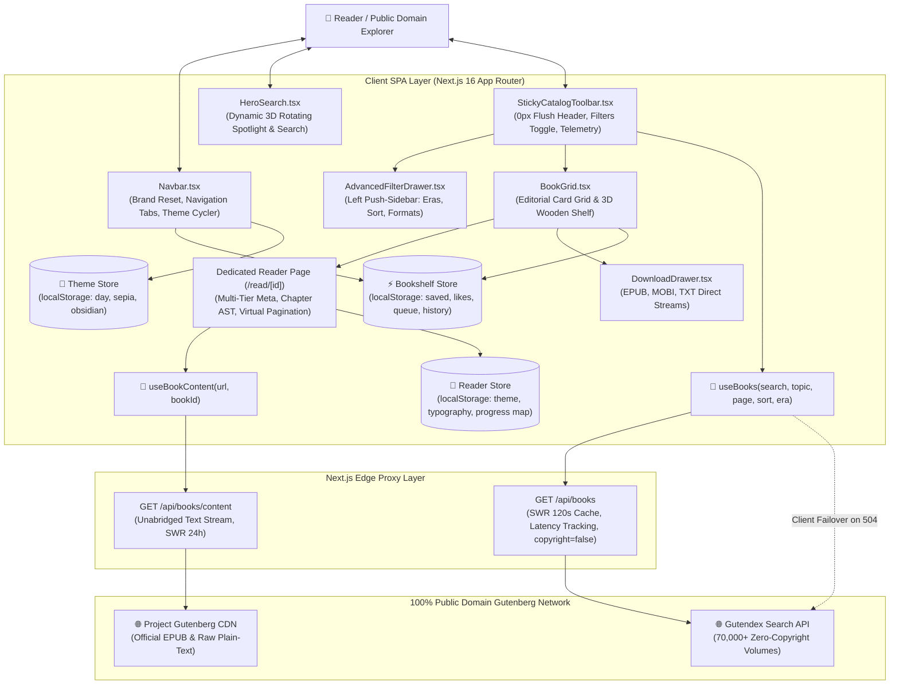

# Architecture Matrix & Living Technical Reference — Bookarium

> **Auto-Generated Living Architecture**: Programmatically compiled from Source AST.  
> **Last Synchronized**: `2026-09-01`  
> **Topology Health**: `61` Modules Analyzed • `161` Static Linkages • `0` Circular Dependencies • `0` Orphaned Modules

---

## 🏛️ System Architecture & Data Flow

Bookarium is built on a **100% Pure Live API Architecture** with real-time telemetry, zero local mock archives, and deterministic state isolation.

---

## 🧩 Component Catalog & Props Interface Matrix

Auto-extracted from Component TypeScript interfaces:

| Component | Exported Props Interface | Primary Props & Signals | Architectural Role |
| :--- | :--- | :--- | :--- |
| **`HeroSearch`** | `HeroSearchProps` | `search`, `onSearchChange`, `selectedTopic`, `selectedLanguage`, `onReadFeaturedBook` | Dynamic rotating 3D book spotlight, unified search bar, and popular topic pills |
| **`StickyCatalogToolbar`** | `StickyCatalogToolbarProps` | `page`, `onPageChange`, `viewMode`, `onOpenFilters`, `isFiltersOpen`, `activeFilterChips`, `latencyMs` | 0px flush sticky toolbar with live latency telemetry and filter toggle |
| **`BookCard`** | `BookCardProps` | `book`, `onDownloadClick` | Open-book skeuomorphic cover, like/save actions, and instant reader handoff |
| **`BookGrid`** | `BookGridProps` | `books`, `isLoading`, `isError`, `page`, `viewMode`, `onViewModeChange`, `onDownloadClick` | Responsive catalog container toggling between Editorial Grid and 3D Shelf |
| **`BookshelfRack`** | `BookshelfRackProps` | `books`, `onRemoveBook`, `onDownloadClick` | Skeuomorphic wooden shelf with embossed vertical book spines and touch panning |
| **`AdvancedFilterDrawer`** | `AdvancedFilterDrawerProps` | `isOpen`, `onClose`, `selectedEra`, `selectedSort`, `selectedTopic`, `selectedLanguage`, `selectedFormat` | Collapsible left-side filter sidebar with desktop smooth push transition |
| **`DownloadDrawer`** | `DownloadDrawerProps` | `book`, `isOpen`, `onClose` | Multi-format download hub (EPUB, MOBI, Plain Text, HTML) |
| **`Navbar`** | `NavbarProps` | `activeView`, `onViewChange` | Top brand header, live badge counters, view switcher, and theme cycler |
| **`LiteraryQuotes`** | _Autonomous_ | None (Internal Shuffle State) | 3-column classic literary passage showcase with shuffle discovery |
| **`ReaderHeader`** | `ReaderHeaderProps` | `title`, `author`, `activeChapterTitle`, `readingMode`, `currentVolumeNumber` | Focus reader header with dual-mode `[ ⇄ Info ]` metadata switcher |
| **`ReaderControls`** | `ReaderControlsProps` | `isOpen`, `fontSize`, `fontFamily`, `lineHeight`, `theme`, `columnWidth` | Compact typography and reading mode customization popover (0 scrollbars) |
| **`ReaderTocDrawer`** | `ReaderTocDrawerProps` | `isOpen`, `chapters`, `activeChapterIndex`, `onSelectChapter` | Table of Contents slide-over with page numbers and transparent backdrop |
| **`ReaderSurface`** | `ReaderSurfaceProps` | `content`, `fontSize`, `fontFamily`, `lineHeight`, `columnWidth`, `currentPage` | Fluid paragraph reflow engine with continuous virtual page spreads |
| **`ReaderFooter`** | `ReaderFooterProps` | `currentPage`, `totalPages`, `progressPercentage`, `onPageJump` | Thin sticky bottom pagination bar with direct page jump input |

---

## ⚡ State Management & Store Architecture

Zustand client-side state stores with persistent browser storage:

### 1. `useBookshelfStore` (`src/stores/useBookshelfStore.ts`)
* **Storage Key**: `bookarium-bookshelf` (localStorage)
* **State Tree**:
  * `savedBooks: GutendexBook[]` — Books saved to personal collection.
  * `likedBookIds: number[]` — IDs of favorited masterworks.
  * `readingQueue: GutendexBook[]` — Up next reading list.
  * `readingHistory: ReadingHistoryEntry[]` — Timeline of recently read volumes with timestamps.
* **Core Actions**: `saveBook`, `removeBook`, `toggleSave`, `toggleLike`, `addToQueue`, `removeFromQueue`, `recordHistory`, `clearAllBooks`.

### 2. `useReaderStore` (`src/stores/useReaderStore.ts`)
* **Storage Keys**: `bookarium-reader-preferences`, `bookarium-progress-map` (localStorage)
* **State Tree**:
  * `currentBook: GutendexBook | null` — Active book metadata payload.
  * `fontSize: number` — Active font size (12px–36px, default 18px).
  * `fontFamily: 'serif' | 'sans' | 'mono'` — Active font pairing.
  * `lineHeight: number` — Active line height (1.2–2.6, default 1.8).
  * `theme: 'light' | 'sepia' | 'dark'` — Active reader theme.
  * `columnWidth: 'narrow' | 'normal' | 'wide'` — Reading column width (576px / 768px / 1024px).
  * `readingMode: 'page' | 'scroll'` — Virtual paginated vs. vertical scroll.
  * `progress: Record<number, BookProgress>` — Per-book percentage and chapter bookmarks.
* **Core Actions**: `openReader`, `closeReader`, `setFontSize`, `setFontFamily`, `setLineHeight`, `setTheme`, `setColumnWidth`, `setReadingMode`, `saveProgress`.

### 3. `useThemeStore` (`src/stores/useThemeStore.ts`)
* **Storage Key**: `bookarium-theme` (localStorage)
* **State Tree**: `theme: 'light' | 'dark' | 'sepia'`
* **Core Actions**: `setTheme`, `cycleTheme`, `applyThemeToDocument`.

---

## 🌐 API Routes, Query Hooks & Network Contracts

| Endpoint / Hook | Method / Layer | Query Parameters | Cache & Fallback Strategy | Upstream Target |
| :--- | :--- | :--- | :--- | :--- |
| **`/api/books`** | `GET` (Route) | `search`, `topic`, `languages`, `page`, `sort`, `author_year_start`, `author_year_end`, `mime_type`, `ids` | `s-maxage=120, stale-while-revalidate=600` • Real-time latency tracking | `https://gutendex.com/books/` |
| **`/api/books/content`** | `GET` (Route) | `url`, `id` | `s-maxage=86400, stale-while-revalidate=604800` • UTF-8 plain text streaming | `https://www.gutenberg.org/cache/epub/{id}/pg{id}.txt` |
| **`useBooks`** | TanStack Query | `{ search, topic, languages, page, sort, era, mimeType, enabled }` | `placeholderData: keepPreviousData` • 5m staleTime • Direct client failover on 504 | `/api/books` $\to$ Gutendex |
| **`useBookContent`** | TanStack Query | `{ textUrl, bookId, enabled }` | 24h cache • Automated Gutenberg chapter AST parsing | `/api/books/content` $\to$ Gutenberg CDN |

---

## 📚 Curated Configurations & Design Token Registry

* **`FEATURED_HERO_BOOKS`** (`src/config/featured-books.ts`): 10 curated classic masterpieces (*Pride and Prejudice, Frankenstein, Moby Dick, The Great Gatsby, Alice in Wonderland, Dorian Gray, Sherlock Holmes, Dracula, A Tale of Two Cities, The Time Machine*) with verified volume numbers and quotes.
* **`LITERARY_ERAS`** (`src/config/catalog-filters.ts`): 6 historical eras spanning from Antiquity (-800 to 500) to Mid-20th Century (1914 to 1960).
* **`GENRE_FACETS`** (`src/config/catalog-filters.ts`): Curated genre tags (Gothic & Horror, Philosophy, Adventure, Sci-Fi, Poetry, Drama, Detective & Mystery, History).
* **`READER_THEMES`** (`src/config/reader-themes.ts`): 3 reading themes (Day Paper, Sepia Parchment, Obsidian Dark) with color tokens for background, text, borders, and accents.
* **`LITERARY_QUOTES`** (`src/config/literary-quotes.ts`): 12 literary passages and opening lines from immortal masterworks.

---

## 🔗 AST Module Interconnection & Topology Matrix

Every source file is analyzed for upstream imports and downstream consumers to guarantee zero orphaned or unlinked code:

| Module / Component | Upstream Dependencies (Imports) | Downstream Consumers (Consumed By) | Role & Responsibilities |
| :--- | :--- | :--- | :--- |
| [`route.ts`](src/app/api/books/content/route.ts) | `config/api-endpoints` | _App Route Entry_ | Production Module |
| [`route.ts`](src/app/api/books/route.ts) | `config/api-endpoints`, `mocks/handlers` | _App Route Entry_ | Production Module |
| [`route.ts`](src/app/auth/callback/route.ts) | `lib/supabase/server` | _App Route Entry_ | Production Module |
| [`page.tsx`](src/app/auth/confirm-deletion/page.tsx) | `stores/useAuthStore`, `components/presentation/Navbar`, `components/presentation/Footer`, `components/ui/Button` | _App Route Entry_ | Production Module |
| [`layout.tsx`](src/app/layout.tsx) | `./providers`, `./globals.css` | _App Route Entry_ | Production Module |
| [`page.tsx`](src/app/page.tsx) | `components/presentation/Navbar`, `components/presentation/HeroSearch`, `components/presentation/StickyCatalogToolbar`, `components/presentation/AdvancedFilterDrawer`, `components/presentation/BookGrid`, `components/presentation/LiteraryQuotes`, `components/presentation/DownloadDrawer`, `components/presentation/BookPreviewModal`, `components/ui/Modal`, `components/presentation/Footer`, `components/ui/BackToTop`, `hooks/queries/useBooks`, `hooks/useCatalogFilters`, `hooks/useScrollDirection`, `stores/useBookshelfStore`, `stores/useReaderStore`, `stores/usePreferencesStore`, `hooks/useHasMounted`, `mocks/handlers`, `components/ui/Button` | _App Route Entry_ | Production Module |
| [`page.tsx`](src/app/profile/page.tsx) | `stores/useAuthStore`, `stores/useBookshelfStore`, `stores/useThemeStore`, `stores/usePreferencesStore`, `components/presentation/Navbar`, `components/presentation/Footer`, `components/ui/Button`, `components/ui/Input`, `components/ui/Modal` | _App Route Entry_ | Production Module |
| [`providers.tsx`](src/app/providers.tsx) | `stores/useAuthStore`, `stores/useBookshelfStore`, `components/auth/AuthModal` | _Direct Root Consumer_ | Production Module |
| [`page.tsx`](src/app/read/[id]/page.tsx) | `hooks/queries/useBookContent`, `hooks/queries/useBooks`, `hooks/queries/useBookTranslations`, `stores/useReaderStore`, `hooks/useHasMounted`, `lib/gutenberg-parser`, `config/reader-themes`, `lib/book-metadata`, `components/reader/ReaderHeader`, `components/reader/ReaderFooter`, `components/reader/ReaderTocDrawer`, `components/reader/ReaderControls`, `components/reader/ReaderSurface` | _App Route Entry_ | Production Module |
| [`AuthModal.tsx`](src/components/auth/AuthModal.tsx) | `stores/useAuthStore`, `stores/useBookshelfStore`, `components/ui/Button`, `components/ui/Input` | `providers.tsx` | Production Module |
| [`MotionReveal.tsx`](src/components/motion/MotionReveal.tsx) | `./motion-config` | _Direct Root Consumer_ | Production Module |
| [`StaggerGroup.tsx`](src/components/motion/StaggerGroup.tsx) | `./motion-config` | _Direct Root Consumer_ | Production Module |
| [`motion-config.ts`](src/components/motion/motion-config.ts) | _Root Primitive_ | _Direct Root Consumer_ | Production Module |
| [`AdvancedFilterDrawer.tsx`](src/components/presentation/AdvancedFilterDrawer.tsx) | `components/ui/Button`, `config/catalog-filters`, `./LanguageSelector` | `page.tsx` | Production Module |
| [`BookCard.tsx`](src/components/presentation/BookCard.tsx) | `mocks/handlers`, `lib/utils`, `stores/useBookshelfStore`, `stores/useReaderStore`, `components/ui/Badge`, `components/ui/Button`, `components/ui/Card` | _Direct Root Consumer_ | Production Module |
| [`BookGrid.tsx`](src/components/presentation/BookGrid.tsx) | `mocks/handlers`, `./BookCard`, `./BookshelfRack`, `components/ui/Button` | `page.tsx` | Production Module |
| [`BookPreviewModal.tsx`](src/components/presentation/BookPreviewModal.tsx) | `mocks/handlers`, `config/featured-books`, `lib/gutenberg-parser`, `hooks/queries/useBookContent`, `lib/utils`, `stores/useBookshelfStore`, `components/ui/Badge`, `components/ui/Button` | `page.tsx` | Production Module |
| [`BookshelfRack.tsx`](src/components/presentation/BookshelfRack.tsx) | `mocks/handlers`, `stores/useBookshelfStore`, `stores/useReaderStore`, `stores/useAuthStore`, `components/ui/Button`, `components/ui/Input` | _Direct Root Consumer_ | Production Module |
| [`DownloadDrawer.tsx`](src/components/presentation/DownloadDrawer.tsx) | `mocks/handlers`, `lib/utils`, `components/ui/Modal`, `components/ui/Button`, `components/ui/Badge` | `page.tsx` | Production Module |
| [`Footer.tsx`](src/components/presentation/Footer.tsx) | _Root Primitive_ | `page.tsx`, `page.tsx`, `page.tsx` | Production Module |
| [`HeroSearch.tsx`](src/components/presentation/HeroSearch.tsx) | `hooks/useHasMounted`, `components/ui/Button`, `config/catalog-filters`, `config/featured-books`, `lib/gutenberg-parser`, `hooks/queries/useBookContent`, `mocks/handlers`, `lib/utils`, `./LanguageSelector` | `page.tsx` | Production Module |
| [`LanguageSelector.tsx`](src/components/presentation/LanguageSelector.tsx) | `config/catalog-filters` | _Direct Root Consumer_ | Production Module |
| [`LiteraryQuotes.tsx`](src/components/presentation/LiteraryQuotes.tsx) | `config/literary-quotes` | `page.tsx` | Production Module |
| [`Navbar.tsx`](src/components/presentation/Navbar.tsx) | `stores/useBookshelfStore`, `stores/useThemeStore`, `stores/useAuthStore`, `components/ui/Button` | `page.tsx`, `page.tsx`, `page.tsx` | Production Module |
| [`StickyCatalogToolbar.tsx`](src/components/presentation/StickyCatalogToolbar.tsx) | `components/ui/Button` | `page.tsx` | Production Module |
| [`ReaderControls.tsx`](src/components/reader/ReaderControls.tsx) | `stores/useReaderStore`, `config/reader-themes`, `hooks/useHasMounted` | `page.tsx` | Production Module |
| [`ReaderFooter.tsx`](src/components/reader/ReaderFooter.tsx) | `stores/useReaderStore`, `config/reader-themes` | `page.tsx` | Production Module |
| [`ReaderHeader.tsx`](src/components/reader/ReaderHeader.tsx) | `stores/useReaderStore`, `config/reader-themes`, `config/featured-books`, `lib/book-metadata`, `hooks/queries/useBookTranslations` | `page.tsx` | Production Module |
| [`ReaderSurface.tsx`](src/components/reader/ReaderSurface.tsx) | `stores/useReaderStore`, `lib/gutenberg-parser`, `config/reader-themes` | `page.tsx` | Production Module |
| [`ReaderTocDrawer.tsx`](src/components/reader/ReaderTocDrawer.tsx) | `lib/gutenberg-parser`, `lib/gutenberg-parser`, `stores/useReaderStore`, `config/reader-themes`, `hooks/useHasMounted` | `page.tsx` | Production Module |
| [`BackToTop.tsx`](src/components/ui/BackToTop.tsx) | _Root Primitive_ | `page.tsx` | Production Module |
| [`Badge.tsx`](src/components/ui/Badge.tsx) | `lib/utils` | `BookCard.tsx`, `BookPreviewModal.tsx`, `DownloadDrawer.tsx` | Production Module |
| [`Button.tsx`](src/components/ui/Button.tsx) | `lib/utils` | `page.tsx`, `page.tsx`, `page.tsx`, `AuthModal.tsx`, `AdvancedFilterDrawer.tsx`, `BookCard.tsx`, `BookGrid.tsx`, `BookPreviewModal.tsx`, `BookshelfRack.tsx`, `DownloadDrawer.tsx`, `HeroSearch.tsx`, `Navbar.tsx`, `StickyCatalogToolbar.tsx` | Production Module |
| [`Card.tsx`](src/components/ui/Card.tsx) | `lib/utils` | `BookCard.tsx` | Production Module |
| [`Input.tsx`](src/components/ui/Input.tsx) | `lib/utils` | `page.tsx`, `AuthModal.tsx`, `BookshelfRack.tsx` | Production Module |
| [`Modal.tsx`](src/components/ui/Modal.tsx) | `lib/utils` | `page.tsx`, `page.tsx`, `DownloadDrawer.tsx` | Production Module |
| [`api-endpoints.ts`](src/config/api-endpoints.ts) | _Root Primitive_ | `route.ts`, `route.ts`, `useBookContent.ts`, `useBooks.ts` | Production Module |
| [`catalog-filters.ts`](src/config/catalog-filters.ts) | _Root Primitive_ | `AdvancedFilterDrawer.tsx`, `HeroSearch.tsx`, `LanguageSelector.tsx`, `useBookTranslations.ts`, `useCatalogFilters.ts` | Production Module |
| [`featured-books.ts`](src/config/featured-books.ts) | `lib/utils` | `BookPreviewModal.tsx`, `HeroSearch.tsx`, `ReaderHeader.tsx`, `book-metadata.ts` | Production Module |
| [`literary-quotes.ts`](src/config/literary-quotes.ts) | _Root Primitive_ | `LiteraryQuotes.tsx` | Production Module |
| [`reader-themes.ts`](src/config/reader-themes.ts) | `stores/useReaderStore` | `page.tsx`, `ReaderControls.tsx`, `ReaderFooter.tsx`, `ReaderHeader.tsx`, `ReaderSurface.tsx`, `ReaderTocDrawer.tsx` | Production Module |
| [`useBookContent.ts`](src/hooks/queries/useBookContent.ts) | `mocks/handlers`, `config/api-endpoints` | `page.tsx`, `BookPreviewModal.tsx`, `HeroSearch.tsx` | Production Module |
| [`useBookTranslations.ts`](src/hooks/queries/useBookTranslations.ts) | `config/catalog-filters`, `lib/book-metadata`, `mocks/handlers` | `page.tsx`, `ReaderHeader.tsx` | Production Module |
| [`useBooks.ts`](src/hooks/queries/useBooks.ts) | `mocks/handlers`, `config/api-endpoints` | `page.tsx`, `page.tsx` | Production Module |
| [`useCatalogFilters.ts`](src/hooks/useCatalogFilters.ts) | `config/catalog-filters`, `hooks/useHasMounted` | `page.tsx` | Production Module |
| [`useHasMounted.ts`](src/hooks/useHasMounted.ts) | _Root Primitive_ | `page.tsx`, `page.tsx`, `HeroSearch.tsx`, `ReaderControls.tsx`, `ReaderTocDrawer.tsx`, `useCatalogFilters.ts`, `useBookshelfStore.ts` | Production Module |
| [`usePerformanceTier.ts`](src/hooks/usePerformanceTier.ts) | _Root Primitive_ | _Direct Root Consumer_ | Production Module |
| [`useScrollDirection.ts`](src/hooks/useScrollDirection.ts) | _Root Primitive_ | `page.tsx` | Production Module |
| [`book-metadata.ts`](src/lib/book-metadata.ts) | `mocks/handlers`, `config/featured-books`, `lib/utils` | `page.tsx`, `ReaderHeader.tsx`, `useBookTranslations.ts` | Production Module |
| [`gutenberg-parser.ts`](src/lib/gutenberg-parser.ts) | _Root Primitive_ | `page.tsx`, `BookPreviewModal.tsx`, `HeroSearch.tsx`, `ReaderSurface.tsx`, `ReaderTocDrawer.tsx` | Production Module |
| [`client.ts`](src/lib/supabase/client.ts) | `types/database.types` | `useAuthStore.ts`, `useBookshelfStore.ts` | Production Module |
| [`middleware.ts`](src/lib/supabase/middleware.ts) | `types/database.types`, `./client` | `middleware.ts` | Production Module |
| [`server.ts`](src/lib/supabase/server.ts) | `types/database.types`, `./client` | `route.ts` | Production Module |
| [`utils.ts`](src/lib/utils.ts) | _Root Primitive_ | `BookCard.tsx`, `BookPreviewModal.tsx`, `DownloadDrawer.tsx`, `HeroSearch.tsx`, `Badge.tsx`, `Button.tsx`, `Card.tsx`, `Input.tsx`, `Modal.tsx`, `featured-books.ts`, `book-metadata.ts` | Production Module |
| [`middleware.ts`](src/middleware.ts) | `lib/supabase/middleware` | _Direct Root Consumer_ | Production Module |
| [`useAuthStore.ts`](src/stores/useAuthStore.ts) | `lib/supabase/client`, `types/database.types` | `page.tsx`, `page.tsx`, `providers.tsx`, `AuthModal.tsx`, `BookshelfRack.tsx`, `Navbar.tsx` | Production Module |
| [`useBookshelfStore.ts`](src/stores/useBookshelfStore.ts) | `mocks/handlers`, `hooks/useHasMounted`, `lib/supabase/client`, `types/database.types` | `page.tsx`, `page.tsx`, `providers.tsx`, `AuthModal.tsx`, `BookCard.tsx`, `BookPreviewModal.tsx`, `BookshelfRack.tsx`, `Navbar.tsx` | Production Module |
| [`usePreferencesStore.ts`](src/stores/usePreferencesStore.ts) | _Root Primitive_ | `page.tsx`, `page.tsx` | Production Module |
| [`useReaderStore.ts`](src/stores/useReaderStore.ts) | `mocks/handlers`, `./useThemeStore` | `page.tsx`, `page.tsx`, `BookCard.tsx`, `BookshelfRack.tsx`, `ReaderControls.tsx`, `ReaderFooter.tsx`, `ReaderHeader.tsx`, `ReaderSurface.tsx`, `ReaderTocDrawer.tsx`, `reader-themes.ts` | Production Module |
| [`useThemeStore.ts`](src/stores/useThemeStore.ts) | _Root Primitive_ | `page.tsx`, `Navbar.tsx` | Production Module |
| [`database.types.ts`](src/types/database.types.ts) | _Root Primitive_ | `client.ts`, `middleware.ts`, `server.ts`, `useAuthStore.ts`, `useBookshelfStore.ts` | Production Module |

---

## ⚡ Data Pulling & Caching Strategy

1. **100% Pure Live API Queries**: All catalog items are retrieved in real-time from Project Gutenberg (`https://gutendex.com/books/`).
2. **2-Part Visible Telemetry**: `StickyCatalogToolbar.tsx` renders live API connectivity status alongside exact roundtrip latency in milliseconds.
3. **Customizable Batch Sizing**: Readers can dynamically toggle batch sizes (`Show: [8 | 16 | 24 | 32]`) without page reloads.
4. **Edge SWR Caching**: Common queries are cached with `s-maxage=120, stale-while-revalidate=600` for sub-10ms response times on repeated visits.
5. **On-Demand Text Streaming**: Large book texts (2MB–5MB) are fetched strictly when the focus reader opens.

---

## 🔒 Verification & Compliance

This architecture document is verified deterministically by **Pass 4 of the 7-Gateway Quality Engine** (`npm run verify`).
