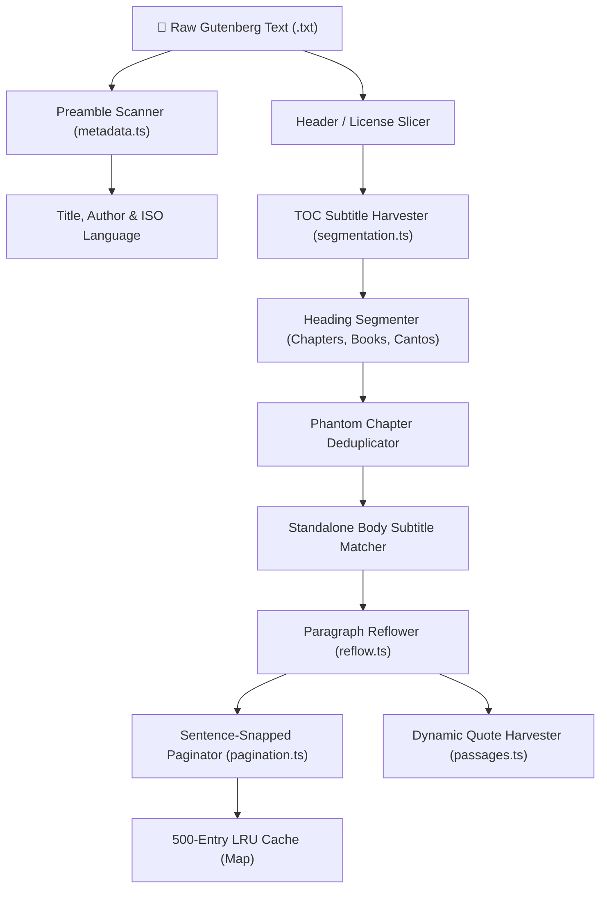

# Project Gutenberg Text Processing & Segmentation Engine — Bookarium

> **Auto-Generated Living Reference**: Programmatically compiled from Source AST via `scripts/generate-parser-docs.js` (Governance Rule 2).  
> **Last Synchronized**: `2026-09-06`  
> **Target Subsystem**: `src/lib/gutenberg/` (100% Client/Worker Compatible, Zero Node.js Dependencies)

---

## 🏛️ Pipeline Architecture & Text Flow

Project Gutenberg books are distributed as plain ASCII/UTF-8 text files without HTML markup, structured metadata, or standardized chapter tags. Bookarium processes these files through a multi-stage deterministic pipeline:

---

## ⚙️ Centralized Configuration (`GUTENBERG_PARSER_CONFIG`)

All limits, thresholds, and window sizes are centralized in `src/lib/gutenberg/types.ts` to prevent magic numbers across modules:

| Configuration Key | Live Value | Functional Purpose |
|---|---|---|
| `CHARS_PER_PAGE_BASE` | `5600` | Baseline character count per virtual page at 18px font size (~850 words) |
| `MIN_CHARS_PER_PAGE` | `1200` | Safety floor preventing pages from becoming too small on large typography |
| `TOC_MAX_HEADING_LENGTH` | `180` | Maximum character length of a heading candidate before discarding as prose |
| `TOC_SEARCH_WINDOW_BYTES` | `9000` | Byte offset window from start of text to search for front-matter Table of Contents |
| `TOC_CLUSTER_BODY_THRESHOLD` | `25000` | Minimum distance from text start to avoid confusing body chapters with TOC listings |
| `ESTIMATED_WORDS_PER_MINUTE` | `200` | Average reading speed used to calculate chapter read times |
| `HEADER_SCAN_BYTES` | `5000` | Initial byte window scanned for Project Gutenberg title, author, and language metadata |
| `PASSAGE_SCAN_BYTES` | `120000` | Maximum text slice analyzed for dynamic quote extraction to protect the event loop |
| `TOC_SLICE_BYTES` | `4000` | Window size used to extract TOC sections from front-matter |
| `ANTHOLOGY_MIN_DISTANCE_CHARS` | `1000` | Minimum character distance between anthology story headings to prevent over-segmentation |
| `MIN_PARAGRAPH_LENGTH` | `35` | Minimum character threshold for a paragraph to be eligible for dynamic quote extraction |
| `MAX_PARAGRAPH_LENGTH` | `800` | Maximum character threshold for quote extraction candidates |
| `MIN_QUOTE_LENGTH` | `15` | Minimum character length of an inner dialogue quote string |
| `DEFAULT_QUOTE_MAX_LEN` | `220` | Maximum excerpt length before adding ellipses truncation |

---

## 🧩 Subsystem Modules & API Contracts

### `segmentation.ts` — Chapter Segmentation & Subtitle Harvesting

Slices raw plain-text into ordered, clean `ChapterSection` entities. Normalizes diverse heading styles, harvests subtitles from Roman/Arabic TOC listings and body subtitles, strips ghost TOC chapters, and detects standalone body headings.

**Exported Functions & Symbols:**

| Symbol | Signature | Contract / Rationale |
|---|---|---|
| `parseGutenbergChapters` | `(rawText)` | Parse raw Gutenberg plain-text into clean structured chapter sections.
Suppresses front-matter Table of Contents (TOC) lists, prefaces, extracts, and closing license matter. |

### `pagination.ts` — Virtual Sentence-Snapped Pagination & Reading Metrics

Calculates virtual page spreads snapped cleanly to paragraph and sentence boundaries. Backed by a 500-entry LRU memory cache and dynamic font-size scaling. Derives 200 WPM reading estimates.

**Exported Functions & Symbols:**

| Symbol | Signature | Contract / Rationale |
|---|---|---|
| `clearPaginationCache` | `constant` | Public subsystem export |
| `paginateChapterContent` | `(content, charsPerPage)` | Splits chapter content into clean virtual pages snapped to sentence, paragraph, and word boundaries.
Guarantees words are NEVER split across page turns. |
| `getCharsPerPage` | `(fontSize (optional))` | Calculate the estimated characters per page for a given font size. |
| `calculateReadingTime` | `(text)` | Calculate estimated reading time in minutes based on 200 wpm standard. |
| `calculateVolumePageSpread` | `(chapters, fontSize (optional))` | Calculate the true continuous book-wide pagination across all chapters for a given font size. |

### `metadata.ts` — Preamble Metadata Extraction & Language Mapping

Scans the initial 5,000 bytes of Gutenberg plain-text headers to extract Title, Author, and ISO 639-1 Language Codes across 25+ language identifiers.

**Exported Functions & Symbols:**

| Symbol | Signature | Contract / Rationale |
|---|---|---|
| `LANGUAGE_NAME_TO_CODE_MAP` | `constant` | Exported constant / dictionary |
| `normalizeLanguageToCode` | `(rawLang)` | Public subsystem export |
| `extractGutenbergHeaderMetadata` | `(rawText)` | Extract Title, Author, and Language directly from the Project Gutenberg preamble header. |

### `reflow.ts` — Heuristic Paragraph Reflow

Unwraps hard 70-character single newlines into fluid paragraphs for responsive reading, while preserving poetry, verse, stanza breaks, and blockquotes with 4+ spaces indentation or lines under 45 characters.

**Exported Functions & Symbols:**

| Symbol | Signature | Contract / Rationale |
|---|---|---|
| `reflowGutenbergParagraphs` | `(rawText)` | Reflows Project Gutenberg plain-text paragraphs by joining single-newline hard wraps
into fluid prose blocks while preserving double-spaced paragraph breaks, dialogue, and verse. |

### `passages.ts` — Dynamic Literary Passage & Quote Extraction

Scans up to 120,000 characters of narrative chapters to dynamically harvest memorable dialogue quotes, opening paragraphs, and literary excerpts for the 3D Book Preview Modal.

**Exported Functions & Symbols:**

| Symbol | Signature | Contract / Rationale |
|---|---|---|
| `extractDynamicBookPassages` | `(rawText, book)` | Dynamically extracts authentic passages and literary quotes directly from raw Gutenberg book text. |

### `types.ts` — Type Contracts & Centralized Parser Configuration

Defines `ChapterSection`, `DynamicBookPassage`, and the immutable `GUTENBERG_PARSER_CONFIG` parameter dictionary.

**Exported Functions & Symbols:**

| Symbol | Signature | Contract / Rationale |
|---|---|---|
| `GUTENBERG_PARSER_CONFIG` | `constant` | Exported constant / dictionary |

---

## 🔍 Heuristic Parser Rules & Segmentation Logic

### 1. Heading Normalization (`normalizeHeadingId`)
To bridge the gap between front-matter Tables of Contents and actual body chapters, headings are mapped to a canonical key format (`${prefix}-${num}`):
- **Keyword Headings**: `CHAPTER I`, `Chapter 1`, `BOOK II`, `ACT III`, `SCENE IV`, `PART V`, `CANTO VI`, `SECTION VII`, `STORY VIII`.
- **Roman Numeral TOC**: `I. THE HIRED CAR` maps to `ch-i`.
- **Arabic Numeral TOC**: `1. Down the Rabbit-Hole` maps to `ch-1`.
- **Casing Rule**: Roman numerals in chapter titles are strictly formatted uppercase (`Chapter I: The Hired Car`, `Chapter XVI`).

### 2. Chapter Subtitle Harvesting (`recordSubtitle`)
Subtitles are harvested across two primary vectors:
1. **Keyword Subtitles**: Matches `CHAPTER I: THE HIRED CAR` or `CHAPTER 1 - THE HIRED CAR`. Trailing page numbers (e.g. `... 24`) are stripped and titles are title-cased.
2. **Front-Matter TOC Items**: Matches items like `I. THE HIRED CAR 1` or `1. Down the Rabbit-Hole ... 1`. Strips dot-leaders (`...`) and trailing page numbers.
3. **Standalone Body Subtitles**: When a book lacks a front-matter TOC (or the TOC entry was wrapped), the parser checks the lines immediately following `CHAPTER [num]` in the body. If a standalone 2–90 character line is followed by a blank line and contains no ending punctuation, it is harvested as the chapter subtitle.

### 3. Phantom Chapter Deduplication
When a book includes a Table of Contents in the front-matter, naive splitters treat TOC lines as individual chapters. Bookarium applies a strict two-stage deduplication guard:
- **Guard Condition**: A candidate chapter is only dropped as a ghost TOC listing if `isVeryShort` (`bodyLength < 150` chars) **AND** `hasLaterDuplicate` (a subsequent section shares the same normalized heading key).
- **Safety**: Legitimate short chapters (e.g. epigrams, author notes) are never dropped because they lack later duplicates.

### 4. Sentence-Snapped Virtual Pagination (`paginateChapterContent`)
Splits prose without ever breaking words across virtual page turns using a 3-tier boundary hierarchy:
1. **Paragraph Boundary (`\n\n`)**: Preferred split within the search window `[0.75 * charsPerPage, charsPerPage + 60]`.
2. **Sentence Boundary (`[.!?]["']?\s+`)**: Snaps to full sentences if no paragraph break is present.
3. **Word Boundary (`\s`)**: Snaps to the nearest word boundary before `charsPerPage`.

### 5. Paragraph Reflow (`reflowGutenbergParagraphs`)
- Joins single hard newlines (70–75 chars) with a single space for responsive fluid reading across any device viewport.
- Preserves poetry, verse, and blockquotes if all lines are indented with 4+ spaces or if lines are consistently under 45 characters.

---

## 🔒 Verification & Compliance

This living specification is verified deterministically by **Pass 4 of the 7-Gateway Quality Engine** (`npm run verify`) and synchronized via `npm run docs:sync`. Any drift between AST exports and this specification triggers an immediate verification failure.
